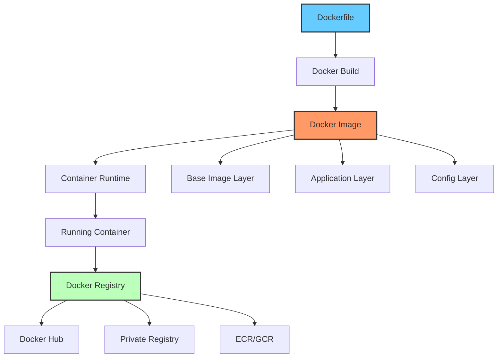
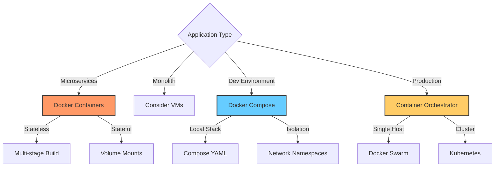

# Docker Fundamentals

## Overview
Docker is a platform for developing, shipping, and running applications in containers.

## Topics
- Containerization Concepts
- Dockerfile
- Images and Layers
- Containers
- Volumes
- Networks
- Docker Compose
- Multi-stage Builds
- Security Best Practices
- Container Orchestration

## Learning Objectives
- Containerize applications
- Write efficient Dockerfiles
- Manage container lifecycle

## Prerequisites
- Basic command line

## Architecture

## When to Use

