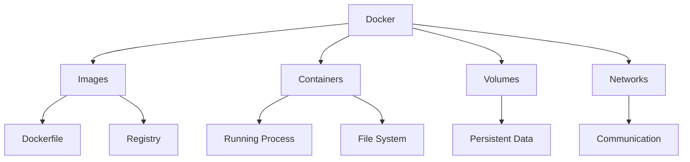

# Module 21: Docker

## Overview
Docker is a containerization platform that packages applications with their dependencies. It provides consistent environments across development, testing, and production.

## Learning Objectives
- Understand container concepts
- Write Dockerfiles
- Use Docker Compose
- Manage images and containers
- Apply Docker best practices

## Prerequisites
- Command line basics
- Application deployment
- Networking concepts

## Why This Concept Exists
Traditional deployment has:
- Environment inconsistencies
- "Works on my machine" issues
- Complex setup
- Dependency conflicts

Docker provides:
- Consistent environments
- Isolation
- Portability
- Scalability

## Problem Statement
How do you package and deploy applications consistently?

## Theory

### Docker Concepts

| Concept | Description |
|---------|-------------|
| Image | Read-only template |
| Container | Running instance |
| Dockerfile | Build instructions |
| Registry | Image repository |
| Volume | Persistent storage |

### Dockerfile Instructions

| Instruction | Purpose |
|-------------|---------|
| FROM | Base image |
| RUN | Execute command |
| COPY | Copy files |
| ADD | Copy with extract |
| CMD | Default command |
| ENTRYPOINT | Container entry |
| ENV | Environment variables |
| EXPOSE | Document ports |

## Internal Working

### Docker Architecture
```
Docker CLI → Docker Daemon → Container Runtime
                          → Image Registry
```

### Container Isolation
```
Host OS → Docker Engine → Container
                        → Process
                        → File System
                        → Network
```

## JVM Perspective

### Java Docker Images
- Eclipse Temurin (recommended)
- OpenJDK
- Amazon Corretto
- GraalVM

### Java-Specific Considerations
- JVM memory limits
- Container-aware JVM
- Layer optimization

## Architecture Diagram



## Syntax

### Dockerfile
```dockerfile
# Build stage
FROM eclipse-temurin:21-jdk as builder
WORKDIR /app
COPY pom.xml .
COPY src ./src
RUN mvn clean package -DskipTests

# Runtime stage
FROM eclipse-temurin:21-jre
WORKDIR /app
COPY --from=builder /app/target/*.jar app.jar
EXPOSE 8080
ENTRYPOINT ["java", "-jar", "app.jar"]
```

### Docker Commands
```bash
# Build image
docker build -t myapp:1.0 .

# Run container
docker run -d -p 8080:8080 --name myapp myapp:1.0

# List containers
docker ps

# View logs
docker logs myapp

# Stop container
docker stop myapp

# Remove container
docker rm myapp
```

## Easy Example
```bash
# Simple Dockerfile
echo 'FROM eclipse-temurin:21-jre
WORKDIR /app
COPY target/app.jar .
EXPOSE 8080
ENTRYPOINT ["java", "-jar", "app.jar"]' > Dockerfile

# Build and run
docker build -t myapp .
docker run -d -p 8080:8080 myapp
```

## Medium Example
```dockerfile
# Multi-stage build
FROM maven:3.9-eclipse-temurin-21 as builder
WORKDIR /app
COPY pom.xml .
RUN mvn dependency:go-offline
COPY src ./src
RUN mvn clean package -DskipTests

FROM eclipse-temurin:21-jre-jammy
WORKDIR /app
COPY --from=builder /app/target/*.jar app.jar
RUN useradd -m appuser
USER appuser
EXPOSE 8080
ENTRYPOINT ["java", "-jar", "app.jar"]
```

## Hard Example
```dockerfile
# Optimized Java Dockerfile
FROM eclipse-temurin:21-jdk as builder
WORKDIR /app

# Cache dependencies
COPY pom.xml .
RUN mvn dependency:resolve dependency:resolve-plugins

# Build application
COPY src ./src
RUN mvn clean package -DskipTests

# Create custom JRE
FROM eclipse-temurin:21-jdk as jre-builder
RUN jlink --add-modules ALL-MODULE_PATH \
    --strip-debug \
    --no-man-pages \
    --no-header-files \
    --compress=2 \
    --output /custom-jre

# Final stage
FROM ubuntu:22.04
COPY --from=jre-builder /custom-jre /custom-jre
ENV PATH="/custom-jre/bin:$PATH"
WORKDIR /app
COPY --from=builder /app/target/*.jar app.jar
EXPOSE 8080
ENTRYPOINT ["java", "-jar", "app.jar"]
```

## Enterprise Example
```yaml
# docker-compose.yml
version: '3.8'

services:
  app:
    build: .
    ports:
      - "8080:8080"
    environment:
      - SPRING_PROFILES_ACTIVE=docker
      - DATABASE_URL=jdbc:postgresql://db:5432/mydb
    depends_on:
      - db
      - redis
    networks:
      - app-network
    
  db:
    image: postgres:15
    environment:
      - POSTGRES_DB=mydb
      - POSTGRES_USER=user
      - POSTGRES_PASSWORD=pass
    volumes:
      - postgres-data:/var/lib/postgresql/data
    networks:
      - app-network
    
  redis:
    image: redis:7-alpine
    networks:
      - app-network

volumes:
  postgres-data:

networks:
  app-network:
    driver: bridge
```

## Performance Considerations
- Use multi-stage builds
- Optimize layer caching
- Use .dockerignore
- Minimize image size

## Best Practices
1. Use official base images
2. Multi-stage builds
3. Non-root user
4. Health checks
5. Layer caching

## Common Mistakes
1. Large images
2. Running as root
3. Not using .dockerignore
4. Copying unnecessary files

## Comparison Table

| Feature | Docker | Podman | LXC |
|---------|--------|--------|-----|
| Daemon | Yes | No | No |
| Rootless | Optional | Yes | No |
| Compose | Yes | Yes | No |
| Kubernetes | Yes | Yes | No |

## Interview Questions

### Q1: What is Docker?
**Answer:** Containerization platform for packaging applications.

### Q2: What is the difference between image and container?
**Answer:** Image is template, container is running instance.

### Q3: What is a multi-stage build?
**Answer:** Build with multiple stages to reduce image size.

### Q4: What is the difference between COPY and ADD?
**Answer:** ADD can extract archives and fetch URLs.

### Q5: What is Docker Compose?
**Answer:** Tool for defining multi-container applications.

## Summary
Docker provides consistent, portable environments for application deployment.

## References
- Docker Documentation
- Docker Best Practices
- Java Docker Guide
