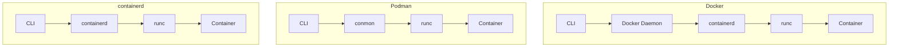

# Comparison: Docker vs Podman vs containerd

## Overview
This comparison helps you choose the right container runtime for your needs.

## Feature Matrix

| Feature | Docker | Podman | containerd |
|---------|--------|--------|------------|
| **Daemon Required** | Yes | No | Yes |
| **Rootless** | Optional | Default | Optional |
| **Docker Compose** | Native | Compatible | No |
| **Kubernetes Integration** | Good | Good | Excellent |
| **OCI Compliance** | Yes | Yes | Yes |
| **Image Building** | Yes | Yes | No |
| **CLI Compatibility** | Native | Docker CLI compatible | ctr CLI |
| **Desktop Application** | Docker Desktop | Podman Desktop | No |
| **Systemd Integration** | Manual | Native | Manual |
| **Pod Support** | No | Yes | No |

## Performance Comparison

| Metric | Docker | Podman | containerd |
|--------|--------|--------|------------|
| **Startup Time** | Fast | Fast | Faster |
| **Memory Overhead** | Moderate | Lower | Lowest |
| **Storage Driver** | overlay2 | overlay2 | overlay2 |
| **Network Performance** | Good | Good | Good |
| **Image Pull Speed** | Fast | Fast | Fast |
| **CPU Usage** | Moderate | Lower | Lowest |

## Architecture Comparison

## Security Comparison

| Security Feature | Docker | Podman | containerd |
|------------------|--------|--------|------------|
| **Rootless by Default** | No | Yes | No |
| **Daemon Required** | Yes (root) | No | Yes |
| **User Namespaces** | Optional | Default | Optional |
| **Seccomp Profiles** | Yes | Yes | Yes |
| **AppArmor/SELinux** | Yes | Yes | Yes |
| **Image Signing** | Docker Content Trust | Notation | Notary |
| **Vulnerability Scanning** | Docker Scout | Podman | Trivy |

## Use Case Matrix

| Use Case | Docker | Podman | containerd |
|----------|--------|--------|------------|
| **Desktop Development** | Excellent | Good | Poor |
| **CI/CD Pipelines** | Good | Excellent | Good |
| **Kubernetes Runtime** | Good | Good | Excellent |
| **Enterprise Security** | Good | Excellent | Good |
| **Simple Containers** | Excellent | Excellent | Good |
| **Pod Management** | Poor | Excellent | Poor |
| **Docker Compose** | Excellent | Good | Poor |
| **Systemd Services** | Poor | Excellent | Poor |

## Operational Comparison

| Factor | Docker | Podman | containerd |
|--------|--------|--------|------------|
| **Setup** | Easy | Easy | Moderate |
| **Monitoring** | Good | Good | Good |
| **Logging** | Good | Good | Good |
| **Networking** | Excellent | Good | Good |
| **Storage** | Excellent | Good | Good |
| **Documentation** | Excellent | Good | Good |
| **Community** | Largest | Growing | Large |
| **Learning Resources** | Most | Growing | Good |

## Cost Comparison

| Cost Factor | Docker | Podman | containerd |
|-------------|--------|--------|------------|
| **License** | Apache 2.0 | Apache 2.0 | Apache 2.0 |
| **Docker Desktop** | Paid (large companies) | Free | N/A |
| **Infrastructure** | Same | Same | Same |
| **Operational** | Low | Low | Low |
| **Training** | Easy | Easy | Moderate |
| **Total Cost** | Low-Medium | Low | Low |

## Migration Effort

| Migration | Docker | Podman | containerd |
|-----------|--------|--------|------------|
| **From Docker** | Native | Very low effort | Moderate effort |
| **From Podman** | Very low effort | Native | Moderate effort |
| **From containerd** | Moderate effort | Moderate effort | Native |

## CLI Compatibility

| Command | Docker | Podman | containerd |
|---------|--------|--------|------------|
| **docker run** | docker run | podman run | ctr run |
| **docker build** | docker build | podman build | N/A |
| **docker compose** | docker compose | podman-compose | N/A |
| **docker ps** | docker ps | podman ps | ctr containers list |
| **docker images** | docker images | podman images | ctr images list |

## When to Choose Each

### Choose Docker When:
- Desktop development environment
- Need Docker Compose
- Team familiar with Docker
- Simple container workflows
- Quick prototyping required

### Choose Podman When:
- Security is top priority
- Need rootless containers
- Enterprise environment
- Systemd integration needed
- CI/CD pipelines

### Choose containerd When:
- Kubernetes node runtime
- Need minimal runtime
- Production Kubernetes clusters
- Fine-grained control needed
- Maximum performance required

## Decision Matrix

| Priority | Docker | Podman | containerd |
|----------|--------|--------|------------|
| **Ease of Use** | Excellent | Good | Moderate |
| **Security** | Good | Excellent | Good |
| **Performance** | Good | Good | Excellent |
| **Kubernetes Integration** | Good | Good | Excellent |
| **Desktop Experience** | Excellent | Good | Poor |
| **Enterprise Support** | Good | Good | Good |
| **Community** | Largest | Growing | Large |
| **Documentation** | Excellent | Good | Good |

## Summary

- **Docker**: Best for desktop development and Docker Compose
- **Podman**: Best for security and rootless containers
- **containerd**: Best for Kubernetes and production runtime