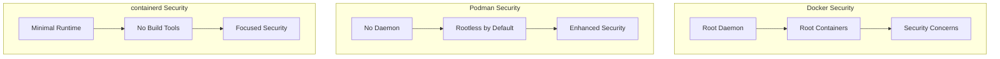
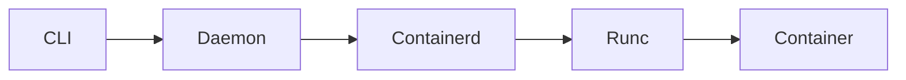
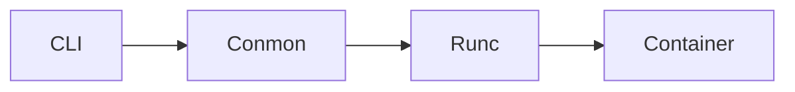

# Decision Tree: When to Use Docker vs Podman vs Others

## Overview
Container runtimes serve different needs. Use this guide to choose the right one for your environment.

## Decision Flow

```mermaid
flowchart TD
    Start[Need Containerization] --> Q1{Enterprise security requirements?}
    Q1 -->|High| Podman[Podman]
    Q1 -->|Normal| Q2{Need Docker Compose?}
    
    Q2 -->|Yes| Docker[Docker]
    Q2 -->|No| Q3{Rootless containers required?}
    
    Q3 -->|Yes| Podman
    Q3 -->|No| Q4{Kubernetes integration?}
    
    Q4 -->|Yes| containerd[containerd]
    Q4 -->|No| Q5{Desktop development?}
    
    Q5 -->|Yes| Docker
    Q5 -->|No| Q6{Need orchestration?}
    
    Q6 -->|Yes, simple| Docker Swarm[Docker Swarm]
    Q6 -->|Yes, complex| K8s[Kubernetes]
    Q6 -->|No| Q7{CI/CD pipeline?}
    
    Q7 -->|Yes| Podman
    Q7 -->|No| Docker
    
    Start --> Q8{Docker Desktop required?}
    Q8 -->|Yes| Docker
    Q8 -->|No| Podman
```

## Feature Comparison

| Feature | Docker | Podman | containerd | CRI-O |
|---------|--------|--------|------------|-------|
| Daemon Required | Yes | No | Yes | Yes |
| Rootless | Optional | Default | Optional | Optional |
| Docker Compose | Native | Compatible | No | No |
| Kubernetes Integration | Good | Good | Excellent | Excellent |
| OCI Compliance | Yes | Yes | Yes | Yes |
| Image Building | Yes | Yes | No | No |
| CLI Compatibility | Native | Docker CLI compatible | ctr CLI | crictl |
| Desktop Application | Docker Desktop | Podman Desktop | No | No |
| Systemd Integration | Manual | Native | Manual | Manual |

## Use Case Recommendations

### Choose Docker When:
- Desktop development environment
- Need Docker Compose
- Team familiar with Docker
- Simple container workflows
- Quick prototyping required

### Choose Podman When:
- Security is top priority
- Need rootless containers
- Enterprise environment
- Systemd integration needed
- CI/CD pipelines

### Choose containerd When:
- Kubernetes node runtime
- Need minimal runtime
- Production Kubernetes clusters
- Fine-grained control needed

## Security Comparison



## Architecture Differences

### Docker Architecture


### Podman Architecture


## Performance Characteristics

| Metric | Docker | Podman | containerd |
|--------|--------|--------|------------|
| Startup Time | Fast | Fast | Faster |
| Memory Overhead | Moderate | Lower | Lowest |
| Storage Driver | overlay2 | overlay2 | overlay2 |
| Network Performance | Good | Good | Good |
| Image Pull Speed | Fast | Fast | Fast |

## Migration Paths

### From Docker to Podman:
- Use podman-docker compatibility package
- Update CI/CD scripts
- Test rootless workflows
- Update documentation

### From Docker to containerd:
- Use ctr or crictl CLI
- Integrate with Kubernetes
- Update build processes
- Plan for orchestration

## When to Consider Alternatives

### Consider Docker Desktop When:
- Need GUI for container management
- Want integrated Kubernetes
- Desktop development focus
- Need Docker Scout scanning

### Consider Podman Desktop When:
- Want rootless desktop containers
- Need Podman-specific features
- Enterprise security requirements
- Prefer no daemon architecture

## Decision Matrix

| Requirement | Docker | Podman | containerd |
|-------------|--------|--------|------------|
| Ease of Use | Best | Good | Moderate |
| Security | Good | Best | Good |
| Kubernetes Integration | Good | Good | Best |
| Desktop Experience | Best | Good | Poor |
| Enterprise Support | Good | Good | Good |
| Community Size | Largest | Growing | Large |
| Documentation | Excellent | Good | Good |
| Learning Resources | Most | Growing | Good |

## Decision Checklist

Choose Docker if you check 3 or more:
- [ ] Desktop development primary
- [ ] Need Docker Compose
- [ ] Team knows Docker
- [ ] Simple workflows needed
- [ ] Quick prototyping
- [ ] Want GUI management

Choose Podman if you check 3 or more:
- [ ] Security critical
- [ ] Need rootless containers
- [ ] Enterprise environment
- [ ] Systemd integration needed
- [ ] CI/CD pipelines
- [ ] Want daemonless architecture

Choose containerd if you check 3 or more:
- [ ] Kubernetes node runtime
- [ ] Minimal runtime needed
- [ ] Production clusters
- [ ] Fine-grained control
- [ ] No build tools needed
- [ ] Maximum performance