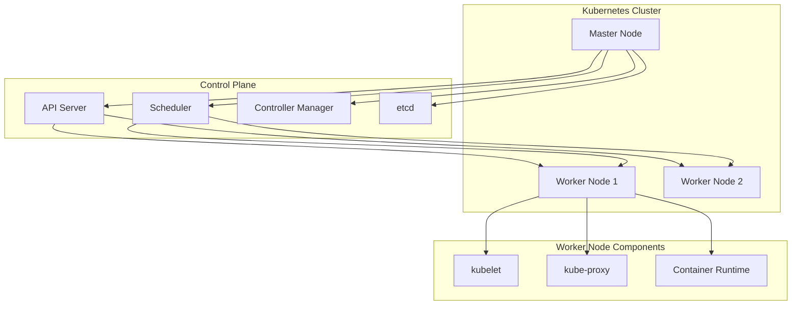
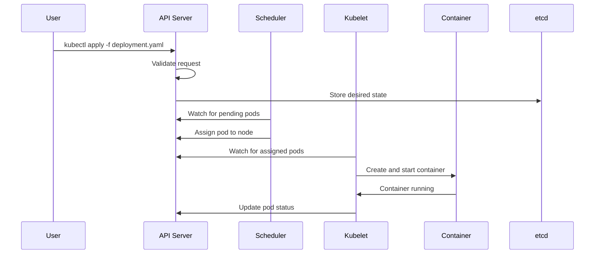

# 1. Introduction

Kubernetes (K8s) is an open-source container orchestration platform for automating deployment, scaling, and management of containerized applications. It groups containers into logical units for easy management and discovery.

# 2. Learning Objectives

- Understand Kubernetes architecture and components
- Deploy and manage applications on Kubernetes
- Configure services, deployments, and pods
- Implement scaling and self-healing
- Monitor and troubleshoot Kubernetes clusters

# 3. Prerequisites

- Docker fundamentals (Module 21)
- Basic networking concepts
- Understanding of distributed systems

# 4. Why This Concept Exists

Managing hundreds or thousands of containers manually is impossible. Kubernetes provides automated orchestration, self-healing, scaling, and service discovery for containerized applications at scale.

# 5. Problem Statement

**Without Kubernetes:**
- Manual container management
- No automatic scaling or recovery
- Complex service discovery
- Difficult rolling updates

**With Kubernetes:**
- Automated deployment and scaling
- Self-healing containers
- Built-in service discovery
- Zero-downtime deployments

# 6. Theory

**Kubernetes Architecture:**

| Component | Role |
|-----------|------|
| Master Node | Control plane (API server, scheduler, controller manager, etcd) |
| Worker Node | Runs application containers (kubelet, kube-proxy, containers) |
| Pod | Smallest deployable unit |
| Service | Network endpoint for pods |
| Deployment | Manages pod replicas |

**Key Concepts:**
- **Pod**: Group of one or more containers
- **Service**: Stable network endpoint
- **Deployment**: Declarative updates for pods
- **Namespace**: Virtual cluster isolation

# 7. Internal Working

**Kubernetes Control Flow:**
1. User submits YAML to API Server
2. API Server stores state in etcd
3. Scheduler assigns pods to nodes
4. Kubelet on node starts containers
5. Controller manager ensures desired state

**Self-Healing Mechanism:**
```
Desired State (3 replicas)
    ↓
Actual State (2 running)
    ↓
Controller detects mismatch
    ↓
Schedules new pod
    ↓
Actual State = Desired State
```

# 8. JVM Perspective

**JVM in Kubernetes:**
- Kubernetes provides resource limits (CPU/memory)
- JVM must respect container limits
- Use `-XX:+UseContainerSupport`
- Configure heap based on resource requests

**Resource Configuration:**
```yaml
resources:
  requests:
    memory: "512Mi"
    cpu: "500m"
  limits:
    memory: "1Gi"
    cpu: "1000m"
```

# 9. Memory Representation

```
Kubernetes Cluster
├── Master Node
│   ├── API Server
│   ├── Scheduler
│   ├── Controller Manager
│   └── etcd (State Store)
├── Worker Node 1
│   ├── kubelet
│   ├── kube-proxy
│   ├── Pod A (Container)
│   └── Pod B (Container)
└── Worker Node 2
    ├── kubelet
    ├── kube-proxy
    └── Pod C (Container)
```

# 10. Architecture Diagram (Mermaid)



# 11. Flow Diagram (Mermaid)



# 12. Syntax

```bash
# Cluster management
kubectl cluster-info
kubectl get nodes
kubectl get pods --all-namespaces

# Workload management
kubectl create deployment myapp --image=myapp:latest
kubectl expose deployment myapp --port=8080 --type=LoadBalancer
kubectl scale deployment myapp --replicas=3

# Debugging
kubectl get pods
kubectl describe pod <pod-name>
kubectl logs <pod-name>
kubectl exec -it <pod-name> -- /bin/bash

# Configuration
kubectl apply -f deployment.yaml
kubectl delete -f deployment.yaml
kubectl diff -f deployment.yaml
```

# 13. Easy Example

```yaml
# Simple deployment
apiVersion: apps/v1
kind: Deployment
metadata:
  name: myapp
spec:
  replicas: 2
  selector:
    matchLabels:
      app: myapp
  template:
    metadata:
      labels:
        app: myapp
    spec:
      containers:
      - name: myapp
        image: myapp:latest
        ports:
        - containerPort: 8080
```

```bash
kubectl apply -f deployment.yaml
kubectl get pods
kubectl get svc
```

# 14. Medium Example

```yaml
# Deployment with service and health checks
apiVersion: apps/v1
kind: Deployment
metadata:
  name: myapp
spec:
  replicas: 3
  selector:
    matchLabels:
      app: myapp
  template:
    metadata:
      labels:
        app: myapp
    spec:
      containers:
      - name: myapp
        image: myapp:latest
        ports:
        - containerPort: 8080
        resources:
          requests:
            memory: "256Mi"
            cpu: "250m"
          limits:
            memory: "512Mi"
            cpu: "500m"
        livenessProbe:
          httpGet:
            path: /actuator/health/liveness
            port: 8080
          initialDelaySeconds: 30
          periodSeconds: 10
        readinessProbe:
          httpGet:
            path: /actuator/health/readiness
            port: 8080
          initialDelaySeconds: 5
          periodSeconds: 5
---
apiVersion: v1
kind: Service
metadata:
  name: myapp
spec:
  selector:
    app: myapp
  ports:
  - port: 80
    targetPort: 8080
  type: LoadBalancer
```

# 15. Hard Example

```yaml
# Production deployment with HPA and PDB
apiVersion: apps/v1
kind: Deployment
metadata:
  name: myapp
  labels:
    app: myapp
spec:
  replicas: 3
  selector:
    matchLabels:
      app: myapp
  strategy:
    type: RollingUpdate
    rollingUpdate:
      maxSurge: 1
      maxUnavailable: 0
  template:
    metadata:
      labels:
        app: myapp
    spec:
      terminationGracePeriodSeconds: 60
      containers:
      - name: myapp
        image: myapp:2.0.0
        ports:
        - containerPort: 8080
        env:
        - name: SPRING_PROFILES_ACTIVE
          value: "production"
        - name: SPRING_DATASOURCE_URL
          valueFrom:
            secretKeyRef:
              name: myapp-secrets
              key: database-url
        resources:
          requests:
            memory: "512Mi"
            cpu: "500m"
          limits:
            memory: "1Gi"
            cpu: "1000m"
        livenessProbe:
          httpGet:
            path: /actuator/health/liveness
            port: 8080
          initialDelaySeconds: 60
          periodSeconds: 10
          failureThreshold: 3
        readinessProbe:
          httpGet:
            path: /actuator/health/readiness
            port: 8080
          initialDelaySeconds: 10
          periodSeconds: 5
          failureThreshold: 3
        lifecycle:
          preStop:
            exec:
              command: ["/bin/sh", "-c", "sleep 10"]
---
apiVersion: v1
kind: Service
metadata:
  name: myapp
spec:
  selector:
    app: myapp
  ports:
  - port: 80
    targetPort: 8080
  type: ClusterIP
---
apiVersion: policy/v1
kind: PodDisruptionBudget
metadata:
  name: myapp-pdb
spec:
  minAvailable: 2
  selector:
    matchLabels:
      app: myapp
---
apiVersion: autoscaling/v2
kind: HorizontalPodAutoscaler
metadata:
  name: myapp-hpa
spec:
  scaleTargetRef:
    apiVersion: apps/v1
    kind: Deployment
    name: myapp
  minReplicas: 3
  maxReplicas: 10
  metrics:
  - type: Resource
    resource:
      name: cpu
      target:
        type: Utilization
        averageUtilization: 70
```

# 16. Enterprise Example

```yaml
# Complete enterprise deployment
apiVersion: apps/v1
kind: Deployment
metadata:
  name: myapp
  namespace: production
  labels:
    app: myapp
    version: 2.0.0
    team: backend
spec:
  replicas: 5
  selector:
    matchLabels:
      app: myapp
  strategy:
    type: RollingUpdate
    rollingUpdate:
      maxSurge: 2
      maxUnavailable: 0
  template:
    metadata:
      labels:
        app: myapp
        version: 2.0.0
    spec:
      serviceAccountName: myapp-sa
      securityContext:
        runAsNonRoot: true
        runAsUser: 1000
        fsGroup: 1000
      containers:
      - name: myapp
        image: registry.example.com/myapp:2.0.0
        ports:
        - containerPort: 8080
          name: http
        - containerPort: 8443
          name: https
        env:
        - name: JAVA_OPTS
          value: "-XX:+UseContainerSupport -XX:MaxRAMPercentage=75.0"
        - name: SPRING_PROFILES_ACTIVE
          value: "production"
        - name: DB_PASSWORD
          valueFrom:
            secretKeyRef:
              name: myapp-secrets
              key: db-password
        resources:
          requests:
            memory: "1Gi"
            cpu: "1000m"
          limits:
            memory: "2Gi"
            cpu: "2000m"
        livenessProbe:
          httpGet:
            path: /actuator/health/liveness
            port: 8080
          initialDelaySeconds: 60
          periodSeconds: 15
          timeoutSeconds: 5
          failureThreshold: 3
        readinessProbe:
          httpGet:
            path: /actuator/health/readiness
            port: 8080
          initialDelaySeconds: 15
          periodSeconds: 5
          timeoutSeconds: 3
          failureThreshold: 3
        volumeMounts:
        - name: config
          mountPath: /app/config
          readOnly: true
        - name: tmp
          mountPath: /tmp
      volumes:
      - name: config
        configMap:
          name: myapp-config
      - name: tmp
        emptyDir: {}
```

# 17. Performance

**Kubernetes Performance:**
| Metric | Value |
|--------|-------|
| Pod startup | 5-15 seconds |
| Service discovery | <1ms |
| Scaling time | 30-60 seconds |
| Rolling update | Configurable |

**Optimization:**
- Use pod presets for common configurations
- Implement resource requests/limits
- Use node affinity for placement
- Configure pod disruption budgets

# 18. Time & Space Complexity

| Operation | Time | Space |
|-----------|------|-------|
| Create pod | O(1) | O(pod) |
| Scale deployment | O(replicas) | O(replicas) |
| Service discovery | O(1) | O(cache) |
| Update deployment | O(replicas) | O(replicas) |

# 19. Thread Safety

Kubernetes handles concurrency through:
- API server request validation
- etcd distributed consensus
- Controller reconciliation loops
- Kubelet status reporting

# 20. Best Practices

1. Use namespaces for isolation
2. Implement resource requests and limits
3. Use liveness and readiness probes
4. Configure pod disruption budgets
5. Use secrets for sensitive data
6. Implement RBAC for access control
7. Monitor with Prometheus and Grafana
8. Use Helm charts for deployment
9. Implement network policies
10. Regular security audits

# 21. Common Mistakes

- Not setting resource limits
- Missing health checks
- Using latest tag in production
- Not implementing PDB
- Hardcoding secrets
- Ignoring pod anti-affinity
- Not configuring rolling updates

# 22. Pitfalls

- Pod scheduling failures due to resource constraints
- Service discovery delays
- Persistent volume binding issues
- ConfigMap/Secret update propagation
- Network policy misconfigurations

# 23. Debugging Tips

```bash
# Check pod status
kubectl get pods -o wide
kubectl describe pod <pod-name>

# View logs
kubectl logs <pod-name>
kubectl logs -f <pod-name> --previous

# Debug networking
kubectl run debug --image=busybox --rm -it -- sh
kubectl exec -it <pod> -- nslookup <service>

# Check events
kubectl get events --sort-by=.metadata.creationTimestamp
```

# 24. Comparison Table

| Feature | Kubernetes | Docker Swarm | Nomad |
|---------|------------|--------------|-------|
| Complexity | High | Low | Medium |
| Scaling | Auto | Auto | Auto |
| Ecosystem | Large | Small | Medium |
| Learning Curve | Steep | Easy | Medium |
| Production | Yes | Yes | Yes |

# 25. Decision Tree

```
Need container orchestration?
├── Simple deployment? → Docker Compose
├── Single host? → Docker Compose
├── Multi-host cluster? → Kubernetes
├── Enterprise production? → Kubernetes
└── Simple clustering? → Docker Swarm
```

# 26. Interview Questions

1. **What is Kubernetes?**
   An open-source container orchestration platform for automating deployment, scaling, and management of containerized applications.

2. **What is a Pod?**
   The smallest deployable unit in Kubernetes, containing one or more containers that share network and storage.

3. **What is a Service in Kubernetes?**
   A stable network endpoint that provides load balancing and service discovery for pods.

4. **What is the difference between Deployment and StatefulSet?**
   Deployment is for stateless applications; StatefulSet is for stateful applications requiring stable network identities and persistent storage.

5. **How does Kubernetes handle scaling?**
   Through HorizontalPodAutoscaler (HPA) based on metrics, or manual scaling with kubectl scale.

6. **What is a ConfigMap?**
   An API object used to store non-confidential configuration data in key-value pairs.

7. **What is a Secret?**
   Similar to ConfigMap but designed for sensitive data like passwords and certificates.

8. **How do liveness and readiness probes work?**
   Liveness checks if container is alive; readiness checks if container can accept traffic. Kubernetes restarts failed liveness probes.

9. **What is a Namespace?**
   A virtual cluster within a physical cluster for resource isolation.

10. **How do rolling updates work?**
    Kubernetes gradually replaces old pods with new ones while maintaining availability through maxSurge and maxUnavailable settings.

11. **What is a DaemonSet?**
    Ensures a pod runs on all (or specific) nodes, used for logging, monitoring, and system services.

12. **What is an Ingress?**
    Manages external HTTP/HTTPS access to services within the cluster.

13. **How does service discovery work?**
    Kubernetes provides DNS records for services. Pods can access services by name within the same namespace.

14. **What is the etcd?**
    A distributed key-value store used as Kubernetes' backing store for all cluster data.

15. **How do you troubleshoot a failing pod?**
    Check events, describe pod, view logs, exec into container, verify resource limits and node conditions.

# 27. Exercises

**Level 1:**
1. Deploy a simple application to Kubernetes
2. Expose it as a service
3. Scale it to 3 replicas

**Level 2:**
1. Implement health checks for a Spring Boot application
2. Configure resource limits and requests
3. Set up horizontal pod autoscaling

**Level 3:**
1. Deploy a microservices application with multiple services
2. Implement network policies for security
3. Set up monitoring with Prometheus and Grafana

# 28. Summary

Kubernetes provides powerful container orchestration for deploying, scaling, and managing applications. Understanding pods, services, deployments, and configuration management is essential for modern cloud-native development.

# 29. References

- [Kubernetes Documentation](https://kubernetes.io/docs/)
- [Kubernetes Concepts](https://kubernetes.io/docs/concepts/)
- [kubectl Reference](https://kubernetes.io/docs/reference/kubectl/)
- [Helm Charts](https://helm.sh/)
- [Kubernetes Best Practices](https://kubernetes.io/docs/concepts/best-practices/)
