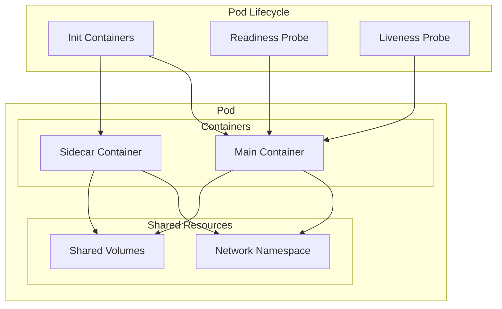
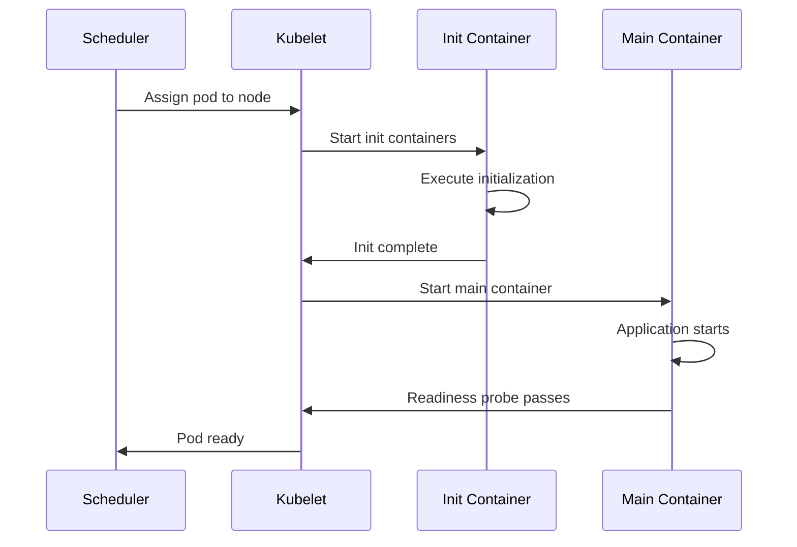

# 1. Introduction

Pods are the smallest deployable units in Kubernetes. They represent a single instance of a running process and can contain one or more containers that share network and storage resources.

# 2. Learning Objectives

- Understand Pod lifecycle and states
- Configure init containers and sidecars
- Implement proper resource management
- Use pod templates effectively
- Debug pod issues

# 3. Prerequisites

- Kubernetes fundamentals (Module 22.1)
- Docker container concepts
- Basic YAML syntax

# 4. Why This Concept Exists

Pods provide a way to group closely related processes that need to share resources. They enable multi-container patterns like sidecars, ambassadors, and adapters while maintaining a single scheduling unit.

# 5. Problem Statement

**Without Pods:**
- Containers scheduled individually
- No shared network/storage
- Complex multi-container coordination
- Difficult to manage related processes

**With Pods:**
- Grouped related containers
- Shared localhost network
- Shared volumes
- Simplified lifecycle management

# 6. Theory

**Pod States:**

| State | Description |
|-------|-------------|
| Pending | Waiting to be scheduled |
| Running | At least one container running |
| Succeeded | All containers terminated successfully |
| Failed | At least one container failed |
| Unknown | Pod state unknown |

**Multi-Container Patterns:**
- **Sidecar**: Helper container (logging, monitoring)
- **Ambassador**: Proxy for external services
- **Adapter**: Standardize output format

# 7. Internal Working

**Pod Lifecycle:**
1. Pod created in API server
2. Scheduler assigns to node
3. Kubelet pulls images
4. Containers start
5. Init containers complete (if any)
6. Readiness probe passes
7. Pod becomes ready
8. Liveness probe monitors
9. Pod terminates (grace period)
10. Pod removed

**Init Container Flow:**
```
Pod Start
    ↓
Init Container 1 → Complete
    ↓
Init Container 2 → Complete
    ↓
Main Containers Start
```

# 8. JVM Perspective

**JVM in Pods:**
- JVM must respect pod resource limits
- Configure heap based on memory requests
- Use `-XX:+UseContainerSupport`
- Monitor with pod-level metrics

```yaml
resources:
  requests:
    memory: "512Mi"  # JVM heap ~384Mi (75%)
  limits:
    memory: "1Gi"    # JVM heap ~768Mi (75%)
```

# 9. Memory Representation

```
Pod Architecture
┌─────────────────────────────────┐
│           Pod Network           │
│  ┌─────────┐  ┌─────────┐     │
│  │Container│  │Container│     │
│  │   A     │  │   B     │     │
│  │(Main)   │  │(Sidecar)│     │
│  └────┬────┘  └────┬────┘     │
│       │            │           │
│       └─────┬──────┘           │
│             │                  │
│        localhost:8080          │
├─────────────────────────────────┤
│         Shared Volumes         │
│  ┌─────────┐  ┌─────────┐     │
│  │Volume A │  │Volume B │     │
│  └─────────┘  └─────────┘     │
└─────────────────────────────────┘
```

# 10. Architecture Diagram (Mermaid)



# 11. Flow Diagram (Mermaid)



# 12. Syntax

```yaml
apiVersion: v1
kind: Pod
metadata:
  name: myapp
  labels:
    app: myapp
spec:
  initContainers:
  - name: init-db
    image: busybox
    command: ['sh', '-c', 'until nslookup db; do sleep 2; done']
  containers:
  - name: myapp
    image: myapp:latest
    ports:
    - containerPort: 8080
    resources:
      requests:
        memory: "256Mi"
        cpu: "250m"
      limits:
        memory: "512Mi"
        cpu: "500m"
    volumeMounts:
    - name: config
      mountPath: /app/config
  volumes:
  - name: config
    configMap:
      name: myapp-config
```

# 13. Easy Example

```yaml
# Simple pod
apiVersion: v1
kind: Pod
metadata:
  name: nginx
  labels:
    app: nginx
spec:
  containers:
  - name: nginx
    image: nginx:alpine
    ports:
    - containerPort: 80
```

```bash
kubectl apply -f pod.yaml
kubectl get pods
kubectl describe pod nginx
```

# 14. Medium Example

```yaml
# Pod with init container and sidecar
apiVersion: v1
kind: Pod
metadata:
  name: myapp
spec:
  initContainers:
  - name: wait-for-db
    image: busybox:1.36
    command: ['sh', '-c', 'until nslookup postgres; do sleep 2; done']
  
  containers:
  - name: myapp
    image: myapp:latest
    ports:
    - containerPort: 8080
    env:
    - name: DB_HOST
      value: postgres
    resources:
      requests:
        memory: "256Mi"
        cpu: "250m"
      limits:
        memory: "512Mi"
        cpu: "500m"
  
  - name: log-shipper
    image: fluent/fluent-bit:latest
    volumeMounts:
    - name: logs
      mountPath: /var/log
  
  volumes:
  - name: logs
    emptyDir: {}
```

# 15. Hard Example

```yaml
# Production pod with multiple patterns
apiVersion: v1
kind: Pod
metadata:
  name: myapp
  labels:
    app: myapp
    version: 2.0.0
  annotations:
    prometheus.io/scrape: "true"
    prometheus.io/port: "8080"
spec:
  serviceAccountName: myapp-sa
  securityContext:
    runAsNonRoot: true
    runAsUser: 1000
    fsGroup: 1000
  
  initContainers:
  - name: init-config
    image: busybox:1.36
    command: ['sh', '-c', 'cp /config-template/* /config/']
    volumeMounts:
    - name: config-template
      mountPath: /config-template
    - name: config
      mountPath: /config
  
  containers:
  - name: myapp
    image: myapp:2.0.0
    ports:
    - name: http
      containerPort: 8080
    - name: metrics
      containerPort: 9090
    env:
    - name: JAVA_OPTS
      value: "-XX:+UseContainerSupport -XX:MaxRAMPercentage=75.0"
    resources:
      requests:
        memory: "512Mi"
        cpu: "500m"
      limits:
        memory: "1Gi"
        cpu: "1000m"
    livenessProbe:
      httpGet:
        path: /actuator/health/liveness
        port: 8080
      initialDelaySeconds: 60
      periodSeconds: 10
    readinessProbe:
      httpGet:
        path: /actuator/health/readiness
        port: 8080
      initialDelaySeconds: 15
      periodSeconds: 5
    volumeMounts:
    - name: config
      mountPath: /app/config
      readOnly: true
  
  - name: envoy-sidecar
    image: envoyproxy/envoy:v1.27
    ports:
    - containerPort: 8443
    volumeMounts:
    - name: envoy-config
      mountPath: /etc/envoy
  
  volumes:
  - name: config
    emptyDir: {}
  - name: config-template
    configMap:
      name: myapp-config
  - name: envoy-config
    configMap:
      name: envoy-config
```

# 16. Enterprise Example

```yaml
# Enterprise pod with full feature set
apiVersion: v1
kind: Pod
metadata:
  name: myapp
  namespace: production
  labels:
    app: myapp
    version: 2.0.0
    team: backend
    environment: production
  annotations:
    prometheus.io/scrape: "true"
    prometheus.io/port: "9090"
    sidecar.istio.io/inject: "true"
spec:
  serviceAccountName: myapp-sa
  automountServiceAccountToken: false
  securityContext:
    runAsNonRoot: true
    runAsUser: 1000
    fsGroup: 1000
    seccompProfile:
      type: RuntimeDefault
  
  initContainers:
  - name: init-permissions
    image: busybox:1.36
    command: ['sh', '-c', 'chown -R 1000:1000 /data']
    securityContext:
      runAsUser: 0
    volumeMounts:
    - name: data
      mountPath: /data
  
  - name: init-schema
    image: flyway/flyway:latest
    command: ['flyway', 'migrate']
    env:
    - name: FLYWAY_URL
      value: jdbc:postgresql://postgres:5432/mydb
    - name: FLYWAY_USER
      valueFrom:
        secretKeyRef:
          name: myapp-secrets
          key: db-user
    - name: FLYWAY_PASSWORD
      valueFrom:
        secretKeyRef:
          name: myapp-secrets
          key: db-password
  
  containers:
  - name: myapp
    image: registry.example.com/myapp:2.0.0
    imagePullPolicy: Always
    ports:
    - name: http
      containerPort: 8080
      protocol: TCP
    - name: https
      containerPort: 8443
      protocol: TCP
    - name: metrics
      containerPort: 9090
      protocol: TCP
    env:
    - name: JAVA_OPTS
      value: "-XX:+UseContainerSupport -XX:MaxRAMPercentage=75.0"
    - name: SPRING_PROFILES_ACTIVE
      value: "production"
    - name: DB_PASSWORD
      valueFrom:
        secretKeyRef:
          name: myapp-secrets
          key: db-password
    resources:
      requests:
        memory: "1Gi"
        cpu: "1000m"
        ephemeral-storage: "1Gi"
      limits:
        memory: "2Gi"
        cpu: "2000m"
        ephemeral-storage: "5Gi"
    livenessProbe:
      httpGet:
        path: /actuator/health/liveness
        port: 8080
      initialDelaySeconds: 60
      periodSeconds: 15
      timeoutSeconds: 5
      failureThreshold: 3
    readinessProbe:
      httpGet:
        path: /actuator/health/readiness
        port: 8080
      initialDelaySeconds: 15
      periodSeconds: 5
      timeoutSeconds: 3
      failureThreshold: 3
    startupProbe:
      httpGet:
        path: /actuator/health
        port: 8080
      failureThreshold: 30
      periodSeconds: 10
    volumeMounts:
    - name: data
      mountPath: /app/data
    - name: config
      mountPath: /app/config
      readOnly: true
    - name: tmp
      mountPath: /tmp
  
  volumes:
  - name: data
    persistentVolumeClaim:
      claimName: myapp-data
  - name: config
    configMap:
      name: myapp-config
  - name: tmp
    emptyDir:
      sizeLimit: 100Mi
  
  affinity:
    podAntiAffinity:
      preferredDuringSchedulingIgnoredDuringExecution:
      - weight: 100
        podAffinityTerm:
          labelSelector:
            matchExpressions:
            - key: app
              operator: In
              values:
              - myapp
          topologyKey: kubernetes.io/hostname
  
  topologySpreadConstraints:
  - maxSkew: 1
    topologyKey: topology.kubernetes.io/zone
    whenUnsatisfiable: DoNotSchedule
    labelSelector:
      matchLabels:
        app: myapp
```

# 17. Performance

**Pod Performance:**
| Metric | Value |
|--------|-------|
| Startup time | 5-15 seconds |
| Shutdown time | Grace period (30s default) |
| Network latency | <1ms (same node) |
| Storage IOPS | Depends on volume type |

**Optimization:**
- Use init containers for setup
- Implement startup probes for slow apps
- Configure graceful shutdown
- Use pod topology spread

# 18. Time & Space Complexity

| Operation | Time | Space |
|-----------|------|-------|
| Create pod | O(1) | O(pod) |
| Schedule pod | O(nodes) | O(scheduler) |
| Start containers | O(images) | O(containers) |
| Health checks | O(1) | O(check) |

# 19. Thread Safety

Pods provide isolation at the container level. Each container has its own process space. Shared namespaces (network, IPC) require application-level synchronization.

# 20. Best Practices

1. Use pod templates in Deployments
2. Implement all three probe types
3. Set resource requests and limits
4. Use init containers for setup
5. Configure graceful shutdown
6. Use security contexts
7. Implement pod anti-affinity
8. Use topology spread constraints
9. Monitor pod metrics
10. Clean up completed pods

# 21. Common Mistakes

- Not setting resource limits
- Missing health checks
- Using host network in production
- Running as root user
- Not implementing graceful shutdown
- Ignoring pod anti-affinity
- Using emptyDir for persistent data

# 22. Pitfalls

- Init containers block main container start
- Liveness probe failures cause restarts
- Resource limits cause OOM kills
- Node affinity may cause scheduling failures
- Secret volume updates are not automatic

# 23. Debugging Tips

```bash
# Check pod status
kubectl get pods -o wide
kubectl describe pod <pod-name>

# View logs
kubectl logs <pod-name> -c <container>
kubectl logs <pod-name> --previous

# Execute into pod
kubectl exec -it <pod-name> -- /bin/bash

# Check resource usage
kubectl top pods

# Debug networking
kubectl run debug --image=busybox --rm -it -- nslookup <service>
```

# 24. Comparison Table

| Feature | Pod | Deployment | StatefulSet |
|---------|-----|------------|-------------|
| Use Case | Single instance | Stateless apps | Stateful apps |
| Scaling | Manual | Auto/Manual | Manual |
| Storage | ephemeral | ephemeral | Persistent |
| Network | Dynamic | Dynamic | Stable |
| Updates | Manual | Rolling | Rolling |

# 25. Decision Tool

```
Need to deploy containers?
├── Single instance, one-time? → Pod
├── Stateless, scalable? → Deployment
├── Stateful, persistent? → StatefulSet
├── System service on all nodes? → DaemonSet
└── Batch job? → Job/CronJob
```

# 26. Interview Questions

1. **What is a Pod?**
   The smallest deployable unit in Kubernetes, containing one or more containers that share network and storage resources.

2. **What is the difference between Pod and Container?**
   A Pod can contain multiple containers; a container is a single running process. Pods provide shared context for containers.

3. **What are init containers?**
   Containers that run before main containers, used for setup tasks like waiting for dependencies or initializing configuration.

4. **What is a sidecar container?**
   A helper container that runs alongside the main container, providing supplementary functionality like logging or monitoring.

5. **How do liveness and readiness probes differ?**
   Liveness checks if container is alive (restarts on failure); readiness checks if container can accept traffic (removes from service on failure).

6. **What is the Pod lifecycle?**
   Pending → Running → Succeeded/Failed → Terminated. Init containers run before main containers.

7. **How do you handle graceful shutdown?**
   Implement SIGTERM handler, use preStop hooks, and configure terminationGracePeriodSeconds.

8. **What are pod security contexts?**
   Security settings that define user/group, privilege escalation, and seccomp profiles for containers.

9. **How do you debug a crashing pod?**
   Check logs, describe pod, verify resource limits, check node conditions, examine events.

10. **What is the difference between emptyDir and hostPath?**
    emptyDir is empty when pod starts and deleted when pod stops; hostPath mounts host filesystem directory.

11. **How do you configure JVM in a pod?**
    Use `-XX:+UseContainerSupport`, set `-XX:MaxRAMPercentage`, and configure based on pod resource limits.

12. **What is pod anti-affinity?**
    A rule that prevents pods from being scheduled on the same node, improving availability.

13. **How do you update a pod?**
    Pods are immutable. Update the Deployment or StatefulSet, which creates new pods and terminates old ones.

14. **What are topology spread constraints?**
    Rules that ensure pods are evenly distributed across zones or nodes for high availability.

15. **How do you handle sensitive data in pods?**
    Use Secrets, mount them as volumes or environment variables. Never hardcode in pod spec.

# 27. Exercises

**Level 1:**
1. Create a simple pod with nginx
2. Add labels and annotations
3. View pod logs and describe

**Level 2:**
1. Create a pod with init container
2. Add a sidecar container for logging
3. Implement all three probe types

**Level 3:**
1. Create a production pod with security context
2. Configure pod anti-affinity
3. Implement graceful shutdown with preStop hook

# 28. Summary

Pods are fundamental to Kubernetes, providing the execution context for containers. Understanding pod lifecycle, multi-container patterns, and resource management is essential for deploying applications effectively.

# 29. References

- [Kubernetes Pods](https://kubernetes.io/docs/concepts/workloads/pods/)
- [Pod Lifecycle](https://kubernetes.io/docs/concepts/workloads/pods/pod-lifecycle/)
- [Init Containers](https://kubernetes.io/docs/concepts/workloads/pods/init-containers/)
- [Pod Security](https://kubernetes.io/docs/concepts/security/pod-security-standards/)
- [Pod Topology](https://kubernetes.io/docs/concepts/scheduling-eviction/topology-spread-constraints/)
