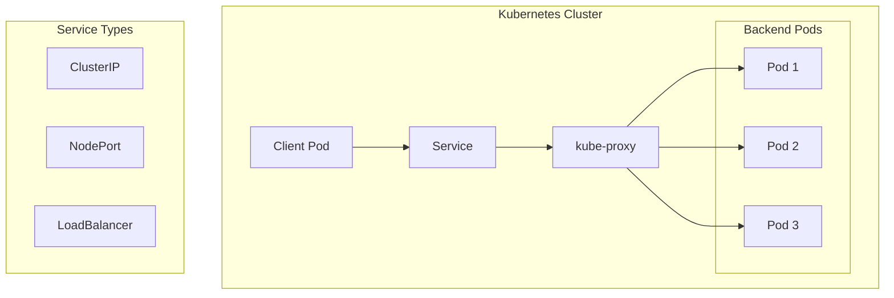
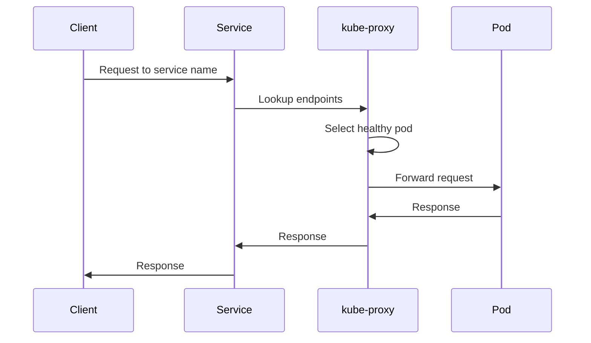

# 1. Introduction

Kubernetes Services provide stable network endpoints for pods. They enable service discovery, load balancing, and abstraction between clients and pods, which are ephemeral by nature.

# 2. Learning Objectives

- Understand Service types and use cases
- Configure ClusterIP, NodePort, and LoadBalancer services
- Implement headless services for stateful applications
- Use ExternalName services for external dependencies
- Configure service discovery and DNS

# 3. Prerequisites

- Kubernetes fundamentals (Module 22.1)
- Pod concepts (Module 22.2)
- Basic networking knowledge

# 4. Why This Concept Exists

Pods are ephemeral - they can be created, destroyed, and rescheduled at any time. Services provide a stable IP address and DNS name that remains constant, enabling reliable communication between application components.

# 5. Problem Statement

**Without Services:**
- Pods have dynamic IPs
- No load balancing
- No service discovery
- Manual endpoint management

**With Services:**
- Stable IP and DNS name
- Automatic load balancing
- Built-in service discovery
- Declarative configuration

# 6. Theory

**Service Types:**

| Type | Scope | Use Case |
|------|-------|----------|
| ClusterIP | Internal only | Internal microservices |
| NodePort | External (Node IP) | Development, simple exposure |
| LoadBalancer | External (Cloud LB) | Production external access |
| ExternalName | CNAME redirect | External service alias |

**Service Selection:**
```yaml
selector:
  app: myapp  # Matches pods with label app=myapp
```

# 7. Internal Working

**Service Architecture:**
```
Client Request
    ↓
Service (ClusterIP: 10.96.0.100)
    ↓
kube-proxy (iptables/IPVS)
    ↓
Load Balancing
    ↓
Pod 1 (10.244.1.5)
Pod 2 (10.244.2.8)
Pod 3 (10.244.1.12)
```

**DNS Resolution:**
- `<service-name>.<namespace>.svc.cluster.local`
- Example: `myapp.default.svc.cluster.local`

# 8. JVM Perspective

**JVM Application Configuration:**
```yaml
# Service
apiVersion: v1
kind: Service
metadata:
  name: myapp
spec:
  selector:
    app: myapp
  ports:
  - port: 80
    targetPort: 8080

# JVM connects to:
# http://myapp:80 (DNS resolution)
# or http://myapp.default.svc.cluster.local:80
```

# 9. Memory Representation

```
Service Load Balancing
┌─────────────────────────────┐
│      Service (VIP)          │
│    10.96.0.100:80           │
└──────────┬──────────────────┘
           │
    ┌──────┴──────┐
    │  kube-proxy │
    └──────┬──────┘
           │
    ┌──────┴──────────────────┐
    │      │         │        │
    ▼      ▼         ▼        │
┌──────┐┌──────┐┌──────┐     │
│Pod 1 ││Pod 2 ││Pod 3 │     │
│:8080 ││:8080 ││:8080 │     │
└──────┘└──────┘└──────┘     │
```

# 10. Architecture Diagram (Mermaid)



# 11. Flow Diagram (Mermaid)



# 12. Syntax

```yaml
# ClusterIP Service
apiVersion: v1
kind: Service
metadata:
  name: myapp
spec:
  type: ClusterIP
  selector:
    app: myapp
  ports:
  - port: 80
    targetPort: 8080

# NodePort Service
apiVersion: v1
kind: Service
metadata:
  name: myapp
spec:
  type: NodePort
  selector:
    app: myapp
  ports:
  - port: 80
    targetPort: 8080
    nodePort: 30080

# LoadBalancer Service
apiVersion: v1
kind: Service
metadata:
  name: myapp
spec:
  type: LoadBalancer
  selector:
    app: myapp
  ports:
  - port: 80
    targetPort: 8080
```

# 13. Easy Example

```yaml
# Simple ClusterIP service
apiVersion: v1
kind: Service
metadata:
  name: myapp
spec:
  selector:
    app: myapp
  ports:
  - port: 80
    targetPort: 8080
```

```bash
kubectl apply -f service.yaml
kubectl get svc myapp
kubectl describe svc myapp
```

# 14. Medium Example

```yaml
# LoadBalancer with multiple ports
apiVersion: v1
kind: Service
metadata:
  name: myapp
  labels:
    app: myapp
spec:
  type: LoadBalancer
  selector:
    app: myapp
  ports:
  - name: http
    port: 80
    targetPort: 8080
  - name: https
    port: 443
    targetPort: 8443
  - name: metrics
    port: 9090
    targetPort: 9090
```

# 15. Hard Example

```yaml
# Complete service configuration
apiVersion: v1
kind: Service
metadata:
  name: myapp
  namespace: production
  labels:
    app: myapp
    version: 2.0.0
  annotations:
    prometheus.io/scrape: "true"
    prometheus.io/port: "9090"
spec:
  type: LoadBalancer
  selector:
    app: myapp
    version: 2.0.0
  ports:
  - name: http
    port: 80
    targetPort: 8080
    protocol: TCP
  - name: https
    port: 443
    targetPort: 8443
    protocol: TCP
  - name: metrics
    port: 9090
    targetPort: 9090
    protocol: TCP
  loadBalancerSourceRanges:
  - 10.0.0.0/8
  - 192.168.0.0/16
  externalTrafficPolicy: Local
  sessionAffinity: ClientIP
  sessionAffinityConfig:
    clientIP:
      timeoutSeconds: 10800
```

# 16. Enterprise Example

```yaml
# Enterprise service with all features
apiVersion: v1
kind: Service
metadata:
  name: myapp
  namespace: production
  labels:
    app: myapp
    version: 2.0.0
    team: backend
  annotations:
    service.beta.kubernetes.io/aws-load-balancer-type: nlb
    service.beta.kubernetes.io/aws-load-balancer-internal: "true"
    service.beta.kubernetes.io/aws-load-balancer-cross-zone-load-balancing-enabled: "true"
spec:
  type: LoadBalancer
  selector:
    app: myapp
    version: 2.0.0
  ports:
  - name: http
    port: 80
    targetPort: 8080
    protocol: TCP
  - name: https
    port: 443
    targetPort: 8443
    protocol: TCP
  - name: metrics
    port: 9090
    targetPort: 9090
    protocol: TCP
  externalTrafficPolicy: Local
  healthCheckNodePort: 30000
  sessionAffinity: None
  ipFamilyPolicy: PreferDualStack
  ipFamilies:
  - IPv4
---
# Headless service for StatefulSet
apiVersion: v1
kind: Service
metadata:
  name: myapp-headless
  namespace: production
spec:
  clusterIP: None
  selector:
    app: myapp
  ports:
  - port: 80
    targetPort: 8080
---
# ExternalName service
apiVersion: v1
kind: Service
metadata:
  name: external-db
  namespace: production
spec:
  type: ExternalName
  externalName: db.example.com
```

# 17. Performance

**Service Performance:**
| Type | Latency | Throughput |
|------|---------|------------|
| ClusterIP | <1ms | High |
| NodePort | <1ms | High |
| LoadBalancer | 1-5ms | High |

**Optimization:**
- Use ClusterIP for internal services
- Use `externalTrafficPolicy: Local` for source IP preservation
- Configure session affinity when needed

# 18. Time & Space Complexity

| Operation | Time | Space |
|-----------|------|-------|
| Create service | O(1) | O(metadata) |
| Lookup endpoints | O(1) | O(cache) |
| Load balance | O(1) | O(connections) |
| Update endpoints | O(pods) | O(pods) |

# 19. Thread Safety

Services are managed by Kubernetes control plane. Endpoint updates are atomic. kube-proxy handles concurrent connections using iptables or IPVS.

# 20. Best Practices

1. Use meaningful service names
2. Configure health checks for endpoints
3. Use named ports for clarity
4. Implement network policies
5. Use headless services for StatefulSets
6. Configure external traffic policy
7. Use annotations for cloud providers
8. Monitor service metrics

# 21. Common Mistakes

- Missing selector labels
- Port name conflicts
- Not configuring health checks
- Using NodePort in production
- Ignoring external traffic policy
- Not using named ports

# 22. Pitfalls

- Service discovery DNS caching
- Session affinity may cause imbalance
- LoadBalancer costs in cloud environments
- ExternalName services don't support ports
- NodePort exposes on all nodes

# 23. Debugging Tips

```bash
# Check service
kubectl get svc
kubectl describe svc <service-name>

# Check endpoints
kubectl get endpoints <service-name>

# Test DNS resolution
kubectl run debug --image=busybox --rm -it -- nslookup <service-name>

# Test connectivity
kubectl run debug --image=busybox --rm -it -- wget -qO- http://<service-name>
```

# 24. Comparison Table

| Feature | ClusterIP | NodePort | LoadBalancer |
|---------|-----------|----------|--------------|
| Scope | Internal | External | External |
| Cost | Free | Free | Cloud charges |
| Source IP | Preserved | Lost | Lost (default) |
| Use Case | Internal | Dev/Test | Production |

# 25. Decision Tool

```
Need to expose service?
├── Internal only? → ClusterIP
├── Dev/test external? → NodePort
├── Production external? → LoadBalancer
├── External alias? → ExternalName
└── Stateful app? → Headless
```

# 26. Interview Questions

1. **What is a Kubernetes Service?**
   A stable network endpoint that provides load balancing and service discovery for a set of pods.

2. **What are the Service types?**
   ClusterIP (internal), NodePort (external via Node IP), LoadBalancer (cloud LB), ExternalName (CNAME).

3. **What is the difference between ClusterIP and NodePort?**
   ClusterIP is internal only; NodePort exposes the service on a specific port on all nodes.

4. **How does service discovery work?**
   Kubernetes DNS provides A records for services. Pods access services by name within the cluster.

5. **What is a headless service?**
   A service with `clusterIP: None` that returns pod IPs directly, used for StatefulSets.

6. **What is externalTrafficPolicy?**
   Controls how external traffic is routed. `Local` preserves source IP; `Cluster` load balances across all pods.

7. **How do services handle pod failures?**
   kube-proxy removes failed pods from the service's endpoint list automatically.

8. **What are named ports?**
   Port names in service spec that provide clarity and can be referenced in other resources.

9. **How do you debug service connectivity?**
   Check endpoints, verify selector labels, test DNS resolution, and use debug pods.

10. **What is session affinity?**
    Routes all requests from a client to the same pod. Use `ClientIP` for sticky sessions.

11. **What is the difference between port and targetPort?**
    `port` is the service port; `targetPort` is the container port traffic is forwarded to.

12. **How do services work across namespaces?**
    Use fully qualified name: `<service>.<namespace>.svc.cluster.local`.

13. **What are service annotations?**
    Metadata used by cloud providers and ingress controllers to configure load balancers.

14. **How do you expose services to the internet?**
    Use LoadBalancer type or Ingress controller with proper network policies.

15. **What is the difference between Service and Ingress?**
    Service provides L4 load balancing; Ingress provides L7 HTTP routing with SSL termination.

# 27. Exercises

**Level 1:**
1. Create a ClusterIP service for a deployment
2. Verify DNS resolution from another pod
3. Test load balancing across pods

**Level 2:**
1. Create a LoadBalancer service
2. Configure multiple named ports
3. Test external access

**Level 3:**
1. Create a headless service for a StatefulSet
2. Configure network policies for service access
3. Set up service monitoring with Prometheus

# 28. Summary

Kubernetes Services provide essential networking abstractions for applications. Understanding service types, DNS resolution, and load balancing is crucial for building reliable microservices architectures.

# 29. References

- [Kubernetes Services](https://kubernetes.io/docs/concepts/services-networking/service/)
- [Service DNS](https://kubernetes.io/docs/concepts/services-networking/dns-pod-service/)
- [Ingress](https://kubernetes.io/docs/concepts/services-networking/ingress/)
- [Network Policies](https://kubernetes.io/docs/concepts/services-networking/network-policies/)
- [Load Balancing](https://kubernetes.io/docs/concepts/services-networking/service/#loadbalancer)
