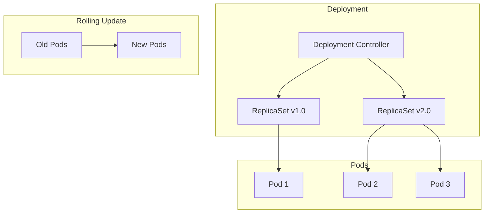
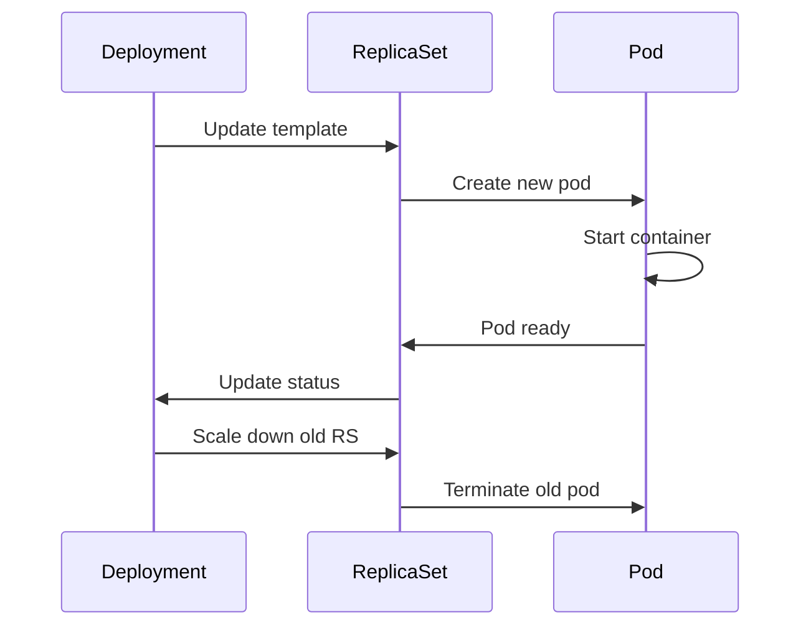

# 1. Introduction

Deployments provide declarative updates for pods and ReplicaSets. They describe the desired state of your application, and Kubernetes continuously works to maintain that state, enabling rolling updates, rollbacks, and scaling.

# 2. Learning Objectives

- Configure Deployment specifications
- Implement rolling updates and rollbacks
- Manage replica counts and scaling
- Use deployment strategies effectively
- Monitor deployment status

# 3. Prerequisites

- Kubernetes fundamentals (Module 22.1)
- Pod concepts (Module 22.2)
- Service concepts (Module 22.3)

# 4. Why This Concept Exists

Deployments automate the lifecycle management of applications. Instead of manually creating pods, you declare the desired state and Kubernetes ensures it's maintained, handling failures, scaling, and updates automatically.

# 5. Problem Statement

**Without Deployments:**
- Manual pod management
- No automatic scaling
- Complex update procedures
- No rollback capability

**With Deployments:**
- Declarative state management
- Automatic scaling and healing
- Rolling updates with zero downtime
- Easy rollbacks

# 6. Theory

**Deployment Components:**
```yaml
apiVersion: apps/v1
kind: Deployment
metadata:
  name: myapp
spec:
  replicas: 3
  selector:
    matchLabels:
      app: myapp
  strategy:
    type: RollingUpdate
    rollingUpdate:
      maxSurge: 1
      maxUnavailable: 0
  template:
    # Pod template
```

**Update Strategies:**
- **RollingUpdate**: Gradual replacement (default)
- **Recreate**: Stop all, then create all

# 7. Internal Working

**Rolling Update Process:**
1. New ReplicaSet created with updated template
2. Old pod terminated
3. New pod created and started
4. Repeat until all pods updated
5. Old ReplicaSet scaled to 0

**Scaling Flow:**
```
Current: 3 replicas
Desired: 5 replicas
    ↓
Controller creates 2 new pods
    ↓
Pods scheduled and started
    ↓
Service includes new pods
```

# 8. JVM Perspective

**Deployment with JVM Settings:**
```yaml
spec:
  template:
    spec:
      containers:
      - name: myapp
        env:
        - name: JAVA_OPTS
          value: "-XX:+UseContainerSupport -XX:MaxRAMPercentage=75.0"
        resources:
          requests:
            memory: "512Mi"
          limits:
            memory: "1Gi"
```

# 9. Memory Representation

```
Deployment State
├── Desired State (spec)
│   ├── Replicas: 3
│   └── Template: v2.0.0
├── Actual State
│   ├── ReplicaSet 1 (v1.0.0): 0 pods
│   └── ReplicaSet 2 (v2.0.0): 3 pods
└── Status
    ├── Ready: 3/3
    └── Available: 3/3
```

# 10. Architecture Diagram (Mermaid)



# 11. Flow Diagram (Mermaid)



# 12. Syntax

```yaml
apiVersion: apps/v1
kind: Deployment
metadata:
  name: myapp
spec:
  replicas: 3
  selector:
    matchLabels:
      app: myapp
  strategy:
    type: RollingUpdate
    rollingUpdate:
      maxSurge: 1
      maxUnavailable: 0
  template:
    metadata:
      labels:
        app: myapp
    spec:
      containers:
      - name: myapp
        image: myapp:2.0.0
        ports:
        - containerPort: 8080
```

```bash
# Manage deployments
kubectl apply -f deployment.yaml
kubectl get deployments
kubectl scale deployment myapp --replicas=5
kubectl rollout status deployment myapp
kubectl rollout undo deployment myapp
```

# 13. Easy Example

```yaml
# Simple deployment
apiVersion: apps/v1
kind: Deployment
metadata:
  name: nginx
spec:
  replicas: 3
  selector:
    matchLabels:
      app: nginx
  template:
    metadata:
      labels:
        app: nginx
    spec:
      containers:
      - name: nginx
        image: nginx:alpine
        ports:
        - containerPort: 80
```

# 14. Medium Example

```yaml
# Deployment with rolling update
apiVersion: apps/v1
kind: Deployment
metadata:
  name: myapp
spec:
  replicas: 3
  selector:
    matchLabels:
      app: myapp
  strategy:
    type: RollingUpdate
    rollingUpdate:
      maxSurge: 1
      maxUnavailable: 0
  template:
    metadata:
      labels:
        app: myapp
    spec:
      containers:
      - name: myapp
        image: myapp:2.0.0
        ports:
        - containerPort: 8080
        resources:
          requests:
            memory: "256Mi"
            cpu: "250m"
          limits:
            memory: "512Mi"
            cpu: "500m"
```

# 15. Hard Example

```yaml
# Production deployment with all features
apiVersion: apps/v1
kind: Deployment
metadata:
  name: myapp
  namespace: production
  labels:
    app: myapp
    version: 2.0.0
spec:
  replicas: 5
  revisionHistoryLimit: 10
  selector:
    matchLabels:
      app: myapp
  strategy:
    type: RollingUpdate
    rollingUpdate:
      maxSurge: 2
      maxUnavailable: 0
  template:
    metadata:
      labels:
        app: myapp
        version: 2.0.0
    spec:
      terminationGracePeriodSeconds: 60
      containers:
      - name: myapp
        image: myapp:2.0.0
        ports:
        - containerPort: 8080
        env:
        - name: SPRING_PROFILES_ACTIVE
          value: "production"
        resources:
          requests:
            memory: "512Mi"
            cpu: "500m"
          limits:
            memory: "1Gi"
            cpu: "1000m"
        livenessProbe:
          httpGet:
            path: /actuator/health/liveness
            port: 8080
          initialDelaySeconds: 60
          periodSeconds: 10
        readinessProbe:
          httpGet:
            path: /actuator/health/readiness
            port: 8080
          initialDelaySeconds: 15
          periodSeconds: 5
        lifecycle:
          preStop:
            exec:
              command: ["/bin/sh", "-c", "sleep 10"]
```

# 16. Enterprise Example

```yaml
# Enterprise deployment
apiVersion: apps/v1
kind: Deployment
metadata:
  name: myapp
  namespace: production
  labels:
    app: myapp
    version: 2.0.0
    team: backend
    environment: production
spec:
  replicas: 5
  revisionHistoryLimit: 10
  progressDeadlineSeconds: 600
  selector:
    matchLabels:
      app: myapp
  strategy:
    type: RollingUpdate
    rollingUpdate:
      maxSurge: 2
      maxUnavailable: 0
  template:
    metadata:
      labels:
        app: myapp
        version: 2.0.0
    spec:
      serviceAccountName: myapp-sa
      securityContext:
        runAsNonRoot: true
        runAsUser: 1000
      terminationGracePeriodSeconds: 60
      containers:
      - name: myapp
        image: registry.example.com/myapp:2.0.0
        imagePullPolicy: Always
        ports:
        - name: http
          containerPort: 8080
        - name: metrics
          containerPort: 9090
        env:
        - name: JAVA_OPTS
          value: "-XX:+UseContainerSupport -XX:MaxRAMPercentage=75.0"
        - name: SPRING_PROFILES_ACTIVE
          value: "production"
        resources:
          requests:
            memory: "1Gi"
            cpu: "1000m"
          limits:
            memory: "2Gi"
            cpu: "2000m"
        livenessProbe:
          httpGet:
            path: /actuator/health/liveness
            port: 8080
          initialDelaySeconds: 60
          periodSeconds: 15
        readinessProbe:
          httpGet:
            path: /actuator/health/readiness
            port: 8080
          initialDelaySeconds: 15
          periodSeconds: 5
        startupProbe:
          httpGet:
            path: /actuator/health
            port: 8080
          failureThreshold: 30
          periodSeconds: 10
        lifecycle:
          preStop:
            exec:
              command: ["/bin/sh", "-c", "sleep 10"]
      affinity:
        podAntiAffinity:
          preferredDuringSchedulingIgnoredDuringExecution:
          - weight: 100
            podAffinityTerm:
              labelSelector:
                matchExpressions:
                - key: app
                  operator: In
                  values:
                  - myapp
              topologyKey: kubernetes.io/hostname
```

# 17. Performance

**Deployment Operations:**
| Operation | Time | Impact |
|-----------|------|--------|
| Create | 30-60s | None |
| Scale up | 30-60s | Brief increase |
| Rolling update | Configurable | Zero downtime |
| Rollback | 30-60s | Zero downtime |

# 18. Time & Space Complexity

| Operation | Time | Space |
|-----------|------|-------|
| Create deployment | O(1) | O(metadata) |
| Scale | O(replicas) | O(pods) |
| Rolling update | O(replicas) | O(replicas) |
| Rollback | O(revision) | O(revision) |

# 19. Thread Safety

Deployment controller uses reconciliation loops to maintain desired state. Concurrent updates are handled through optimistic locking in etcd.

# 20. Best Practices

1. Use meaningful deployment names
2. Configure resource requests and limits
3. Implement health checks
4. Use rolling update strategy
5. Set revision history limit
6. Configure pod anti-affinity
7. Use annotations for documentation
8. Monitor deployment status

# 21. Common Mistakes

- Not configuring maxSurge/maxUnavailable
- Missing health checks
- Using latest tag
- Not setting resource limits
- Ignoring pod anti-affinity
- Not configuring graceful shutdown

# 22. Pitfalls

- Rolling updates may cause resource spikes
- Rollbacks may not work if images are deleted
- Scaling during update may cause issues
- Resource limits cause OOM kills
- Anti-affinity may prevent scheduling

# 23. Debugging Tips

```bash
# Check deployment status
kubectl get deployments
kubectl describe deployment <name>

# Monitor rollout
kubectl rollout status deployment <name>

# View history
kubectl rollout history deployment <name>

# Rollback
kubectl rollout undo deployment <name>
kubectl rollout undo deployment <name> --to-revision=2
```

# 24. Comparison Table

| Feature | Deployment | StatefulSet | DaemonSet |
|---------|------------|-------------|-----------|
| Use Case | Stateless | Stateful | System |
| Scaling | Any | Sequential | All nodes |
| Updates | Rolling | Rolling | Rolling |
| Storage | ephemeral | Persistent | ephemeral |

# 25. Decision Tool

```
Need to deploy pods?
├── Stateless app? → Deployment
├── Stateful app? → StatefulSet
├── System service? → DaemonSet
└── Batch job? → Job/CronJob
```

# 26. Interview Questions

1. **What is a Deployment?**
   A Kubernetes resource that provides declarative updates for pods and ReplicaSets, enabling scaling, updates, and rollbacks.

2. **What is the difference between maxSurge and maxUnavailable?**
   maxSurge is extra pods created during update; maxUnavailable is pods that can be unavailable.

3. **How do rolling updates work?**
   Gradually replaces old pods with new ones while maintaining availability through surge and unavailability settings.

4. **How do you rollback a deployment?**
   Use `kubectl rollout undo deployment <name>` or specify a revision.

5. **What is revisionHistoryLimit?**
   Number of old ReplicaSets to retain for rollback. Default is 10.

6. **How do you pause a deployment?**
   Use `kubectl rollout pause deployment <name>` to batch multiple changes.

7. **What is progressDeadlineSeconds?**
   Maximum time for a deployment to progress before reporting failure. Default is 600s.

8. **How do you scale a deployment?**
   Use `kubectl scale deployment <name> --replicas=N` or edit the deployment.

9. **What are deployment conditions?**
   Status conditions like Available, Progressing, and ReplicaFailure that indicate deployment state.

10. **How do you handle failed deployments?**
    Check events, describe deployment, verify pod status, and rollback if needed.

11. **What is the difference between Recreate and RollingUpdate?**
    Recreate stops all pods then creates new ones; RollingUpdate gradually replaces pods.

12. **How do you configure zero-downtime deployments?**
    Use RollingUpdate with maxUnavailable=0, implement health checks, and use preStop hooks.

13. **What is a ReplicaSet?**
    A Kubernetes resource that maintains a stable set of replica pods running the specified template.

14. **How do deployments handle pod failures?**
    The controller creates new pods to maintain the desired replica count.

15. **What is progressDeadlineSeconds?**
    Maximum time in seconds for a deployment to make progress before it's considered failed.

# 27. Exercises

**Level 1:**
1. Create a simple deployment
2. Scale it to 5 replicas
3. View rollout status

**Level 2:**
1. Update deployment image
2. Monitor rolling update
3. Rollback to previous version

**Level 3:**
1. Create a production deployment with all features
2. Implement zero-downtime update
3. Configure pod anti-affinity

# 28. Summary

Deployments are essential for managing application lifecycle in Kubernetes. They provide declarative updates, automatic scaling, and easy rollbacks, making them fundamental for production workloads.

# 29. References

- [Kubernetes Deployments](https://kubernetes.io/docs/concepts/workloads/controllers/deployment/)
- [Rolling Updates](https://kubernetes.io/docs/concepts/workloads/controllers/deployment/#rolling-update-deployment)
- [Rollbacks](https://kubernetes.io/docs/concepts/workloads/controllers/deployment/#rolling-back-a-deployment)
- [Scaling](https://kubernetes.io/docs/concepts/workloads/controllers/deployment/#scaling-a-deployment)
- [Pausing and Resuming](https://kubernetes.io/docs/concepts/workloads/controllers/deployment/#pausing-and-resuming-a-deployment)
