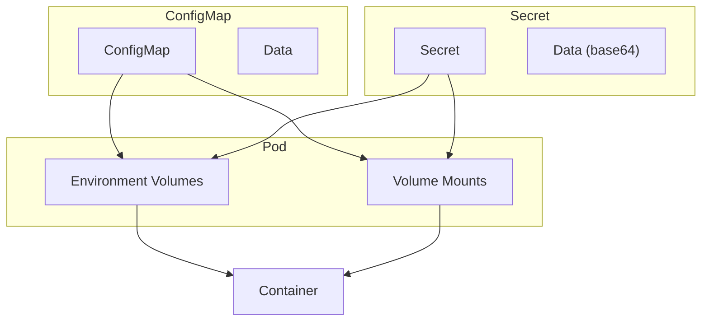
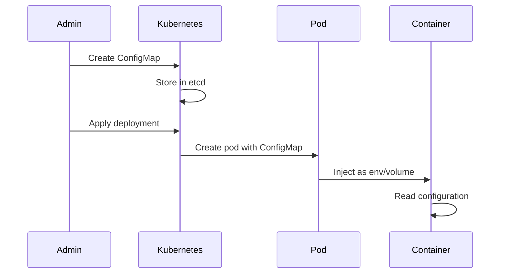

# 1. Introduction

ConfigMaps and Secrets are Kubernetes objects for storing configuration data. ConfigMaps hold non-sensitive configuration, while Secrets store sensitive data like passwords and certificates. Both can be consumed as environment variables or mounted as files.

# 2. Learning Objectives

- Create and manage ConfigMaps and Secrets
- Inject configuration into pods
- Use configuration from files and literals
- Implement configuration best practices
- Manage secrets securely

# 3. Prerequisites

- Kubernetes fundamentals (Module 22.1)
- Pod concepts (Module 22.2)
- Basic understanding of configuration management

# 4. Why This Concept Exists

Applications need configuration that varies between environments. Hardcoding configuration in images makes them non-portable. ConfigMaps and Secrets externalize configuration, enabling the same image to run across different environments.

# 5. Problem Statement

**Without ConfigMaps/Secrets:**
- Configuration hardcoded in images
- Different images per environment
- Secrets in version control
- Complex deployment procedures

**With ConfigMaps/Secrets:**
- Configuration externalized
- Same image across environments
- Secrets managed securely
- Simplified deployments

# 6. Theory

**ConfigMap vs Secret:**

| Feature | ConfigMap | Secret |
|---------|-----------|--------|
| Data | Non-sensitive | Sensitive |
| Encoding | Plain text | Base64 |
| Encryption at rest | No | Optional |
| Access control | RBAC | RBAC |

**Consumption Methods:**
- Environment variables
- Volume mounts
- Command-line arguments

# 7. Internal Working

**ConfigMap Architecture:**
```
ConfigMap (myapp-config)
├── Data
│   ├── application.properties
│   └── logging.properties
└── Metadata

Pod
├── Environment Variable
│   └── From ConfigMap
└── Volume Mount
    └── ConfigMap → /app/config
```

# 8. JVM Perspective

**Spring Boot Configuration:**
```yaml
# ConfigMap with Spring properties
apiVersion: v1
kind: ConfigMap
metadata:
  name: myapp-config
data:
  application.properties: |
    spring.profiles.active=production
    server.port=8080
    spring.datasource.url=jdbc:postgresql://db:5432/mydb
```

```yaml
# Mount in pod
containers:
- name: myapp
  volumeMounts:
  - name: config
    mountPath: /app/config
volumes:
- name: config
  configMap:
    name: myapp-config
```

# 9. Memory Representation

```
ConfigMap Storage
├── etcd (Encrypted)
│   └── ConfigMap data
└── Pod Volume Mount
    └── /app/config/
        ├── application.properties
        └── logging.properties

Secret Storage
├── etcd (Encrypted at rest)
│   └── Secret data (base64)
└── Pod Volume Mount
    └── /app/secrets/
        ├── db-password
        └── api-key
```

# 10. Architecture Diagram (Mermaid)



# 11. Flow Diagram (Mermaid)



# 12. Syntax

```yaml
# ConfigMap from literals
apiVersion: v1
kind: ConfigMap
metadata:
  name: myapp-config
data:
  KEY1: "value1"
  KEY2: "value2"

# ConfigMap from file
apiVersion: v1
kind: ConfigMap
metadata:
  name: myapp-config
data:
  application.properties: |
    key1=value1
    key2=value2

# Secret
apiVersion: v1
kind: Secret
metadata:
  name: myapp-secrets
type: Opaque
data:
  db-password: cGFzc3dvcmQ=  # base64 encoded
```

```bash
# Create from command line
kubectl create configmap myapp-config --from-literal=key1=value1
kubectl create secret generic myapp-secrets --from-literal=db-password=secret
```

# 13. Easy Example

```yaml
# Simple ConfigMap
apiVersion: v1
kind: ConfigMap
metadata:
  name: myapp-config
data:
  GREETING: "Hello"
  ENVIRONMENT: "development"
---
# Pod using ConfigMap
apiVersion: v1
kind: Pod
metadata:
  name: myapp
spec:
  containers:
  - name: myapp
    image: myapp:latest
    env:
    - name: GREETING
      valueFrom:
        configMapKeyRef:
          name: myapp-config
          key: GREETING
```

# 14. Medium Example

```yaml
# ConfigMap with multiple data
apiVersion: v1
kind: ConfigMap
metadata:
  name: myapp-config
data:
  application.properties: |
    server.port=8080
    spring.profiles.active=production
    logging.level.root=INFO
  logging.properties: |
    .level=INFO
---
# Secret
apiVersion: v1
kind: Secret
metadata:
  name: myapp-secrets
type: Opaque
data:
  db-password: cGFzc3dvcmQ=
  api-key: YWJjZGVmZw==
---
# Pod with both
apiVersion: v1
kind: Pod
metadata:
  name: myapp
spec:
  containers:
  - name: myapp
    image: myapp:latest
    env:
    - name: DB_PASSWORD
      valueFrom:
        secretKeyRef:
          name: myapp-secrets
          key: db-password
    volumeMounts:
    - name: config
      mountPath: /app/config
  volumes:
  - name: config
    configMap:
      name: myapp-config
```

# 15. Hard Example

```yaml
# Complete configuration setup
apiVersion: v1
kind: ConfigMap
metadata:
  name: myapp-config
  namespace: production
data:
  application.properties: |
    spring.profiles.active=production
    server.port=8080
    spring.datasource.url=jdbc:postgresql://db:5432/mydb
    spring.datasource.username=${DB_USER}
    logging.level.root=INFO
    management.endpoints.web.exposure.include=health,metrics
  bootstrap.properties: |
    spring.application.name=myapp
    eureka.client.service-url.defaultZone=http://discovery:8761/eureka
---
apiVersion: v1
kind: Secret
metadata:
  name: myapp-secrets
  namespace: production
type: Opaque
data:
  db-password: cGFzc3dvcmQ=
  db-user: cG9zdGdyZXM=
  api-key: YWJjZGVmZ2hpamtsbW5vcA==
---
apiVersion: apps/v1
kind: Deployment
metadata:
  name: myapp
spec:
  replicas: 3
  selector:
    matchLabels:
      app: myapp
  template:
    metadata:
      labels:
        app: myapp
    spec:
      containers:
      - name: myapp
        image: myapp:2.0.0
        env:
        - name: DB_PASSWORD
          valueFrom:
            secretKeyRef:
              name: myapp-secrets
              key: db-password
        - name: DB_USER
          valueFrom:
            secretKeyRef:
              name: myapp-secrets
              key: db-user
        volumeMounts:
        - name: config
          mountPath: /app/config
          readOnly: true
        - name: secrets
          mountPath: /app/secrets
          readOnly: true
      volumes:
      - name: config
        configMap:
          name: myapp-config
      - name: secrets
        secret:
          secretName: myapp-secrets
```

# 16. Enterprise Example

```yaml
# Enterprise configuration management
apiVersion: v1
kind: ConfigMap
metadata:
  name: myapp-config
  namespace: production
  labels:
    app: myapp
    environment: production
data:
  application.yml: |
    spring:
      profiles:
        active: production
      datasource:
        url: jdbc:postgresql://db:5432/mydb
        hikari:
          maximum-pool-size: 20
          minimum-idle: 5
    management:
      endpoints:
        web:
          exposure:
            include: health,metrics,prometheus
      metrics:
        export:
          prometheus:
            enabled: true
---
apiVersion: v1
kind: Secret
metadata:
  name: myapp-secrets
  namespace: production
  labels:
    app: myapp
    environment: production
type: Opaque
data:
  db-password: cGFzc3dvcmQ=
  db-user: cG9zdGdyZXM=
  api-key: YWJjZGVmZ2hpamtsbW5vcA==
  jwt-secret: c2VjdXJleWtleWZvcmp3dHRvaw==
---
apiVersion: v1
kind: Secret
metadata:
  name: tls-certs
  namespace: production
type: kubernetes.io/tls
data:
  tls.crt: LS0tLS1CRUdJTi...
  tls.key: LS0tLS1CRUdJTi...
---
apiVersion: apps/v1
kind: Deployment
metadata:
  name: myapp
spec:
  replicas: 5
  selector:
    matchLabels:
      app: myapp
  template:
    spec:
      containers:
      - name: myapp
        image: registry.example.com/myapp:2.0.0
        envFrom:
        - configMapRef:
            name: myapp-config
        - secretRef:
            name: myapp-secrets
        volumeMounts:
        - name: config
          mountPath: /app/config
          readOnly: true
        - name: tls
          mountPath: /app/tls
          readOnly: true
      volumes:
      - name: config
        configMap:
          name: myapp-config
      - name: tls
        secret:
          secretName: tls-certs
```

# 17. Performance

**ConfigMap/Secret Performance:**
| Operation | Time |
|-----------|------|
| Create | O(1) |
| Update | O(1) |
| Mount | O(1) |
| Reload | Application-dependent |

**Best Practices:**
- Use immutable ConfigMaps for versioning
- Mount secrets as volumes, not env vars
- Use external secret managers for sensitive data
- Implement configuration validation

# 18. Time & Space Complexity

| Operation | Time | Space |
|-----------|------|-------|
| Create | O(1) | O(data) |
| Read | O(1) | O(0) |
| Update | O(1) | O(data) |
| Delete | O(1) | O(0) |

# 19. Thread Safety

ConfigMap and Secret updates are atomic. Pod configuration updates require pod restart unless using volume mount with auto-reload.

# 20. Best Practices

1. Use meaningful names for ConfigMaps/Secrets
2. Separate configuration by environment
3. Use immutable ConfigMaps for production
4. Mount secrets as volumes
5. Use external secret managers
6. Implement RBAC for access control
7. Version control ConfigMaps (not Secrets)
8. Rotate secrets regularly

# 21. Common Mistakes

- Storing secrets in version control
- Using environment variables for secrets
- Not encrypting secrets at rest
- Hardcoding configuration
- Not validating configuration
- Using same ConfigMap for all environments

# 22. Pitfalls

- ConfigMap updates require pod restart
- Secret base64 is not encryption
- Large ConfigMaps may cause issues
- Secret volumes are not auto-rotated
- Environment variables are visible in pod spec

# 23. Debugging Tips

```bash
# Check ConfigMap
kubectl get configmap myapp-config
kubectl describe configmap myapp-config
kubectl get configmap myapp-config -o yaml

# Check Secret
kubectl get secret myapp-secrets
kubectl describe secret myapp-secrets

# Decode secret
kubectl get secret myapp-secrets -o jsonpath='{.data.db-password}' | base64 -d

# Test configuration
kubectl exec -it <pod> -- env | grep CONFIG
kubectl exec -it <pod> -- ls /app/config
```

# 24. Comparison Table

| Feature | ConfigMap | Secret | Environment Variable |
|---------|-----------|--------|---------------------|
| Sensitive | No | Yes | No |
| Encryption | No | Optional | No |
| Updateable | Yes | Yes | No |
| Volume mount | Yes | Yes | No |

# 25. Decision Tool

```
Need to store configuration?
├── Non-sensitive? → ConfigMap
├── Sensitive? → Secret
├── External service? → External Secrets Operator
└── Complex config? → ConfigMap + Secret
```

# 26. Interview Questions

1. **What is a ConfigMap?**
   A Kubernetes object for storing non-confidential configuration data in key-value pairs.

2. **What is a Secret?**
   Similar to ConfigMap but designed for sensitive data like passwords and certificates.

3. **How do ConfigMaps differ from Secrets?**
   ConfigMaps store plain text; Secrets store base64-encoded data with optional encryption at rest.

4. **How do you inject ConfigMap into pods?**
   As environment variables using `envFrom` or as volume mounts.

5. **What is the difference between env and envFrom?**
   `env` maps specific keys; `envFrom` injects all keys from a ConfigMap/Secret.

6. **How do you update ConfigMap without restarting pods?**
   Mount as volume and use subPath, or use external configuration management.

7. **What is the security risk of Secrets?**
   Base64 is encoding, not encryption. Use encryption at rest and external secret managers.

8. **How do you manage secrets in production?**
   Use external secret managers like HashiCorp Vault, AWS Secrets Manager, or sealed secrets.

9. **What are immutable ConfigMaps?**
   ConfigMaps that cannot be updated after creation, useful for versioning and preventing accidental changes.

10. **How do you mount ConfigMap as a file?**
    Use volumeMounts in pod spec with configMap volume source.

11. **What is the maximum size of a ConfigMap?**
    1 MB (etcd limitation).

12. **How do you share ConfigMap across namespaces?**
    You cannot. Create separate ConfigMaps per namespace or use external configuration.

13. **What happens when ConfigMap is updated?**
    Volume mounts update automatically (with delay); environment variables require pod restart.

14. **How do you validate ConfigMap data?**
    Use admission webhooks or validation in application code.

15. **What are the best practices for Secret management?**
    Use encryption at rest, rotate regularly, implement RBAC, use external secret managers.

# 27. Exercises

**Level 1:**
1. Create a ConfigMap with literal values
2. Inject it as environment variables in a pod
3. Verify the configuration is available

**Level 2:**
1. Create a ConfigMap from a file
2. Mount it as a volume in a pod
3. Test file-based configuration

**Level 3:**
1. Implement external secret management
2. Set up secret rotation
3. Configure RBAC for ConfigMap/Secret access

# 28. Summary

ConfigMaps and Secrets are essential for managing application configuration in Kubernetes. They externalize configuration from images, enabling portability and security. Key concepts: use ConfigMaps for non-sensitive data, Secrets for sensitive data, and external secret managers for production.

# 29. References

- [ConfigMaps](https://kubernetes.io/docs/concepts/configuration/configmap/)
- [Secrets](https://kubernetes.io/docs/concepts/configuration/secret/)
- [External Secrets Operator](https://external-secrets.io/)
- [Sealed Secrets](https://sealed-secrets.netlify.app/)
- [Configuration Best Practices](https://kubernetes.io/docs/concepts/configuration/overview/)
