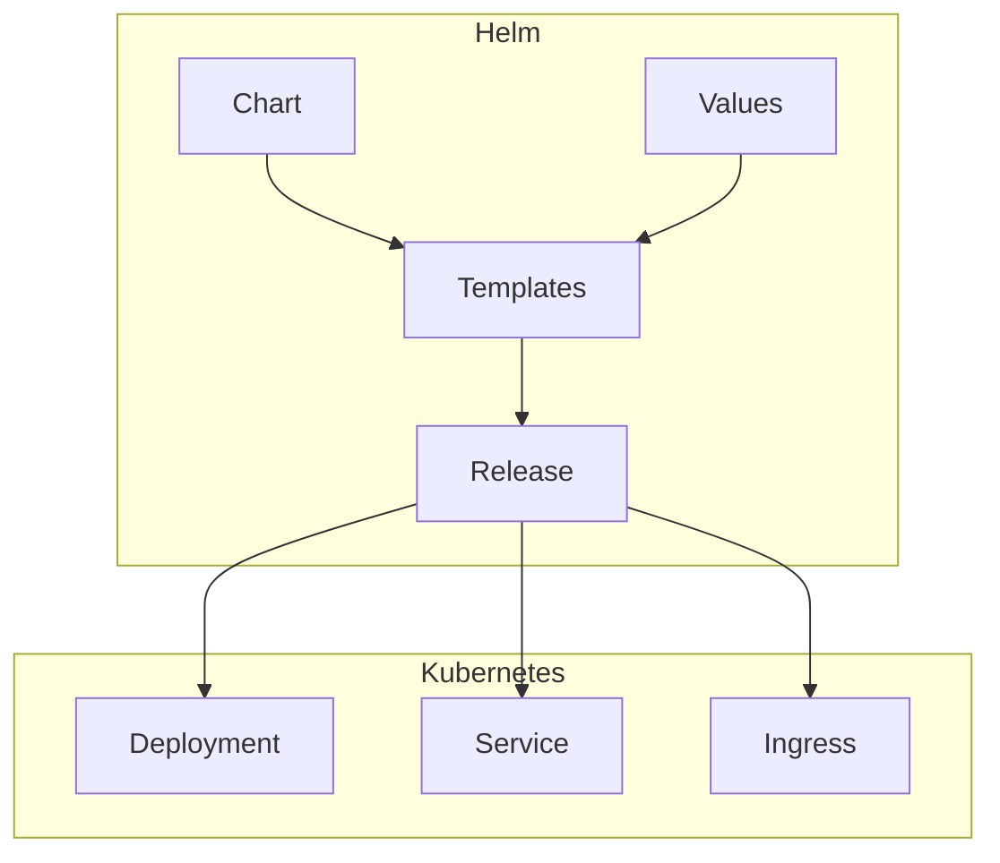
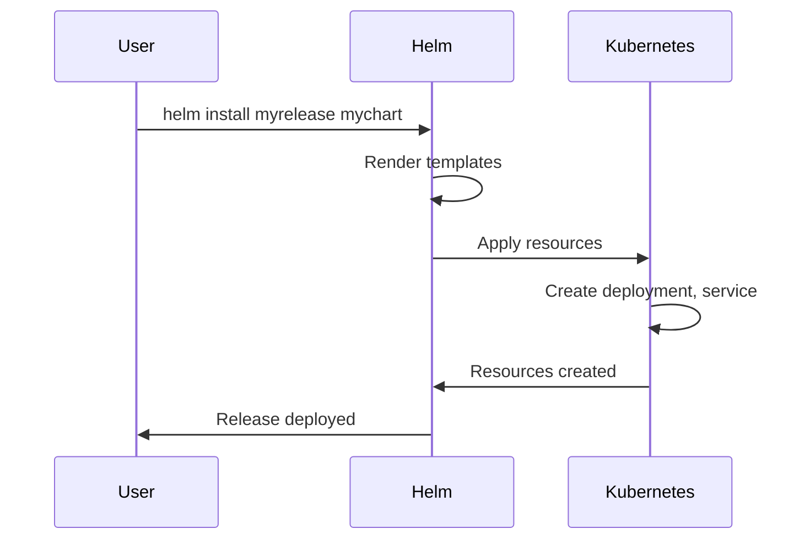

# 1. Introduction

Helm is the package manager for Kubernetes. It simplifies application deployment and management by packaging Kubernetes resources into reusable charts, enabling version control, templating, and easy rollbacks.

# 2. Learning Objectives

- Understand Helm chart structure
- Create and package Helm charts
- Use templates and values
- Manage Helm releases
- Implement chart repositories

# 3. Prerequisites

- Kubernetes fundamentals (Module 22)
- Basic YAML knowledge
- Command-line familiarity

# 4. Why This Concept Exists

Deploying complex applications to Kubernetes requires multiple YAML files. Helm simplifies this by providing templates, values, and package management, making it easy to deploy, upgrade, and rollback applications.

# 5. Problem Statement

**Without Helm:**
- Multiple YAML files per application
- No templating
- Manual version management
- Complex rollbacks

**With Helm:**
- Single command deployment
- Template-based configuration
- Version control and history
- Easy rollbacks

# 6. Theory

**Helm Components:**

| Component | Description |
|-----------|-------------|
| Chart | Package of Kubernetes resources |
| Values | Configuration for charts |
| Release | Running instance of a chart |
| Repository | Collection of charts |

**Chart Structure:**
```
mychart/
├── Chart.yaml
├── values.yaml
├── templates/
│   ├── deployment.yaml
│   ├── service.yaml
│   └── ingress.yaml
└── charts/
```

# 7. Internal Working

**Helm Deployment Flow:**
1. User runs `helm install`
2. Helm fetches chart (local/repo)
3. Templates rendered with values
4. Kubernetes resources created
5. Release record stored

**Template Rendering:**
```
Template: {{ .Values.replicaCount }} replicas
Values: replicaCount: 3
Result: 3 replicas
```

# 8. JVM Perspective

**Helm Values for Java Apps:**
```yaml
# values.yaml
replicaCount: 3

image:
  repository: myapp
  tag: "2.0.0"

resources:
  requests:
    memory: "512Mi"
    cpu: "500m"
  limits:
    memory: "1Gi"
    cpu: "1000m"

env:
  JAVA_OPTS: "-XX:+UseContainerSupport -XX:MaxRAMPercentage=75.0"
  SPRING_PROFILES_ACTIVE: "production"
```

# 9. Memory Representation

```
Helm Release State
├── Chart (Templates)
│   ├── deployment.yaml.tpl
│   ├── service.yaml.tpl
│   └── ingress.yaml.tpl
├── Values
│   ├── replicaCount: 3
│   ├── image.tag: "2.0.0"
│   └── resources: ...
└── Release
    ├── Revision: 1
    ├── Status: deployed
    └── Resources: [deployment, service, ingress]
```

# 10. Architecture Diagram (Mermaid)



# 11. Flow Diagram (Mermaid)



# 12. Syntax

```bash
# Install chart
helm install <release> <chart>
helm install myrelease ./mychart
helm install myrelease bitnami/nginx

# Upgrade release
helm upgrade <release> <chart>
helm upgrade myrelease ./mychart --set image.tag=2.1.0

# Rollback release
helm rollback <release> <revision>

# List releases
helm list
helm list --all-namespaces

# Uninstall release
helm uninstall <release>

# Package chart
helm package ./mychart

# Search repository
helm search repo nginx
```

# 13. Easy Example

```yaml
# Chart.yaml
apiVersion: v2
name: myapp
version: 0.1.0
appVersion: "1.0.0"

# values.yaml
replicaCount: 2
image:
  repository: nginx
  tag: "alpine"

# templates/deployment.yaml
apiVersion: apps/v1
kind: Deployment
metadata:
  name: {{ .Release.Name }}
spec:
  replicas: {{ .Values.replicaCount }}
  selector:
    matchLabels:
      app: {{ .Release.Name }}
  template:
    metadata:
      labels:
        app: {{ .Release.Name }}
    spec:
      containers:
      - name: {{ .Release.Name }}
        image: "{{ .Values.image.repository }}:{{ .Values.image.tag }}"
```

```bash
helm install myapp ./myapp
kubectl get pods
```

# 14. Medium Example

```yaml
# values.yaml
replicaCount: 3

image:
  repository: myapp
  tag: "2.0.0"
  pullPolicy: IfNotPresent

service:
  type: ClusterIP
  port: 80
  targetPort: 8080

resources:
  requests:
    memory: "256Mi"
    cpu: "250m"
  limits:
    memory: "512Mi"
    cpu: "500m"

# templates/deployment.yaml
apiVersion: apps/v1
kind: Deployment
metadata:
  name: {{ include "myapp.fullname" . }}
  labels:
    {{- include "myapp.labels" . | nindent 4 }}
spec:
  replicas: {{ .Values.replicaCount }}
  selector:
    matchLabels:
      {{- include "myapp.selectorLabels" . | nindent 6 }}
  template:
    metadata:
      labels:
        {{- include "myapp.selectorLabels" . | nindent 8 }}
    spec:
      containers:
      - name: {{ .Chart.Name }}
        image: "{{ .Values.image.repository }}:{{ .Values.image.tag }}"
        ports:
        - containerPort: {{ .Values.service.targetPort }}
        resources:
          {{- toYaml .Values.resources | nindent 10 }}
```

# 15. Hard Example

```yaml
# Complete enterprise chart
# values.yaml
replicaCount: 3

image:
  repository: registry.example.com/myapp
  tag: "2.0.0"
  pullPolicy: Always

serviceAccount:
  create: true
  name: myapp-sa

service:
  type: LoadBalancer
  port: 80
  targetPort: 8080

ingress:
  enabled: true
  className: nginx
  annotations:
    cert-manager.io/cluster-issuer: letsencrypt-prod
  hosts:
  - host: myapp.example.com
    paths:
    - path: /
      pathType: Prefix
  tls:
  - secretName: myapp-tls
    hosts:
    - myapp.example.com

resources:
  requests:
    memory: "512Mi"
    cpu: "500m"
  limits:
    memory: "1Gi"
    cpu: "1000m"

autoscaling:
  enabled: true
  minReplicas: 3
  maxReplicas: 10
  targetCPUUtilizationPercentage: 70

env:
  JAVA_OPTS: "-XX:+UseContainerSupport -XX:MaxRAMPercentage=75.0"
  SPRING_PROFILES_ACTIVE: "production"

secrets:
  db-password: "encrypted-password"

# templates/deployment.yaml
apiVersion: apps/v1
kind: Deployment
metadata:
  name: {{ include "myapp.fullname" . }}
  labels:
    {{- include "myapp.labels" . | nindent 4 }}
spec:
  {{- if not .Values.autoscaling.enabled }}
  replicas: {{ .Values.replicaCount }}
  {{- end }}
  selector:
    matchLabels:
      {{- include "myapp.selectorLabels" . | nindent 6 }}
  template:
    metadata:
      labels:
        {{- include "myapp.selectorLabels" . | nindent 8 }}
    spec:
      serviceAccountName: {{ include "myapp.serviceAccountName" . }}
      containers:
      - name: {{ .Chart.Name }}
        image: "{{ .Values.image.repository }}:{{ .Values.image.tag }}"
        imagePullPolicy: {{ .Values.image.pullPolicy }}
        ports:
        - name: http
          containerPort: {{ .Values.service.targetPort }}
        env:
        {{- range $key, $value := .Values.env }}
        - name: {{ $key }}
          value: {{ $value | quote }}
        {{- end }}
        - name: DB_PASSWORD
          valueFrom:
            secretKeyRef:
              name: {{ include "myapp.fullname" . }}
              key: db-password
        resources:
          {{- toYaml .Values.resources | nindent 10 }}
        livenessProbe:
          httpGet:
            path: /actuator/health/liveness
            port: http
          initialDelaySeconds: 60
          periodSeconds: 10
        readinessProbe:
          httpGet:
            path: /actuator/health/readiness
            port: http
          initialDelaySeconds: 15
          periodSeconds: 5
```

# 16. Enterprise Example

```yaml
# Enterprise Helm chart with all features
# Chart.yaml
apiVersion: v2
name: myapp
description: Enterprise Java application
type: application
version: 1.0.0
appVersion: "2.0.0"
keywords:
- java
- spring-boot
maintainers:
- name: Platform Team
  email: platform@example.com

# values.yaml
global:
  imageRegistry: registry.example.com
  imagePullSecrets:
  - name: registry-credentials

replicaCount: 3

image:
  repository: myapp
  tag: "2.0.0"
  pullPolicy: Always

serviceAccount:
  create: true
  annotations:
    eks.amazonaws.com/role-arn: arn:aws:iam::123456789:role/myapp

podSecurityContext:
  runAsNonRoot: true
  runAsUser: 1000
  fsGroup: 1000

securityContext:
  allowPrivilegeEscalation: false
  capabilities:
    drop:
    - ALL
  readOnlyRootFilesystem: true

service:
  type: LoadBalancer
  port: 80
  targetPort: 8080
  annotations:
    service.beta.kubernetes.io/aws-load-balancer-type: nlb

ingress:
  enabled: true
  className: nginx
  annotations:
    cert-manager.io/cluster-issuer: letsencrypt-prod
    nginx.ingress.kubernetes.io/rate-limit: "100"
  hosts:
  - host: myapp.example.com
    paths:
    - path: /
      pathType: Prefix
  tls:
  - secretName: myapp-tls
    hosts:
    - myapp.example.com

resources:
  requests:
    memory: "1Gi"
    cpu: "1000m"
  limits:
    memory: "2Gi"
    cpu: "2000m"

autoscaling:
  enabled: true
  minReplicas: 3
  maxReplicas: 20
  targetCPUUtilizationPercentage: 70
  targetMemoryUtilizationPercentage: 80

podDisruptionBudget:
  enabled: true
  minAvailable: 2

env:
  JAVA_OPTS: "-XX:+UseContainerSupport -XX:MaxRAMPercentage=75.0"
  SPRING_PROFILES_ACTIVE: "production"

secrets:
  db-password: "encrypted"
  api-key: "encrypted"

configMaps:
  application.properties: |
    server.port=8080
    management.endpoints.web.exposure.include=health,metrics
```

# 17. Performance

**Helm Performance:**
| Operation | Time |
|-----------|------|
| Install | 10-30s |
| Upgrade | 10-30s |
| Rollback | 10-30s |
| Template render | <1s |

**Optimization:**
- Use chart dependencies efficiently
- Minimize template complexity
- Cache chart repositories
- Use --wait flag for deployment validation

# 18. Time & Space Complexity

| Operation | Time | Space |
|-----------|------|-------|
| Install | O(resources) | O(chart) |
| Upgrade | O(resources) | O(chart) |
| Rollback | O(resources) | O(history) |
| Package | O(chart) | O(chart) |

# 19. Thread Safety

Helm operations are not thread-safe for the same release. Use locking mechanisms for concurrent deployments to the same release.

# 20. Best Practices

1. Use semantic versioning for charts
2. Document values.yaml thoroughly
3. Use helpers for common templates
4. Implement chart testing
5. Use chart repositories with authentication
6. Keep charts modular
7. Use values files per environment
8. Implement proper RBAC

# 21. Common Mistakes

- Not testing templates
- Hardcoding values in templates
- Ignoring chart dependencies
- Not using semantic versioning
- Missing documentation
- Not implementing proper security

# 22. Pitfalls

- Template rendering errors may cause failures
- Chart dependencies may conflict
- Release history can grow large
- Values files may have syntax errors
- CRDs require special handling

# 23. Debugging Tips

```bash
# Template rendering
helm template ./mychart --values values.yaml
helm template ./mychart --debug

# Dry run
helm install myrelease ./mychart --dry-run --debug

# Check release status
helm status myrelease

# View release history
helm history myrelease

# Check values
helm get values myrelease
helm get values myrelease --all
```

# 24. Comparison Table

| Feature | Helm | Kustomize | Plain YAML |
|---------|------|-----------|------------|
| Templating | Yes | No | No |
| Package Manager | Yes | No | No |
| Version Control | Yes | No | No |
| Rollbacks | Yes | No | No |
| Complexity | Medium | Low | High |

# 25. Decision Tool

```
Need Kubernetes packaging?
├── Simple app? → Plain YAML
├── Need templating? → Helm or Kustomize
├── Need package management? → Helm
└── Need complex configuration? → Helm
```

# 26. Interview Questions

1. **What is Helm?**
   The package manager for Kubernetes that simplifies application deployment through charts, templates, and values.

2. **What is a Helm chart?**
   A package containing Kubernetes resource templates and default configuration values.

3. **What is the difference between Chart and Release?**
   A Chart is a package; a Release is a running instance of a chart deployed to a cluster.

4. **How do Helm templates work?**
   Go templates that use values to generate Kubernetes YAML manifests.

5. **What is values.yaml?**
   Default configuration file that provides values for template rendering.

6. **How do you manage multiple environments?**
   Use separate values files per environment (values-dev.yaml, values-prod.yaml).

7. **How do Helm rollbacks work?**
   Helm stores release history; `helm rollback` reverts to a previous revision.

8. **What are Helm hooks?**
   Kubernetes resources that run at specific points in the release lifecycle (pre-install, post-upgrade).

9. **How do you handle secrets in Helm?**
   Use external secret managers, sealed secrets, or Helm secrets plugin.

10. **What is a Helm repository?**
    A collection of charts that can be shared and installed.

11. **How do you test a Helm chart?**
    Use `helm template`, `helm lint`, `helm install --dry-run`, and chart testing frameworks.

12. **What are chart dependencies?**
    Other charts that your chart depends on, specified in Chart.yaml.

13. **How do you version Helm charts?**
    Use semantic versioning in Chart.yaml.

14. **What is the difference between helm install and helm upgrade?**
    Install creates a new release; upgrade updates an existing release.

15. **How do you debug Helm template errors?**
    Use `helm template --debug` and `helm lint` to identify issues.

# 27. Exercises

**Level 1:**
1. Create a basic Helm chart
2. Install it to a cluster
3. Upgrade with new values

**Level 2:**
1. Create a chart with multiple templates
2. Implement values for different environments
3. Add chart dependencies

**Level 3:**
1. Create an enterprise-grade chart
2. Implement Helm hooks
3. Set up chart repository and CI/CD

# 28. Summary

Helm simplifies Kubernetes application management through charts, templates, and package management. It enables version-controlled deployments, easy rollbacks, and reusable configurations, making it essential for production Kubernetes environments.

# 29. References

- [Helm Documentation](https://helm.sh/docs/)
- [Helm Charts](https://helm.sh/docs/topics/charts/)
- [Helm Templates](https://helm.sh/docs/chart_template_guide/)
- [Helm Best Practices](https://helm.sh/docs/chart_best_practices/)
- [Artifact Hub](https://artifacthub.io/)
