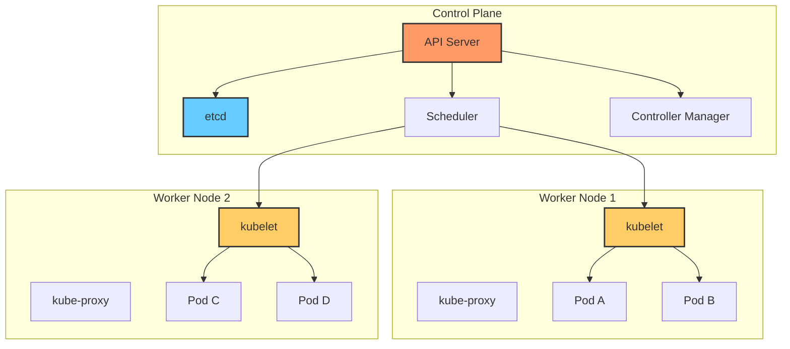
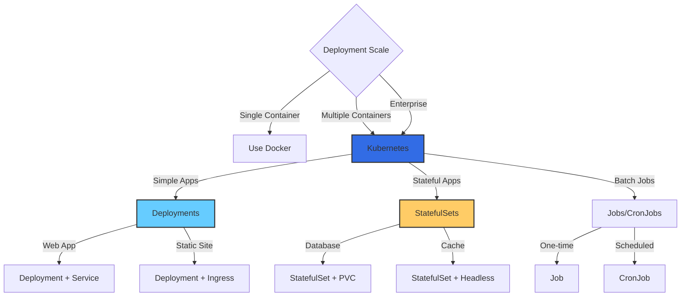

# Kubernetes Fundamentals

## Overview
Kubernetes (K8s) is an open-source system for automating deployment, scaling, and management of containerized applications.

## Topics
- Pods
- Services
- Deployments
- ReplicaSets
- ConfigMaps and Secrets
- Namespaces
- Ingress
- Persistent Volumes
- StatefulSets
- Helm Charts

## Learning Objectives
- Deploy applications on K8s
- Manage cluster resources
- Implement scaling strategies

## Prerequisites
- Docker basics

## Architecture

## When to Use

