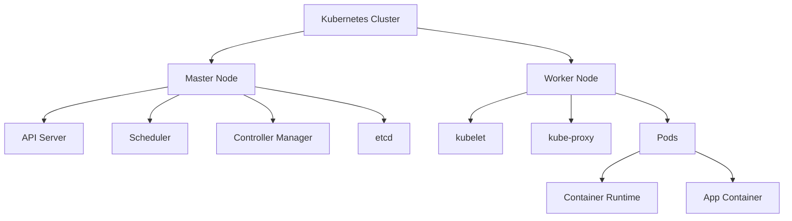

# Module 22: Kubernetes

## Overview
Kubernetes (K8s) is a container orchestration platform for automating deployment, scaling, and management of containerized applications.

## Learning Objectives
- Understand K8s architecture
- Deploy applications
- Scale and manage services
- Configure networking
- Apply K8s patterns

## Prerequisites
- Docker basics
- Container concepts
- Networking basics

## Why This Concept Exists
Container management needs:
- Automated deployment
- Scaling
- Self-healing
- Service discovery

Kubernetes provides:
- Orchestration
- Load balancing
- Rollouts/rollbacks
- Storage orchestration

## Problem Statement
How do you manage containerized applications at scale?

## Theory

### K8s Components

| Component | Description |
|-----------|-------------|
| Pod | Smallest deployable unit |
| Service | Network endpoint |
| Deployment | Pod management |
| ConfigMap | Configuration |
| Secret | Sensitive data |
| Namespace | Isolation |

### K8s Architecture

| Component | Purpose |
|-----------|---------|
| Master Node | Control plane |
| Worker Node | Runs pods |
| etcd | Key-value store |
| API Server | K8s API |
| Scheduler | Pod scheduling |

## Internal Working

### Pod Lifecycle
```
Pending → Running → Succeeded/Failed
```

### Service Types

| Type | Description |
|------|-------------|
| ClusterIP | Internal access |
| NodePort | External access |
| LoadBalancer | Cloud load balancer |
| Ingress | HTTP routing |

## JVM Perspective

### Java on K8s
- JVM memory settings
- Health checks
- Graceful shutdown
- Resource limits

## Architecture Diagram



## Syntax

### Deployment
```yaml
apiVersion: apps/v1
kind: Deployment
metadata:
  name: my-app
spec:
  replicas: 3
  selector:
    matchLabels:
      app: my-app
  template:
    metadata:
      labels:
        app: my-app
    spec:
      containers:
      - name: my-app
        image: my-app:1.0
        ports:
        - containerPort: 8080
        resources:
          requests:
            memory: "256Mi"
            cpu: "250m"
          limits:
            memory: "512Mi"
            cpu: "500m"
```

### Service
```yaml
apiVersion: v1
kind: Service
metadata:
  name: my-app-service
spec:
  selector:
    app: my-app
  ports:
  - port: 80
    targetPort: 8080
  type: LoadBalancer
```

## Easy Example
```bash
# Create deployment
kubectl create deployment my-app --image=my-app:1.0

# Expose deployment
kubectl expose deployment my-app --port=80 --type=LoadBalancer

# Check status
kubectl get pods
kubectl get services
```

## Medium Example
```yaml
apiVersion: apps/v1
kind: Deployment
metadata:
  name: spring-boot-app
spec:
  replicas: 3
  selector:
    matchLabels:
      app: spring-boot
  template:
    metadata:
      labels:
        app: spring-boot
    spec:
      containers:
      - name: app
        image: spring-boot-app:1.0
        ports:
        - containerPort: 8080
        env:
        - name: SPRING_PROFILES_ACTIVE
          value: "prod"
        - name: DATABASE_URL
          valueFrom:
            secretKeyRef:
              name: db-secret
              key: url
        livenessProbe:
          httpGet:
            path: /actuator/health
            port: 8080
          initialDelaySeconds: 30
          periodSeconds: 10
        readinessProbe:
          httpGet:
            path: /actuator/health
            port: 8080
          initialDelaySeconds: 5
          periodSeconds: 5
```

## Hard Example
```yaml
apiVersion: autoscaling/v2
kind: HorizontalPodAutoscaler
metadata:
  name: my-app-hpa
spec:
  scaleTargetRef:
    apiVersion: apps/v1
    kind: Deployment
    name: my-app
  minReplicas: 2
  maxReplicas: 10
  metrics:
  - type: Resource
    resource:
      name: cpu
      target:
        type: Utilization
        averageUtilization: 70
  - type: Resource
    resource:
      name: memory
      target:
        type: Utilization
        averageUtilization: 80
```

## Enterprise Example
```yaml
apiVersion: networking.k8s.io/v1
kind: Ingress
metadata:
  name: my-app-ingress
  annotations:
    nginx.ingress.kubernetes.io/rewrite-target: /
spec:
  rules:
  - host: myapp.example.com
    http:
      paths:
      - path: /
        pathType: Prefix
        backend:
          service:
            name: my-app-service
            port:
              number: 80
  tls:
  - hosts:
    - myapp.example.com
    secretName: my-app-tls
```

## Performance Considerations
- Set resource limits
- Use horizontal scaling
- Configure health checks
- Use namespaces for isolation

## Best Practices
1. Use declarative configuration
2. Set resource limits
3. Use namespaces
4. Implement health checks
5. Use rolling updates

## Comparison Table

| Feature | Kubernetes | Docker Swarm | Nomad |
|---------|------------|--------------|-------|
| Complexity | High | Low | Medium |
| Scaling | Excellent | Good | Good |
| Ecosystem | Large | Small | Medium |
| Learning Curve | Steep | Easy | Medium |

## Interview Questions

### Q1: What is a Pod?
**Answer:** Smallest deployable unit containing one or more containers.

### Q2: What is a Deployment?
**Answer:** Manages pod replicas and updates.

### Q3: What is a Service?
**Answer:** Network endpoint for accessing pods.

### Q4: What is the difference between ClusterIP and NodePort?
**Answer:** ClusterIP is internal, NodePort exposes externally.

### Q5: What is a ConfigMap?
**Answer:** Stores non-sensitive configuration data.

## Summary
Kubernetes provides container orchestration for scalable, manageable applications.

## References
- Kubernetes Documentation
- Kubernetes the Hard Way
- Spring on Kubernetes
