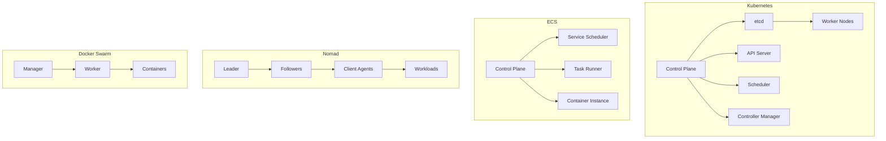

# Comparison: Kubernetes vs ECS vs Nomad vs Docker Swarm

## Overview
This comparison helps you choose the right container orchestration platform.

## Feature Matrix

| Feature | Kubernetes | ECS | Nomad | Docker Swarm |
|---------|------------|-----|-------|--------------|
| **Deployment Model** | Any cloud/On-prem | AWS only | Any cloud/On-prem | Any cloud/On-prem |
| **Complexity** | High | Moderate | Moderate | Low |
| **Learning Curve** | Steep | Moderate | Moderate | Easy |
| **Auto-scaling** | Yes (HPA/VPA) | Yes | Yes | No |
| **Service Discovery** | Built-in | AWS ALB/NLB | Built-in | Built-in |
| **Load Balancing** | Ingress/Service | ALB/NLB | Built-in | Built-in |
| **Secret Management** | External/CSI | AWS Secrets Manager | External | Docker Secrets |
| **Storage** | CSI Drivers | EBS/EFS | CSI Drivers | Volumes |
| **Networking** | CNI Plugins | awsvpc/bridge | CNI Plugins | Overlay network |
| **Multi-tenancy** | Yes | Limited | Yes | No |

## Performance Comparison

| Metric | Kubernetes | ECS | Nomad | Docker Swarm |
|--------|------------|-----|-------|--------------|
| **Pod/Task Startup** | 5-30s | 1-10s | 1-10s | 1-10s |
| **Scaling Speed** | Moderate | Fast | Fast | Moderate |
| **Resource Overhead** | Higher | Lower | Lower | Lower |
| **Network Latency** | Good | Good | Good | Good |
| **Storage Performance** | Good | Good | Good | Good |
| **Maximum Scale** | 5000 nodes | 2000 tasks | 10000 nodes | 1000 nodes |

## Architecture Comparison

## Use Case Matrix

| Use Case | Kubernetes | ECS | Nomad | Docker Swarm |
|----------|------------|-----|-------|--------------|
| **Enterprise** | Excellent | Excellent | Good | Poor |
| **Startup** | Good | Good | Excellent | Excellent |
| **Multi-cloud** | Excellent | Poor | Excellent | Good |
| **AWS-only** | Good | Excellent | Good | Good |
| **Simple Apps** | Poor | Good | Excellent | Excellent |
| **Complex Apps** | Excellent | Good | Good | Poor |
| **Hybrid Cloud** | Excellent | Poor | Excellent | Good |
| **Edge Computing** | Good | Poor | Excellent | Good |

## Operational Comparison

| Factor | Kubernetes | ECS | Nomad | Docker Swarm |
|--------|------------|-----|-------|--------------|
| **Setup** | Complex | Easy | Moderate | Easy |
| **Monitoring** | Excellent | Good | Good | Moderate |
| **Logging** | Excellent | Good | Good | Moderate |
| **Debugging** | Moderate | Easy | Easy | Easy |
| **Upgrades** | Moderate | Easy | Easy | Easy |
| **Backup** | Good | Excellent | Good | Moderate |
| **Documentation** | Excellent | Good | Good | Good |
| **Community** | Largest | AWS-focused | Growing | Declining |

## Cost Comparison

| Cost Factor | Kubernetes | ECS | Nomad | Docker Swarm |
|-------------|------------|-----|-------|--------------|
| **Control Plane** | Self-managed/EKS cost | Free | Self-managed | Free |
| **Compute** | EC2/EKS nodes | EC2/Fargate | EC2/Nomad servers | EC2 |
| **Networking** | Standard AWS | Standard AWS | Standard AWS | Standard AWS |
| **Storage** | Standard AWS | EBS/EFS | Standard AWS | Standard AWS |
| **Operational Cost** | High | Moderate | Moderate | Low |
| **Total Cost** | High | Low-Moderate | Moderate | Low |

## Migration Effort

| Migration | Kubernetes | ECS | Nomad | Docker Swarm |
|-----------|------------|-----|-------|--------------|
| **From Kubernetes** | Native | Moderate | Moderate | High |
| **From ECS** | Moderate | Native | Moderate | High |
| **From Nomad** | Moderate | Moderate | Native | High |
| **From Docker Swarm** | High | High | High | Native |

## Ecosystem and Integration

| Integration | Kubernetes | ECS | Nomad | Docker Swarm |
|-------------|------------|-----|-------|--------------|
| **Service Mesh** | Istio, Linkerd | App Mesh | Consul Connect | N/A |
| **CI/CD** | ArgoCD, Flux | CodePipeline | Various | Various |
| **Monitoring** | Prometheus, Grafana | CloudWatch | Prometheus | Prometheus |
| **Logging** | ELK, Loki | CloudWatch Logs | ELK | ELK |
| **Security** | OPA, Falco | IAM, GuardDuty | Consul | Docker Security |

## When to Choose Each

### Choose Kubernetes When:
- Multi-cloud or hybrid cloud required
- Need maximum flexibility
- Complex microservices architecture
- Want large ecosystem
- Need advanced features
- Team has Kubernetes expertise

### Choose ECS When:
- AWS-only environment
- Want managed service
- Simpler operations needed
- Need AWS integration
- Cost optimization important

### Choose Nomad When:
- Need simpler orchestration
- Want HashiCorp ecosystem
- Mixed workload types
- Need Windows support
- Simpler learning curve

### Choose Docker Swarm When:
- Simple clustering needed
- Small team or project
- Quick setup required
- Docker expertise available
- Limited scale requirements

## Decision Matrix

| Priority | Kubernetes | ECS | Nomad | Docker Swarm |
|----------|------------|-----|-------|--------------|
| **Flexibility** | Excellent | Good | Good | Moderate |
| **Ease of Use** | Poor | Good | Good | Excellent |
| **Cost** | High | Low-Moderate | Moderate | Low |
| **Scaling** | Excellent | Good | Good | Moderate |
| **Ecosystem** | Excellent | Good | Good | Poor |
| **Community** | Largest | AWS-focused | Growing | Declining |
| **Enterprise** | Excellent | Excellent | Good | Poor |
| **Future Proof** | Excellent | Good | Good | Poor |

## Summary

- **Kubernetes**: Best for multi-cloud and complex microservices
- **ECS**: Best for AWS-only and managed service needs
- **Nomad**: Best for simpler orchestration and HashiCorp ecosystem
- **Docker Swarm**: Best for simple clustering and small teams