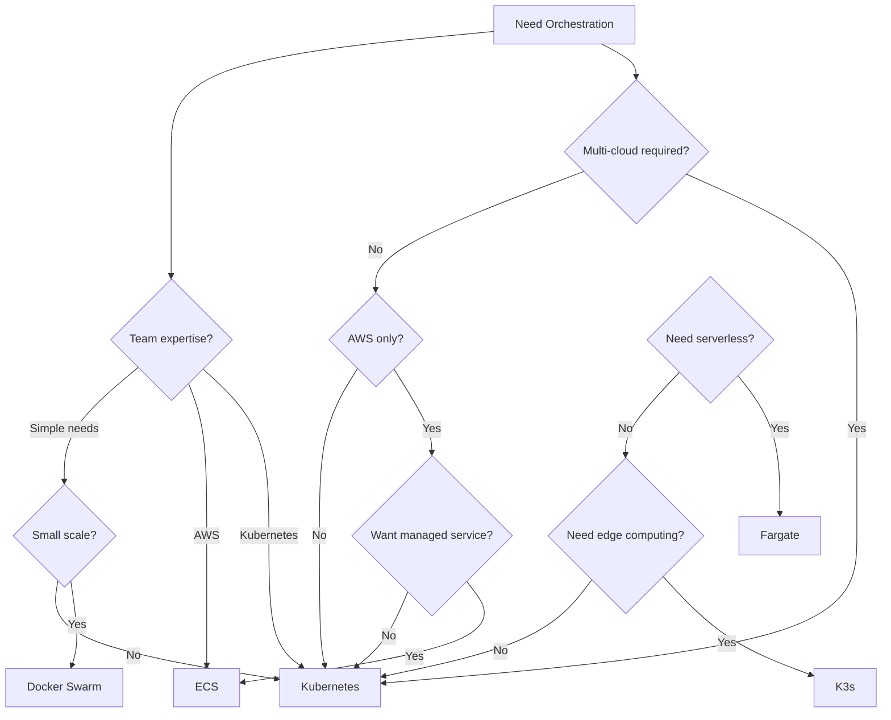
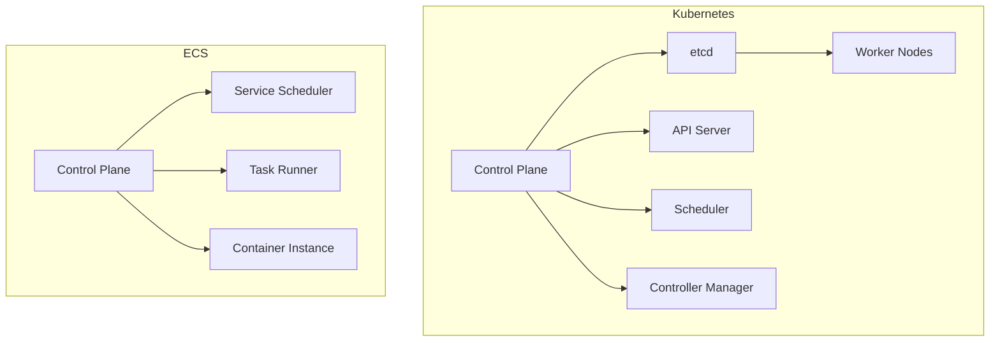

# Decision Tree: When to Use Kubernetes vs ECS vs Others

## Overview
Container orchestration platforms serve different needs. Use this guide to choose the right one for your environment.

## Decision Flow

## Feature Comparison

| Feature | Kubernetes | ECS | Nomad | Docker Swarm |
|---------|------------|-----|-------|--------------|
| Deployment Model | Any cloud/On-prem | AWS only | Any cloud/On-prem | Any cloud/On-prem |
| Complexity | High | Moderate | Moderate | Low |
| Learning Curve | Steep | Moderate | Moderate | Easy |
| Auto-scaling | Yes (HPA/VPA) | Yes (Service Auto Scaling) | Yes | No |
| Service Discovery | Built-in | AWS ALB/NLB | Built-in | Built-in |
| Load Balancing | Ingress/Service | ALB/NLB | Built-in | Built-in |
| Secret Management | External/CSI | AWS Secrets Manager | External | Docker Secrets |
| Storage | CSI Drivers | EBS/EFS | CSI Drivers | Volumes |
| Networking | CNI Plugins | awsvpc/bridge | CNI Plugins | Overlay network |

## Use Case Recommendations

### Choose Kubernetes When:
- Multi-cloud or hybrid cloud
- Need maximum flexibility
- Complex microservices architecture
- Want large ecosystem
- Need advanced features
- Team has Kubernetes expertise

### Choose ECS When:
- AWS-only environment
- Want managed service
- Simpler operations needed
- Need AWS integration
- Cost optimization important

### Choose Nomad When:
- Need simpler orchestration
- Want HashiCorp ecosystem
- Mixed workload types
- Need Windows support
- Simpler learning curve

### Choose Docker Swarm When:
- Simple clustering needed
- Small team or project
- Quick setup required
- Docker expertise available
- Limited scale requirements

## Architecture Comparison

## Cost Comparison

| Factor | Kubernetes | ECS | Nomad |
|--------|------------|-----|-------|
| Control Plane | Self-managed or EKS cost | Free | Self-managed |
| Compute | EC2/EKS nodes | EC2/Fargate | EC2/Nomad servers |
| Networking | Standard AWS | Standard AWS | Standard AWS |
| Storage | Standard AWS | EBS/EFS | Standard AWS |
| Operational Cost | High | Moderate | Moderate |

## Performance Characteristics

| Metric | Kubernetes | ECS | Nomad |
|--------|------------|-----|-------|
| Pod/Task Startup | 5-30s | 1-10s | 1-10s |
| Scaling Speed | Moderate | Fast | Fast |
| Resource Overhead | Higher | Lower | Lower |
| Network Latency | Good | Good | Good |
| Storage Performance | Good | Good | Good |

## Migration Considerations

### From ECS to Kubernetes:
- Learn Kubernetes concepts
- Plan for complex networking
- Set up CI/CD pipeline
- Train team on K8s

### From Docker Swarm to Kubernetes:
- Refactor Compose files to Helm charts
- Plan for RBAC setup
- Implement service mesh if needed
- Update monitoring

## When to Consider Alternatives

### Consider K3s When:
- Need lightweight Kubernetes
- Edge computing requirements
- Resource-constrained environments
- Development/testing clusters

### Consider Nomad When:
- Need simpler orchestration
- Want HashiCorp ecosystem
- Mixed workloads (VMs + containers)
- Windows containers required

## Decision Matrix

| Requirement | Kubernetes | ECS | Nomad |
|-------------|------------|-----|-------|
| Flexibility | Best | Good | Good |
| Ease of Use | Poor | Good | Good |
| Cost | Moderate | Low-Moderate | Moderate |
| Scaling | Best | Good | Good |
| Community | Largest | AWS-focused | Growing |
| Documentation | Excellent | Good | Good |
| Enterprise Support | Multiple vendors | AWS | HashiCorp |
| Learning Resources | Most | Good | Good |

## Decision Checklist

Choose Kubernetes if you check 3 or more:
- [ ] Multi-cloud or hybrid required
- [ ] Need maximum flexibility
- [ ] Complex microservices
- [ ] Want large ecosystem
- [ ] Team has K8s expertise
- [ ] Need advanced features

Choose ECS if you check 3 or more:
- [ ] AWS-only environment
- [ ] Want managed service
- [ ] Simpler operations needed
- [ ] Need AWS integration
- [ ] Cost optimization important
- [ ] Small to medium scale

Choose Nomad if you check 3 or more:
- [ ] Need simpler orchestration
- [ ] Want HashiCorp ecosystem
- [ ] Mixed workload types
- [ ] Need Windows support
- [ ] Simpler learning curve
- [ ] Team prefers simplicity