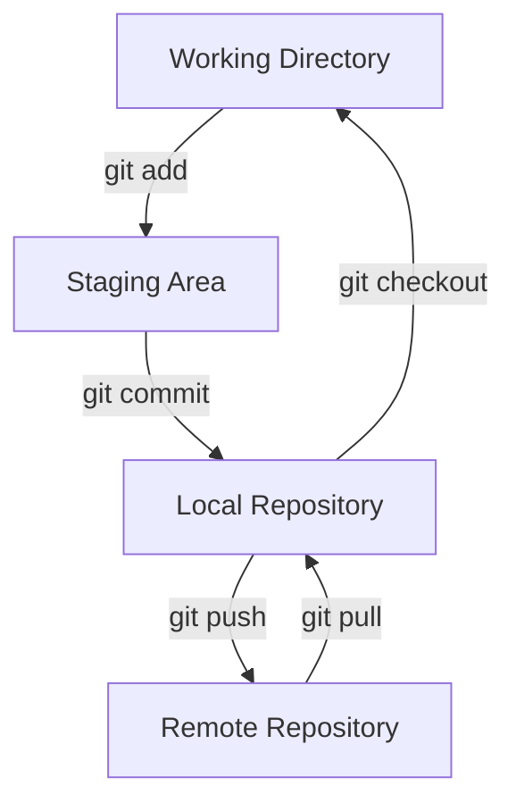
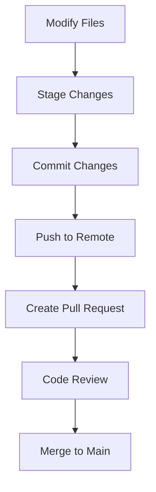

# Module 49: Git

## Overview
Git is a distributed version control system for tracking code changes. It enables collaboration, branching, merging, and history management for software development.

## Learning Objectives
- Master Git commands and workflows
- Understand branching strategies
- Handle merge conflicts
- Use Git hooks and automation
- Apply Git best practices

## Prerequisites
- Command line basics
- File system concepts
- Development workflow

## Why This Concept Exists
Without version control:
- Code changes are lost
- Collaboration is difficult
- History is unclear
- Rollbacks are impossible

Git provides:
- Change tracking
- Branching and merging
- Collaboration
- History management
- Distributed development

## Problem Statement
How do you manage code changes, collaborate effectively, and maintain clean history?

## Theory

### Git Objects

| Object | Purpose |
|--------|---------|
| Blob | File content |
| Tree | Directory structure |
| Commit | Snapshot with metadata |
| Tag | Named reference |

### Branch Strategies

| Strategy | Description |
|----------|-------------|
| Git Flow | Feature, develop, release, hotfix |
| GitHub Flow | Feature branches, main, PRs |
| Trunk-Based | Short-lived branches, frequent merge |

## Internal Working

### Git Storage
1. Working directory (untracked)
2. Staging area (index)
3. Local repository
4. Remote repository

### Merge vs Rebase

| Feature | Merge | Rebase |
|---------|-------|--------|
| History | Preserved | Linearized |
| Conflicts | Merge commit | Interactive |
| Cleanliness | Complex | Clean |

## JVM Perspective

### Git and Java
- .gitignore for Java projects
- Maven/Gradle integration
- IDE integration (IntelliJ, Eclipse)
- CI/CD pipeline triggers

### Git Hooks
- pre-commit: validation
- pre-push: testing
- post-merge: build
- commit-msg: message check

## Architecture Diagram



## Flow Diagram



## Syntax

### Basic Commands
```bash
# Initialize repository
git init

# Clone repository
git clone https://github.com/user/repo.git

# Check status
git status

# Stage files
git add file.txt
git add .

# Commit
git commit -m "Add feature"

# Push
git push origin main

# Pull
git pull origin main
```

### Branching
```bash
# List branches
git branch
git branch -a

# Create branch
git branch feature-x

# Switch branch
git checkout feature-x
git checkout -b feature-x

# Merge branch
git merge feature-x

# Delete branch
git branch -d feature-x
```

### History
```bash
# View log
git log
git log --oneline --graph

# View changes
git diff
git diff --staged

# View specific commit
git show abc123

# Undo changes
git reset HEAD file.txt
git checkout -- file.txt

# Amend commit
git commit --amend
```

### Remote
```bash
# Add remote
git remote add origin url

# View remotes
git remote -v

# Fetch
git fetch origin

# Push
git push origin main

# Pull
git pull origin main
```

## Easy Example
```bash
# Create new repository
git init
git add README.md
git commit -m "Initial commit"

# Create feature branch
git checkout -b feature/login

# Make changes
echo "Login functionality" > login.java
git add login.java
git commit -m "Add login feature"

# Merge to main
git checkout main
git merge feature/login

# Push to remote
git push origin main
```

## Medium Example
```bash
# Handle merge conflict
git checkout -b feature/payment
# Make conflicting changes
git commit -am "Add payment feature"

git checkout main
git merge feature/payment
# CONFLICT!

# Resolve conflict
# Edit conflicted file
git add payment.java
git commit -m "Resolve merge conflict"

# Interactive rebase
git rebase -i HEAD~3
# Squash commits, reorder, edit

# Cherry-pick specific commit
git cherry-pick abc123
```

## Hard Example
```bash
# Advanced Git operations

# Bisect for bug hunting
git bisect start
git bisect bad HEAD
git bisect good v1.0
# Git tests commits automatically

# Interactive rebase to clean history
git rebase -i main
# Pick, squash, reword, edit, drop

# Stash with message
git stash push -m "Work in progress"
git stash list
git stash pop stash@{0}

# Reflog for recovery
git reflog
git checkout abc123

# Submodules
git submodule add url/repo path
git submodule update --init --recursive
```

## Enterprise Example
```bash
#!/bin/bash
# Git workflow automation script

# Feature branch workflow
create_feature() {
    local feature_name=$1
    git checkout main
    git pull origin main
    git checkout -b feature/${feature_name}
    echo "Created feature branch: feature/${feature_name}"
}

# Release workflow
create_release() {
    local version=$1
    git checkout main
    git pull origin main
    git checkout -b release/${version}
    
    # Update version
    mvn versions:set -DnewVersion=${version}
    git commit -am "Bump version to ${version}"
    
    # Merge to main and develop
    git checkout main
    git merge release/${version}
    git tag -a v${version} -m "Release ${version}"
    git push origin main --tags
    
    # Cleanup
    git branch -d release/${version}
    git push origin --delete release/${version}
}

# Hotfix workflow
create_hotfix() {
    local hotfix_name=$1
    git checkout main
    git checkout -b hotfix/${hotfix_name}
    
    # Make fix
    echo "Fix applied"
    git commit -am "Fix: ${hotfix_name}"
    
    # Merge to main and develop
    git checkout main
    git merge hotfix/${hotfix_name}
    git tag -a hotfix-${hotfix_name} -m "Hotfix ${hotfix_name}"
    git push origin main --tags
    
    # Cleanup
    git branch -d hotfix/${hotfix_name}
}
```

## Performance Considerations
- Use shallow clones for CI
- Git LFS for large files
- Sparse checkout for monorepos
- Git pack for storage efficiency

## Time & Space Complexity

| Operation | Time | Space |
|-----------|------|-------|
| clone | O(n) | O(n) |
| commit | O(1) | O(1) |
| merge | O(n) | O(1) |
| rebase | O(n) | O(n) |
| push/pull | O(n) | O(n) |

## Thread Safety
- Git is not thread-safe for same repository
- Use separate working directories
- Lock files prevent conflicts
- Atomic commits for consistency

## Best Practices
1. Write clear commit messages
2. Keep commits small and focused
3. Use feature branches
4. Review before merging
5. Clean up merged branches

## Common Mistakes
1. Large commits
2. Bad commit messages
3. Not pulling before push
4. Force pushing to main
5. Ignoring merge conflicts

## Comparison Table

| Feature | Git | SVN | Mercurial |
|---------|-----|-----|-----------|
| Type | Distributed | Centralized | Distributed |
| Speed | Fast | Medium | Fast |
| Branching | Excellent | Good | Good |
| Learning Curve | Steep | Easy | Medium |

## Interview Questions

### Q1: What is the difference between git merge and git rebase?
**Answer:** Merge preserves history, rebase linearizes it.

### Q2: What is a detached HEAD?
**Answer:** HEAD points to a commit instead of a branch.

### Q3: How do you undo a commit?
**Answer:** `git reset` or `git revert` (creates new commit).

### Q4: What is git stash?
**Answer:** Temporarily stores uncommitted changes.

### Q5: What is the difference between git fetch and git pull?
**Answer:** Fetch downloads changes, pull fetches and merges.

### Q6: How do you resolve merge conflicts?
**Answer:** Edit conflicted files, git add, git commit.

### Q7: What is a fast-forward merge?
**Answer:** When target branch is ahead, no merge commit needed.

### Q8: What is git cherry-pick?
**Answer:** Apply specific commit from another branch.

### Q9: What is the difference between HEAD and HEAD~1?
**Answer:** HEAD is current commit, HEAD~1 is parent.

### Q10: What is .gitignore?
**Answer:** File listing patterns to ignore in repository.

### Q11: What is Git LFS?
**Answer:** Large File Storage for handling large files.

### Q12: What is interactive rebase?
**Answer:** Editing commit history during rebase.

### Q13: What is a Git submodule?
**Answer:** Repository embedded within another repository.

### Q14: What is git bisect?
**Answer:** Binary search for bug-introducing commit.

### Q15: What are Git hooks?
**Answer:** Scripts that run on Git events (commit, push, etc.).

## Exercises

### Easy
1. Create a repository and make commits
2. Create and merge branches
3. Resolve a merge conflict

### Medium
1. Use interactive rebase
2. Create a .gitignore
3. Use git stash

### Hard
1. Set up Git hooks
2. Create a release workflow
3. Use git bisect

## Summary
Git is essential for modern software development, enabling collaboration and change management.

## References
- Git Documentation
- Pro Git Book
- Git Cheat Sheet
