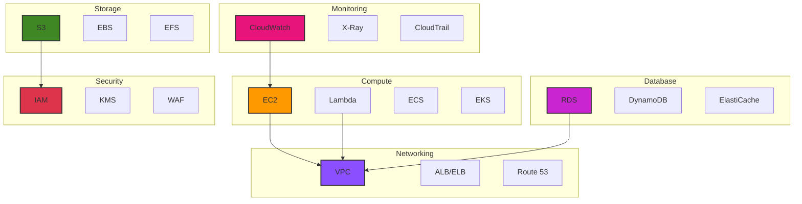
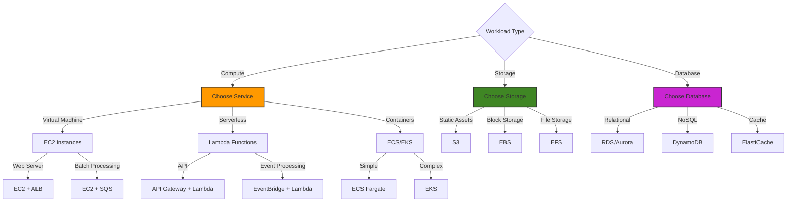

# AWS Fundamentals

## Overview
Amazon Web Services (AWS) is the world's most comprehensive cloud platform.

## Topics
- EC2
- S3
- RDS
- Lambda
- VPC
- IAM
- CloudFormation
- DynamoDB
- SQS/SNS
- CloudWatch

## Learning Objectives
- Navigate AWS console
- Deploy basic infrastructure
- Understand pricing models

## Prerequisites
- Basic networking

## Architecture

## When to Use

