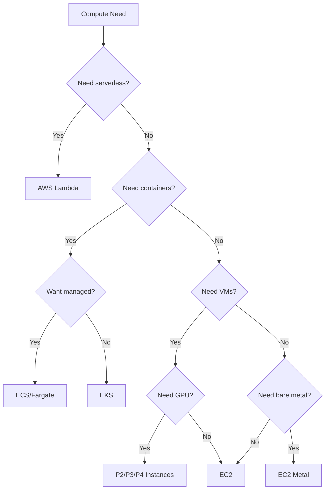
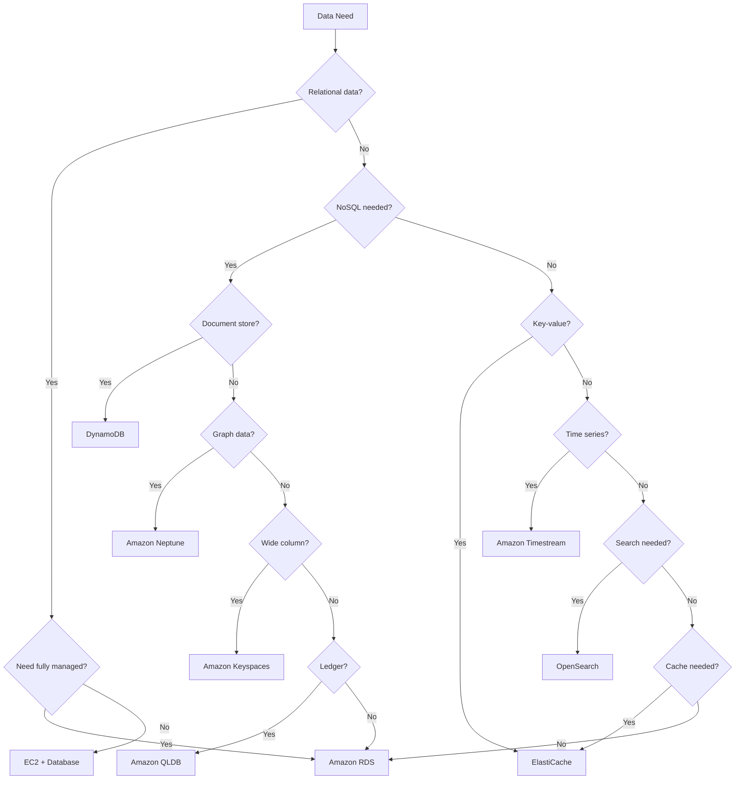
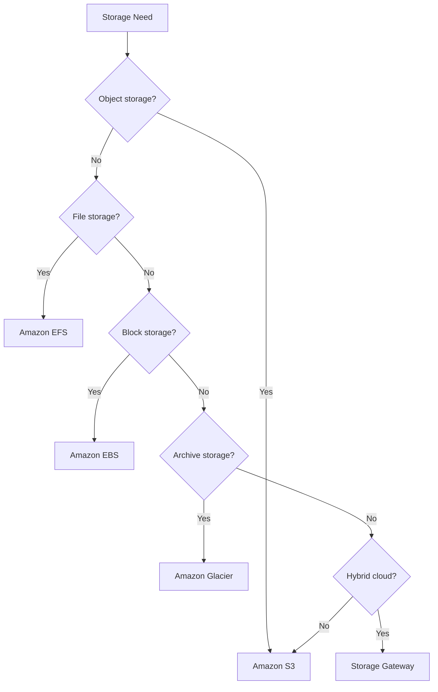
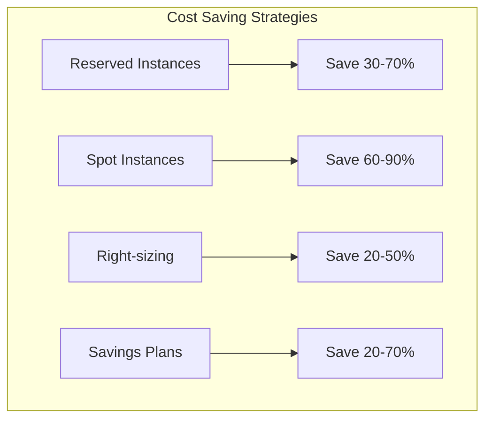
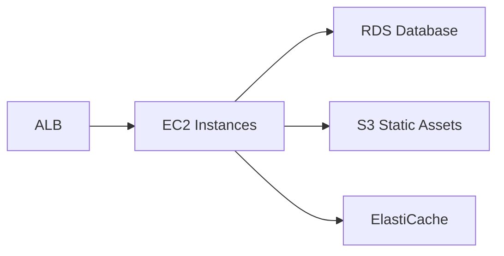
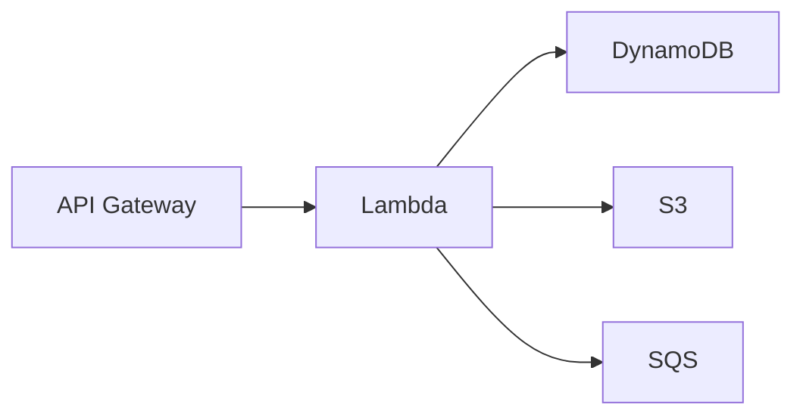

# Decision Tree: AWS Service Selection Guide

## Overview
AWS offers hundreds of services. This guide helps you choose the right services for common use cases.

## Compute Selection

## Database Selection

## Storage Selection

## Service Selection Matrix

### Compute Services

| Service | Use Case | Scaling | Cost Model |
|---------|----------|---------|------------|
| EC2 | Traditional applications | Manual/Auto | Instance hours |
| Lambda | Event-driven, microservices | Automatic | Per request |
| ECS | Container orchestration | Manual/Auto | Container hours |
| EKS | Kubernetes workloads | Manual/Auto | Cluster hours |
| Lightsail | Simple web apps | Manual | Monthly |

### Database Services

| Service | Use Case | Scaling | Best For |
|---------|----------|---------|----------|
| RDS | Relational data | Vertical/Horizontal | Traditional apps |
| DynamoDB | Key-value, document | Automatic | High-scale apps |
| ElastiCache | Caching, sessions | Cluster | Performance |
| Neptune | Graph data | Vertical | Social networks |
| OpenSearch | Search, analytics | Cluster | Log analytics |

### Storage Services

| Service | Use Case | Durability | Access Pattern |
|---------|----------|------------|----------------|
| S3 | Object storage | 11 9s | REST API |
| EFS | Shared file storage | High | NFS |
| EBS | Block storage | High | Single EC2 |
| Glacier | Archive storage | High | Batch retrieval |

## Cost Optimization

## Architecture Patterns

### Three-Tier Web Application

### Serverless Application

## Migration Considerations

### Common Migration Paths:
- On-premises to EC2: Lift and shift
- On-premises to Containers: Containerize first
- Monolith to Microservices: Decompose gradually
- SQL to NoSQL: Evaluate data model fit

## When to Use Specific Services

### Choose EC2 When:
- Need full control over OS
- Running legacy applications
- Need specific instance types
- Custom networking required

### Choose Lambda When:
- Event-driven architecture
- Variable workloads
- Microservices
- Quick prototyping

### Choose ECS When:
- Container workloads
- Want managed orchestration
- Need AWS integration
- Simpler than Kubernetes

### Choose RDS When:
- Relational data model
- Need ACID compliance
- Standard SQL queries
- Traditional applications

### Choose DynamoDB When:
- Key-value access patterns
- High-scale requirements
- Serverless architecture
- Need millisecond latency

## Decision Checklist

Choose compute based on:
- [ ] Workload type (batch, real-time, etc.)
- [ ] Scaling requirements
- [ ] Cost constraints
- [ ] Team expertise
- [ ] Integration needs

Choose database based on:
- [ ] Data model (relational, document, etc.)
- [ ] Query patterns
- [ ] Scaling requirements
- [ ] Consistency needs
- [ ] Budget constraints

Choose storage based on:
- [ ] Data type (objects, files, blocks)
- [ ] Access patterns
- [ ] Durability requirements
- [ ] Performance needs
- [ ] Cost constraints