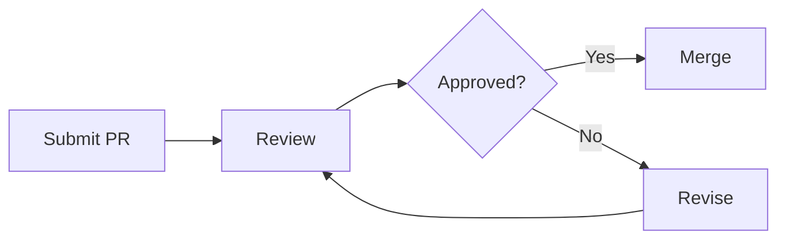
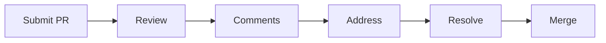

# Code Reviews

## Overview

Code reviews are systematic examinations of source code by peers to find bugs, improve code quality, and share knowledge. They are a cornerstone of engineering excellence, catching issues early and fostering a culture of continuous learning.

## Why Code Reviews Matter

### Quality Assurance
- Catch bugs before they reach production
- Identify logic errors and edge cases
- Ensure adherence to coding standards
- Prevent security vulnerabilities

### Knowledge Sharing
- Spread domain knowledge across the team
- Teach new patterns and techniques
- Create shared code ownership
- Reduce bus factor risk

### Continuous Improvement
- Learn from peers' approaches
- Discover better solutions collectively
- Refine coding standards over time
- Build team skills incrementally

## Code Review Process

### 1. Preparation (Author)
Before submitting for review:

```markdown
## Pull Request Checklist

- [ ] Code compiles and passes all tests
- [ ] Self-reviewed the diff
- [ ] Added/updated tests for changes
- [ ] Updated documentation if needed
- [ ] Kept changes focused and atomic
- [ ] Wrote clear commit messages
- [ ] Filled out PR description
```

### 2. Submission
Create a clear, focused pull request:

```markdown
## What
Brief description of changes.

## Why
Context and motivation for the changes.

## How
Implementation approach and key decisions.

## Testing
How the changes were tested.

## Screenshots
Visual changes (if applicable).
```

### 3. Review
Systematic review approach:

```markdown
## Review Checklist

### Correctness
- [ ] Logic is correct
- [ ] Edge cases handled
- [ ] Error handling appropriate
- [ ] No race conditions

### Quality
- [ ] Code is readable
- [ ] Functions are focused
- [ ] Names are meaningful
- [ ] No code duplication

### Security
- [ ] Input validation
- [ ] Authentication/authorization
- [ ] Data protection
- [ ] No secrets in code

### Performance
- [ ] Efficient algorithms
- [ ] No N+1 queries
- [ ] Proper indexing
- [ ] Caching considered

### Testing
- [ ] Tests cover new code
- [ ] Tests are meaningful
- [ ] Edge cases tested
- [ ] No flaky tests
```

### 4. Feedback
Provide constructive, actionable feedback:

```markdown
## Feedback Examples

### Good Feedback
"Consider using a Map here instead of a List for O(1) lookups.
This function is called frequently and the current O(n) scan
could be a bottleneck."

### Poor Feedback
"This is wrong."

### Good Feedback
"Nice catch on the null check! Could we also handle the case
where the list is empty?"

### Poor Feedback
"LGTM"
```

### 5. Resolution
Address feedback and iterate:

```markdown
## Resolution Process

1. Respond to all comments
2. Make requested changes
3. Mark resolved conversations
4. Request re-review if significant changes
5. Merge when approved
```

## Review Styles

### Approval-Based


### Comment-Based


## Best Practices

### For Authors

1. **Keep PRs Small**
   - Aim for < 400 lines changed
   - One logical change per PR
   - Separate refactoring from features

2. **Provide Context**
   - Explain why, not just what
   - Link to relevant issues/docs
   - Describe testing approach

3. **Self-Review First**
   - Review your own diff before submitting
   - Fix obvious issues
   - Ensure completeness

4. **Respond Constructively**
   - Thank reviewers for feedback
   - Ask clarifying questions
   - Don't take feedback personally

### For Reviewers

1. **Review Promptly**
   - Respond within 24 hours
   - Prioritize reviews over new work
   - Block on critical issues only

2. **Be Constructive**
   - Suggest alternatives
   - Explain reasoning
   - Praise good work

3. **Focus on What Matters**
   - Correctness over style
   - Architecture over nitpicks
   - Security over convenience

4. **Ask Questions**
   - "What happens if...?"
   - "Have you considered...?"
   - "Could you explain...?"

## Common Anti-Patterns

### Rubber Stamping
```markdown
# Bad
LGTM 👍

# Good
Reviewed the authentication logic in auth.ts:45-67.
The token validation looks correct. One suggestion:
consider adding rate limiting to prevent brute force attacks.
```

### Nitpicking
```markdown
# Bad
"Variable name should be camelCase"

# Good
Focus on logic, architecture, and security first.
Style can be automated with linters.
```

### Gatekeeping
```markdown
# Bad
"This isn't how I would do it"

# Good
"Have you considered approach X? It might be more efficient
because Y."
```

## Tools and Automation

### Static Analysis
```yaml
# .github/workflows/review.yml
name: Code Review
on: [pull_request]
jobs:
  review:
    runs-on: ubuntu-latest
    steps:
      - uses: actions/checkout@v3
      - name: Run linters
        run: |
          npm run lint
          npm run typecheck
      - name: Run tests
        run: npm test
      - name: Security scan
        run: npm run security
```

### Automated Checks
```javascript
// pre-commit hook
const { execSync } = require('child_process');

// Run linters
execSync('eslint . --fix');

// Run type checks
execSync('tsc --noEmit');

// Run tests
execSync('jest --passWithNoTests');
```

### Review Analytics
Track review metrics:

```markdown
## Review Metrics

| Metric | Target | Current |
|--------|--------|---------|
| Review turnaround | < 24h | 18h |
| Comments per PR | 2-5 | 3.2 |
| Approval rate | > 80% | 85% |
| Rework rate | < 20% | 15% |
```

## Code Review Meetings

### Design Reviews
For significant architectural changes:

```markdown
## Design Review Agenda

1. Problem statement (5 min)
2. Proposed solution (10 min)
3. Alternatives considered (5 min)
4. Q&A and discussion (15 min)
5. Decision and action items (5 min)
```

### Bug Triage
For reviewing and prioritizing bugs:

```markdown
## Bug Triage Process

1. Review new bug reports
2. Verify reproduction steps
3. Assess severity and impact
4. Assign priority
5. Schedule fixes
```

## Metrics and Improvement

### Key Metrics
- **Review Turnaround Time** - Time from submission to approval
- **Comments per PR** - Feedback density
- **Rework Rate** - PRs requiring significant changes
- **Defect Escape Rate** - Bugs found after merge

### Continuous Improvement
```markdown
## Monthly Review Retrospective

1. What's working well in reviews?
2. What's not working?
3. What should we try differently?
4. Update review guidelines
```

## Related Topics

- [Pair Programming](../pair-programming/README.md)
- [Mob Programming](../mob-programming/README.md)
- [Quality Gates](../quality/gates/README.md)
- [Clean Code](../craftsmanship/clean-code/README.md)
