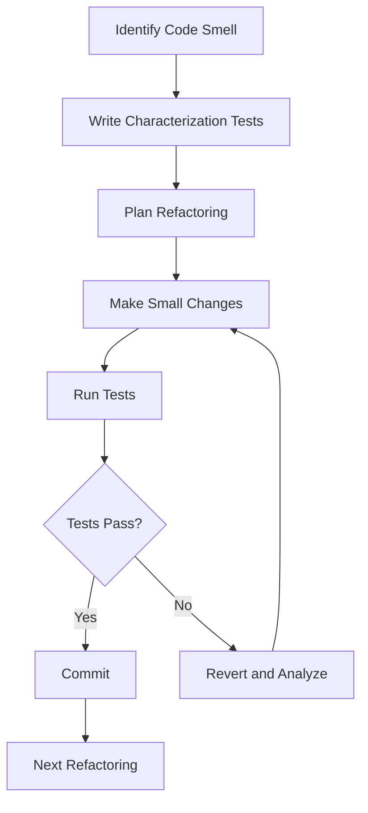

# Refactoring

## Overview

Refactoring is the process of restructuring existing code without changing its external behavior. It improves code readability, reduces complexity, and makes the codebase easier to maintain and extend.

## Why Refactor?

### Improve Code Quality
- Make code more readable
- Reduce complexity
- Improve maintainability
- Enhance testability

### Enable Features
- Make new features easier to add
- Reduce development time
- Lower risk of bugs
- Improve developer productivity

### Reduce Technical Debt
- Eliminate code smells
- Apply design patterns
- Improve architecture
- Reduce maintenance costs

## Code Smells

### Bloaters
```markdown
## Long Method
- Method does too many things
- Hard to understand and test
- Solution: Extract Method

## Large Class
- Class has too many responsibilities
- God object anti-pattern
- Solution: Extract Class

## Data Clumps
- Same data structures together everywhere
- Sign of poor abstraction
- Solution: Extract Class or Introduce Parameter Object

## Primitive Obsession
- Using primitives instead of small objects
- Missing domain modeling
- Solution: Replace Type Code with Subclass
```

### Object-Orientation Abusers
```markdown
## Switch Statements
- Complex conditional logic
- Duplicated type checking
- Solution: Replace with Polymorphism

## Parallel Inheritance Hierarchies
- Duplicate class hierarchies
- Solution: Move Method

## Temporary Field
- Fields used only in certain cases
- Solution: Extract Class

## Alternative Classes with Different Interfaces
- Similar classes with different APIs
- Solution: Unify Interface
```

### Change Preventers
```markdown
## Divergent Change
- One class modified for different reasons
- Solution: Extract Class

## Shotgun Surgery
- One change requires many small edits
- Solution: Move Method/Field

## Feature Envy
- Method uses more data from another class
- Solution: Move Method

## Data泥clumps
- Groups of data items that travel together
- Solution: Introduce Parameter Object
```

### Dispensables
```markdown
## Comments
- Comment explains what code does
- Solution: Remove comment, improve code

## Duplicate Code
- Same code in multiple places
- Solution: Extract Method

## Lazy Class
- Class that does too little
- Solution: Inline Class

## Speculative Generality
- Unused code for "future needs"
- Solution: Remove or simplify
```

## Refactoring Techniques

### Composing Methods
```java
// Extract Method
public class OrderService {
    // Before
    public void processOrder(Order order) {
        // Validate order
        if (order == null) {
            throw new IllegalArgumentException("Order cannot be null");
        }
        if (order.getItems().isEmpty()) {
            throw new IllegalArgumentException("Order must have items");
        }
        
        // Calculate total
        double total = 0;
        for (OrderItem item : order.getItems()) {
            total += item.getPrice() * item.getQuantity();
        }
        
        // Apply discount
        if (order.getCustomer().isPremium()) {
            total *= 0.9;
        }
        
        // Process payment
        paymentService.charge(order.getCustomer(), total);
    }
    
    // After
    public void processOrder(Order order) {
        validateOrder(order);
        double total = calculateTotal(order);
        total = applyDiscount(order, total);
        paymentService.charge(order.getCustomer(), total);
    }
    
    private void validateOrder(Order order) {
        if (order == null) {
            throw new IllegalArgumentException("Order cannot be null");
        }
        if (order.getItems().isEmpty()) {
            throw new IllegalArgumentException("Order must have items");
        }
    }
    
    private double calculateTotal(Order order) {
        return order.getItems().stream()
            .mapToDouble(item -> item.getPrice() * item.getQuantity())
            .sum();
    }
    
    private double applyDiscount(Order order, double total) {
        if (order.getCustomer().isPremium()) {
            return total * 0.9;
        }
        return total;
    }
}
```

### Moving Features Between Objects
```java
// Move Method
public class Customer {
    // Before
    public double calculateDiscount() {
        double discount = 0;
        if (getOrders().size() > 10) {
            discount += 0.1;
        }
        if (getTotalSpent() > 1000) {
            discount += 0.05;
        }
        return discount;
    }
}

// After
public class Customer {
    private DiscountCalculator discountCalculator;
    
    public double calculateDiscount() {
        return discountCalculator.calculate(this);
    }
}

public class DiscountCalculator {
    public double calculate(Customer customer) {
        double discount = 0;
        if (customer.getOrders().size() > 10) {
            discount += 0.1;
        }
        if (customer.getTotalSpent() > 1000) {
            discount += 0.05;
        }
        return discount;
    }
}
```

### Organizing Data
```java
// Replace Type Code with Subclass
// Before
public class Employee {
    private int type;
    static final int ENGINEER = 0;
    static final int SALESMAN = 1;
    static final int MANAGER = 2;
    
    public double calculateSalary() {
        switch (type) {
            case ENGINEER:
                return baseSalary;
            case SALESMAN:
                return baseSalary + commission;
            case MANAGER:
                return baseSalary + bonus;
            default:
                throw new IllegalArgumentException();
        }
    }
}

// After
public abstract class Employee {
    public abstract double calculateSalary();
}

public class Engineer extends Employee {
    @Override
    public double calculateSalary() {
        return baseSalary;
    }
}

public class Salesman extends Employee {
    @Override
    public double calculateSalary() {
        return baseSalary + commission;
    }
}

public class Manager extends Employee {
    @Override
    public double calculateSalary() {
        return baseSalary + bonus;
    }
}
```

### Simplifying Conditional Expressions
```java
// Consolidate Conditional Expression
// Before
public double calculateInsuranceAmount() {
    if (age < 18) {
        return 0;
    }
    if (age >= 18 && !isMember) {
        return 100;
    }
    if (age >= 18 && isMember) {
        return 50;
    }
    return 0;
}

// After
public double calculateInsuranceAmount() {
    if (isNotEligibleForInsurance()) {
        return 0;
    }
    return isMember ? 50 : 100;
}

private boolean isNotEligibleForInsurance() {
    return age < 18;
}
```

### Simplifying Method Calls
```java
// Introduce Parameter Object
// Before
public void createMeeting(Date start, Date end, List<Attendee> attendees) {
    // ...
}

// After
public void createMeeting(MeetingRequest request) {
    // ...
}

public class MeetingRequest {
    private Date start;
    private Date end;
    private List<Attendee> attendees;
    // ...
}
```

### Dealing with Generalization
```java
// Pull Up Method
// Before
class ChildA {
    public void method() {
        // implementation A
    }
}

class ChildB {
    public void method() {
        // implementation B (same as A)
    }
}

// After
class Parent {
    public void method() {
        // common implementation
    }
}

class ChildA extends Parent {
    // inherits method
}

class ChildB extends Parent {
    // inherits method
}
```

## Refactoring Process

### Safe Refactoring Steps
```markdown
## Refactoring Checklist

1. **Ensure Tests Exist**
   - Write tests for current behavior
   - Verify tests pass
   - Commit current state

2. **Make Small Changes**
   - One refactoring at a time
   - Keep changes atomic
   - Run tests after each change

3. **Verify Behavior**
   - All tests pass
   - No new warnings
   - Code coverage maintained

4. **Commit Frequently**
   - Small, focused commits
   - Clear commit messages
   - Easy to revert
```

### Refactoring Workflow


## Best Practices

### Do's
```markdown
## Do

- Refactor under test coverage
- Make one change at a time
- Commit frequently
- Use version control
- Communicate with team
- Refactor with purpose
- Keep refactoring small
```

### Don'ts
```markdown
## Don't

- Refactor without tests
- Refactor and add features
- Refactor large codebases at once
- Skip code review
- Refactor production code without backup
- Forget to update documentation
```

## Related Topics

- [Refactoring Techniques](techniques/README.md)
- [Refactoring to Patterns](patterns/README.md)
- [Technical Debt](../tech-debt/README.md)
- [Clean Code](../craftsmanship/clean-code/README.md)
- [Code Reviews](../code-reviews/README.md)
