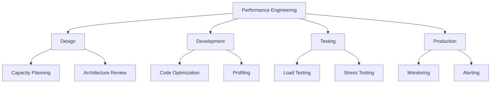
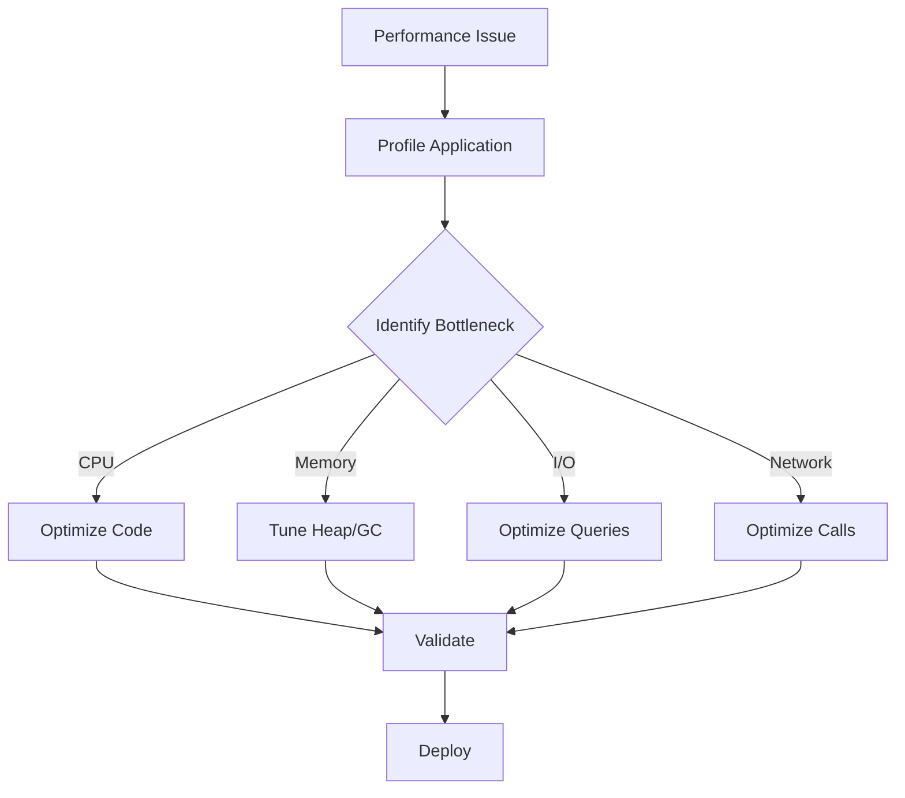

# Module 51: Performance Engineering

## Overview
Performance engineering involves designing, building, and validating software to ensure it meets performance requirements. It includes profiling, tuning, load testing, and monitoring.

## Learning Objectives
- Understand performance metrics
- Master JVM tuning
- Use profiling tools
- Implement load testing
- Optimize application performance

## Prerequisites
- Java fundamentals
- JVM basics
- System administration

## Why This Concept Exists
Poor performance leads to:
- User frustration
- Revenue loss
- Infrastructure costs
- System failures

Performance engineering provides:
- Proactive optimization
- Capacity planning
- Cost efficiency
- User satisfaction

## Problem Statement
How do you ensure your application meets performance requirements?

## Theory

### Performance Metrics

| Metric | Description |
|--------|-------------|
| Latency | Response time |
| Throughput | Requests per second |
| Utilization | Resource usage |
| Scalability | Load handling |
| Error Rate | Failure percentage |

### JVM Metrics

| Metric | Description |
|--------|-------------|
| Heap Usage | Memory consumption |
| GC Pause | Stop-the-world time |
| Thread Count | Active threads |
| CPU Usage | Processor utilization |

## Internal Working

### Performance Analysis
1. Define requirements
2. Baseline measurement
3. Identify bottlenecks
4. Optimize
5. Validate improvement
6. Monitor in production

### JVM Tuning Process
1. Set heap size (-Xmx, -Xms)
2. Choose GC algorithm
3. Tune GC parameters
4. Monitor and adjust
5. Profile hotspots

## JVM Perspective

### JVM Flags
```bash
# Heap
-Xms512m -Xmx2g

# GC
-XX:+UseG1GC
-XX:MaxGCPauseMillis=200

# Monitoring
-XX:+PrintGCDetails
-XX:+PrintGCTimeStamps
```

### Profiling Tools
- VisualVM
- JProfiler
- YourKit
- async-profiler
- JFR (Java Flight Recorder)

## Architecture Diagram



## Flow Diagram



## Syntax

### JVM Tuning
```bash
# Memory
java -Xms1g -Xmx4g -XX:MaxMetaspaceSize=256m -jar app.jar

# GC (G1)
java -XX:+UseG1GC -XX:MaxGCPauseMillis=200 -XX:G1HeapRegionSize=16m -jar app.jar

# GC (ZGC)
java -XX:+UseZGC -jar app.jar

# Monitoring
java -XX:+FlightRecorder -XX:StartFlightRecording=duration=60s,filename=recording.jfr -jar app.jar
```

### Load Testing with JMeter
```xml
<?xml version="1.0" encoding="UTF-8"?>
<jmeterTestPlan>
  <hashTree>
    <TestPlan>
      <elementProp name="HTTP Request" elementType="HTTPSampler">
        <stringProp name="HTTPSampler.domain">localhost</stringProp>
        <stringProp name="HTTPSampler.port">8080</stringProp>
        <stringProp name="HTTPSampler.path">/api/endpoint</stringProp>
      </elementProp>
    </TestPlan>
  </hashTree>
</jmeterTestPlan>
```

### Performance Monitoring
```java
// Micrometer metrics
@RestController
public class MetricsController {
    private final MeterRegistry registry;
    
    @GetMapping("/endpoint")
    public String endpoint() {
        Timer.Sample sample = Timer.start(registry);
        // Process request
        sample.stop(registry.timer("request.duration"));
        return "OK";
    }
}
```

## Easy Example
```java
public class PerformanceEasyExample {
    // Bad: String concatenation in loop
    public static String badStringConcat() {
        String result = "";
        for (int i = 0; i < 10000; i++) {
            result += "item" + i;  // Creates new String each time
        }
        return result;
    }
    
    // Good: StringBuilder
    public static String goodStringConcat() {
        StringBuilder sb = new StringBuilder();
        for (int i = 0; i < 10000; i++) {
            sb.append("item").append(i);
        }
        return sb.toString();
    }
    
    // Bad: Autoboxing
    public static long badAutoboxing() {
        Long sum = 0L;  // Autoboxing
        for (long i = 0; i < 1000000; i++) {
            sum += i;  // Unbox, add, autobox
        }
        return sum;
    }
    
    // Good: Primitive
    public static long goodAutoboxing() {
        long sum = 0L;
        for (long i = 0; i < 1000000; i++) {
            sum += i;
        }
        return sum;
    }
}
```

## Medium Example
```java
import java.util.concurrent.*;
import java.util.stream.*;

public class PerformanceMediumExample {
    // Cache expensive computations
    private final ConcurrentHashMap<String, CompletableFuture<Double>> cache = 
        new ConcurrentHashMap<>();
    
    public CompletableFuture<Double> computeExpensive(String key) {
        return cache.computeIfAbsent(key, k -> 
            CompletableFuture.supplyAsync(() -> {
                // Expensive computation
                try {
                    Thread.sleep(1000);
                } catch (InterruptedException e) {
                    Thread.currentThread().interrupt();
                }
                return Math.random() * 100;
            })
        );
    }
    
    // Parallel stream for large datasets
    public double parallelSum(int[] numbers) {
        return java.util.Arrays.stream(numbers)
            .parallel()
            .sum();
    }
    
    // Batch processing
    public <T> void processBatch(List<T> items, int batchSize, 
            java.util.function.Consumer<T> processor) {
        IntStream.range(0, (items.size() + batchSize - 1) / batchSize)
            .parallel()
            .forEach(batch -> {
                int start = batch * batchSize;
                int end = Math.min(start + batchSize, items.size());
                items.subList(start, end).forEach(processor);
            });
    }
}
```

## Hard Example
```java
import java.lang.management.*;
import java.util.concurrent.*;

public class PerformanceHardExample {
    // JVM metrics collection
    public static void collectJvmMetrics() {
        MemoryMXBean memoryBean = ManagementFactory.getMemoryMXBean();
        MemoryUsage heap = memoryBean.getHeapMemoryUsage();
        MemoryUsage nonHeap = memoryBean.getNonHeapMemoryUsage();
        
        System.out.printf("Heap: %d/%d MB (%.1f%%)%n",
            heap.getUsed() / 1024 / 1024,
            heap.getMax() / 1024 / 1024,
            (double) heap.getUsed() / heap.getMax() * 100);
        
        ThreadMXBean threadBean = ManagementFactory.getThreadMXBean();
        System.out.printf("Threads: %d (peak: %d)%n",
            threadBean.getThreadCount(),
            threadBean.getPeakThreadCount());
        
        OperatingSystemMXBean osBean = ManagementFactory.getOperatingSystemMXBean();
        System.out.printf("Load Average: %.2f%n", osBean.getSystemLoadAverage());
    }
    
    // Custom performance counter
    public static class PerformanceCounter {
        private final AtomicLong count = new AtomicLong(0);
        private final AtomicLong totalTime = new AtomicLong(0);
        
        public <T> T measure(java.util.concurrent.Callable<T> operation) throws Exception {
            long start = System.nanoTime();
            try {
                return operation.call();
            } finally {
                long duration = System.nanoTime() - start;
                count.incrementAndGet();
                totalTime.addAndGet(duration);
            }
        }
        
        public double getAverageNanos() {
            long c = count.get();
            return c == 0 ? 0 : (double) totalTime.get() / c;
        }
        
        public void printStats() {
            System.out.printf("Operations: %d, Avg: %.2f ms%n",
                count.get(), getAverageNanos() / 1_000_000);
        }
    }
    
    public static void main(String[] args) throws Exception {
        PerformanceCounter counter = new PerformanceCounter();
        
        for (int i = 0; i < 100; i++) {
            counter.measure(() -> {
                Thread.sleep(10);
                return null;
            });
        }
        
        counter.printStats();
        collectJvmMetrics();
    }
}
```

## Enterprise Example
```java
import java.util.concurrent.*;
import java.util.concurrent.atomic.*;
import java.util.*;

public class PerformanceEnterpriseExample {
    // Connection pool monitoring
    public static class MonitoredConnectionPool {
        private final BlockingQueue<Connection> pool;
        private final AtomicInteger active = new AtomicInteger(0);
        private final AtomicInteger total = new AtomicInteger(0);
        
        public MonitoredConnectionPool(int maxSize) {
            this.pool = new LinkedBlockingQueue<>(maxSize);
            for (int i = 0; i < maxSize; i++) {
                pool.offer(new Connection());
                total.incrementAndGet();
            }
        }
        
        public Connection acquire() throws InterruptedException {
            active.incrementAndGet();
            return pool.take();
        }
        
        public void release(Connection conn) {
            pool.offer(conn);
            active.decrementAndGet();
        }
        
        public Map<String, Object> getMetrics() {
            return Map.of(
                "active", active.get(),
                "idle", pool.size(),
                "total", total.get()
            );
        }
    }
    
    static class Connection {}
    
    public static void main(String[] args) {
        MonitoredConnectionPool pool = new MonitoredConnectionPool(10);
        System.out.println("Pool metrics: " + pool.getMetrics());
    }
}
```

## Performance Considerations
- Profile before optimizing
- Focus on critical path
- Measure, don't guess
- Consider trade-offs

## Time & Space Complexity

| Operation | Without | With Optimization |
|-----------|---------|-------------------|
| String concat | O(n²) | O(n) |
| Autoboxing | O(n) overhead | O(1) |
| Parallel stream | O(n) | O(n/p) |
| Cache lookup | O(n) | O(1) |

## Thread Safety
- Use concurrent collections
- Minimize synchronization
- Use thread pools
- Avoid thread-unsafe operations

## Best Practices
1. Profile regularly
2. Set performance budgets
3. Use caching wisely
4. Optimize hot paths
5. Monitor production

## Common Mistakes
1. Premature optimization
2. Ignoring I/O
3. Not profiling
4. Over-optimizing

## Comparison Table

| Tool | Type | Cost | Features |
|------|------|------|----------|
| VisualVM | Profiler | Free | Basic |
| JProfiler | Profiler | Paid | Advanced |
| YourKit | Profiler | Paid | Advanced |
| JFR | Recorder | Free | Built-in |

## Interview Questions

### Q1: What is performance engineering?
**Answer:** Ensuring software meets performance requirements through design, testing, and optimization.

### Q2: What is JVM tuning?
**Answer:** Adjusting JVM parameters for optimal performance.

### Q3: What is the difference between latency and throughput?
**Answer:** Latency is response time, throughput is requests per second.

### Q4: What is profiling?
**Answer:** Analyzing application to find performance bottlenecks.

### Q5: What is load testing?
**Answer:** Testing system under expected load.

### Q6: What is stress testing?
**Answer:** Testing system beyond normal load to find breaking point.

### Q7: What is capacity planning?
**Answer:** Determining resources needed for expected load.

### Q8: What is caching?
**Answer:** Storing frequently accessed data for faster retrieval.

### Q9: What is connection pooling?
**Answer:** Reusing database connections for better performance.

### Q10: What is the difference between -Xms and -Xmx?
**Answer:** -Xms is initial heap size, -Xmx is maximum heap size.

### Q11: What is G1GC?
**Answer:** Garbage-First Garbage Collector for balanced performance.

### Q12: What is ZGC?
**Answer:** Low-latency garbage collector with sub-millisecond pauses.

### Q13: What is JFR?
**Answer:** Java Flight Recorder for production profiling.

### Q14: What is async-profiler?
**Answer:** Low-overhead sampling profiler for Java.

### Q15: What are performance anti-patterns?
**Answer:** Common mistakes like N+1 queries, excessive logging, etc.

## Exercises

### Easy
1. Profile a Java application
2. Tune JVM heap size
3. Use StringBuilder instead of String concatenation

### Medium
1. Implement caching
2. Use connection pooling
3. Optimize database queries

### Hard
1. Perform load testing
2. Implement circuit breaker
3. Optimize JVM for low latency

## Summary
Performance engineering ensures applications meet performance requirements through profiling, tuning, and monitoring.

## References
- Java Performance by Scott Oaks
- Java Performance Companion
- Oracle Performance Tuning Guide
