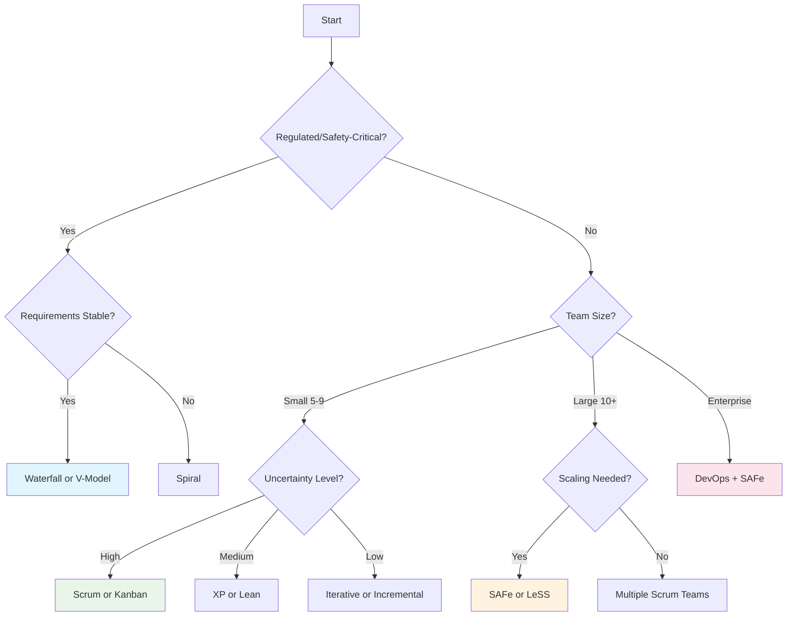

# Software Development Methodologies

A full guide to software development methodologies, their phases, use cases, and trade-offs.

## Overview

Software development methodologies are structured frameworks that guide teams through the process of building software. The choice of methodology impacts delivery speed, quality, risk management, and team collaboration.

## Methodology Categories

### Traditional (Plan-Driven)
- **Waterfall** - Sequential phases, full documentation
- **V-Model** - Verification and validation at each phase
- **Spiral** - Risk-driven iterative cycles

### Iterative & Incremental
- **Iterative** - Build through repeated cycles
- **Incremental** - Deliver in working pieces
- **RAD** - Rapid prototyping and time-boxed delivery

### Agile & Lean
- **Agile** - Adaptive, value-driven approach
- **Scrum** - Sprint-based with defined roles
- **Kanban** - Flow-based with WIP limits
- **XP** - Engineering excellence practices
- **Lean** - Waste elimination and efficiency

### Scaled & Enterprise
- **SAFe** - Scaled Agile for large organizations
- **LeSS** - Large-Scale Scrum
- **RUP** - Unified process framework

### Modern Practices
- **DevOps** - Culture bridging development and operations

## Decision Tree

## Quick Selection Guide

| Scenario | Recommended Methodology | Why |
|----------|------------------------|-----|
| Fixed requirements, compliance | Waterfall | Predictable, documented |
| Safety-critical systems | V-Model | Verification at each phase |
| Large risky projects | Spiral | Risk analysis per cycle |
| Startup with uncertainty | Scrum | Fast feedback, pivots |
| Operations-heavy team | Kanban | Flow optimization |
| High engineering standards | XP | Best practices built-in |
| 50+ person program | SAFe | Portfolio alignment |
| Need both dev + ops | DevOps | End-to-end automation |

## Key Principles Across All Methodologies

1. **Deliver value** - Focus on working software or products
2. **Manage risk** - Identify and mitigate issues early
3. **Enable collaboration** - Communication within and across teams
4. **Continuous improvement** - Learn and adapt from feedback
5. **Quality assurance** - Build quality in, don't test it in

## How to Use This Guide

1. **New to methodologies?** Start with the [Comparison Matrix](comparison.md)
2. **Choosing for your team?** Use the decision tree above
3. **Preparing for interviews?** Review individual methodology READMEs
4. **Scaling your organization?** Read SAFe, LeSS, and DevOps guides

## Related Topics

- [Agile Principles](agile/README.md)
- [Engineering Culture](../engineering-culture/)
- [Code Quality](../quality/)
- [DevOps Practices](devops/README.md)
