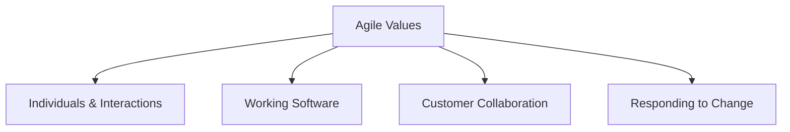

# Agile Methodology

## Overview

Agile is a mindset and set of values for software development that prioritizes customer collaboration, responding to change, and delivering working software. The Agile Manifesto, published in 2001, established four core values and twelve principles.

## The Agile Manifesto

### Four Values

1. **Individuals and interactions** over processes and tools
2. **Working software** over comprehensive documentation
3. **Customer collaboration** over contract negotiation
4. **Responding to change** over following a plan

### Twelve Principles

1. Our highest priority is to satisfy the customer through early and continuous delivery
2. Welcome changing requirements, even late in development
3. Deliver working software frequently (weeks rather than months)
4. Business people and developers must work together daily
5. Build projects around motivated individuals
6. The most efficient method is face-to-face conversation
7. Working software is the primary measure of progress
8. Agile processes promote sustainable development
9. Continuous attention to technical excellence and good design
10. Simplicity is essential
11. The best architectures emerge from self-organizing teams
12. At regular intervals, the team reflects on how to become more effective

## When to Use

- Requirements are unclear or evolving
- Fast time-to-market is critical
- Customer can provide regular feedback
- Project complexity requires adaptive approach
- Team is experienced and self-organizing

## Pros

- Rapid delivery of value
- High customer satisfaction
- Adaptability to change
- Improved team morale
- Continuous improvement

## Cons

- Requires significant customer involvement
- Can be challenging for distributed teams
- Documentation may be insufficient
- Scope can be difficult to control
- May not suit regulatory environments

## Agile Frameworks

- **Scrum** - Sprint-based with defined roles
- **Kanban** - Flow-based with WIP limits
- **XP** - Engineering excellence practices
- **Lean** - Waste elimination
- **Crystal** - Lightweight, adaptive methods

## Real-World Example

**Spotify** - Spotify uses an Agile approach with squads, tribes, chapters, and guilds, enabling autonomous teams to deliver value continuously while maintaining alignment.

## Interview Questions

1. What are the four values of the Agile Manifesto?
2. How does Agile handle changing requirements?
3. What is the difference between Agile and Waterfall?
4. What are some popular Agile frameworks?
5. How do you measure progress in Agile projects?

## References

- Agile Alliance. "The Agile Manifesto" (agilemanifesto.org)
- Alistair Cockburn (2001). "Agile Software Development"
- Jim Highsmith (2002). "Agile Software Development Ecosystems"
