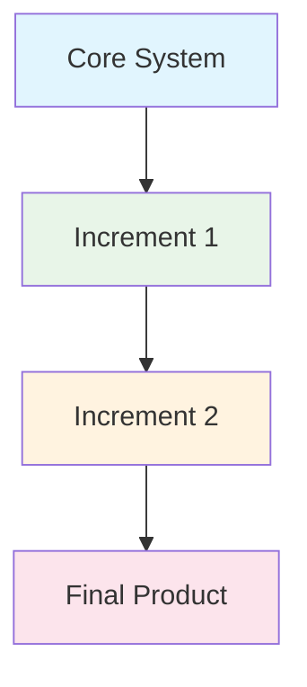

# Incremental Methodology

## Overview

The Incremental methodology divides the system into increments, where each increment delivers a working subset of the final product. Each increment adds functionality while maintaining a working system.

## Process

1. **Core System** - Build basic functionality
2. **Increment 1** - Add Feature Set A
3. **Increment 2** - Add Feature Set B
4. **Increment 3** - Add Feature Set C
5. **Final Product** - Complete system

## When to Use

- Large projects that can be divided into components
- Projects with clear, separable features
- When early delivery of partial functionality is valuable
- Teams working in parallel on different increments
- Systems requiring phased rollout

## Pros

- Early delivery of working software
- Reduced risk through incremental delivery
- Easier to test and debug smaller increments
- Customer can use early increments
- Parallel development possible

## Cons

- Requires careful planning of increments
- Integration challenges between increments
- Architecture must support incremental addition
- May require significant rework if increments are poorly defined
- Documentation of interfaces between increments is critical

## Real-World Example

**Amazon Web Services** - AWS launches new services incrementally, starting with core functionality and adding features over time based on customer feedback and usage patterns.

## Interview Questions

1. How does incremental development differ from iterative development?
2. What are the benefits of delivering software in increments?
3. How do you plan and manage dependencies between increments?
4. What challenges arise when integrating multiple increments?
5. When would you choose incremental over other methodologies?

## References

- Barry Boehm (1988). "A Spiral Model of Software Development and Enhancement"
- Tom Gilb (1988). "Principles of Software Engineering Management"
- Project Management Institute. "PMBOK Guide"
