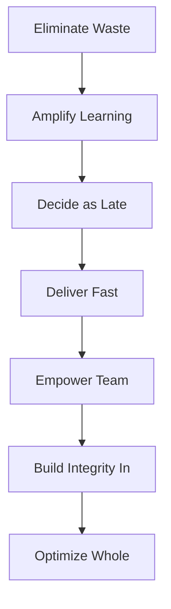

# Lean Software Development

## Overview

Lean Software Development is an agile methodology that applies lean manufacturing principles to software development. Created by **Mary and Tom Poppendieck**, it focuses on eliminating waste and maximizing value.

## Core Principles

1. **Eliminate Waste** - Remove anything that doesn't add value
2. **Amplify Learning** - Use feedback and experimentation
3. **Decide as Late as Possible** - Keep options open
4. **Deliver as Fast as Possible** - Short iterations, quick feedback
5. **Empower the Team** - Trust people to make decisions
6. **Build Integrity In** - Quality is built in, not inspected in
7. **Optimize the Whole** - Focus on the entire value stream

## Types of Waste

- **Partially Done Work** - Code not yet delivered
- **Extra Features** - Building what isn't needed
- **Relearning** - Not documenting or sharing knowledge
- **Handoffs** - Delays between teams
- **Task Switching** - Context switching overhead
- **Defects** - Bugs and rework
- **Underutilized Talent** - Not leveraging team skills

## When to Use

- Teams seeking to improve efficiency
- Organizations with process overhead
- Projects where speed is critical
- Teams wanting to reduce waste
- When optimizing the value stream

## Pros

- Focuses on value delivery
- Reduces waste and inefficiency
- Empowers teams to make decisions
- Encourages continuous improvement
- Can be applied alongside other methodologies

## Cons

- Requires cultural shift
- May lack specific practices
- Can be difficult to measure waste
- Requires discipline to maintain focus
- Not a complete framework

## Real-World Example

**Toyota** - Toyota's production system, the origin of lean principles, uses just-in-time manufacturing and continuous improvement (kaizen) to eliminate waste and improve quality.

## Interview Questions

1. What are the seven principles of Lean Software Development?
2. How do you identify waste in software development?
3. What is "decide as late as possible" and why is it valuable?
4. How does Lean complement other agile methodologies?
5. What metrics help identify waste in a development process?

## References

- Mary Poppendieck and Tom Poppendieck (2003). "Lean Software Development: An Agile Toolkit"
- Mary Poppendieck and Tom Poppendieck (2006). "Implementing Lean Software Development: From Concept to Cash"
- James Morgan and Jeffrey Liker (2006). "The Toyota Product Development System"
