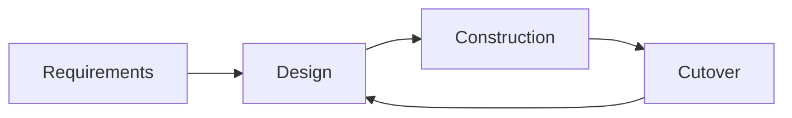

# Rapid Application Development (RAD)

## Overview

Rapid Application Development is a time-boxed methodology that emphasizes rapid prototyping and iterative development. Created by **James Martin** in 1991, RAD prioritizes speed and customer feedback over comprehensive planning.

## Phases

1. **Requirements Planning** - Quick requirements gathering
2. **User Design** - Collaborative prototyping
3. **Rapid Construction** - Quick build and testing
4. **Cutover** - Deployment and transition

## When to Use

- Projects with tight deadlines
- Systems requiring rapid user feedback
- Small to medium-sized projects
- Applications with modular architecture
- When user interfaces are critical

## Pros

- Fast delivery of working software
- Strong user involvement
- Quick feedback and adaptation
- Reduced development time
- Early demonstration of prototypes

## Cons

- Not suitable for large, complex projects
- Requires highly skilled developers
- May compromise quality for speed
- Difficult to manage scope creep
- Poor documentation if rushed

## Real-World Example

**Banking Mobile Apps** - Many banks use RAD to quickly develop and iterate on mobile banking features based on customer feedback and market demands.

## Interview Questions

1. What are the key phases of RAD?
2. How does RAD differ from traditional methodologies?
3. When would RAD be inappropriate?
4. How do you manage quality in a RAD environment?
5. What role do prototypes play in RAD?

## References

- James Martin (1991). "Rapid Application Development"
- James Martin (1990). "Rapid Application Development"
- Mercury Interactive Corporation. "Rapid Application Development"
