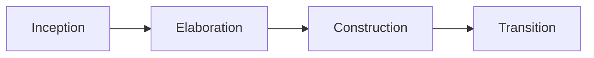

# Rational Unified Process (RUP)

## Overview

The Rational Unified Process is an iterative software development process framework created by **IBM/Rational Software**. RUP provides a structured approach with defined phases, disciplines, and best practices.

## Phases

1. **Inception** - Define project scope and business case
2. **Elaboration** - Analyze requirements and reduce risks
3. **Construction** - Build the product iteratively
4. **Transition** - Deploy to users

## Key Disciplines

- **Business Modeling** - Understand the organization
- **Requirements** - Capture what the system should do
- **Analysis & Design** - Architect the solution
- **Implementation** - Code and unit test
- **Test** - Verify correctness
- **Deployment** - Release to users
- **Configuration Management** - Manage changes
- **Project Management** - Plan and track
- **Environment** - Set up tools and processes

## When to Use

- Large, complex projects
- Projects requiring structured methodology
- Organizations with mature development processes
- Projects with regulatory requirements
- Teams transitioning to iterative development

## Pros

- Comprehensive and well-documented
- Scalable to different project sizes
- Emphasizes risk management
- Clear roles and responsibilities
- Strong focus on architecture

## Cons

- Complex and heavyweight
- Can be overwhelming for small projects
- Requires significant training
- May be too rigid for some projects
- Documentation-heavy

## Real-World Example

**IBM Software Products** - Many IBM software products were developed using RUP, leveraging its structured approach for complex enterprise applications.

## Interview Questions

1. What are the four phases of RUP?
2. How does RUP handle risk management?
3. What disciplines does RUP include?
4. When would you choose RUP over Agile methodologies?
5. How does RUP scale for different project sizes?

## References

- Philippe Kruchten (1999). "The Rational Unified Process: An Introduction"
- IBM Rational Software. "Rational Unified Process Best Practices"
- Walker Royce (1998). "Software Project Management: A Unified Framework"
