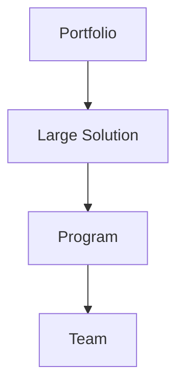

# Scaled Agile Framework (SAFe)

## Overview

The Scaled Agile Framework is a knowledge base for implementing agile practices at enterprise scale. Created by **Dean Leffingwell**, SAFe provides guidance for alignment, collaboration, and delivery in large organizations.

## Levels

1. **Team Level** - Scrum, Kanban, or XP for individual teams
2. **Program Level** - Agile Release Trains (ARTs) for value streams
3. **Large Solution Level** - Coordinating multiple ARTs
4. **Portfolio Level** - Strategic alignment and funding

## Key Concepts

- **Agile Release Train (ART)** - Long-lived team of teams
- **Program Increment (PI)** - Time-boxed planning interval
- **Vision** - Strategic direction
- **Roadmap** - Planned features and enablers
- **Lean Portfolio Management** - Strategic funding and governance

## When to Use

- Large enterprises with hundreds of developers
- Organizations transitioning to agile
- Programs requiring cross-team coordination
- When aligning strategy with execution
- Complex systems with multiple dependencies

## Pros

- Provides structure for scaling agile
- Aligns teams to business objectives
- Supports large, complex programs
- Enables portfolio-level visibility
- Facilitates continuous delivery

## Cons

- Can be overly bureaucratic
- Requires significant organizational change
- May be too heavyweight for small organizations
- Training and certification can be expensive
- Risk of becoming process-focused over value-focused

## Real-World Example

**Salesforce** - Salesforce uses SAFe to coordinate development across multiple product teams, aligning thousands of developers to deliver cohesive platform updates.

## Interview Questions

1. What are the four levels of SAFe?
2. What is an Agile Release Train (ART)?
3. How does SAFe handle cross-team dependencies?
4. What is a Program Increment (PI)?
5. When would you choose SAFe over other scaling frameworks?

## References

- Dean Leffingwell (2011). "Agile Software Requirements: Lean Requirements for Teams, Programs, and the Enterprise"
- Scaled Agile Inc. "SAFe 5.0 Distilled" (scaledagileframework.com)
- Dean Leffingwell (2014). "Agile Software Requirements: Lean Requirements for Teams, Programs, and the Enterprise"
