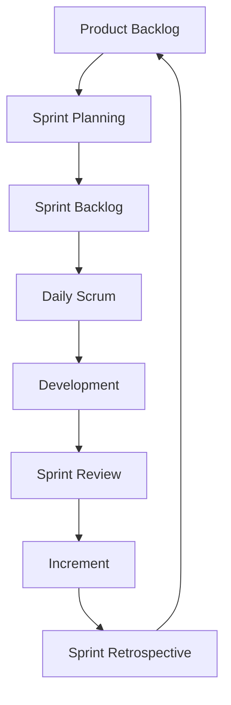

# Scrum Framework

## Overview

Scrum is an agile framework for managing complex software development projects. It uses fixed-length iterations called Sprints, defined roles, and ceremonies to enable teams to deliver value incrementally.

## Roles

- **Product Owner** - Maximizes product value, manages backlog
- **Scrum Master** - Ensures Scrum process is followed, removes impediments
- **Development Team** - Self-organizing, cross-functional team (3-9 members)

## Ceremonies

- **Sprint Planning** - Define what can be delivered in the Sprint
- **Daily Scrum** - 15-minute daily synchronization meeting
- **Sprint Review** - Demonstrate completed work to stakeholders
- **Sprint Retrospective** - Team reflects on process improvement

## Artifacts

- **Product Backlog** - Prioritized list of features and requirements
- **Sprint Backlog** - Items selected for the current Sprint
- **Increment** - The sum of all completed backlog items

## When to Use

- Projects with unclear or evolving requirements
- Teams that can commit to regular iterations
- Products requiring frequent customer feedback
- Organizations embracing self-organizing teams
- Projects needing rapid value delivery

## Pros

- Clear structure and cadence
- Regular inspection and adaptation
- High team collaboration and morale
- Transparent progress tracking
- Rapid response to change

## Cons

- Requires disciplined team adherence
- Scrum Master role may be misunderstood
- Can be challenging for distributed teams
- Scope creep if Product Owner is not decisive
- Not suitable for all project types

## Real-World Example

**Microsoft Azure DevOps** - Microsoft's Azure DevOps team uses Scrum to manage complex cloud infrastructure development, with multiple teams working in synchronized sprints.

## Interview Questions

1. What are the three roles in Scrum?
2. How does a Sprint differ from a project phase?
3. What happens during the Sprint Retrospective?
4. How do you handle scope changes during a Sprint?
5. What metrics do you track in Scrum?

## References

- Ken Schwaber and Jeff Sutherland. "The Scrum Guide" (scrumguides.org)
- Mike Cohn (2009). "Succeeding with Agile: Software Development Using Scrum"
- Schwaber, K. (2004). "Agile Project Management with Scrum"
