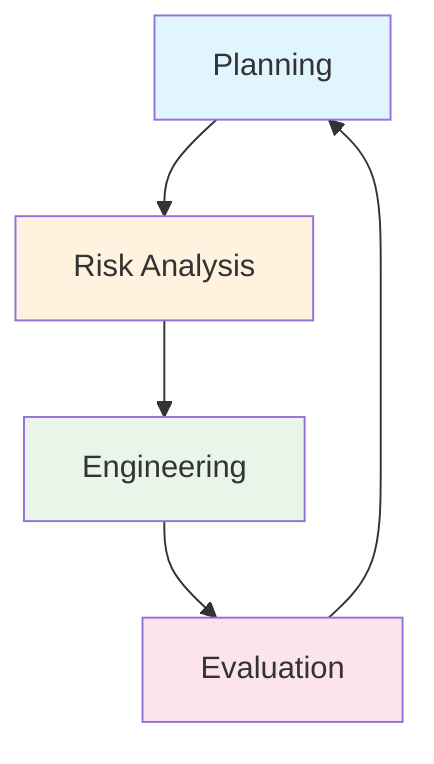

# Spiral Model

## Overview

The Spiral Model is a risk-driven software development methodology that combines iterative development with systematic risk analysis. Each iteration (spiral) progresses through planning, risk analysis, engineering, and evaluation phases.

## Phases (Per Spiral Cycle)

1. **Planning** - Define objectives, alternatives, and constraints
2. **Risk Analysis** - Identify and resolve risks
3. **Engineering** - Develop and verify the product
4. **Evaluation** - Customer review and plan next cycle

## Origins

Developed by **Barry Boehm** in 1986, the Spiral Model was one of the first to explicitly incorporate risk management into the software development lifecycle.

## When to Use

- Large, complex, and risky projects
- Requirements are unclear or evolving
- Safety-critical systems requiring risk management
- Projects where prototyping is beneficial
- Long-duration projects with significant investment

## Pros

- Early identification and mitigation of risks
- Customer involvement throughout development
- Supports prototyping and iterative refinement
- Flexible and adaptable to changing requirements
- Strong focus on risk management

## Cons

- Complex and difficult to manage
- Requires experienced risk analysis experts
- Can be expensive due to repeated risk assessments
- Not suitable for small, low-risk projects
- Documentation can become overwhelming

## Real-World Example

**Boeing 777 Development** - The development of the Boeing 777 used a spiral-like approach, with extensive prototyping and risk analysis for critical systems like flight controls and avionics.

## Interview Questions

1. What are the four phases of a Spiral cycle?
2. How does risk analysis drive decision-making in the Spiral Model?
3. When would you choose Spiral over Waterfall or Agile?
4. What are the challenges of implementing the Spiral Model?
5. How does Barry Boehm's Spiral Model differ from iterative development?

## References

- Barry Boehm (1986). "A Spiral Model of Software Development and Enhancement"
- Barry Boehm (2000). "Software Risk Management: Principles and Practices"
- IEEE Software, Vol. 8, No. 3
