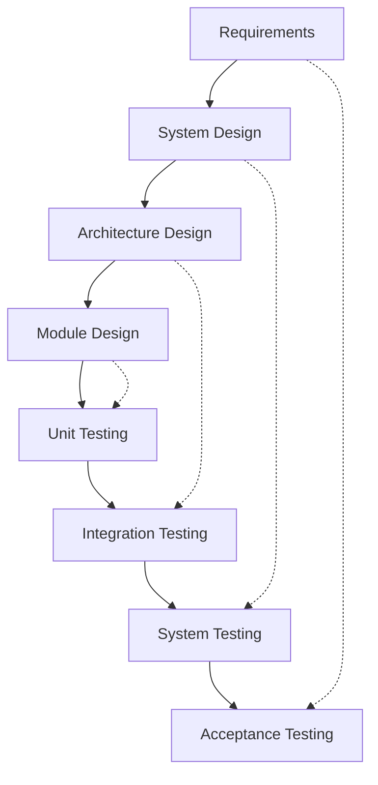

# V-Model (Verification and Validation)

## Overview

The V-Model extends Waterfall by pairing each development phase with a corresponding testing phase. It emphasizes verification (are we building the product right?) and validation (are we building the right product?) throughout the lifecycle.

## Phases

**Left Side (Verification):**
1. Requirements Analysis
2. System Design
3. Architecture Design
4. Module Design

**Right Side (Validation):**
5. Unit Testing
6. Integration Testing
7. System Testing
8. Acceptance Testing

## When to Use

- Safety-critical systems (medical devices, avionics)
- Highly regulated environments requiring traceability
- Projects where defects are extremely costly
- Systems requiring formal verification and validation
- Fixed requirements with minimal expected changes

## Pros

- Early test planning and design
- Clear traceability between requirements and tests
- Reduced cost of fixing defects
- Structured approach with defined deliverables
- Strong documentation for compliance

## Cons

- Inflexible to requirement changes
- Requires detailed upfront planning
- Testing begins late in the process
- Not suitable for projects with evolving requirements
- Can be overly bureaucratic for small projects

## Real-World Example

**Medical Device Software (FDA 21 CFR Part 11)** - Software for insulin pumps or MRI machines must follow V-Model to demonstrate that each requirement is verified and validated at appropriate stages.

## Interview Questions

1. How does V-Model differ from Waterfall?
2. Explain the relationship between verification and validation in V-Model.
3. What are the advantages of early test planning in V-Model?
4. When would V-Model be inappropriate for a project?
5. How do you ensure traceability in a V-Model project?

## References

- Kevin Forsberg, Harold Mooz, Howard Cotterman (1991). "Visualizing Project Management"
- IEEE Standard 12207 for Systems and Software Engineering
- ISO/IEC 12207 Software Life Cycle Processes
