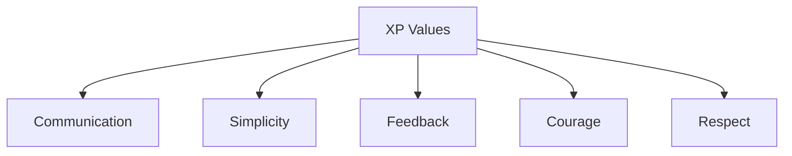

# Extreme Programming (XP)

## Overview

Extreme Programming is an agile methodology that emphasizes engineering excellence and technical practices. Created by **Kent Beck** in the late 1990s, XP focuses on producing high-quality software through specific engineering practices.

## Core Practices

1. **Pair Programming** - Two developers work on one computer
2. **Test-Driven Development (TDD)** - Write tests before code
3. **Continuous Integration** - Integrate and test frequently
4. **Refactoring** - Improve code structure without changing behavior
5. **Simple Design** - Build only what is needed
6. **Collective Code Ownership** - Everyone can modify any code
7. **Small Releases** - Frequent, incremental releases
8. **Sustainable Pace** - Maintain 40-hour work weeks
9. **On-Site Customer** - Customer available full-time
10. **Coding Standards** - Consistent style across team

## When to Use

- Projects requiring high code quality
- Teams with experienced developers
- Projects with rapidly changing requirements
- When customer can be actively involved
- Small, co-located teams

## Pros

- High code quality through TDD and pair programming
- Rapid feedback loops
- Reduced technical debt
- Knowledge sharing through pair programming
- Sustainable development pace

## Cons

- Requires skilled developers
- Intensive customer involvement may be difficult
- Pair programming can be exhausting
- Not suitable for all project types
- May be challenging for distributed teams

## Real-World Example

**ThoughtWorks** - ThoughtWorks, a global software consultancy, uses XP practices extensively, particularly pair programming and TDD, to deliver high-quality enterprise software.

## Interview Questions

1. What are the core practices of XP?
2. How does Test-Driven Development improve code quality?
3. What are the benefits and challenges of pair programming?
4. When would you choose XP over other agile methodologies?
5. How does XP emphasize simplicity in design?

## References

- Kent Beck (2000). "Extreme Programming Explained: Embrace Change"
- Robert C. Martin (2003). "Agile Software Development, Principles, Patterns, and Practices"
- Don Wells. "Extreme Programming: A Gentle Introduction"
