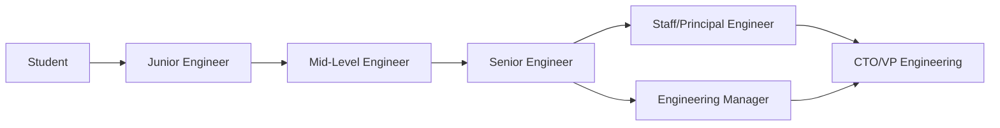

# Career Stage Guide

This academy serves engineers at every career stage — from first-year student to CTO. Find your stage and follow the path.

---

## Career Stages

---

## Stage 1: Student (Year 1-4)

**Goal:** Learn fundamentals, build projects, get first job.

**Start here:** [00-Fundamentals](../00-fundamentals/) → [01-Programming Languages](../01-programming-languages/) → [02-Computer Science](../02-computer-science/)

**Focus areas:**
| Priority | Module | Why |
|----------|--------|-----|
| 1 | Pick a language (Java/Python/Go/JS) | Core skill |
| 2 | Data Structures & Algorithms | Interview essential |
| 3 | One backend framework | Build things |
| 4 | One database | Store data |
| 5 | Git & basic DevOps | Ship code |
| 6 | Basic testing | Quality mindset |

**Skip for now:** Trade-offs, economics, architecture, SRE — you'll understand these after building things.

**Projects to build:**
- CLI tool ( calculator, todo app )
- REST API (blog, bookshelf)
- Full-stack app (simple e-commerce)
- Contribute to open source

---

## Stage 2: Junior Engineer (0-2 years)

**Goal:** Write production code, understand codebase, ship features.

**Start here:** [00-Fundamentals](../00-fundamentals/) → [03-Software Design](../03-software-design/) → [04-Backend Engineering](../04-backend-engineering/)

**Focus areas:**
| Priority | Module | Why |
|----------|--------|-----|
| 1 | SOLID principles | Write maintainable code |
| 2 | Design patterns | Solve common problems |
| 3 | Testing (unit, integration) | Ship with confidence |
| 4 | Database design | Store data correctly |
| 5 | Code review skills | Learn from others |
| 6 | Basic system design | Understand the big picture |

**Now understand:** DRY, KISS, YAGNI, clean code, basic architecture.

**Projects to build:**
- Microservice with database
- CI/CD pipeline
- Monitoring dashboard
- Auth system (JWT, OAuth)

---

## Stage 3: Mid-Level Engineer (2-5 years)

**Goal:** Own features, mentor juniors, make technical decisions.

**Start here:** [11-Architecture](../11-architecture/) → [10-Security](../10-security/) → [13-DevOps](../13-devops/)

**Focus areas:**
| Priority | Module | Why |
|----------|--------|-----|
| 1 | System design | Design systems end-to-end |
| 2 | Architecture patterns | Make structural decisions |
| 3 | Security fundamentals | Protect what you build |
| 4 | Production operations | Keep things running |
| 5 | Performance optimization | Make things fast |
| 6 | Technical debt management | Pay down debt |

**Now understand:** Trade-offs, economics, metrics, technical debt, ADR.

**Projects to build:**
- Design a URL shortener (system design)
- Implement circuit breaker pattern
- Set up monitoring & alerting
- Lead a migration project

---

## Stage 4: Senior Engineer (5-10 years)

**Goal:** Own systems, drive architecture, mentor team, influence direction.

**Start here:** All of [00-Fundamentals](../00-fundamentals/) deeply → [22-Engineering Excellence](../22-engineering-excellence/) → [23-Reference Implementations](../23-reference-implementations/)

**Focus areas:**
| Priority | Module | Why |
|----------|--------|-----|
| 1 | Advanced architecture | Design for scale |
| 2 | Distributed systems | Handle complexity |
| 3 | Engineering economics | Make business decisions |
| 4 | Team practices | Multiply team output |
| 5 | Legacy modernization | Evolve systems |
| 6 | Production playbooks | Learn from companies |

**Now understand:** Everything in fundamentals deeply — trade-offs, economics, metrics, reliability, decision-making.

**Projects to build:**
- Design a payment system
- Lead a monolith-to-microservices migration
- Build a platform engineering team
- Write architecture decision records

---

## Stage 5: Staff/Principal Engineer (10+ years)

**Goal:** Set technical direction, solve org-wide problems, influence beyond team.

**Focus areas:**
| Priority | Module | Why |
|----------|--------|-----|
| 1 | Enterprise architecture | Organization-wide design |
| 2 | Technology strategy | Pick the right technologies |
| 3 | Engineering culture | Build high-performing teams |
| 4 | Innovation | Push boundaries |
| 5 | Industry patterns | Learn from best companies |

**Reference:**
- [24-Case Studies](../24-case-studies/) — How Netflix, Uber, Amazon do it
- [25-Playbooks](../25-engineering-playbooks/) — Company-specific approaches
- [22-Excellence](../22-engineering-excellence/) — Engineering culture

---

## Stage 6: Engineering Manager / Director

**Goal:** Build teams, manage delivery, balance technical and people.

**Focus areas:**
| Priority | Module | Why |
|----------|--------|-----|
| 1 | Agile/Scrum/Kanban | Run effective processes |
| 2 | Engineering metrics | Measure what matters |
| 3 | Technical debt management | Balance speed and quality |
| 4 | Hiring & mentoring | Build the team |
| 5 | Stakeholder communication | Bridge business and tech |

**Reference:**
- [22-Excellence](../22-engineering-excellence/) — Methodologies, quality, culture
- [28-Career](../28-career-roadmap/) — Growth paths
- [00-Fundamentals/economics](../00-fundamentals/economics/) — Cost decisions

---

## Stage 7: CTO / VP Engineering

**Goal:** Technical vision, business alignment, organizational leadership.

**Focus areas:**
| Priority | Module | Why |
|----------|--------|-----|
| 1 | Technology strategy | Long-term technical vision |
| 2 | Build vs buy decisions | Economic optimization |
| 3 | Vendor evaluation | Choose the right tools |
| 4 | Compliance & security | Risk management |
| 5 | Innovation pipeline | Stay ahead |

**Reference:**
- [00-Fundamentals/economics](../00-fundamentals/economics/) — TCO, ROI, cost of delay
- [24-Case Studies](../24-case-studies/) — How companies scale
- [30-Certifications](../30-certifications/) — Team capabilities
- [14-Cloud](../14-cloud/) — Platform strategy

---

## Quick Reference by Stage

| Stage | Years | Start Module | Focus | Skip |
|-------|-------|--------------|-------|------|
| Student | 0-4 | 01-Language | Language + CS basics | Architecture, Economics |
| Junior | 0-2 | 03-Design | Code quality + patterns | System design, SRE |
| Mid-Level | 2-5 | 11-Architecture | System design + security | Enterprise architecture |
| Senior | 5-10 | 22-Excellence | Architecture + leadership | — |
| Staff | 10+ | 24-Cases | Strategy + culture | — |
| Manager | — | 22-Excellence | Process + metrics | Deep technical |
| CTO | — | Economics | Strategy + vision | Implementation details |

---

## How Each Stage Uses Fundamentals

| Topic | Student | Junior | Mid | Senior | Staff | CTO |
|-------|---------|--------|-----|--------|-------|-----|
| Principles (SOLID) | Learn | Apply | Teach | Refine | Standardize | — |
| Trade-offs | — | — | Understand | Make | Guide | Decide |
| Economics | — | — | — | Understand | Apply | Lead |
| Metrics | — | — | — | Use | Improve | Set direction |
| Decision-making | — | — | — | ADR | RFC | Strategy |
| Reliability | — | — | — | SRE basics | Chaos eng | SLO strategy |
