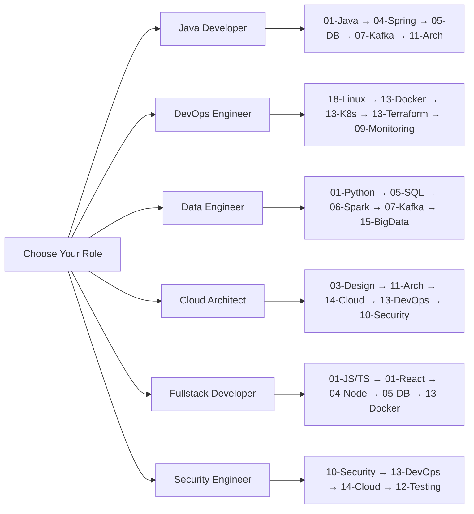

# Guide — How to Use This Academy

## Welcome

This is not a tutorial site. This is a **complete software engineering knowledge base** — designed to take you from beginner to senior engineer, covering every technology, every concept, every interview question.

---

## The Philosophy

Every technology follows this flow:

```
Problem → Concept → Architecture → Technology → Implementation → Production → Operations → Modernization → Interview → Playbook
```

If any section is missing, the topic is incomplete.

---

## Navigation

### By Module Number

| # | Module | What's Inside |
|---|--------|---------------|
| 00 | Fundamentals | Principles, trade-offs, metrics, glossary |
| 01 | Languages | Java, Python, Go, JS, TS, C#, Kotlin, Rust, Scala, PHP |
| 02 | Computer Science | Algorithms, data structures, OS, networks |
| 03 | Software Design | Design patterns, SOLID, architecture styles |
| 04 | Backend | Spring, .NET, Django, Flask, Node.js, Laravel |
| 05 | Data Platforms | PostgreSQL, MySQL, MongoDB, Redis, Cassandra |
| 06 | Data Engineering | Spark, Flink, Airflow, Kafka Streams |
| 07 | Messaging | Kafka, RabbitMQ, Pulsar, GraphQL |
| 08 | Integration | EIP, MuleSoft, Apache Camel |
| 09 | Observability | Prometheus, Grafana, ELK, Jaeger |
| 10 | Security | OWASP, IAM, cryptography, compliance |
| 11 | Architecture | System design, DDD, ADR, C4 |
| 12 | Testing | Unit, integration, E2E, TDD, BDD |
| 13 | DevOps | Docker, Kubernetes, Terraform, Ansible |
| 14 | Cloud | AWS, Azure, GCP |
| 15 | Big Data | Hadoop, Spark, Flink, Beam |
| 16 | ML/AI | Machine Learning, LLM, Prompt Engineering |
| 17 | App Servers | Tomcat, Jetty, WebLogic, NGINX |
| 18 | Operating Systems | Linux, Windows, macOS, Unix |
| 19 | Legacy | EJB, JSP, Struts, SOAP, COBOL |
| 20 | Search | Elasticsearch, Solr, Lucene |
| 21 | Enterprise Tools | Jira, Splunk, Datadog, Vault |
| 22 | Excellence | Agile, refactoring, quality, DevEx |
| 23 | Reference Impls | Banking, E-commerce, Chat |
| 24 | Case Studies | Netflix, Uber, Amazon, Google |
| 25 | Playbooks | Company cases + modernization |
| 26 | Interview | Coding, system design, behavioral |
| 27 | Learning Paths | Structured paths for each role |
| 28 | Career | Junior → Mid → Senior → Architect |
| 29 | Open Source | Contributing, first PR |
| 30 | Certifications | AWS, Azure, GCP, K8s, HashiCorp |

### By Role



### By Technology

Each technology folder contains:
- **README.md** — Overview, when to use, decision tree
- **history.md** — Origin, founders, motivation
- **versions.md** — Version-by-version changes
- **architecture.md** — System architecture with Mermaid diagrams
- **core-concepts.md** — Fundamental building blocks
- **internals.md** — How it works under the hood
- **patterns.md** — Technology-specific patterns
- **anti-patterns.md** — Bad practices, common mistakes
- **misconceptions.md** — Myths vs reality
- **confused-topics.md** — "This is NOT that"
- **interview.md** — Questions, answers, scenarios

---

## Learning Approach

### 1. Don't Skip Fundamentals
Start with [00-Fundamentals](00-fundamentals/) even if you think you know it. The trade-offs and decision-making sections will change how you think about technology.

### 2. Learn by Doing
Every technology has hands-on labs. Don't just read — code along.

### 3. Understand the "Why"
Every technology answers:
- **Why?** — What problem does this solve?
- **How?** — How does it work internally?
- **When?** — When should you use it? When NOT?
- **Where?** — Where is it used in production?
- **What if?** — What if it fails?

### 4. Compare Before Choosing
Every technology has comparison files:
- `comparison.md` — vs competitors
- `decision-tree.md` — When to use, when NOT
- `confused-topics.md` — Common confusions

### 5. Prepare for Interviews
Every technology has:
- `interview.md` — 15-30 questions with answers
- `corner-cases.md` — Edge cases and failure scenarios
- `production-playbook.md` — How companies use it

---

## Prerequisites

Every README starts with:
- **Prerequisites** — What you need to know first
- **Related** — What connects to this topic
- **Next** — What to learn after

Follow the learning dependency graph in the root README.

---

## Quality Standards

Every topic must answer:
1. **Why?** — Motivation, origin
2. **How?** — Implementation, internals
3. **When?** — Use cases, decision trees
4. **Where?** — Production examples
5. **What if?** — Failure scenarios, corner cases
6. **Why not?** — Alternatives, trade-offs

---

## Getting Help

- Start with the root [README.md](README.md)
- Check [27-Learning Paths](27-learning-paths/) for structured paths
- Check [26-Interview Prep](26-interview-preparation/) for job preparation
- Check [30-Certifications](30-certifications/) for certification guides
