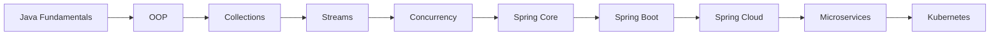
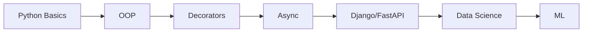
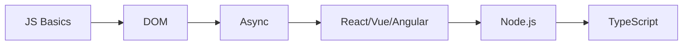
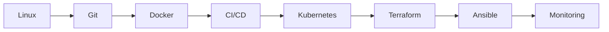
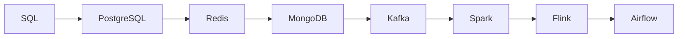
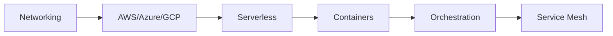
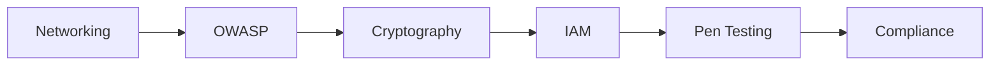
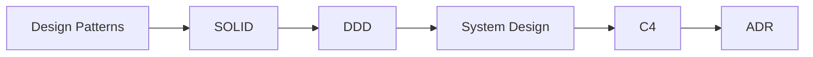
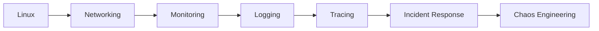
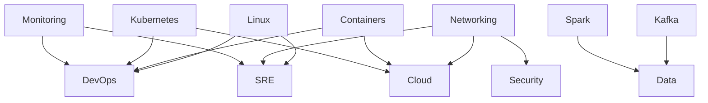

# Learning Dependency Graph

## Overview

This document maps all major learning paths with their prerequisites and dependencies. Each path represents a progressive skill journey where foundational knowledge is required before advancing to complex topics.

## 1. Java Path

## 2. Python Path

## 3. Go Path

## 4. JavaScript Path

## 5. DevOps Path

## 6. Data Path

## 7. Cloud Path

## 8. Security Path

## 9. Architecture Path

## 10. SRE Path

## Cross-Path Dependencies

