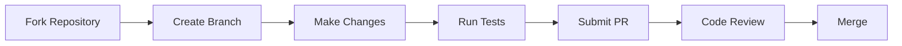

# Java Engineering Academy

<p align="center">
  
</p>

<p align="center">
  <a href="https://github.com/javaengineeringacademy/java-engineering-academy/actions/workflows/ci.yml">
    
  </a>
  <a href="https://github.com/javaengineeringacademy/java-engineering-academy/actions/workflows/build.yml">
    
  </a>
  <a href="https://github.com/javaengineeringacademy/java-engineering-academy/actions/workflows/test.yml">
    
  </a>
  <a href="https://github.com/javaengineeringacademy/java-engineering-academy/actions/workflows/codeql.yml">
    
  </a>
  
  
  
</p>

**The world's best open-source Java Engineering curriculum.**

Production-grade. Interview-focused. Community-driven. Built the way senior engineers learn inside enterprise software companies.

---

## Who Is This Repository For?

| Audience | How This Helps |
|----------|---------------|
| **Beginners** | Start from zero, build strong fundamentals with progressive difficulty |
| **Intermediate developers** | Fill gaps, learn enterprise patterns, prepare for senior roles |
| **Senior engineers** | Refresh knowledge, learn modern Java 21 features, ace interviews |
| **Career changers** | Structured path from fundamentals to job-ready in 6 months |
| **Bootcamp graduates** | Deepen understanding beyond surface-level tutorials |
| **Self-taught developers** | Fill knowledge gaps with enterprise-grade explanations |
| **Interview candidates** | 500+ interview questions organized by topic and difficulty |
| **Technical leads** | Reference architecture patterns and design principles |
| **Open source contributors** | Well-structured project with clear contribution guidelines |

---

## Quick Start

### Prerequisites

- JDK 21 (or later)
- Maven 3.8.6+ (or use the included Maven wrapper)
- Git

### Get Up and Running

```bash
# Clone the repository
git clone https://github.com/javaengineeringacademy/java-engineering-academy.git
cd java-engineering-academy

# Build and verify everything compiles
mvn clean verify

# Run a specific module
mvn clean compile -pl modules/01-java-fundamentals

# Run tests for a module
mvn test -pl modules/02-object-oriented-programming
```

### Recommended First Steps

1. Start with [Module 01: Java Fundamentals](modules/01-java-fundamentals/)
2. Complete all exercises before moving to the next topic
3. Build the mini-projects at the end of each module
4. Review interview questions for each topic
5. Move to the next module

---

## Current Implementation Status

### Core Java (Modules 00-27)
| Module | Status | Topics | Java Files | Tests |
|--------|--------|--------|------------|-------|
| [00 — Learning Roadmaps](modules/00-learning-roadmaps/) | ✅ Complete | 1 | 0 | 0 |
| [01 — Java Fundamentals](modules/01-java-fundamentals/) | ✅ Complete | 7 | 37 | — |
| [02 — Object-Oriented Programming](oop-fundamentals/) | ✅ Complete | 35 | 240+ | 25+ |
| [03 — Exception Handling](modules/03-exception-handling/) | ✅ Complete | 10 | 7 | 3 |
| [04 — Collections Framework](modules/04-collections-framework/) | ✅ Complete | 28 | 13 | 6 |
| [05 — Generics](modules/05-generics/) | ✅ Complete | 10 | 7 | 3 |
| [06 — Strings](modules/06-strings/) | ✅ Complete | 1 | 1 | 1 |
| [07 — Functional Programming](modules/07-functional-programming/) | ✅ Complete | 13 | 11 | 5 |
| [08 — Multithreading](modules/08-multithreading/) | ✅ Complete | 14 | 8 | 4 |
| [09 — Stream API](modules/09-stream-api/) | ✅ Complete | 1 | 1 | 1 |
| [10 — Design Patterns](modules/10-design-patterns/) | ✅ Complete | 14 | 11 | 11 |
| [11 — Testing](modules/11-testing/) | ✅ Complete | 14 | 8 | 6 |
| [12 — Memory Management](modules/12-memory-management/) | ✅ Complete | 1 | 1 | 1 |
| [13 — JDBC/Database](modules/13-jdbc-database/) | ✅ Complete | 14 | 7 | 6 |
| [14 — Spring Framework](modules/14-spring-framework/) | ✅ Complete | 14 | 8 | 8 |
| [15 — Spring Boot](modules/15-spring-boot/) | ✅ Complete | 12 | 8 | 8 |
| [16 — Spring Security](modules/16-spring-security/) | ✅ Complete | 5 | 4 | 4 |
| [17 — REST API](modules/17-rest-api/) | ✅ Complete | 7 | 5 | 4 |
| [18 — Microservices](modules/18-microservices/) | ✅ Complete | 7 | 4 | 4 |
| [19 — Apache Kafka](modules/19-apache-kafka/) | ✅ Complete | 6 | 5 | 4 |
| [20 — Redis](modules/20-redis/) | ✅ Complete | 6 | 5 | 5 |
| [21 — Docker](modules/21-docker/) | ✅ Complete | 6 | 4 | 3 |
| [22 — Kubernetes](modules/22-kubernetes/) | ✅ Complete | 6 | 4 | 4 |
| [23 — AWS](modules/23-aws/) | ✅ Complete | 7 | 6 | 6 |
| [24 — System Design](modules/24-system-design/) | ✅ Complete | 8 | 6 | 6 |
| [25 — Enterprise Projects](modules/25-enterprise-projects/) | ✅ Complete | 6 | 5 | 5 |
| [26 — Interview Preparation](modules/26-interview-preparation/) | ✅ Complete | 8 | 5 | 5 |
| [27 — Logging](modules/27-logging/) | ✅ Complete | 1 | 1 | 1 |

### Enterprise & Cloud (Modules 28-47)
| Module | Status | Topics | Java Files | Tests |
|--------|--------|--------|------------|-------|
| [28 — Java I/O and NIO](modules/28-java-io-and-nio/) | ✅ Complete | 14 | 21 | 0 |
| [29 — Date/Time API](modules/29-date-time-api/) | ✅ Complete | 1 | 1 | 1 |
| [30 — SOLID Principles](modules/30-solid-principles/) | ✅ Complete | 1 | 1 | 1 |
| [31 — Clean Code](modules/31-clean-code/) | 🔄 In Progress | 1 | 0 | 0 |
| [32 — JVM Internals](modules/32-jvm-internals/) | ✅ Complete | 12 | 8 | 4 |
| [33 — Spring Core](modules/33-spring-core/) | 🔄 In Progress | 1 | 0 | 0 |
| [34 — Build Tools](modules/34-build-tools/) | ✅ Complete | 12 | 4 | 4 |
| [35 — Spring Data JPA](modules/35-spring-data-jpa/) | 🔄 In Progress | 1 | 0 | 0 |
| [36 — Hibernate](modules/36-hibernate/) | 🔄 In Progress | 1 | 0 | 0 |
| [37 — Garbage Collection](modules/37-garbage-collection/) | ✅ Complete | 1 | 1 | 1 |
| [38 — Reflection](modules/38-reflection/) | ✅ Complete | 1 | 1 | 1 |
| [39 — GraphQL](modules/39-graphql/) | ✅ Complete | 1 | 1 | 1 |
| [40 — Annotations](modules/40-annotations/) | ✅ Complete | 1 | 1 | 1 |
| [41 — RabbitMQ](modules/41-rabbitmq/) | ✅ Complete | 1 | 1 | 1 |
| [42 — Redpanda](modules/42-redpanda/) | 🔄 In Progress | 1 | 0 | 0 |
| [43 — Serialization](modules/43-serialization/) | ✅ Complete | 1 | 1 | 1 |
| [44 — Elasticsearch](modules/44-elasticsearch/) | 🔄 In Progress | 1 | 0 | 0 |
| [45 — Object Copying](modules/45-object-copying/) | ✅ Complete | 1 | 1 | 1 |
| [46 — File I/O](modules/46-file-io/) | ✅ Complete | 1 | 1 | 1 |
| [47 — NIO](modules/47-nio/) | ✅ Complete | 1 | 1 | 1 |

### DevOps & Tools (Modules 48-74)
| Module | Status | Topics | Java Files | Tests |
|--------|--------|--------|------------|-------|
| [48 — Linux](modules/48-linux/) | 🔄 In Progress | 1 | 0 | 0 |
| [49 — Git](modules/49-git/) | 🔄 In Progress | 1 | 0 | 0 |
| [50 — DevOps](modules/50-devops/) | 🔄 In Progress | 1 | 0 | 0 |
| [51 — Performance Engineering](modules/51-performance-engineering/) | 🔄 In Progress | 1 | 0 | 0 |
| [52 — Debugging](modules/52-debugging/) | 🔄 In Progress | 1 | 0 | 0 |
| [53 — Java Interview](modules/53-java-interview/) | ✅ Complete | 1 | 1 | 1 |
| [54 — Company Interviews](modules/54-company-interviews/) | ✅ Complete | 1 | 1 | 1 |
| [55 — Projects](modules/55-projects/) | 🔄 In Progress | 1 | 0 | 0 |
| [56 — Case Studies](modules/56-case-studies/) | 🔄 In Progress | 1 | 0 | 0 |
| [57 — Cheat Sheets](modules/57-cheat-sheets/) | 🔄 In Progress | 1 | 0 | 0 |
| [58 — Best Practices](modules/58-best-practices/) | 🔄 In Progress | 1 | 0 | 0 |
| [59 — Migration Guides](modules/59-migration-guides/) | 🔄 In Progress | 1 | 0 | 0 |
| [60 — YAML](modules/60-yaml/) | 🔄 In Progress | 1 | 0 | 0 |
| [61 — Properties](modules/61-properties/) | 🔄 In Progress | 1 | 0 | 0 |
| [62 — Networking](modules/62-networking/) | ✅ Complete | 1 | 1 | 1 |
| [63 — CI/CD](modules/63-ci-cd/) | 🔄 In Progress | 1 | 0 | 0 |
| [64 — OpenAPI/Swagger](modules/64-openapi-swagger/) | 🔄 In Progress | 1 | 0 | 0 |
| [65 — SQL](modules/65-sql/) | ✅ Complete | 1 | 1 | 1 |
| [66 — Cloud Design](modules/66-cloud-design/) | 🔄 In Progress | 1 | 0 | 0 |
| [67 — Observability](modules/67-observability/) | 🔄 In Progress | 1 | 0 | 0 |
| [68 — Security](modules/68-security/) | 🔄 In Progress | 1 | 0 | 0 |
| [69 — Reactive Programming](modules/69-reactive-programming/) | 🔄 In Progress | 1 | 0 | 0 |
| [70 — Java Version History](modules/70-java-version-history/) | 🔄 In Progress | 1 | 0 | 0 |
| [71 — Certification Guide](modules/71-certification-guide/) | 🔄 In Progress | 1 | 0 | 0 |
| [72 — Reference Material](modules/72-reference-material/) | 🔄 In Progress | 1 | 0 | 0 |
| [73 — XML](modules/73-xml/) | ✅ Complete | 1 | 1 | 1 |
| [74 — JSON](modules/74-json/) | ✅ Complete | 1 | 1 | 1 |

---

## Curriculum Overview

### Learning Philosophy

> "Teach Java exactly the way senior engineers learn inside enterprise software companies."

- **Why before How**: Understand the problem before the solution
- **Production-grade**: Every example compiles, runs, and passes quality gates
- **Progressive difficulty**: Easy → Medium → Hard → Enterprise
- **Interview-focused**: Every topic includes questions by difficulty level
- **Project-based**: Learn by building real applications
- **Community-driven**: Contributions welcome with clear guidelines

### Learning Methodology

```
Read Theory → Run Examples → Solve Exercises → Build Projects → Ace Interviews
```

Each topic follows this exact structure:

```
topic-name/
├── README.md              # The lesson
├── theory/                # Deep explanation
├── diagrams/              # Visual learning
├── examples/
│   ├── easy/              # Syntax & basics
│   ├── medium/            # Combined concepts
│   └── hard/              # Production-level
├── exercises/
│   ├── easy/
│   ├── medium/
│   └── hard/
├── assignments/           # Graded work
├── quiz/                  # Knowledge check
├── interview/             # Interview questions
├── pitfalls/              # Common mistakes
├── best-practices/        # Industry standards
├── real-world/            # Framework usage
├── references/            # External resources
└── solutions/             # Answer key
```

---

## Module Navigation

### Foundations (Modules 01-07)

| # | Module | Topics | Focus |
|---|--------|--------|-------|
| 01 | [Java Fundamentals](modules/01-java-fundamentals/) | 7 | Variables, types, control flow, methods, arrays, strings |
| 02 | [Object-Oriented Programming](modules/02-object-oriented-programming/) | 35 | Classes, inheritance, polymorphism, SOLID, design principles |
| 03 | [Exception Handling](modules/03-exception-handling/) | 9 | Try-catch, custom exceptions, best practices |
| 04 | [Collections Framework](modules/04-collections-framework/) | 22 | Lists, maps, sets, queues, algorithms |
| 05 | [Generics](modules/05-generics/) | 9 | Type parameters, bounds, wildcards |
| 06 | [Strings](modules/06-strings/) | 1 | String immutability, pooling, StringBuilder, patterns |
| 07 | [Functional Programming](modules/07-functional-programming/) | 13 | Lambdas, streams, optional, functional interfaces |

### Core Java (Modules 08-13)

| # | Module | Topics | Focus |
|---|--------|--------|-------|
| 08 | [Multithreading](modules/08-multithreading/) | 14 | Threads, executors, virtual threads, synchronization |
| 09 | [Stream API](modules/09-stream-api/) | 1 | Stream operations, collectors, parallel streams |
| 10 | [Design Patterns](modules/10-design-patterns/) | 14 | Creational, structural, behavioral patterns |
| 11 | [Testing](modules/11-testing/) | 14 | JUnit 5, Mockito, AssertJ, test design |
| 12 | [Memory Management](modules/12-memory-management/) | 1 | Heap, stack, garbage collection basics |
| 13 | [JDBC & Database](modules/13-jdbc-database/) | 14 | Connections, transactions, connection pooling |

### Enterprise (Modules 14-19)

| # | Module | Topics | Focus |
|---|--------|--------|-------|
| 14 | [Spring Framework](modules/14-spring-framework/) | 14 | IoC, DI, AOP, data access |
| 15 | [Spring Boot](modules/15-spring-boot/) | 12 | Auto-configuration, starters, actuator |
| 16 | [Spring Security](modules/16-spring-security/) | 5 | Authentication, authorization, OAuth2 |
| 17 | [REST API](modules/17-rest-api/) | 7 | Controllers, validation, error handling |
| 18 | [Microservices](modules/18-microservices/) | 7 | Service discovery, API gateway, circuit breaker |
| 19 | [Apache Kafka](modules/19-apache-kafka/) | 6 | Producers, consumers, streams |

### Infrastructure (Modules 20-27)

| # | Module | Topics | Focus |
|---|--------|--------|-------|
| 20 | [Redis](modules/20-redis/) | 6 | Caching, pub/sub, data structures |
| 21 | [Docker](modules/21-docker/) | 6 | Containers, images, compose |
| 22 | [Kubernetes](modules/22-kubernetes/) | 6 | Pods, services, deployments |
| 23 | [AWS](modules/23-aws/) | 7 | EC2, S3, RDS, Lambda |
| 24 | [System Design](modules/24-system-design/) | 8 | Scalability, resilience, architecture |
| 25 | [Enterprise Projects](modules/25-enterprise-projects/) | 6 | End-to-end applications |
| 26 | [Interview Preparation](modules/26-interview-preparation/) | 8 | Coding, design, behavioral |
| 27 | [Logging](modules/27-logging/) | 1 | Log4j, SLF4J, logging patterns |

### Advanced Topics (Modules 28-47)

| # | Module | Topics | Focus |
|---|--------|--------|-------|
| 28 | [Java I/O and NIO](modules/28-java-io-and-nio/) | 14 | Streams, channels, buffers, file operations |
| 29 | [Date/Time API](modules/29-date-time-api/) | 1 | LocalDate, LocalDateTime, ZoneId, formatting |
| 30 | [SOLID Principles](modules/30-solid-principles/) | 1 | Single responsibility, open-closed, Liskov substitution |
| 31 | [Clean Code](modules/31-clean-code/) | 1 | Naming, functions, comments, formatting |
| 32 | [JVM Internals](modules/32-jvm-internals/) | 12 | Memory model, garbage collection, class loaders |
| 33 | [Spring Core](modules/33-spring-core/) | 1 | Bean lifecycle, profiles, validation |
| 34 | [Build Tools](modules/34-build-tools/) | 12 | Maven, Gradle, dependency management |
| 35 | [Spring Data JPA](modules/35-spring-data-jpa/) | 1 | Repositories, queries, auditing |
| 36 | [Hibernate](modules/36-hibernate/) | 1 | ORM, mappings, caching, queries |
| 37 | [Garbage Collection](modules/37-garbage-collection/) | 1 | GC algorithms, tuning, monitoring |
| 38 | [Reflection](modules/38-reflection/) | 1 | Dynamic proxies, introspection, annotations |
| 39 | [GraphQL](modules/39-graphql/) | 1 | Schema, resolvers, subscriptions |
| 40 | [Annotations](modules/40-annotations/) | 1 | Meta-annotations, custom annotations, processing |
| 41 | [RabbitMQ](modules/41-rabbitmq/) | 1 | Message broker, exchanges, queues |
| 42 | [Redpanda](modules/42-redpanda/) | 1 | Kafka-compatible streaming platform |
| 43 | [Serialization](modules/43-serialization/) | 1 | Java serialization, JSON, Protocol Buffers |
| 44 | [Elasticsearch](modules/44-elasticsearch/) | 1 | Search engine, indexing, queries |
| 45 | [Object Copying](modules/45-object-copying/) | 1 | Clone, copy constructors, serialization |
| 46 | [File I/O](modules/46-file-io/) | 1 | NIO.2, Files API, Path operations |
| 47 | [NIO](modules/47-nio/) | 1 | Non-blocking I/O, selectors, channels |

### DevOps & Tools (Modules 48-74)

| # | Module | Topics | Focus |
|---|--------|--------|-------|
| 48 | [Linux](modules/48-linux/) | 1 | Commands, shell scripting, system admin |
| 49 | [Git](modules/49-git/) | 1 | Version control, branching, workflows |
| 50 | [DevOps](modules/50-devops/) | 1 | CI/CD, automation, infrastructure |
| 51 | [Performance Engineering](modules/51-performance-engineering/) | 1 | Profiling, optimization, monitoring |
| 52 | [Debugging](modules/52-debugging/) | 1 | Debuggers, logging, troubleshooting |
| 53 | [Java Interview](modules/53-java-interview/) | 1 | Common questions, coding challenges |
| 54 | [Company Interviews](modules/54-company-interviews/) | 1 | Company-specific questions, patterns |
| 55 | [Projects](modules/55-projects/) | 1 | Portfolio projects, real-world apps |
| 56 | [Case Studies](modules/56-case-studies/) | 1 | Architecture decisions, trade-offs |
| 57 | [Cheat Sheets](modules/57-cheat-sheets/) | 1 | Quick reference guides |
| 58 | [Best Practices](modules/58-best-practices/) | 1 | Code conventions, patterns |
| 59 | [Migration Guides](modules/59-migration-guides/) | 1 | Java version upgrades, framework migrations |
| 60 | [YAML](modules/60-yaml/) | 1 | Configuration, Kubernetes manifests |
| 61 | [Properties](modules/61-properties/) | 1 | Application config, profiles |
| 62 | [Networking](modules/62-networking/) | 1 | TCP/IP, HTTP, sockets |
| 63 | [CI/CD](modules/63-ci-cd/) | 1 | Jenkins, GitHub Actions, pipelines |
| 64 | [OpenAPI/Swagger](modules/64-openapi-swagger/) | 1 | API documentation, specs |
| 65 | [SQL](modules/65-sql/) | 1 | Queries, joins, optimization |
| 66 | [Cloud Design](modules/66-cloud-design/) | 1 | Cloud patterns, 12-factor apps |
| 67 | [Observability](modules/67-observability/) | 1 | Metrics, tracing, logging |
| 68 | [Security](modules/68-security/) | 1 | OWASP, encryption, authentication |
| 69 | [Reactive Programming](modules/69-reactive-programming/) | 1 | Reactor, RxJava, backpressure |
| 70 | [Java Version History](modules/70-java-version-history/) | 1 | Features from Java 8 to 21 |
| 71 | [Certification Guide](modules/71-certification-guide/) | 1 | OCA, OCP, preparation |
| 72 | [Reference Material](modules/72-reference-material/) | 1 | Books, courses, websites |
| 73 | [XML](modules/73-xml/) | 1 | Parsing, transformation, validation |
| 74 | [JSON](modules/74-json/) | 1 | Processing, Jackson, Gson |

---

## Mini Projects

The curriculum includes 14 progressive mini-projects to solidify your learning:

| # | Project | Module | Difficulty | Concepts Covered |
|---|---------|--------|------------|------------------|
| 1 | Calculator | 01 — Java Fundamentals | Easy | Variables, operators, control flow |
| 2 | Number guessing game | 01 — Java Fundamentals | Easy | Loops, random, user input |
| 3 | Student grade tracker | 01 — Java Fundamentals | Medium | Arrays, methods, formatting |
| 4 | Contact book | 01 — Java Fundamentals | Medium | Strings, arrays, menu-driven |
| 5 | ATM simulator | 02 — OOP | Easy | Classes, objects, encapsulation |
| 6 | Library system | 02 — OOP | Medium | Inheritance, polymorphism |
| 7 | Bank management system | 02 — OOP | Hard | All OOP principles |
| 8 | Shape hierarchy | 02 — OOP | Medium | Abstract classes, interfaces |
| 9 | Custom exception framework | 03 — Exception Handling | Medium | Exception hierarchy, chaining |
| 10 | File processor with error recovery | 03 — Exception Handling | Hard | Try-catch, resources, logging |
| 11 | Sort algorithm visualizer | 04 — Collections | Medium | Comparable, Comparator, sorting |
| 12 | Custom collection library | 04 — Collections | Hard | Generics, iterators, builders |
| 13 | Type-safe data store | 05 — Generics | Medium | Generic classes, bounds, wildcards |
| 14 | Expression parser | 05 — Generics | Hard | Type erasure, generic algorithms |

---

## Diagrams & Visual Learning

Every module includes Mermaid diagrams for visual learners:

- **Class diagrams** — UML-style inheritance and composition trees
- **Sequence diagrams** — Object interaction flows
- **Memory diagrams** — Stack vs. heap visualization
- **Architecture diagrams** — Module dependency graphs
- **Flowcharts** — Decision-making and algorithm walkthroughs

Example topics with diagrams:

- [OOP Concepts Overview](modules/02-object-oriented-programming/diagrams/oop-concepts.md)
- [Class Hierarchy](modules/02-object-oriented-programming/diagrams/class-hierarchy.md)
- [System Design Patterns](modules/24-system-design/diagrams/)

---

## Learning Paths

Choose the path that matches your experience level:

### Beginner Path (0-6 months experience)

```
Duration: 14 weeks (part-time) | 4 weeks (full-time)

Week 1-2:  Module 01 — Java Fundamentals
Week 3-6:  Module 02 — Object-Oriented Programming (35 topics)
Week 7-8:  Module 03 — Exception Handling
Week 9-10: Module 04 — Collections Framework
Week 11:   Module 05 — Generics
Week 12:   Module 11 — Testing (JUnit & Mockito)
Week 13-14: Mini Projects + Review
```

### Intermediate Path (6-18 months experience)

```
Duration: 16 weeks (part-time) | 6 weeks (full-time)

Week 1-2:   Module 02 — OOP Review (focus on SOLID, design principles)
Week 3-4:   Module 07 — Functional Programming & Streams
Week 5-7:   Module 08 — Multithreading & Concurrency
Week 8-10:  Module 10 — Design Patterns
Week 11-12: Module 13 — JDBC & Database
Week 13-16: Module 14 — Spring Framework
```

### Advanced Path (18+ months experience)

```
Duration: 20 weeks (part-time) | 8 weeks (full-time)

Week 1-3:   Module 08 — Multithreading (deep dive)
Week 4-5:   Module 09 — JVM Internals
Week 6-8:   Module 10 — Design Patterns
Week 9-10:  Module 16 — Spring Security
Week 11-13: Module 18 — Microservices
Week 14-16: Module 24 — System Design
Week 17-20: Module 25 — Enterprise Projects
```

### Enterprise Learning Path (Targeting Senior/Lead Roles)

```
Week 1-4:   Java Fundamentals + OOP
Week 5-8:   Collections + Generics + Exception Handling
Week 9-12:  Functional Programming + Streams
Week 13-16: Multithreading + JVM Internals
Week 17-20: Design Patterns + Testing
Week 21-24: JDBC + Spring Framework
Week 25-28: Spring Boot + REST APIs
Week 29-32: Spring Security + Microservices
Week 33-36: Docker + Kubernetes
Week 37-40: AWS + System Design
Week 41-44: Enterprise Projects
Week 45-48: Interview Preparation
```

---

## Repository Architecture

```
java-engineering-academy/
├── .github/
│   ├── ISSUE_TEMPLATE/        Bug reports, feature requests, content improvements
│   ├── PULL_REQUEST_TEMPLATE.md
│   └── workflows/             CI/CD, Build, Test, CodeQL
├── config/
│   └── checkstyle/            Google Java Style configuration
├── docs/
│   ├── architecture/          System design documentation
│   ├── images/                Logos and diagrams
│   ├── interview/             General interview prep
│   └── roadmap/               Curriculum roadmap
├── modules/
│   ├── 01-java-fundamentals/
│   │   ├── src/main/java/     Example code
│   │   ├── src/test/java/     Unit tests
│   │   ├── docs/              Topic documentation
│   │   ├── exercises/         Practice problems
│   │   ├── solutions/         Answer key
│   │   └── README.md
│   ├── 02-object-oriented-programming/
│   │   ├── 01-introduction/
│   │   ├── 02-classes/
│   │   ├── ...
│   │   ├── 35-mini-projects/
│   │   └── README.md
│   └── ... (26 modules total)
├── projects/                  Portfolio projects
├── resources/                 Curated references
├── templates/                 Topic, exercise, interview, quiz templates
├── pom.xml                    Maven parent build
├── REVIEW.md                  Repository review findings
├── LEARNING_PATH.md           Sprint schedule & milestones
├── ROADMAP.md                 Long-term curriculum plan
├── CONTRIBUTING.md            Contribution guidelines
├── CODE_OF_CONDUCT.md         Community standards
└── CHANGELOG.md               Version history
```

---

## Sprint Progress

| Sprint | Focus | Status | Completion |
|--------|-------|--------|------------|
| Sprint 1 | Java Fundamentals | ✅ Complete | 100% |
| Sprint 2 | Object-Oriented Programming | ✅ Complete | 100% |
| Sprint 3 | Exception Handling | 🔄 In Progress | 30% |
| Sprint 4 | Collections Framework | 🔄 In Progress | 20% |
| Sprint 5 | Generics | 🔄 In Progress | 15% |
| Sprint 6 | Functional Programming | 🔲 Planned | 0% |
| Sprint 7 | Multithreading & Concurrency | 🔲 Planned | 0% |
| Sprint 8 | JVM Internals | 🔲 Planned | 0% |
| Sprint 9 | Design Patterns | 🔲 Planned | 0% |
| Sprint 10 | Testing | 🔲 Planned | 0% |
| Sprint 11 | Spring Framework | 🔲 Planned | 0% |
| Sprint 12 | Cloud & DevOps | 🔲 Planned | 0% |

---

## Contribution Workflow



**Steps:**
1. Fork the repository
2. Create a feature branch: `git checkout -b feature/amazing-feature`
3. Make your changes following the [Topic Template](templates/README.md)
4. Run quality gates: `mvn clean verify`
5. Commit with conventional format: `feat(scope): description`
6. Push and open a Pull Request
7. Address review feedback
8. Merge after approval

See [CONTRIBUTING.md](CONTRIBUTING.md) for detailed guidelines.

---

## Technology Stack

| Category | Technology |
|----------|-----------|
| Language | Java 21 |
| Build | Maven 3.8.6+ |
| Testing | JUnit 5, Mockito, AssertJ |
| Code Style | Google Java Style Guide |
| Static Analysis | Checkstyle, PMD, SpotBugs |
| Coverage | JaCoCo |
| CI/CD | GitHub Actions |
| Security | CodeQL |
| Documentation | Markdown, Mermaid |

---

## FAQ

**Q: How long does it take to complete the curriculum?**
A: Approximately 6-12 months for the full curriculum, depending on your pace and background. See [LEARNING_PATH.md](LEARNING_PATH.md) for detailed time estimates.

**Q: Do I need prior programming experience?**
A: No. Module 01 starts from zero. However, basic computer literacy is assumed.

**Q: Is this enough to get a Java developer job?**
A: The curriculum covers technical skills. Combine with portfolio projects from Module 25 and interview prep from Module 26.

**Q: Can I contribute?**
A: Yes! See [CONTRIBUTING.md](CONTRIBUTING.md). We welcome improvements to any topic.

**Q: How is this different from Baeldung or Java Brains?**
A: This is a complete curriculum (not individual articles), with progressive difficulty, exercises, tests, and enterprise-grade code quality.

**Q: What IDE should I use?**
A: IntelliJ IDEA (Community or Ultimate) is recommended. VS Code with Java extensions also works.

**Q: Where are the templates for creating new topics?**
A: See [templates/](templates/README.md) for topic, exercise, interview, quiz, and assignment templates.

**Q: How are the mini-projects structured?**
A: Each mini-project includes requirements, starter code, tests, and solutions. See the [Mini Projects](#mini-projects) section for the full list.

---

## Community

- **Discussions**: [GitHub Discussions](https://github.com/javaengineeringacademy/java-engineering-academy/discussions)
- **Issues**: [Report Issues](https://github.com/javaengineeringacademy/java-engineering-academy/issues)
- **Contributions**: See [CONTRIBUTING.md](CONTRIBUTING.md)
- **Code of Conduct**: See [CODE_OF_CONDUCT.md](CODE_OF_CONDUCT.md)
- **Templates**: See [templates/](templates/README.md)

---

## License

This project is licensed under the [Apache License 2.0](LICENSE).

---

<p align="center">
  <b>Star this repository if you find it helpful!</b>
</p>
