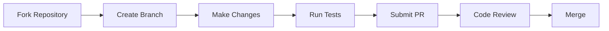

# Software Engineering Academy

<p align="center">
  
</p>

<p align="center">
  <a href="https://github.com/javaengineeringacademy/software-engineering-academy/actions/workflows/ci.yml">
    
  </a>
  <a href="https://github.com/javaengineeringacademy/software-engineering-academy/actions/workflows/build.yml">
    
  </a>
  <a href="https://github.com/javaengineeringacademy/software-engineering-academy/actions/workflows/test.yml">
    
  </a>
  
</p>

**The world's best open-source Software Engineering curriculum.**

Production-grade. Interview-focused. Community-driven. Built the way senior engineers learn inside enterprise software companies.

---

## Who Is This Repository For?

| Audience | How This Helps |
|----------|---------------|
| **Beginners** | Start from zero, build strong fundamentals with progressive difficulty |
| **Intermediate developers** | Fill gaps, learn enterprise patterns, prepare for senior roles |
| **Senior engineers** | Refresh knowledge, learn modern features, ace interviews |
| **Career changers** | Structured path from fundamentals to job-ready in 6 months |
| **Bootcamp graduates** | Deepen understanding beyond surface-level tutorials |
| **Self-taught developers** | Fill knowledge gaps with enterprise-grade explanations |
| **Interview candidates** | 500+ interview questions organized by topic and difficulty |
| **Technical leads** | Reference architecture patterns and design principles |
| **Open source contributors** | Well-structured project with clear contribution guidelines |

---

## Technology Coverage

### Languages
| Language | Focus | Modules |
|----------|-------|---------|
| [Java](languages/java/) | Enterprise, Backend, Spring | 14 modules, 200+ files |
| [Go](languages/go/) | Cloud, Microservices, DevOps | 3 modules |
| [Rust](languages/rust/) | Systems, Performance, Safety | 3 modules |
| [Python](languages/python/) | Data Science, AI/ML, Backend | 3 modules |
| [JavaScript](languages/javascript/) | Web, Full Stack, Node.js | 3 modules |
| [TypeScript](languages/typescript/) | Type-safe, Enterprise JS | 3 modules |
| [Kotlin](languages/kotlin/) | Android, Spring, JVM | 3 modules |
| [Scala](languages/scala/) | Functional, Big Data, Akka | 3 modules |
| [C#](languages/csharp/) | .NET, Enterprise, Game Dev | 3 modules |
| [C++](languages/cpp/) | Systems, Games, Embedded | 3 modules |
| [PHP](languages/php/) | Web, Laravel, WordPress | 3 modules |

### Spring Framework
| Module | Focus | Modules |
|--------|-------|---------|
| [Spring Core](languages/java/spring/01-spring-core/) | IoC, DI, AOP | 3 modules |
| [Spring Boot](languages/java/spring/02-spring-boot/) | Auto-config, Starters | 3 modules |
| [Spring Cloud](languages/java/spring/03-spring-cloud/) | Microservices, Distributed | 3 modules |
| [Spring Security](languages/java/spring/04-spring-security/) | Auth, OAuth2, JWT | 3 modules |
| [Spring Data](languages/java/spring/05-spring-data/) | Repositories, JPA, MongoDB | 3 modules |
| [Spring WebFlux](languages/java/spring/06-spring-webflux/) | Reactive, Non-blocking | 3 modules |

### Frontend
| Framework | Focus | Modules |
|-----------|-------|---------|
| [HTML](frontend/html/) | Markup, Semantic Elements, Forms | 3 modules |
| [CSS](frontend/css/) | Styling, Flexbox, Grid, Responsive | 3 modules |
| [React](frontend/react/) | Modern UI, Hooks, State Management | 3 modules |
| [Angular](frontend/angular/) | Enterprise Apps, TypeScript | 3 modules |
| [Vue.js](frontend/vue/) | Progressive Framework, Composition API | 3 modules |

### Backend
| Technology | Focus | Modules |
|------------|-------|---------|
| [Node.js](backend/nodejs/) | Server-side JavaScript, APIs | 3 modules |

### Scripting
| Language | Focus | Modules |
|----------|-------|---------|
| [Bash](languages/scripting/01-bash/) | Unix Shell, Automation, System Admin | 3 modules |
| [Python Scripting](languages/scripting/02-python-scripting/) | Automation, CLI Tools, File Processing | 3 modules |
| [PowerShell](languages/scripting/03-powershell/) | Windows Admin, Azure, Automation | 3 modules |

### DevOps & Tools
| Technology | Focus | Modules |
|------------|-------|---------|
| [Docker](devops/docker/) | Containerization, Images | 3 modules |
| [Kubernetes](devops/kubernetes/) | Orchestration, Scaling | 3 modules |
| [Helm](devops/helm/) | Package Manager, Charts | 3 modules |
| [Terraform](devops/terraform/) | Infrastructure as Code | 3 modules |
| [Pulumi](devops/pulumi/) | IaC with Programming Languages | 3 modules |
| [Jenkins](tools/jenkins/) | CI/CD, Pipelines | 3 modules |
| [Ansible](tools/ansible/) | Configuration Management | 3 modules |
| [ArgoCD](devops/argocd/) | GitOps, Kubernetes CD | 3 modules |
| [GitLab CI](devops/gitlab-ci/) | CI/CD in GitLab | 3 modules |
| [Prometheus](tools/prometheus/) | Monitoring, Alerting | 3 modules |
| [Grafana](tools/grafana/) | Visualization, Dashboards | 3 modules |
| [HashiCorp](devops/hashiicorp/) | Vault, Consul, Nomad | 3 modules |

### Cloud
| Provider | Focus | Modules |
|----------|-------|---------|
| [AWS](cloud/aws/) | EC2, S3, Lambda, RDS | 3 modules |
| [Azure](cloud/azure/) | VMs, Azure SQL, Functions | 3 modules |
| [GCP](cloud/gcp/) | Compute Engine, BigQuery | 3 modules |

### Databases
| Technology | Focus | Modules |
|------------|-------|---------|
| [Redis](data/redis/) | Caching, Pub/Sub, Structures | 3 modules |
| [PostgreSQL](data/postgresql/) | Advanced SQL, JSONB, Full Text | 3 modules |
| [MySQL](data/mysql/) | Relational, Replication, Optimization | 3 modules |
| [MongoDB](data/mongodb/) | Document DB, Aggregation, Sharding | 3 modules |
| [Cassandra](data/cassandra/) | Distributed NoSQL, High Availability | 3 modules |
| [Elasticsearch](data/elasticsearch/) | Search, Analytics, Full Text | 3 modules |
| [Data Engineering](data/data-engineering/) | ETL, Pipelines, Spark | 3 modules |
| [Apache Spark](data/spark/) | Big Data Processing, ML | 3 modules |

### Messaging
| Technology | Focus | Modules |
|------------|-------|---------|
| [Kafka](messaging/kafka/) | Event Streaming, Streams | 3 modules |
| [RabbitMQ](messaging/rabbitmq/) | Message Broker, AMQP | 3 modules |
| [GraphQL](messaging/graphql/) | Query Language, APIs | 3 modules |
| [SOAP](messaging/soap/) | Web Services, WSDL, XML | 3 modules |

### Architecture
| Topic | Focus | Modules |
|-------|-------|---------|
| [Microservices](architecture/microservices/) | Distributed Systems, Patterns | 3 modules |
| [System Design](architecture/system-design/) | Scalability, Architecture | 3 modules |

### AI/ML
| Topic | Focus | Modules |
|-------|-------|---------|
| [AI Engineering](ai-ml/ai-engineering/) | ML Integration, LLM APIs | 3 modules |
| [Prompt Engineering](ai-ml/prompt-engineering/) | AI Communication, Optimization | 3 modules |
| [LLM Applications](ai-ml/llm-applications/) | RAG, Vector DBs, Chatbots | 3 modules |
| [Machine Learning](ai-ml/machine-learning/) | Algorithms, Models, Evaluation | 3 modules |

### Security
| Topic | Focus | Modules |
|-------|-------|---------|
| [Cyber Security](security/cyber-security/) | OWASP, Encryption, Auth | 3 modules |

### Mobile
| Technology | Focus | Modules |
|------------|-------|---------|
| [Flutter](mobile/flutter/) | Cross-platform, Dart, UI | 3 modules |
| [React Native](mobile/react-native/) | JavaScript Mobile, Native APIs | 3 modules |

### Career
| Topic | Focus | Modules |
|-------|-------|---------|
| [Interview Preparation](career/interview-preparation/) | Coding, Design, Behavioral | 3 modules |
| [Career Roadmaps](career/career-roadmaps/) | Growth Paths, Planning | 3 modules |
| [Open Source](career/open-source/) | Contributing, Community | 3 modules |
| [Real Projects](career/real-projects/) | Enterprise Applications | 3 modules |

---

## Quick Start

### Prerequisites

- **Java**: JDK 21+ (for Java modules)
- **Node.js**: v18+ (for JavaScript/TypeScript modules)
- **Python**: 3.10+ (for Python modules)
- **Go**: 1.21+ (for Go modules)
- **Rust**: Latest stable (for Rust modules)
- **Docker**: Latest (for DevOps modules)
- **Git**: Latest

### Get Up and Running

```bash
# Clone the repository
git clone https://github.com/javaengineeringacademy/software-engineering-academy.git
cd software-engineering-academy

# Build Java modules
mvn clean verify

# Navigate to any technology
cd languages/java/01-fundamentals
cd languages/go/01-fundamentals
cd frontend/react/01-fundamentals
cd devops/docker/01-fundamentals
```

### Recommended First Steps

1. Choose your learning path below
2. Start with Module 01 of your chosen technology
3. Complete all exercises before moving to the next topic
4. Build the mini-projects at the end of each module
5. Review interview questions for each topic

---

## Learning Paths

### Full Stack Developer Path

```
Duration: 6-12 months (full-time)

Phase 1: Foundations (4 weeks)
├── Java Fundamentals
├── JavaScript Fundamentals
├── TypeScript Fundamentals
└── Git Basics

Phase 2: Frontend (6 weeks)
├── React Fundamentals
├── Angular Fundamentals
└── CSS/HTML Review

Phase 3: Backend (6 weeks)
├── Node.js Fundamentals
├── Java Spring Boot
└── REST API Design

Phase 4: DevOps (4 weeks)
├── Docker
├── Kubernetes
└── CI/CD

Phase 5: Cloud (4 weeks)
├── AWS/Azure/GCP Basics
├── Cloud Architecture
└── Monitoring

Phase 6: Advanced (6 weeks)
├── Microservices
├── System Design
└── Interview Prep
```

### Backend Engineer Path

```
Duration: 4-8 months (full-time)

Phase 1: Languages (6 weeks)
├── Java Advanced
├── Go Fundamentals
└── Python Basics

Phase 2: Frameworks (6 weeks)
├── Spring Boot
├── Spring Security
├── Spring Data JPA
└── Hibernate

Phase 3: Databases (4 weeks)
├── SQL Mastery
├── Redis
└── Data Engineering

Phase 4: Messaging (4 weeks)
├── Kafka
├── RabbitMQ
└── GraphQL

Phase 5: Architecture (6 weeks)
├── Microservices
├── System Design
└── Design Patterns

Phase 6: Career (4 weeks)
├── Interview Preparation
└── Real Projects
```

### DevOps Engineer Path

```
Duration: 4-6 months (full-time)

Phase 1: Containers (4 weeks)
├── Docker
├── Docker Compose
└── Multi-stage Builds

Phase 2: Orchestration (4 weeks)
├── Kubernetes
├── Helm Charts
└── Service Mesh

Phase 3: Infrastructure (4 weeks)
├── Terraform
├── AWS/Azure/GCP
└── Cloud Architecture

Phase 4: CI/CD (4 weeks)
├── GitHub Actions
├── Jenkins
└── GitOps

Phase 5: Monitoring (4 weeks)
├── Prometheus
├── Grafana
└── ELK Stack

Phase 6: Security (4 weeks)
├── Container Security
├── Cloud Security
└── Cyber Security Basics
```

### AI/ML Engineer Path

```
Duration: 6-12 months (full-time)

Phase 1: Foundations (6 weeks)
├── Python Advanced
├── Statistics
└── Linear Algebra

Phase 2: Machine Learning (8 weeks)
├── ML Fundamentals
├── Supervised Learning
├── Unsupervised Learning
└── Deep Learning Basics

Phase 3: AI Engineering (6 weeks)
├── AI Engineering
├── LLM Applications
└── Prompt Engineering

Phase 4: Data (4 weeks)
├── Data Engineering
├── Spark
└── Data Pipelines

Phase 5: Deployment (4 weeks)
├── Model Deployment
├── MLOps
└── Monitoring

Phase 6: Projects (4 weeks)
├── Real Projects
└── Portfolio Building
```

### Cloud Architect Path

```
Duration: 6-8 months (full-time)

Phase 1: Cloud Basics (4 weeks)
├── AWS Fundamentals
├── Azure Fundamentals
└── GCP Fundamentals

Phase 2: Advanced Services (6 weeks)
├── AWS Advanced
├── Azure Advanced
└── GCP Advanced

Phase 3: Architecture (6 weeks)
├── System Design
├── Microservices
└── Cloud Design Patterns

Phase 4: DevOps (4 weeks)
├── Docker
├── Kubernetes
└── Terraform

Phase 5: Security (4 weeks)
├── Cloud Security
├── IAM
└── Compliance

Phase 6: Certification (4 weeks)
├── AWS Solutions Architect
├── Azure Architect
└── GCP Architect
```

---

## Repository Architecture

```
software-engineering-academy/
├── languages/
│   ├── java/                    # 14 Java modules
│   │   ├── 01-fundamentals/
│   │   ├── 02-oop/
│   │   ├── 03-exception-handling/
│   │   ├── 04-collections/
│   │   ├── 05-generics/
│   │   ├── 06-strings/
│   │   ├── 07-functional-programming/
│   │   ├── 08-io-nio/
│   │   ├── 09-multithreading/
│   │   ├── 10-jvm-internals/
│   │   ├── 11-design-patterns/
│   │   ├── 12-testing/
│   │   ├── 13-reflection-annotations/
│   │   ├── 14-logging/
│   │   └── spring/              # Spring modules
│   │       ├── spring-core/
│   │       ├── spring-mvc/
│   │       ├── spring-data/
│   │       ├── spring-security/
│   │       ├── spring-boot/
│   │       └── spring-integration/
│   ├── go/                      # Go modules
│   │   ├── 01-fundamentals/
│   │   ├── 02-concurrency/
│   │   └── 03-advanced/
│   ├── rust/                    # Rust modules
│   │   ├── 01-fundamentals/
│   │   ├── 02-ownership/
│   │   └── 03-async/
│   ├── python/                  # Python modules
│   │   ├── 01-fundamentals/
│   │   ├── 02-oop/
│   │   └── 03-advanced/
│   ├── javascript/              # JavaScript modules
│   │   ├── 01-fundamentals/
│   │   ├── 02-dom/
│   │   └── 03-async/
│   └── typescript/              # TypeScript modules
│       ├── 01-fundamentals/
│       ├── 02-generics/
│       └── 03-advanced/
├── frontend/
│   ├── react/                   # React modules
│   │   ├── 01-fundamentals/
│   │   ├── 02-hooks/
│   │   └── 03-advanced/
│   └── angular/                 # Angular modules
│       ├── 01-fundamentals/
│       ├── 02-components/
│       └── 03-advanced/
├── backend/
│   └── nodejs/                  # Node.js modules
│       ├── 01-fundamentals/
│       ├── 02-express/
│       └── 03-advanced/
├── devops/
│   ├── docker/                  # Docker modules
│   │   ├── 01-fundamentals/
│   │   ├── 02-compose/
│   │   └── 03-advanced/
│   ├── kubernetes/              # Kubernetes modules
│   │   ├── 01-fundamentals/
│   │   ├── 02-services/
│   │   └── 03-advanced/
│   └── terraform/               # Terraform modules
│       ├── 01-fundamentals/
│       ├── 02-modules/
│       └── 03-advanced/
├── cloud/
│   ├── aws/                     # AWS modules
│   │   ├── 01-fundamentals/
│   │   ├── 02-ec2-s3/
│   │   └── 03-advanced/
│   ├── azure/                   # Azure modules
│   │   ├── 01-fundamentals/
│   │   ├── 02-compute/
│   │   └── 03-advanced/
│   └── gcp/                     # GCP modules
│       ├── 01-fundamentals/
│       ├── 02-compute/
│       └── 03-advanced/
├── data/
│   ├── redis/                   # Redis modules
│   │   ├── 01-fundamentals/
│   │   ├── 02-data-structures/
│   │   └── 03-advanced/
│   └── data-engineering/        # Data Engineering modules
│       ├── 01-fundamentals/
│       ├── 02-etl/
│       └── 03-advanced/
├── messaging/
│   ├── kafka/                   # Kafka modules
│   │   ├── 01-fundamentals/
│   │   ├── 02-streams/
│   │   └── 03-advanced/
│   ├── rabbitmq/                # RabbitMQ modules
│   │   ├── 01-fundamentals/
│   │   ├── 02-patterns/
│   │   └── 03-advanced/
│   └── graphql/                 # GraphQL modules
│       ├── 01-fundamentals/
│       ├── 02-schema/
│       └── 03-advanced/
├── architecture/
│   ├── microservices/           # Microservices modules
│   │   ├── 01-fundamentals/
│   │   ├── 02-patterns/
│   │   └── 03-advanced/
│   └── system-design/           # System Design modules
│       ├── 01-fundamentals/
│       ├── 02-patterns/
│       └── 03-advanced/
├── ai-ml/
│   ├── ai-engineering/          # AI Engineering modules
│   │   ├── 01-fundamentals/
│   │   ├── 02-integration/
│   │   └── 03-advanced/
│   ├── prompt-engineering/      # Prompt Engineering modules
│   │   ├── 01-fundamentals/
│   │   ├── 02-techniques/
│   │   └── 03-advanced/
│   ├── llm-applications/        # LLM Applications modules
│   │   ├── 01-fundamentals/
│   │   ├── 02-rag/
│   │   └── 03-advanced/
│   └── machine-learning/        # Machine Learning modules
│       ├── 01-fundamentals/
│       ├── 02-algorithms/
│       └── 03-advanced/
├── security/
│   └── cyber-security/          # Cyber Security modules
│       ├── 01-fundamentals/
│       ├── 02-web-security/
│       └── 03-advanced/
├── career/
│   ├── interview-preparation/   # Interview modules
│   │   ├── 01-fundamentals/
│   │   ├── 02-dsa/
│   │   └── 03-advanced/
│   ├── career-roadmaps/         # Career modules
│   │   ├── 01-fundamentals/
│   │   ├── 02-paths/
│   │   └── 03-advanced/
│   ├── open-source/             # Open Source modules
│   │   ├── 01-fundamentals/
│   │   ├── 02-contributing/
│   │   └── 03-advanced/
│   └── real-projects/           # Real Projects modules
│       ├── 01-fundamentals/
│       ├── 02-projects/
│       └── 03-advanced/
├── .github/                     # GitHub workflows
├── docs/                        # Documentation
├── templates/                   # Content templates
├── pom.xml                      # Maven parent build
├── README.md                    # This file
├── CONTRIBUTING.md              # Contribution guidelines
├── CODE_OF_CONDUCT.md           # Community standards
└── CHANGELOG.md                 # Version history
```

---

## Learning Methodology

> "Teach software engineering the way senior engineers learn inside enterprise software companies."

### Core Principles

1. **Why before How**: Understand the problem before the solution
2. **Production-grade**: Every example compiles, runs, and passes quality gates
3. **Progressive difficulty**: Easy → Medium → Hard → Enterprise
4. **Interview-focused**: Every topic includes questions by difficulty level
5. **Project-based**: Learn by building real applications
6. **Community-driven**: Contributions welcome with clear guidelines

### Topic Structure

Every topic follows this exact structure:

```
topic-name/
├── README.md              # The lesson
├── theory/                # Deep explanation
├── diagrams/              # Visual learning (Mermaid)
├── examples/
│   ├── easy/              # Syntax & basics
│   ├── medium/            # Combined concepts
│   └── hard/              # Production-level
├── exercises/
│   ├── easy/
│   ├── medium/
│   └── hard/
├── quiz/                  # Knowledge check (25 questions)
├── interview/             # Interview questions (15+)
├── pitfalls/              # Common mistakes
├── best-practices/        # Industry standards
└── references/            # External resources
```

### Learning Flow

```
Read Theory → Run Examples → Solve Exercises → Build Projects → Ace Interviews
```

---

## Module Navigation

### Languages

| Language | Module | Difficulty | Focus |
|----------|--------|------------|-------|
| Java | [01 — Fundamentals](languages/java/01-fundamentals/) | Beginner | Variables, types, control flow |
| Java | [02 — OOP](languages/java/02-oop/) | Beginner | Classes, inheritance, polymorphism |
| Java | [03 — Exception Handling](languages/java/03-exception-handling/) | Intermediate | Try-catch, custom exceptions |
| Java | [04 — Collections](languages/java/04-collections/) | Intermediate | Lists, maps, sets, queues |
| Java | [05 — Generics](languages/java/05-generics/) | Intermediate | Type parameters, bounds |
| Java | [06 — Strings](languages/java/06-strings/) | Beginner | String manipulation |
| Java | [07 — Functional Programming](languages/java/07-functional-programming/) | Intermediate | Lambdas, streams, optional |
| Java | [08 — I/O & NIO](languages/java/08-io-nio/) | Intermediate | File operations, channels |
| Java | [09 — Multithreading](languages/java/09-multithreading/) | Advanced | Concurrency, virtual threads |
| Java | [10 — JVM Internals](languages/java/10-jvm-internals/) | Advanced | Memory model, GC |
| Java | [11 — Design Patterns](languages/java/11-design-patterns/) | Advanced | Creational, structural, behavioral |
| Java | [12 — Testing](languages/java/12-testing/) | Intermediate | JUnit 5, Mockito, AssertJ |
| Java | [13 — Reflection & Annotations](languages/java/13-reflection-annotations/) | Advanced | Dynamic proxies, meta-annotations |
| Java | [14 — Logging](languages/java/14-logging/) | Intermediate | Log4j, SLF4J, patterns |
| Go | [01 — Fundamentals](languages/go/01-fundamentals/) | Beginner | Syntax, types, concurrency |
| Rust | [01 — Fundamentals](languages/rust/01-fundamentals/) | Beginner | Ownership, borrowing, lifetimes |
| Python | [01 — Fundamentals](languages/python/01-fundamentals/) | Beginner | Syntax, data structures |
| JavaScript | [01 — Fundamentals](languages/javascript/01-fundamentals/) | Beginner | DOM, async, ES6+ |
| TypeScript | [01 — Fundamentals](languages/typescript/01-fundamentals/) | Intermediate | Types, generics, utility types |

### Frontend

| Framework | Module | Difficulty | Focus |
|-----------|--------|------------|-------|
| React | [01 — Fundamentals](frontend/react/01-fundamentals/) | Intermediate | Components, hooks, state |
| Angular | [01 — Fundamentals](frontend/angular/01-fundamentals/) | Intermediate | Components, services, DI |

### Backend

| Technology | Module | Difficulty | Focus |
|------------|--------|------------|-------|
| Node.js | [01 — Fundamentals](backend/nodejs/01-fundamentals/) | Intermediate | Express, middleware, APIs |

### DevOps

| Technology | Module | Difficulty | Focus |
|------------|--------|------------|-------|
| Docker | [01 — Fundamentals](devops/docker/01-fundamentals/) | Intermediate | Containers, Dockerfile |
| Kubernetes | [01 — Fundamentals](devops/kubernetes/01-fundamentals/) | Advanced | Pods, services, deployments |
| Terraform | [01 — Fundamentals](devops/terraform/01-fundamentals/) | Advanced | IaC, providers, modules |

### Cloud

| Provider | Module | Difficulty | Focus |
|----------|--------|------------|-------|
| AWS | [01 — Fundamentals](cloud/aws/01-fundamentals/) | Intermediate | EC2, S3, Lambda |
| Azure | [01 — Fundamentals](cloud/azure/01-fundamentals/) | Intermediate | VMs, Azure SQL, Functions |
| GCP | [01 — Fundamentals](cloud/gcp/01-fundamentals/) | Intermediate | Compute Engine, BigQuery |

### Data

| Technology | Module | Difficulty | Focus |
|------------|--------|------------|-------|
| Redis | [01 — Fundamentals](data/redis/01-fundamentals/) | Intermediate | Caching, pub/sub, structures |
| Data Engineering | [01 — Fundamentals](data/data-engineering/01-fundamentals/) | Advanced | ETL, pipelines, Spark |

### Messaging

| Technology | Module | Difficulty | Focus |
|------------|--------|------------|-------|
| Kafka | [01 — Fundamentals](messaging/kafka/01-fundamentals/) | Advanced | Event streaming, streams |
| RabbitMQ | [01 — Fundamentals](messaging/rabbitmq/01-fundamentals/) | Intermediate | Message broker, AMQP |
| GraphQL | [01 — Fundamentals](messaging/graphql/01-fundamentals/) | Intermediate | Schema, resolvers, subscriptions |

### Architecture

| Topic | Module | Difficulty | Focus |
|-------|--------|------------|-------|
| Microservices | [01 — Fundamentals](architecture/microservices/01-fundamentals/) | Advanced | Service decomposition, patterns |
| System Design | [01 — Fundamentals](architecture/system-design/01-fundamentals/) | Advanced | Scalability, trade-offs |

### AI/ML

| Topic | Module | Difficulty | Focus |
|-------|--------|------------|-------|
| AI Engineering | [01 — Fundamentals](ai-ml/ai-engineering/01-fundamentals/) | Advanced | ML integration, LLM APIs |
| Prompt Engineering | [01 — Fundamentals](ai-ml/prompt-engineering/01-fundamentals/) | Intermediate | AI communication, optimization |
| LLM Applications | [01 — Fundamentals](ai-ml/llm-applications/01-fundamentals/) | Advanced | RAG, vector DBs, chatbots |
| Machine Learning | [01 — Fundamentals](ai-ml/machine-learning/01-fundamentals/) | Advanced | Algorithms, models, evaluation |

### Security

| Topic | Module | Difficulty | Focus |
|-------|--------|------------|-------|
| Cyber Security | [01 — Fundamentals](security/cyber-security/01-fundamentals/) | Intermediate | OWASP, encryption, auth |

### Career

| Topic | Module | Difficulty | Focus |
|-------|--------|------------|-------|
| Interview Prep | [01 — Fundamentals](career/interview-preparation/01-fundamentals/) | All Levels | Coding, design, behavioral |
| Career Roadmaps | [01 — Fundamentals](career/career-roadmaps/01-fundamentals/) | All Levels | Growth paths, planning |
| Open Source | [01 — Fundamentals](career/open-source/01-fundamentals/) | All Levels | Contributing, community |
| Real Projects | [01 — Fundamentals](career/real-projects/01-fundamentals/) | Advanced | Enterprise applications |

---

## Contribution Workflow



**Steps:**
1. Fork the repository
2. Create a feature branch: `git checkout -b feature/amazing-feature`
3. Make your changes following the [Topic Template](templates/README.md)
4. Run quality gates: `mvn clean verify`
5. Commit with conventional format: `feat(scope): description`
6. Push and open a Pull Request
7. Address review feedback
8. Merge after approval

See [CONTRIBUTING.md](CONTRIBUTING.md) for detailed guidelines.

---

## Technology Stack

| Category | Technology |
|----------|-----------|
| Languages | Java 21, Go 1.21, Rust, Python 3.10+, Node.js 18+, TypeScript 5+ |
| Frontend | React 18, Angular 17, HTML5, CSS3 |
| Backend | Spring Boot, Express.js, FastAPI, Gin |
| DevOps | Docker, Kubernetes, Terraform, GitHub Actions |
| Cloud | AWS, Azure, GCP |
| Databases | PostgreSQL, MongoDB, Redis, Elasticsearch |
| Messaging | Kafka, RabbitMQ, GraphQL |
| AI/ML | OpenAI, LangChain, TensorFlow, PyTorch |
| Testing | JUnit 5, Jest, Pytest, Go testing, cargo test |
| Code Style | Google Java Style, Prettier, Black, rustfmt |
| CI/CD | GitHub Actions, Jenkins, GitLab CI |

---

## FAQ

**Q: How long does it take to complete the curriculum?**
A: Approximately 6-12 months for the full curriculum, depending on your pace and background. See [Learning Paths](#learning-paths) for detailed time estimates.

**Q: Do I need prior programming experience?**
A: No. Module 01 of each technology starts from zero. However, basic computer literacy is assumed.

**Q: Is this enough to get a software engineering job?**
A: The curriculum covers technical skills. Combine with portfolio projects from Career/Real Projects and interview prep from Career/Interview Preparation.

**Q: Can I contribute?**
A: Yes! See [CONTRIBUTING.md](CONTRIBUTING.md). We welcome improvements to any topic.

**Q: How is this different from other learning platforms?**
A: This is a complete curriculum (not individual articles), with progressive difficulty, exercises, tests, and enterprise-grade code quality across multiple technologies.

**Q: What IDE should I use?**
A: 
- **Java**: IntelliJ IDEA
- **JavaScript/TypeScript**: VS Code
- **Python**: VS Code or PyCharm
- **Go**: GoLand or VS Code
- **Rust**: RustRover or VS Code

**Q: Where are the templates for creating new topics?**
A: See [templates/](templates/README.md) for topic, exercise, interview, quiz, and assignment templates.

---

## Community

- **Discussions**: [GitHub Discussions](https://github.com/javaengineeringacademy/software-engineering-academy/discussions)
- **Issues**: [Report Issues](https://github.com/javaengineeringacademy/software-engineering-academy/issues)
- **Contributions**: See [CONTRIBUTING.md](CONTRIBUTING.md)
- **Code of Conduct**: See [CODE_OF_CONDUCT.md](CODE_OF_CONDUCT.md)
- **Templates**: See [templates/](templates/README.md)

---

## License

This project is licensed under the [Apache License 2.0](LICENSE).

---

<p align="center">
  <b>Star this repository if you find it helpful!</b>
</p>
