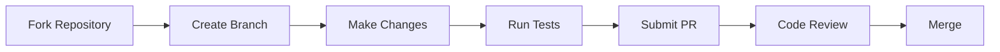

# Java Engineering Academy

<p align="center">
  
</p>

<p align="center">
  <a href="https://github.com/javaengineeringacademy/java-engineering-academy/actions/workflows/ci.yml">
    
  </a>
  <a href="https://github.com/javaengineeringacademy/java-engineering-academy/actions/workflows/build.yml">
    
  </a>
  <a href="https://github.com/javaengineeringacademy/java-engineering-academy/actions/workflows/test.yml">
    
  </a>
  <a href="https://github.com/javaengineeringacademy/java-engineering-academy/actions/workflows/codeql.yml">
    
  </a>
  
  
  
</p>

**The world's best open-source Java Engineering curriculum.**

Production-grade. Interview-focused. Community-driven. Built the way senior engineers learn inside enterprise software companies.

---

## Who Is This Repository For?

| Audience | How This Helps |
|----------|---------------|
| **Beginners** | Start from zero, build strong fundamentals with progressive difficulty |
| **Intermediate developers** | Fill gaps, learn enterprise patterns, prepare for senior roles |
| **Senior engineers** | Refresh knowledge, learn modern Java 21 features, ace interviews |
| **Career changers** | Structured path from fundamentals to job-ready in 6 months |
| **Bootcamp graduates** | Deepen understanding beyond surface-level tutorials |
| **Self-taught developers** | Fill knowledge gaps with enterprise-grade explanations |
| **Interview candidates** | 500+ interview questions organized by topic and difficulty |
| **Technical leads** | Reference architecture patterns and design principles |
| **Open source contributors** | Well-structured project with clear contribution guidelines |

---

## Current Implementation Status

| Module | Status | Topics | Files | Tests |
|--------|--------|--------|-------|-------|
| [01 — Java Fundamentals](modules/01-java-fundamentals/) | ✅ Complete | 7 | 35 | 7 |
| [02 — Object-Oriented Programming](modules/02-object-oriented-programming/) | ✅ Complete | 33 | 230+ | 25+ |
| [03 — Exception Handling](modules/03-exception-handling/) | 🔲 Scaffolded | — | — | — |
| [04 — Collections Framework](modules/04-collections-framework/) | 🔲 Scaffolded | — | — | — |
| [05 — Generics](modules/05-generics/) | 🔲 Scaffolded | — | — | — |
| [06 — Java I/O and NIO](modules/06-java-io-and-nio/) | 🔲 Scaffolded | — | — | — |
| [07 — Functional Programming & Streams](modules/07-functional-programming/) | 🔲 Scaffolded | — | — | — |
| [08 — Multithreading & Concurrency](modules/08-multithreading/) | 🔲 Scaffolded | — | — | — |
| [09 — JVM Internals](modules/09-jvm-internals/) | 🔲 Scaffolded | — | — | — |
| [10 — Design Patterns](modules/10-design-patterns/) | 🔲 Scaffolded | — | — | — |
| [11 — Testing (JUnit & Mockito)](modules/11-testing/) | 🔲 Scaffolded | — | — | — |
| [12 — Maven & Gradle](modules/12-build-tools/) | 🔲 Scaffolded | — | — | — |
| [13 — JDBC & Database](modules/13-jdbc-database/) | 🔲 Scaffolded | — | — | — |
| [14 — Spring Framework](modules/14-spring-framework/) | 🔲 Scaffolded | — | — | — |
| [15 — Spring Boot](modules/15-spring-boot/) | 🔲 Scaffolded | — | — | — |
| [16 — Spring Security](modules/16-spring-security/) | 🔲 Scaffolded | — | — | — |
| [17 — REST API Development](modules/17-rest-api/) | 🔲 Scaffolded | — | — | — |
| [18 — Microservices](modules/18-microservices/) | 🔲 Scaffolded | — | — | — |
| [19 — Apache Kafka](modules/19-apache-kafka/) | 🔲 Scaffolded | — | — | — |
| [20 — Redis](modules/20-redis/) | 🔲 Scaffolded | — | — | — |
| [21 — Docker](modules/21-docker/) | 🔲 Scaffolded | — | — | — |
| [22 — Kubernetes](modules/22-kubernetes/) | 🔲 Scaffolded | — | — | — |
| [23 — AWS](modules/23-aws/) | 🔲 Scaffolded | — | — | — |
| [24 — System Design](modules/24-system-design/) | 🔲 Scaffolded | — | — | — |
| [25 — Enterprise Projects](modules/25-enterprise-projects/) | 🔲 Scaffolded | — | — | — |
| [26 — Interview Preparation](modules/26-interview-preparation/) | 🔲 Scaffolded | — | — | — |

---

## Curriculum Overview

### Learning Philosophy

> "Teach Java exactly the way senior engineers learn inside enterprise software companies."

- **Why before How**: Understand the problem before the solution
- **Production-grade**: Every example compiles, runs, and passes quality gates
- **Progressive difficulty**: Easy → Medium → Hard → Enterprise
- **Interview-focused**: Every topic includes questions by difficulty level
- **Project-based**: Learn by building real applications
- **Community-driven**: Contributions welcome with clear guidelines

### Learning Methodology

```
Read Theory → Run Examples → Solve Exercises → Build Projects → Ace Interviews
```

Each topic follows this exact structure:

```
topic-name/
├── README.md              # The lesson
├── theory/                # Deep explanation
├── diagrams/              # Visual learning
├── examples/
│   ├── easy/              # Syntax & basics
│   ├── medium/            # Combined concepts
│   └── hard/              # Production-level
├── exercises/
│   ├── easy/
│   ├── medium/
│   └── hard/
├── assignments/           # Graded work
├── quiz/                  # Knowledge check
├── interview/             # Interview questions
├── pitfalls/              # Common mistakes
├── best-practices/        # Industry standards
├── real-world/            # Framework usage
├── references/            # External resources
└── solutions/             # Answer key
```

---

## Repository Architecture

```
java-engineering-academy/
├── .github/
│   ├── ISSUE_TEMPLATE/        Bug reports, feature requests, content improvements
│   ├── PULL_REQUEST_TEMPLATE.md
│   └── workflows/             CI/CD, Build, Test, CodeQL
├── config/
│   └── checkstyle/            Google Java Style configuration
├── docs/
│   ├── architecture/          System design documentation
│   ├── images/                Logos and diagrams
│   ├── interview/             General interview prep
│   └── roadmap/               Curriculum roadmap
├── modules/
│   ├── 01-java-fundamentals/
│   │   ├── src/main/java/     Example code
│   │   ├── src/test/java/     Unit tests
│   │   ├── docs/              Topic documentation
│   │   ├── exercises/         Practice problems
│   │   ├── solutions/         Answer key
│   │   └── README.md
│   ├── 02-object-oriented-programming/
│   │   ├── 01-introduction/
│   │   ├── 02-classes/
│   │   ├── 03-objects/
│   │   ├── ...
│   │   ├── 33-mini-projects/
│   │   └── README.md
│   └── ... (26 future modules)
├── projects/                  Portfolio projects
├── resources/                 Curated references
├── pom.xml                    Maven parent build
├── REVIEW.md                  Repository review findings
├── LEARNING_PATH.md           Sprint schedule & milestones
├── ROADMAP.md                 Long-term curriculum plan
├── CONTRIBUTING.md            Contribution guidelines
├── CODE_OF_CONDUCT.md         Community standards
└── CHANGELOG.md               Version history
```

---

## Module Navigation

### Foundations (Modules 01-06)

| # | Module | Topics | Focus |
|---|--------|--------|-------|
| 01 | [Java Fundamentals](modules/01-java-fundamentals/) | 7 | Variables, types, control flow, methods, arrays, strings |
| 02 | [Object-Oriented Programming](modules/02-object-oriented-programming/) | 33 | Classes, inheritance, polymorphism, SOLID, design principles |
| 03 | Exception Handling | — | Try-catch, custom exceptions, best practices |
| 04 | Collections Framework | — | Lists, maps, sets, queues, algorithms |
| 05 | Generics | — | Type parameters, bounds, wildcards |
| 06 | Java I/O and NIO | — | Streams, channels, buffers, file operations |

### Core Java (Modules 07-12)

| # | Module | Topics | Focus |
|---|--------|--------|-------|
| 07 | Functional Programming | — | Lambdas, streams, optional, functional interfaces |
| 08 | Multithreading | — | Threads, executors, virtual threads, synchronization |
| 09 | JVM Internals | — | Memory model, garbage collection, class loaders |
| 10 | Design Patterns | — | Creational, structural, behavioral patterns |
| 11 | Testing | — | JUnit 5, Mockito, AssertJ, test design |
| 12 | Build Tools | — | Maven, Gradle, dependency management |

### Enterprise (Modules 13-18)

| # | Module | Topics | Focus |
|---|--------|--------|-------|
| 13 | JDBC & Database | — | Connections, transactions, connection pooling |
| 14 | Spring Framework | — | IoC, DI, AOP, data access |
| 15 | Spring Boot | — | Auto-configuration, starters, actuator |
| 16 | Spring Security | — | Authentication, authorization, OAuth2 |
| 17 | REST API | — | Controllers, validation, error handling |
| 18 | Microservices | — | Service discovery, API gateway, circuit breaker |

### Infrastructure (Modules 19-23)

| # | Module | Topics | Focus |
|---|--------|--------|-------|
| 19 | Apache Kafka | — | Producers, consumers, streams |
| 20 | Redis | — | Caching, pub/sub, data structures |
| 21 | Docker | — | Containers, images, compose |
| 22 | Kubernetes | — | Pods, services, deployments |
| 23 | AWS | — | EC2, S3, RDS, Lambda |

### Mastery (Modules 24-26)

| # | Module | Topics | Focus |
|---|--------|--------|-------|
| 24 | System Design | — | Scalability, resilience, architecture |
| 25 | Enterprise Projects | — | End-to-end applications |
| 26 | Interview Preparation | — | Coding, design, behavioral |

---

## Sprint Progress

| Sprint | Focus | Status | Completion |
|--------|-------|--------|------------|
| Sprint 1 | Java Fundamentals | ✅ Complete | 100% |
| Sprint 2 | Object-Oriented Programming | ✅ Complete | 100% |
| Sprint 3 | Collections & Generics | 🔲 Planned | 0% |
| Sprint 4 | Functional Programming | 🔲 Planned | 0% |
| Sprint 5 | Multithreading & Concurrency | 🔲 Planned | 0% |
| Sprint 6 | JVM Internals | 🔲 Planned | 0% |
| Sprint 7 | Design Patterns | 🔲 Planned | 0% |
| Sprint 8 | Spring Framework | 🔲 Planned | 0% |
| Sprint 9 | Spring Boot | 🔲 Planned | 0% |
| Sprint 10 | Spring Security | 🔲 Planned | 0% |
| Sprint 11 | Microservices | 🔲 Planned | 0% |
| Sprint 12 | Cloud & DevOps | 🔲 Planned | 0% |

---

## Enterprise Learning Path

For developers targeting senior/lead roles:

```
Week 1-4:   Java Fundamentals + OOP
Week 5-8:   Collections + Generics + Exception Handling
Week 9-12:  Functional Programming + Streams
Week 13-16: Multithreading + JVM Internals
Week 17-20: Design Patterns + Testing
Week 21-24: JDBC + Spring Framework
Week 25-28: Spring Boot + REST APIs
Week 29-32: Spring Security + Microservices
Week 33-36: Docker + Kubernetes
Week 37-40: AWS + System Design
Week 41-44: Enterprise Projects
Week 45-48: Interview Preparation
```

---

## Getting Started

### Prerequisites

- JDK 21 (or later)
- Maven 3.8.6+ (or use the included Maven wrapper)
- Git

### Quick Start

```bash
# Clone the repository
git clone https://github.com/javaengineeringacademy/java-engineering-academy.git
cd java-engineering-academy

# Build and verify everything compiles
mvn clean verify

# Run a specific module
mvn clean compile -pl modules/01-java-fundamentals

# Run tests
mvn test -pl modules/02-object-oriented-programming
```

### Recommended Learning Order

1. Start with [Module 01: Java Fundamentals](modules/01-java-fundamentals/)
2. Complete all exercises before moving to the next topic
3. Build the mini-projects at the end of each module
4. Review interview questions for each topic
5. Move to the next module

---

## Contribution Workflow



**Steps:**
1. Fork the repository
2. Create a feature branch: `git checkout -b feature/amazing-feature`
3. Make your changes following the [Topic Template](#topic-template)
4. Run quality gates: `mvn clean verify`
5. Commit with conventional format: `feat(scope): description`
6. Push and open a Pull Request
7. Address review feedback
8. Merge after approval

See [CONTRIBUTING.md](CONTRIBUTING.md) for detailed guidelines.

---

## Technology Stack

| Category | Technology |
|----------|-----------|
| Language | Java 21 |
| Build | Maven 3.8.6+ |
| Testing | JUnit 5, Mockito, AssertJ |
| Code Style | Google Java Style Guide |
| Static Analysis | Checkstyle, PMD, SpotBugs |
| Coverage | JaCoCo |
| CI/CD | GitHub Actions |
| Security | CodeQL |
| Documentation | Markdown, Mermaid |

---

## FAQ

**Q: How long does it take to complete the curriculum?**  
A: Approximately 6-12 months for the full curriculum, depending on your pace and background.

**Q: Do I need prior programming experience?**  
A: No. Module 01 starts from zero. However, basic computer literacy is assumed.

**Q: Is this enough to get a Java developer job?**  
A: The curriculum covers technical skills. Combine with portfolio projects from Module 25 and interview prep from Module 26.

**Q: Can I contribute?**  
A: Yes! See [CONTRIBUTING.md](CONTRIBUTING.md). We welcome improvements to any topic.

**Q: How is this different from Baeldung or Java Brains?**  
A: This is a complete curriculum (not individual articles), with progressive difficulty, exercises, tests, and enterprise-grade code quality.

**Q: What IDE should I use?**  
A: IntelliJ IDEA (Community or Ultimate) is recommended. VS Code with Java extensions also works.

---

## Community

- **Discussions**: [GitHub Discussions](https://github.com/javaengineeringacademy/java-engineering-academy/discussions)
- **Issues**: [Report Issues](https://github.com/javaengineeringacademy/java-engineering-academy/issues)
- **Contributions**: See [CONTRIBUTING.md](CONTRIBUTING.md)
- **Code of Conduct**: See [CODE_OF_CONDUCT.md](CODE_OF_CONDUCT.md)

---

## License

This project is licensed under the [Apache License 2.0](LICENSE).

---

<p align="center">
  <b>Star this repository if you find it helpful!</b>
</p>
