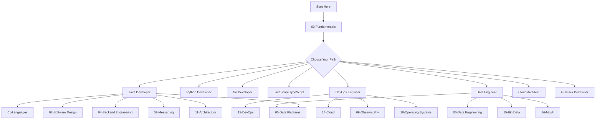
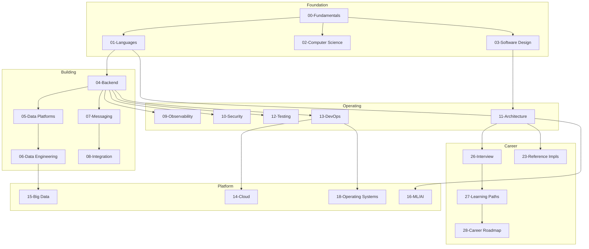

# Software Engineering Academy

<p align="center">
  
</p>

<p align="center">
  <strong>The world's most comprehensive open-source software engineering knowledge base.</strong><br>
  31 modules | 1,600+ topics | Every technology, every concept, every question answered.
</p>

---

## The Philosophy

```
Problem → Concept → Architecture → Technology → Implementation → Production → Operations → Modernization → Interview → Playbook
```

Every technology in this academy follows this flow. If it doesn't, the structure is wrong.

---

## How to Use This Academy



---

## Academy Structure

### Foundation (What you need first)

| Module | Description | Start Here |
|--------|-------------|------------|
| [00-Fundamentals](00-fundamentals/) | Software engineering principles, trade-offs, metrics | Yes |
| [01-Programming Languages](01-programming-languages/) | Java, Python, Go, JavaScript, TypeScript, C#, Kotlin, Rust, Scala, PHP | Pick your language |
| [02-Computer Science](02-computer-science/) | Algorithms, data structures, OS, networks | Yes |
| [03-Software Design](03-software-design/) | Design patterns, SOLID, architecture styles | Yes |

### Building (How to build software)

| Module | Description | When to Study |
|--------|-------------|---------------|
| [04-Backend Engineering](04-backend-engineering/) | Spring, .NET, Django, Flask, Node.js, Laravel | After languages |
| [05-Data Platforms](05-data-platforms/) | PostgreSQL, MySQL, MongoDB, Redis, Cassandra | After backend |
| [06-Data Engineering](06-data-engineering/) | Spark, Flink, Airflow, Kafka Streams | After data platforms |
| [07-Messaging](07-messaging/) | Kafka, RabbitMQ, Pulsar, GraphQL | After backend |
| [08-Integration](08-integration-engineering/) | EIP, MuleSoft, Apache Camel | After messaging |

### Operating (How to run software)

| Module | Description | When to Study |
|--------|-------------|---------------|
| [09-Observability](09-observability/) | Prometheus, Grafana, ELK, Jaeger, OpenTelemetry | After backend |
| [10-Security](10-security/) | OWASP, IAM, cryptography, compliance | After backend |
| [11-Architecture](11-architecture/) | System design, DDD, ADR, C4, fitness functions | After design patterns |
| [12-Testing](12-testing/) | Unit, integration, E2E, TDD, BDD | After languages |
| [13-DevOps](13-devops/) | Docker, Kubernetes, Terraform, Ansible, CI/CD | After backend |

### Platform (Where software runs)

| Module | Description | When to Study |
|--------|-------------|---------------|
| [14-Cloud](14-cloud/) | AWS, Azure, GCP | After DevOps |
| [15-Big Data](15-big-data/) | Hadoop, Spark ecosystem, Flink, Beam | After data engineering |
| [16-ML/AI](16-machine-learning/) | Machine Learning, AI Engineering, LLM, Prompt Engineering | After Python |
| [17-App Servers](17-application-servers-runtime/) | Tomcat, Jetty, WebLogic, NGINX, Kestrel | After languages |
| [18-Operating Systems](18-operating-systems/) | Linux (8 distros), Windows, macOS, Unix | After CS |

### Enterprise (Real-world engineering)

| Module | Description | When to Study |
|--------|-------------|---------------|
| [19-Enterprise Legacy](19-enterprise-legacy-technologies/) | EJB, JSP, Struts, SOAP, COBOL, mainframe | Reference |
| [20-Search & Analytics](20-search-analytics/) | Elasticsearch, Solr, Lucene, Kibana | After data platforms |
| [21-Enterprise Tools](21-enterprise-tools/) | Jira, Splunk, Datadog, Dynatrace, Vault | Reference |

### Excellence (How to be great)

| Module | Description | When to Study |
|--------|-------------|---------------|
| [22-Engineering Excellence](22-engineering-excellence/) | Agile, refactoring, quality, DevEx | After fundamentals |
| [23-Reference Implementations](23-reference-implementations/) | Banking, E-commerce, Chat systems | After architecture |
| [24-Case Studies](24-case-studies/) | Netflix, Uber, Amazon, Google | Reference |
| [25-Engineering Playbooks](25-engineering-playbooks/) | Company playbooks + modernization guides | Reference |

### Career (Getting hired)

| Module | Description | When to Study |
|--------|-------------|---------------|
| [26-Interview Preparation](26-interview-preparation/) | Coding, system design, behavioral | When job hunting |
| [27-Learning Paths](27-learning-paths/) | Structured paths for each role | Start of journey |
| [28-Career Roadmap](28-career-roadmap/) | Junior → Mid → Senior → Architect | Ongoing |
| [29-Open Source](29-open-source/) | Contributing, first PR, community | Anytime |
| [30-Certifications](30-certifications/) | AWS, Azure, GCP, K8s, HashiCorp, Security | When certified |

---

## Universal Template

Every technology follows this identical structure:

```
technology/
├── README.md              # Overview, when to use, decision tree
├── history.md             # Origin, founders, motivation, timeline
├── versions.md            # Version-by-version changes
├── architecture.md        # System architecture, Mermaid diagrams
├── core-concepts.md       # Fundamental building blocks
├── internals.md           # How it works under the hood
├── configuration.md       # All config options explained
├── installation.md        # Setup across platforms
├── performance.md         # Tuning, benchmarks, optimization
├── security.md            # Security model, hardening
├── monitoring.md          # Metrics, alerts, dashboards
├── production.md          # Production config, HA, DR
├── best-practices.md      # Industry-proven practices
├── anti-patterns.md       # Bad practices, common mistakes
├── pitfalls.md            # Gotchas, known issues
├── debugging.md           # Debug techniques, tools
├── troubleshooting.md     # Common issues, solutions
├── misconceptions.md      # Myths vs reality
├── confused-topics.md     # "This is NOT that"
├── patterns.md            # Technology-specific patterns
├── comparison.md          # vs Competitor
├── decision-tree.md       # When to use, when NOT to use
├── corner-cases.md        # Edge cases, failure scenarios
├── production-playbook.md # How Netflix/Uber/Amazon uses it
├── interview.md           # Questions, answers, scenarios
├── hands-on-labs.md       # Practical exercises
├── cheat-sheet.md         # Quick reference
├── roadmap.md             # Future, deprecations, trends
└── references.md          # Books, links, documentation
```

---

## Learning Dependency Graph



---

## Quick Start by Role

### I want to become a Java Backend Developer
1. [00-Fundamentals](00-fundamentals/) → [01-Java](01-programming-languages/Java/) → [02-CS](02-computer-science/) → [03-Design](03-software-design/)
2. [04-Spring](04-backend-engineering/spring/) → [05-PostgreSQL](05-data-platforms/postgresql/) → [07-Kafka](07-messaging/kafka/)
3. [11-Architecture](11-architecture/) → [13-Docker+K8s](13-devops/) → [14-Cloud](14-cloud/)
4. [26-Interview](26-interview-preparation/) → [30-Certifications](30-certifications/)

### I want to become a DevOps/SRE Engineer
1. [00-Fundamentals](00-fundamentals/) → [18-Linux](18-operating-systems/) → [02-CS](02-computer-science/)
2. [13-Docker](13-devops/docker/) → [13-Kubernetes](13-devops/kubernetes/) → [13-Terraform](13-devops/terraform/)
3. [09-Observability](09-observability/) → [14-Cloud](14-cloud/) → [10-Security](10-security/)
4. [26-Interview](26-interview-preparation/) → [30-CKA/CKS](30-certifications/kubernetes/)

### I want to become a Data Engineer
1. [00-Fundamentals](00-fundamentals/) → [01-Python](01-programming-languages/Python/) → [02-CS](02-computer-science/)
2. [05-SQL](05-data-platforms/) → [06-Spark](06-data-engineering/) → [07-Kafka](07-messaging/kafka/)
3. [15-Big Data](15-big-data/) → [14-Cloud](14-cloud/) → [16-ML](16-machine-learning/)
4. [26-Interview](26-interview-preparation/) → [30-Certifications](30-certifications/)

### I want to become a Cloud Architect
1. [00-Fundamentals](00-fundamentals/) → [03-Design](03-software-design/) → [11-Architecture](11-architecture/)
2. [14-AWS/Azure/GCP](14-cloud/) → [13-DevOps](13-devops/) → [10-Security](10-security/)
3. [23-Reference Impls](23-reference-implementations/) → [24-Case Studies](24-case-studies/)
4. [26-Interview](26-interview-preparation/) → [30-Certifications](30-certifications/)

---

## Stats

| Metric | Count |
|--------|-------|
| Modules | 31 (00-30) |
| README files | 1,600+ |
| Technologies covered | 100+ |
| Design patterns | 9 languages × 23-28 patterns |
| Interview questions | 500+ |
| Code examples | 300+ |
| Mermaid diagrams | 130+ |
| Company playbooks | 12 |
| Modernization guides | 14 |
| Certification paths | 7 providers |

---

## Contributing

See [GUIDE.md](GUIDE.md) for how to use this academy.
See [29-Open Source](29-open-source/) for how to contribute.

---

## License

Apache License 2.0

---

<p align="center">
  <strong>Built with the belief that software engineering education should be free, comprehensive, and industry-aligned.</strong>
</p>
