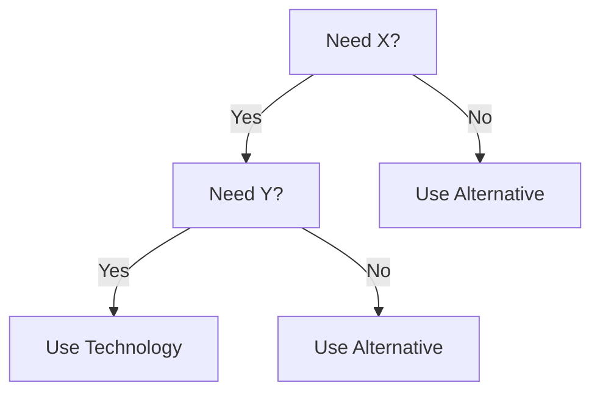
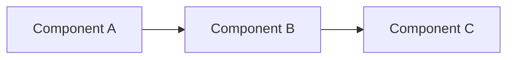
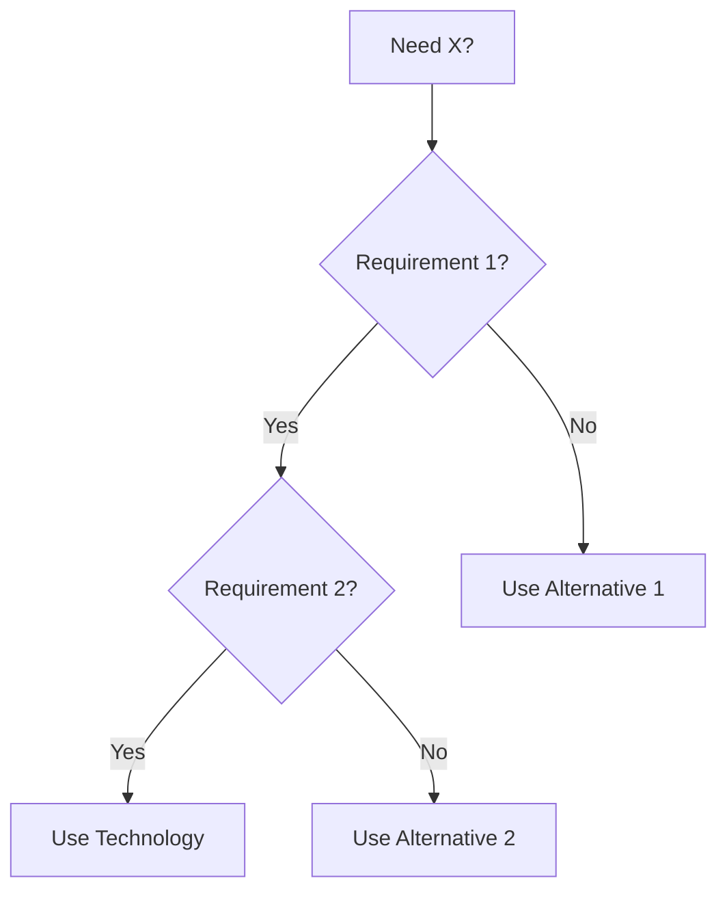
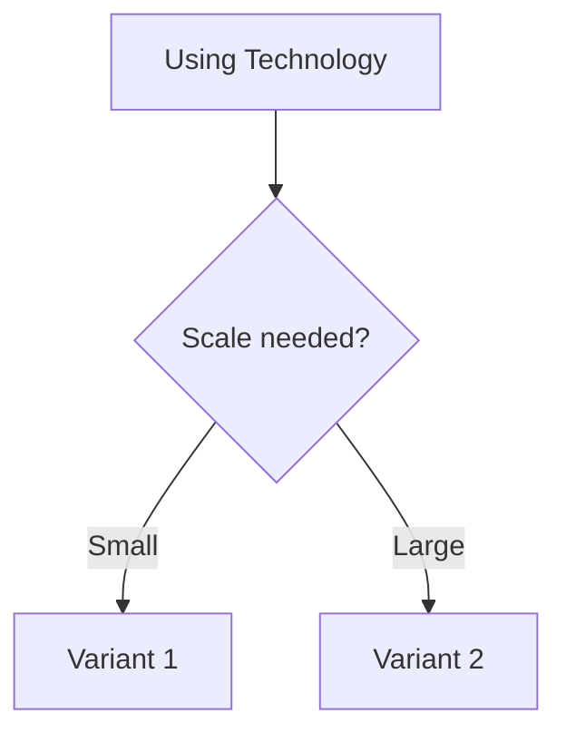

# Universal Technology Template

Every technology in the academy MUST follow this EXACT structure.

## File Structure

```
<technology>/
├── README.md                    # Main entry point
├── history.md                   # Origin story, founders, motivation
├── versions.md                  # Version-by-version changes
├── architecture.md              # System architecture, diagrams
├── core-concepts.md             # Fundamental building blocks
├── internals.md                 # How it works under the hood
├── lifecycle.md                 # Birth → Growth → Maturity → Decline
├── configuration.md             # All config options explained
├── installation.md              # Setup across platforms
├── project-structure.md         # Standard project layout
├── examples/
│   ├── README.md                # Examples index
│   ├── beginner/                # Getting started examples
│   ├── intermediate/            # Real-world examples
│   └── advanced/                # Expert-level examples
├── advanced-topics.md           # Expert concepts
├── performance.md               # Tuning, benchmarks, optimization
├── security.md                  # Security model, hardening, CVEs
├── monitoring.md                # Metrics, alerts, dashboards
├── production.md                # Production config, HA, DR
├── scaling.md                   # Scale strategies
├── best-practices.md            # Industry-proven practices
├── anti-patterns.md             # Bad practices, common mistakes
├── pitfalls.md                  # Gotchas, known issues
├── debugging.md                 # Debug techniques, tools
├── troubleshooting.md           # Common issues, solutions
├── migration.md                 # Upgrade paths, competitor migration
├── relationships.md             # Works with, alternatives, competitors
├── decision-tree.md             # When to use, when NOT to use
├── comparison.md                # vs Competitor1, vs Competitor2
├── corner-cases.md              # Edge cases, failure scenarios
├── production-playbook.md       # How companies use it
├── patterns.md                  # Technology-specific patterns
├── interview.md                 # Questions, answers, scenarios
├── hands-on-labs.md             # Practical exercises
├── assignments.md               # Practice projects
├── cheat-sheet.md               # Quick reference card
├── roadmap.md                   # Future, deprecations, trends
├── cross-links.md               # Prerequisites, related, next
└── references.md                # Books, links, documentation
```

## README.md Template

```markdown
# Technology Name

> One-line description

## Overview

2-3 paragraphs explaining what it is, why it exists, and what problem it solves.

## When to Use

### Use When
- Scenario 1
- Scenario 2

### Don't Use When
- Scenario 1
- Scenario 2

## Decision Tree



## Quick Start

```code
// Minimal working example
```

## Architecture



## Related Technologies

| Category | Technology | Relationship |
|----------|------------|--------------|
| Works With | X | Integration partner |
| Alternative | Y | Can replace |
| Competitor | Z | Direct competitor |
| Replacement | W | Replaces older tech |

## Core Concepts

1. **Concept A** - Description
2. **Concept B** - Description
3. **Concept C** - Description

## Internal Working

Brief explanation of how it works internally.

## Configuration

Key configuration options:
| Option | Default | Description |
|--------|---------|-------------|
| option1 | value | Description |

## Best Practices

1. Practice 1
2. Practice 2

## Anti-Patterns

1. Anti-pattern 1
2. Anti-pattern 2

## Performance

Key metrics and optimization tips.

## Security

Security model and hardening.

## Monitoring

What to monitor, alert thresholds.

## Production

Production configuration recommendations.

## Scaling

How to scale horizontally/vertically.

## Troubleshooting

| Symptom | Cause | Solution |
|---------|-------|----------|
| Issue 1 | Cause 1 | Fix 1 |

## Corner Cases

1. Edge case 1 - How to handle
2. Edge case 2 - How to handle

## Interview Questions

1. Q1?
2. Q2?
3. Q3?
4. Q4?
5. Q5?

## Hands-on Labs

1. Lab 1: Description
2. Lab 2: Description

## References

- [Official Docs](url)
- [Book 1](url)
- [Tutorial 1](url)

---
**Prerequisites:** [A](path) | [B](path)
**Related:** [C](path) | [D](path)
**Next:** [E](path)
**Used In:** [Module](path)
```

## history.md Template

```markdown
# Technology Name - History

## Origin Story

### The Problem
What problem existed that needed solving.

### The Founders
- **Name** - Background, role

### The Birth
When, where, why it was created.

## Development Timeline

| Year | Version | Event | Impact |
|------|---------|-------|--------|
| XXXX | X.X | Event | Impact |

## Key Milestones

### Era 1: [Name] (XXXX-XXXX)
Description of this era.

### Era 2: [Name] (XXXX-XXXX)
Description of this era.

## Current Status

- Community size
- Adoption level
- Maintenance status

## Future

What's coming next.
```

## versions.md Template

```markdown
# Technology Name - Version History

## Version X.Y.Z (YYYY-MM-DD)

### Features
- Feature 1 - Description
- Feature 2 - Description

### Improvements
- Improvement 1

### Changes
- Change 1

### Deprecated
- Feature being deprecated

### Removed
- Feature removed

### Security
- Security fix 1

### Why This Version
Motivation for this release.
```

## patterns.md Template

```markdown
# Technology Name - Patterns

## Pattern 1: [Name]

### Problem
What problem does this solve?

### Solution
How does this pattern solve it?

### Implementation
Code example.

### When to Use
- Use case 1
- Use case 2

### When NOT to Use
- Anti-use case 1

### Related Patterns
- Pattern A - Similar
- Pattern B - Complementary
```

## anti-patterns.md Template

```markdown
# Technology Name - Anti-Patterns

## Anti-Pattern 1: [Name]

### Description
What this anti-pattern looks like.

### Why It's Bad
Problems it causes.

### Example
Bad code/example.

### Better Approach
Correct way to do it.

### Impact
Performance, security, or reliability impact.
```

## decision-tree.md Template

```markdown
# Technology Name - Decision Tree

## Primary Decision



## Secondary Decisions

### Which version/variant?


## Comparison Matrix

| Criteria | Technology | Alt 1 | Alt 2 |
|----------|------------|-------|-------|
| Performance | High | Medium | Low |
| Learning Curve | Steep | Easy | Medium |
| Community | Large | Small | Medium |
```
