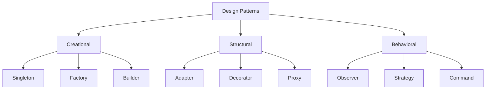

# Module 10: Design Patterns

## Overview
Design patterns are reusable solutions to common software design problems. They provide proven approaches for creating flexible, maintainable, and scalable code.

## Learning Objectives
- Understand GoF design patterns
- Apply creational patterns
- Use structural patterns
- Implement behavioral patterns
- Choose appropriate patterns

## Prerequisites
- OOP concepts
- Java fundamentals
- Problem-solving skills

## Why This Concept Exists
Without patterns:
- Reinventing solutions
- Inconsistent approaches
- Poor maintainability
- Design problems

Patterns provide:
- Proven solutions
- Common vocabulary
- Best practices
- Reusable designs

## Problem Statement
How do you solve recurring design problems effectively?

## Theory

### Pattern Categories

| Category | Purpose | Examples |
|----------|---------|----------|
| Creational | Object creation | Factory, Builder, Singleton |
| Structural | Object composition | Adapter, Decorator, Proxy |
| Behavioral | Object communication | Observer, Strategy, Command |

### Pattern List

| Pattern | Category | Use Case |
|---------|----------|----------|
| Singleton | Creational | Single instance |
| Factory | Creational | Object creation |
| Builder | Creational | Complex objects |
| Adapter | Structural | Interface conversion |
| Decorator | Structural | Add behavior |
| Proxy | Structural | Control access |
| Observer | Behavioral | Notifications |
| Strategy | Behavioral | Algorithm selection |
| Command | Behavioral | Encapsulate requests |

## Internal Working

### Pattern Selection
1. Identify problem
2. Find matching pattern
3. Adapt to context
4. Implement
5. Refactor

### Pattern Relationships
```
Creational → Structural → Behavioral
    ↓              ↓            ↓
 How to create  How to compose  How to interact
```

## JVM Perspective

### Pattern Usage in JDK
- Singleton: Runtime.getRuntime()
- Factory: Collection.iterator()
- Decorator: InputStream chain
- Proxy: java.lang.reflect.Proxy
- Observer: EventListener

## Architecture Diagram



## Syntax

### Singleton Pattern
```java
public class Singleton {
    private static Singleton instance;
    
    private Singleton() {}
    
    public static synchronized Singleton getInstance() {
        if (instance == null) {
            instance = new Singleton();
        }
        return instance;
    }
}
```

### Factory Pattern
```java
public interface Shape {
    void draw();
}

public class Circle implements Shape {
    @Override
    public void draw() {
        System.out.println("Drawing circle");
    }
}

public class Rectangle implements Shape {
    @Override
    public void draw() {
        System.out.println("Drawing rectangle");
    }
}

public class ShapeFactory {
    public static Shape create(String type) {
        return switch (type.toLowerCase()) {
            case "circle" -> new Circle();
            case "rectangle" -> new Rectangle();
            default -> throw new IllegalArgumentException("Unknown: " + type);
        };
    }
}
```

### Observer Pattern
```java
public interface Observer {
    void update(String event);
}

public class EventBus {
    private List<Observer> observers = new ArrayList<>();
    
    public void subscribe(Observer observer) {
        observers.add(observer);
    }
    
    public void publish(String event) {
        observers.forEach(o -> o.update(event));
    }
}
```

## Easy Example
```java
// Builder pattern
public class User {
    private final String name;
    private final String email;
    private final int age;
    
    private User(Builder builder) {
        this.name = builder.name;
        this.email = builder.email;
        this.age = builder.age;
    }
    
    public static class Builder {
        private String name;
        private String email;
        private int age;
        
        public Builder name(String name) {
            this.name = name;
            return this;
        }
        
        public Builder email(String email) {
            this.email = email;
            return this;
        }
        
        public Builder age(int age) {
            this.age = age;
            return this;
        }
        
        public User build() {
            return new User(this);
        }
    }
    
    public static void main(String[] args) {
        User user = new User.Builder()
            .name("John")
            .email("john@example.com")
            .age(30)
            .build();
    }
}
```

## Medium Example
```java
// Strategy pattern
public interface SortStrategy {
    void sort(int[] array);
}

public class BubbleSort implements SortStrategy {
    @Override
    public void sort(int[] array) {
        // Bubble sort implementation
    }
}

public class QuickSort implements SortStrategy {
    @Override
    public void sort(int[] array) {
        // Quick sort implementation
    }
}

public class Sorter {
    private SortStrategy strategy;
    
    public Sorter(SortStrategy strategy) {
        this.strategy = strategy;
    }
    
    public void sort(int[] array) {
        strategy.sort(array);
    }
    
    public static void main(String[] args) {
        Sorter sorter = new Sorter(new QuickSort());
        sorter.sort(new int[]{3, 1, 4, 1, 5});
    }
}
```

## Hard Example
```java
// Decorator pattern
public interface Coffee {
    double getCost();
    String getDescription();
}

public class SimpleCoffee implements Coffee {
    @Override
    public double getCost() { return 5.0; }
    
    @Override
    public String getDescription() { return "Simple coffee"; }
}

public abstract class CoffeeDecorator implements Coffee {
    protected Coffee coffee;
    
    public CoffeeDecorator(Coffee coffee) {
        this.coffee = coffee;
    }
}

public class MilkDecorator extends CoffeeDecorator {
    public MilkDecorator(Coffee coffee) {
        super(coffee);
    }
    
    @Override
    public double getCost() {
        return coffee.getCost() + 1.5;
    }
    
    @Override
    public String getDescription() {
        return coffee.getDescription() + ", milk";
    }
}

// Usage
Coffee coffee = new MilkDecorator(new SimpleCoffee());
System.out.println(coffee.getDescription()); // Simple coffee, milk
System.out.println(coffee.getCost()); // 6.5
```

## Enterprise Example
```java
// Command pattern
public interface Command {
    void execute();
    void undo();
}

public class CompositeCommand implements Command {
    private List<Command> commands = new ArrayList<>();
    
    public void addCommand(Command command) {
        commands.add(command);
    }
    
    @Override
    public void execute() {
        commands.forEach(Command::execute);
    }
    
    @Override
    public void undo() {
        ListIterator<Command> it = commands.listIterator(commands.size());
        while (it.hasPrevious()) {
            it.previous().undo();
        }
    }
}

// Text editor example
public class TextEditor {
    private StringBuilder content = new StringBuilder();
    private Stack<Command> history = new Stack<>();
    
    public void executeCommand(Command command) {
        command.execute();
        history.push(command);
    }
    
    public void undo() {
        if (!history.isEmpty()) {
            history.pop().undo();
        }
    }
}
```

## Performance Considerations
- Singleton can impact testing
- Factory adds indirection
- Decorator can deep nesting
- Proxy adds overhead

## Time & Space Complexity

| Pattern | Time | Space |
|---------|------|-------|
| Singleton | O(1) | O(1) |
| Factory | O(1) | O(1) |
| Builder | O(n) | O(fields) |
| Decorator | O(1) | O(decorators) |

## Thread Safety
- Singleton needs synchronization
- Factory can be thread-safe
- Decorator depends on wrapped object
- Proxy can be thread-safe

## Best Practices
1. Don't over-engineer
2. Choose appropriate pattern
3. Keep it simple
4. Document decisions
5. Refactor to pattern

## Common Mistakes
1. Using patterns unnecessarily
2. Overcomplicating design
3. Wrong pattern choice
4. Ignoring simplicity

## Comparison Table

| Pattern | Use Case | Complexity |
|---------|----------|------------|
| Singleton | Single instance | Low |
| Factory | Object creation | Low |
| Builder | Complex objects | Medium |
| Decorator | Add behavior | Medium |
| Strategy | Algorithm selection | Low |

## Interview Questions

### Q1: What is a design pattern?
**Answer:** Reusable solution to common software design problems.

### Q2: What are the three categories of patterns?
**Answer:** Creational, Structural, Behavioral.

### Q3: What is the Singleton pattern?
**Answer:** Ensures only one instance of a class exists.

### Q4: What is the Factory pattern?
**Answer:** Creates objects without specifying exact class.

### Q5: What is the Strategy pattern?
**Answer:** Defines family of algorithms and makes them interchangeable.

### Q6: What is the Observer pattern?
**Answer:** Defines one-to-many dependency between objects.

### Q7: What is the Decorator pattern?
**Answer:** Adds behavior to objects dynamically.

### Q8: What is the Adapter pattern?
**Answer:** Converts one interface to another.

### Q9: What is the Proxy pattern?
**Answer:** Provides surrogate or placeholder for another object.

### Q10: What is the Command pattern?
**Answer:** Encapsulates requests as objects.

### Q11: What is the difference between Factory and Abstract Factory?
**Answer:** Factory creates one product, Abstract Factory creates families.

### Q12: What is the difference between Strategy and State?
**Answer:** Strategy changes algorithm, State changes behavior based on state.

### Q13: What is the Template Method pattern?
**Answer:** Defines algorithm skeleton with some steps deferred to subclasses.

### Q14: What is the Facade pattern?
**Answer:** Provides simplified interface to complex subsystem.

### Q15: What is the Builder pattern?
**Answer:** Separates construction from representation.

## Exercises

### Easy
1. Implement Singleton
2. Create Factory pattern
3. Use Builder pattern

### Medium
1. Implement Observer pattern
2. Create Strategy pattern
3. Use Decorator pattern

### Hard
1. Implement Command pattern
2. Create Composite pattern
3. Use Flyweight pattern

## Summary
Design patterns provide proven solutions to common problems. Use them judiciously for better designs.

## References
- Design Patterns by GoF
- Head First Design Patterns
- Refactoring to Patterns
