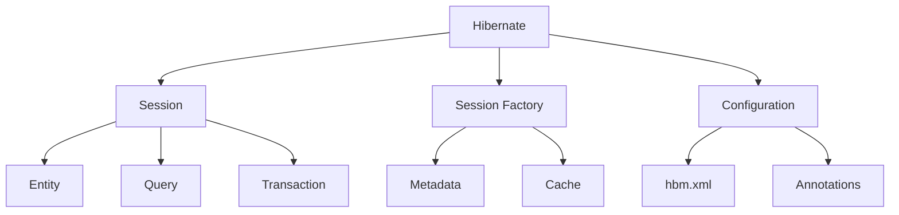
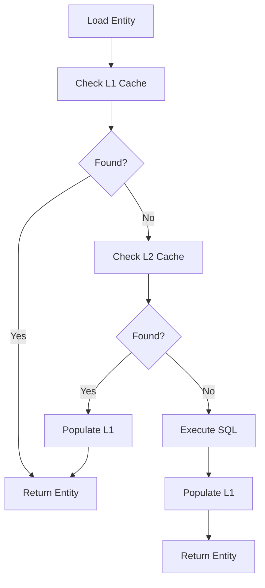

# Module 36: Hibernate

## Overview
Hibernate is an Object-Relational Mapping (ORM) framework for Java. It maps Java objects to database tables, handling persistence, relationships, caching, and query optimization.

## Learning Objectives
- Master entity mapping
- Understand relationships
- Use HQL and Criteria API
- Implement caching
- Handle transactions

## Prerequisites
- JPA basics
- SQL knowledge
- Java collections

## Why This Concept Exists
JDBC requires:
- Manual SQL writing
- Object-relational mapping
- Connection management
- Exception handling

Hibernate provides:
- Automatic mapping
- Relationship management
- Caching
- Query optimization
- Database independence

## Problem Statement
How do you efficiently map Java objects to relational database tables?

## Theory

### Mapping Annotations

| Annotation | Purpose |
|------------|---------|
| @Entity | Mark as entity |
| @Table | Database table |
| @Id | Primary key |
| @GeneratedValue | Auto-generation |
| @Column | Column mapping |
| @Transient | Ignore field |

### Relationship Types

| Type | Description |
|------|-------------|
| @OneToOne | One-to-one |
| @OneToMany | One-to-many |
| @ManyToOne | Many-to-one |
| @ManyToMany | Many-to-many |

### Cascade Types

| Type | Description |
|------|-------------|
| ALL | All operations |
| PERSIST | Persist only |
| MERGE | Merge only |
| REMOVE | Remove only |

## Internal Working

### Session Lifecycle
1. Create SessionFactory
2. Open Session
3. Begin Transaction
4. Execute operations
5. Commit/Rollback
6. Close Session

### Dirty Checking
- Track entity changes
- Auto-update on flush
- Batch SQL generation
- Optimistic locking

## JVM Perspective

### Proxy Generation
- Lazy loading proxies
- CGLIB enhancement
- Bytecode manipulation
- Field access vs property access

### Cache Levels
```
L1 Cache (Session):
┌─────────────────────────────────────┐
│ Persistence Context                 │
│  ├─ Managed entities                │
│  └─ Detached entities               │
└─────────────────────────────────────┘

L2 Cache (SessionFactory):
┌─────────────────────────────────────┐
│ Shared Cache                        │
│  ├─ Entity cache                    │
│  ├─ Collection cache                │
│  └─ Query cache                     │
└─────────────────────────────────────┘
```

## Architecture Diagram



## Flow Diagram



## Syntax

### Entity Mapping
```java
import jakarta.persistence.*;

@Entity
@Table(name = "users")
public class User {
    @Id
    @GeneratedValue(strategy = GenerationType.IDENTITY)
    private Long id;
    
    @Column(nullable = false, length = 100)
    private String name;
    
    @Column(unique = true)
    private String email;
    
    @Enumerated(EnumType.STRING)
    private UserStatus status;
    
    @Transient
    private String temporaryField;
    
    @Version
    private Long version;
}
```

### Relationships
```java
// One-to-Many
@Entity
public class User {
    @OneToMany(mappedBy = "user", cascade = CascadeType.ALL)
    private List<Order> orders;
}

// Many-to-One
@Entity
public class Order {
    @ManyToOne(fetch = FetchType.LAZY)
    @JoinColumn(name = "user_id")
    private User user;
}

// Many-to-Many
@Entity
public class Student {
    @ManyToMany
    @JoinTable(
        name = "student_course",
        joinColumns = @JoinColumn(name = "student_id"),
        inverseJoinColumns = @JoinColumn(name = "course_id")
    )
    private Set<Course> courses;
}
```

### HQL Queries
```java
// HQL
Query query = session.createQuery("FROM User WHERE age > :age");
query.setParameter("age", 18);
List<User> users = query.list();

// Criteria API
CriteriaBuilder cb = session.getCriteriaBuilder();
CriteriaQuery<User> criteria = cb.createQuery(User.class);
Root<User> root = criteria.from(User.class);
criteria.select(root).where(cb.gt(root.get("age"), 18));
List<User> users = session.createQuery(criteria).getResultList();
```

## Easy Example
```java
import jakarta.persistence.*;
import org.hibernate.Session;
import org.hibernate.SessionFactory;
import org.hibernate.cfg.Configuration;

public class EasyExample {
    public static void main(String[] args) {
        SessionFactory factory = new Configuration()
            .configure()
            .addAnnotatedClass(User.class)
            .buildSessionFactory();
        
        // Create user
        Session session = factory.openSession();
        session.beginTransaction();
        
        User user = new User("John", "john@example.com");
        session.persist(user);
        
        session.getTransaction().commit();
        session.close();
        
        factory.close();
    }
}

@Entity
class User {
    @Id
    @GeneratedValue
    private Long id;
    private String name;
    private String email;
    
    public User() {}
    public User(String name, String email) {
        this.name = name;
        this.email = email;
    }
}
```

## Medium Example
```java
import jakarta.persistence.*;
import org.hibernate.Session;
import java.util.List;

public class MediumExample {
    // Relationship mapping
    @Entity
    public class Order {
        @Id
        @GeneratedValue
        private Long id;
        
        @ManyToOne(fetch = FetchType.LAZY)
        @JoinColumn(name = "user_id")
        private User user;
        
        @OneToMany(mappedBy = "order", cascade = CascadeType.ALL)
        private List<OrderItem> items;
    }
    
    // Query with relationships
    public List<Order> findOrdersByUser(String userName) {
        Session session = sessionFactory.openSession();
        List<Order> orders = session.createQuery(
            "SELECT o FROM Order o JOIN o.user u WHERE u.name = :name",
            Order.class)
            .setParameter("name", userName)
            .getResultList();
        session.close();
        return orders;
    }
}
```

## Hard Example
```java
import jakarta.persistence.*;
import org.hibernate.*;
import org.hibernate.criterion.*;

public class HardExample {
    // Criteria API with projections
    public List<Object[]> getUserStatistics() {
        Session session = sessionFactory.openSession();
        CriteriaBuilder cb = session.getCriteriaBuilder();
        CriteriaQuery<Object[]> criteria = cb.createQuery(Object[].class);
        Root<User> root = criteria.from(User.class);
        
        criteria.multiselect(
            root.get("department"),
            cb.count(root),
            cb.avg(root.get("age"))
        ).groupBy(root.get("department"));
        
        return session.createQuery(criteria).getResultList();
    }
    
    // Batch processing
    public void batchInsert(List<User> users) {
        Session session = sessionFactory.openSession();
        Transaction tx = session.beginTransaction();
        
        for (int i = 0; i < users.size(); i++) {
            session.persist(users.get(i));
            if (i % 50 == 0) {
                session.flush();
                session.clear();
            }
        }
        
        tx.commit();
        session.close();
    }
}
```

## Enterprise Example
```java
import jakarta.persistence.*;
import org.hibernate.*;
import org.hibernate.annotations.*;
import java.time.LocalDateTime;

// Auditing
@Entity
@EntityListeners(AuditingEntityListener.class)
public class AuditedEntity {
    @Id
    @GeneratedValue
    private Long id;
    
    @CreatedDate
    private LocalDateTime createdAt;
    
    @LastModifiedDate
    private LocalDateTime updatedAt;
    
    @Version
    private Long version;
}

// Optimistic locking
@Entity
public class Account {
    @Id
    @GeneratedValue
    private Long id;
    
    private double balance;
    
    @Version
    private Long version;
    
    public void transfer(double amount) {
        this.balance += amount;
    }
}

// Second-level cache
@Entity
@Cacheable
@org.hibernate.annotations.Cache(usage = CacheConcurrencyStrategy.READ_WRITE)
public class CachedEntity {
    @Id
    @GeneratedValue
    private Long id;
    
    private String data;
}
```

## Performance Considerations
- Use second-level cache
- Enable batch fetching
- Avoid N+1 queries
- Use read-only transactions
- Lazy load associations

## Time & Space Complexity
| Operation | Time | Space |
|-----------|------|-------|
| Load entity | O(1) | O(1) |
| Query | O(n) | O(n) |
| Save | O(1) | O(1) |
| Update | O(1) | O(1) |

## Thread Safety
- Session is not thread-safe
- SessionFactory is thread-safe
- Use one session per thread
- Use @Transactional

## Best Practices
1. Use @GeneratedValue for IDs
2. Prefer FetchType.LAZY
3. Use batch processing
4. Enable second-level cache
5. Use optimistic locking

## Common Mistakes
1. N+1 query problems
2. LazyInitializationException
3. Missing @Transactional
4. Not using batch processing

## Pitfalls & Warnings
1. Transient state issues
2. Detached entity problems
3. Cascade delete issues
4. Locking conflicts

## Debugging Tips
1. Enable SQL logging
2. Use statistics API
3. Monitor query performance
4. Check generated SQL

## Comparison Table

| Feature | Hibernate | JPA | JDBC |
|---------|-----------|-----|------|
| Mapping | Full | Partial | None |
| Caching | L1/L2 | Optional | None |
| Query | HQL/Criteria | JPQL | SQL |
| Relationships | Full | Full | Manual |

## Decision Tree

```mermaid
graph TD
    A[Persistence] --> B{Complexity?}
    B -->|Simple| C[JDBC]
    B -->|Medium| D[JPA]
    B -->|Complex| E[Hibernate]
    
    F[Relationships] --> G{Type?}
    G -->|One-to-One| H[@OneToOne]
    G -->|One-to-Many| I[@OneToMany]
    G -->|Many-to-Many| J[@ManyToMany]
```

## Interview Questions

### Q1: What is Hibernate?
**Answer:** ORM framework for Java that maps objects to database tables.

### Q2: What is the difference between Session and SessionFactory?
**Answer:** SessionFactory is thread-safe factory, Session is per-thread unit of work.

### Q3: What is lazy loading?
**Answer:** Loading data only when accessed, not immediately.

### Q4: What is the N+1 problem?
**Answer:** Multiple queries when one would suffice for relationships.

### Q5: What is second-level cache?
**Answer:** Shared cache across sessions for entities.

### Q6: What is HQL?
**Answer:** Hibernate Query Language, similar to SQL but for entities.

### Q7: What is dirty checking?
**Answer:** Automatic detection of entity changes for updates.

### Q8: What is the difference between merge and update?
**Answer:** merge returns new instance, update modifies detached entity.

### Q9: What is optimistic locking?
**Answer:** Using version field to detect concurrent modifications.

### Q10: What is cascade?
**Answer:** Propagation of operations to related entities.

### Q11: What is @FetchMode?
**Answer:** Defines how collections are fetched (JOIN, SELECT, SUBSELECT).

### Q12: What is the difference between HQL and SQL?
**Answer:** HQL uses entity names, SQL uses table names.

### Q13: What is Criteria API?
**Answer:** Type-safe query building without string queries.

### Q14: What is the difference between get and load?
**Answer:** get returns null if not found, load throws exception.

### Q15: What is the difference between open-in-view and transaction?
**Answer:** open-in-view keeps session open, transaction closes after commit.

## Exercises

### Easy
1. Create entity with annotations
2. Map one-to-many relationship
3. Use HQL to query

### Medium
1. Implement second-level cache
2. Use Criteria API
3. Handle batch processing

### Hard
1. Implement audit logging
2. Create custom dialect
3. Optimize performance

## Summary
Hibernate provides comprehensive ORM with caching, relationships, and query optimization.

## References
- Hibernate Documentation
- JPA Specification
- Baeldung Hibernate Guide
