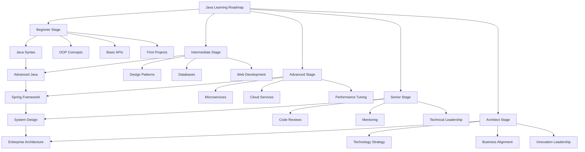

# Module 00: Java Learning Roadmaps

## Introduction

This module provides comprehensive learning roadmaps for Java developers at all levels. Whether you're a complete beginner or an experienced developer aiming for architect roles, these roadmaps will guide your learning journey with clear milestones, time estimates, and curated resources.

## Learning Objectives

- Understand the complete Java ecosystem and career progression
- Identify your current level and set clear learning goals
- Follow structured paths from beginner to architect
- Access curated resources for each learning stage
- Track progress with measurable milestones

## Prerequisites

- Basic computer literacy
- Willingness to learn and practice consistently
- Access to a computer with internet connection
- Text editor or IDE (IntelliJ IDEA recommended)

## Why This Concept Exists

The Java ecosystem is vast and constantly evolving. Without a clear roadmap, developers often:
- Jump between topics without building foundational knowledge
- Miss critical concepts needed for career advancement
- Waste time on outdated or irrelevant technologies
- Struggle to see the big picture of their learning journey

A structured roadmap provides direction, motivation, and a clear path to mastery.

## Problem Statement

**Scenario**: A beginner Java developer wants to become a Java Architect but doesn't know where to start or what to learn in what order.

**Without a roadmap**:
- Random learning with no clear progression
- Knowledge gaps that cause problems later
- Inability to make informed career decisions
- Frustration and potential abandonment of learning goals

**With a roadmap**:
- Clear milestones and time estimates
- Logical progression of concepts
- Resource recommendations at each stage
- Motivation through visible progress

## Theory

### The Java Career Ladder

1. **Beginner (0-6 months)**
   - Java fundamentals
   - Basic OOP concepts
   - Simple applications

2. **Intermediate (6-18 months)**
   - Advanced Java features
   - Design patterns
   - Database connectivity
   - Web development basics

3. **Advanced (18-36 months)**
   - Enterprise frameworks (Spring, Hibernate)
   - Microservices architecture
   - Cloud deployment
   - Performance optimization

4. **Senior Developer (3-5 years)**
   - System design
   - Code review expertise
   - Mentoring skills
   - Technical decision making

5. **Architect (5+ years)**
   - Enterprise architecture
   - Technology strategy
   - Cross-system integration
   - Business-IT alignment

## Internal Working

### How Learning Progression Works

1. **Foundation Building**: Master core concepts before moving to advanced topics
2. **Practical Application**: Apply theoretical knowledge through projects
3. **Feedback Loop**: Get feedback through code reviews, tests, and real-world usage
4. **Iterative Improvement**: Revisit concepts at higher levels of understanding

### The 70-20-10 Learning Model

- **70% Experiential Learning**: Hands-on coding and projects
- **20% Social Learning**: Mentoring, code reviews, pair programming
- **10% Formal Learning**: Courses, books, tutorials

## JVM Perspective

Understanding JVM internals becomes crucial at advanced stages:
- **Memory Management**: Required for performance optimization
- **Garbage Collection**: Essential for tuning production applications
- **Class Loading**: Important for plugin architectures and frameworks
- **JIT Compilation**: Critical for performance optimization

## Memory Representation

Learning progress can be conceptualized as building mental models:
- **Conceptual Knowledge**: Stored as mental frameworks
- **Procedural Knowledge**: Stored as muscle memory through practice
- **Declarative Knowledge**: Stored as facts and principles

## Architecture Diagram (Mermaid)



## Flow Diagram (Mermaid)

```mermaid
flowchart TD
    Start([Start Learning Journey]) --> Assess{Assess Current Level}
    
    Assess -->|Beginner| BeginnerPath[Beginner Learning Path]
    Assess -->|Intermediate| IntermediatePath[Intermediate Learning Path]
    Assess -->|Advanced| AdvancedPath[Advanced Learning Path]
    Assess -->|Senior| SeniorPath[Senior Learning Path]
    Assess -->|Architect| ArchitectPath[Architect Learning Path]
    
    BeginnerPath --> LearnBasics[Learn Java Basics<br/>3-4 months]
    LearnBasics --> PracticeBasic[Practice with Small Projects<br/>1-2 months]
    PracticeBasic --> LearnOOP[Learn OOP Concepts<br/>2-3 months]
    LearnOOP --> BuildFoundation[Build Foundation Projects<br/>2-3 months]
    BuildFoundation --> IntermediateReady{Ready for Intermediate?}
    
    IntermediateReady -->|Yes| IntermediatePath
    IntermediateReady -->|No| ReviewBasics[Review Fundamentals]
    ReviewBasics --> BuildFoundation
    
    IntermediatePath --> LearnAdvanced[Learn Advanced Java<br/>3-4 months]
    LearnAdvanced --> LearnPatterns[Learn Design Patterns<br/>2-3 months]
    LearnPatterns --> LearnDB[Learn Databases<br/>2-3 months]
    LearnDB --> LearnWeb[Learn Web Development<br/>3-4 months]
    LearnWeb --> BuildIntermediate[Build Intermediate Projects<br/>3-4 months]
    BuildIntermediate --> AdvancedReady{Ready for Advanced?}
    
    AdvancedReady -->|Yes| AdvancedPath
    AdvancedReady -->|No| ReviewIntermediate[Review Intermediate Topics]
    ReviewIntermediate --> BuildIntermediate
    
    AdvancedPath --> LearnSpring[Learn Spring Framework<br/>4-6 months]
    LearnSpring --> LearnMicroservices[Learn Microservices<br/>3-4 months]
    LearnMicroservices --> LearnCloud[Learn Cloud Services<br/>3-4 months]
    LearnCloud --> LearnPerformance[Learn Performance Tuning<br/>2-3 months]
    LearnPerformance --> BuildAdvanced[Build Advanced Projects<br/>4-6 months]
    BuildAdvanced --> SeniorReady{Ready for Senior?}
    
    SeniorReady -->|Yes| SeniorPath
    SeniorReady -->|No| ReviewAdvanced[Review Advanced Topics]
    ReviewAdvanced --> BuildAdvanced
    
    SeniorPath --> LearnSystemDesign[Learn System Design<br/>3-4 months]
    LearnSystemDesign --> PracticeReviews[Practice Code Reviews<br/>Ongoing]
    PracticeReviews --> LearnMentoring[Learn Mentoring Skills<br/>2-3 months]
    LearnMentoring --> LeadProjects[Lead Technical Projects<br/>6-12 months]
    LeadProjects --> ArchitectReady{Ready for Architect?}
    
    ArchitectReady -->|Yes| ArchitectPath
    ArchitectReady -->|No| ReviewSenior[Review Senior Topics]
    ReviewSenior --> LeadProjects
    
    ArchitectPath --> LearnEnterprise[Learn Enterprise Architecture<br/>6-12 months]
    LearnEnterprise --> LearnStrategy[Learn Technology Strategy<br/>3-6 months]
    LearnStrategy --> AlignBusiness[Align with Business Goals<br/>3-6 months]
    AlignBusiness --> LeadInnovation[Lead Innovation Initiatives<br/>Ongoing]
    LeadInnovation --> Mastery([Achieve Mastery])
```



## Beginner Stage (0-6 months)

### Learning Path
1. **Java Syntax and Basics** (1-2 months)
   - Variables, data types, operators
   - Control structures (if/else, loops)
   - Arrays and basic data structures
   - Methods and functions

2. **Object-Oriented Programming** (2-3 months)
   - Classes and objects
   - Inheritance and polymorphism
   - Encapsulation and abstraction
   - Interfaces and abstract classes

3. **Basic APIs** (1-2 months)
   - String manipulation
   - Collections framework basics
   - Exception handling
   - File I/O

### Time Estimate: 3-6 months (20-25 hours/week)

### Resources
- **Books**: "Head First Java", "Java: A Beginner's Guide"
- **Online**: Oracle Java Tutorials, Codecademy Java Course
- **Practice**: HackerRank Java, LeetCode Easy problems
- **Projects**: Calculator, To-do list, Simple game

### Milestones
- [ ] Write a complete Java program from scratch
- [ ] Implement basic OOP concepts
- [ ] Use collections to manage data
- [ ] Handle exceptions properly
- [ ] Build 3-5 small projects

## Intermediate Stage (6-18 months)

### Learning Path
1. **Advanced Java Features** (3-4 months)
   - Generics
   - Collections framework advanced
   - Lambda expressions and functional interfaces
   - Streams API basics
   - Concurrency fundamentals

2. **Design Patterns** (2-3 months)
   - Creational patterns (Singleton, Factory, Builder)
   - Structural patterns (Adapter, Decorator, Proxy)
   - Behavioral patterns (Observer, Strategy, Command)

3. **Database Connectivity** (2-3 months)
   - JDBC fundamentals
   - Connection pooling
   - Basic ORM concepts
   - SQL fundamentals

4. **Web Development Basics** (3-4 months)
   - HTTP protocol fundamentals
   - Servlets and JSP basics
   - RESTful web services
   - Introduction to Spring Framework

### Time Estimate: 6-12 months (20-30 hours/week)

### Resources
- **Books**: "Effective Java", "Head First Design Patterns"
- **Online**: Pluralsight Java Paths, Udemy Java Courses
- **Practice**: LeetCode Medium problems, CodeWars
- **Projects**: Web application, REST API, Database-driven application

### Milestones
- [ ] Implement design patterns in projects
- [ ] Build a complete web application
- [ ] Create RESTful APIs
- [ ] Connect to databases efficiently
- [ ] Use concurrency correctly

## Advanced Stage (18-36 months)

### Learning Path
1. **Spring Framework** (4-6 months)
   - Spring Core and DI
   - Spring Boot
   - Spring MVC
   - Spring Data
   - Spring Security

2. **Microservices Architecture** (3-4 months)
   - Microservices principles
   - Service discovery
   - API gateways
   - Inter-service communication
   - Event-driven architecture

3. **Cloud Services** (3-4 months)
   - Cloud fundamentals (AWS/Azure/GCP)
   - Containerization (Docker)
   - Orchestration (Kubernetes)
   - CI/CD pipelines

4. **Performance Tuning** (2-3 months)
   - Profiling tools
   - Memory optimization
   - Thread pool tuning
   - Database performance

### Time Estimate: 12-18 months (25-35 hours/week)

### Resources
- **Books**: "Spring in Action", "Cloud Native Java"
- **Online**: Spring Official Tutorials, AWS/Azure/GCP Documentation
- **Practice**: LeetCode Hard problems, System design interviews
- **Projects**: Microservices application, Cloud deployment, Performance-critical system

### Milestones
- [ ] Build a production-ready Spring application
- [ ] Deploy to cloud environment
- [ ] Implement microservices architecture
- [ ] Optimize application performance
- [ ] Set up CI/CD pipeline

## Senior Stage (3-5 years)

### Learning Path
1. **System Design** (3-4 months)
   - Distributed systems principles
   - System design patterns
   - Scalability concepts
   - Reliability engineering

2. **Code Review Expertise** (Ongoing)
   - Code quality standards
   - Architecture review
   - Performance review
   - Security review

3. **Mentoring Skills** (2-3 months)
   - Teaching techniques
   - Feedback delivery
   - Career guidance
   - Knowledge sharing

4. **Technical Leadership** (6-12 months)
   - Technical decision making
   - Stakeholder communication
   - Project planning
   - Risk management

### Time Estimate: 2-3 years (continuous learning)

### Resources
- **Books**: "Designing Data-Intensive Applications", "The Manager's Path"
- **Online**: System Design courses, Leadership training
- **Practice**: Lead technical projects, Conduct code reviews
- **Projects**: Large-scale systems, Architecture documentation

### Milestones
- [ ] Design a scalable system architecture
- [ ] Lead a team of developers
- [ ] Make critical technical decisions
- [ ] Mentor junior developers
- [ ] Present technical strategy to stakeholders

## Architect Stage (5+ years)

### Learning Path
1. **Enterprise Architecture** (6-12 months)
   - Enterprise architecture frameworks (TOGAF, Zachman)
   - Domain-driven design
   - Event sourcing and CQRS
   - Integration patterns

2. **Technology Strategy** (3-6 months)
   - Technology evaluation
   - Roadmap planning
   - Vendor assessment
   - Cost optimization

3. **Business-IT Alignment** (3-6 months)
   - Business process modeling
   - Requirements translation
   - Value stream mapping
   - ROI analysis

4. **Innovation Leadership** (Ongoing)
   - Technology radar
   - Proof of concept development
   - Innovation culture
   - Emerging technologies evaluation

### Time Estimate: Ongoing professional development

### Resources
- **Books**: "Enterprise Integration Patterns", "Domain-Driven Design"
- **Online**: Architecture conferences, Executive education courses
- **Practice**: Lead enterprise initiatives, Advise on technology strategy
- **Projects**: Enterprise architecture, Technology roadmap, Innovation labs

### Milestones
- [ ] Define enterprise architecture standards
- [ ] Lead technology strategy decisions
- [ ] Align IT with business objectives
- [ ] Drive innovation initiatives
- [ ] Mentor other architects

## Syntax

### Roadmap Progress Tracking Template

```java
public class LearningProgress {
    private String stage;
    private List<String> completedTopics;
    private List<String> currentTopics;
    private List<String> upcomingTopics;
    private LocalDateTime startDate;
    private LocalDateTime lastUpdated;
    
    // Methods for tracking progress
    public void markTopicComplete(String topic) {
        // Implementation
    }
    
    public double getCompletionPercentage() {
        // Calculate based on completed vs total topics
        return 0.0;
    }
    
    public String getNextMilestone() {
        // Return next milestone to achieve
        return "";
    }
}
```

## Easy Example

### Simple Progress Tracker

```java
import java.time.LocalDate;
import java.util.ArrayList;
import java.util.List;

public class SimpleProgressTracker {
    private String currentStage = "Beginner";
    private List<String> completedTopics = new ArrayList<>();
    private LocalDate startDate = LocalDate.now();
    
    public void completeTopic(String topic) {
        completedTopics.add(topic);
        System.out.println("Completed: " + topic);
        System.out.println("Total completed: " + completedTopics.size());
    }
    
    public void displayProgress() {
        System.out.println("Current Stage: " + currentStage);
        System.out.println("Topics Completed: " + completedTopics.size());
        System.out.println("Days Learning: " + 
            java.time.temporal.ChronoUnit.DAYS.between(startDate, LocalDate.now()));
    }
    
    public static void main(String[] args) {
        SimpleProgressTracker tracker = new SimpleProgressTracker();
        tracker.completeTopic("Java Syntax");
        tracker.completeTopic("OOP Basics");
        tracker.displayProgress();
    }
}
```

## Medium Example

### Learning Roadmap Implementation

```java
import java.time.LocalDate;
import java.util.*;
import java.util.stream.Collectors;

public class LearningRoadmap {
    private Map<String, List<Topic>> stages;
    private Map<String, Boolean> topicCompletion;
    private LocalDate startDate;
    
    public LearningRoadmap() {
        stages = new LinkedHashMap<>();
        topicCompletion = new HashMap<>();
        startDate = LocalDate.now();
        initializeRoadmap();
    }
    
    private void initializeRoadmap() {
        // Beginner Stage
        List<Topic> beginnerTopics = Arrays.asList(
            new Topic("Java Syntax", 4, "Variables, operators, control structures"),
            new Topic("OOP Concepts", 6, "Classes, objects, inheritance, polymorphism"),
            new Topic("Basic APIs", 4, "Strings, collections, exceptions"),
            new Topic("First Projects", 6, "Calculator, to-do list, simple game")
        );
        stages.put("Beginner", beginnerTopics);
        
        // Intermediate Stage
        List<Topic> intermediateTopics = Arrays.asList(
            new Topic("Advanced Java", 8, "Generics, lambdas, streams"),
            new Topic("Design Patterns", 6, "Creational, structural, behavioral"),
            new Topic("Databases", 6, "JDBC, SQL, basic ORM"),
            new Topic("Web Development", 8, "HTTP, Servlets, REST, Spring basics")
        );
        stages.put("Intermediate", intermediateTopics);
        
        // Add more stages as needed...
    }
    
    public void completeTopic(String stage, String topicName) {
        String key = stage + ":" + topicName;
        topicCompletion.put(key, true);
        System.out.println("Completed: " + topicName + " in " + stage);
    }
    
    public double getStageProgress(String stage) {
        List<Topic> topics = stages.get(stage);
        if (topics == null) return 0.0;
        
        long completed = topics.stream()
            .filter(t -> topicCompletion.containsKey(stage + ":" + t.getName()))
            .count();
        return (double) completed / topics.size() * 100;
    }
    
    public String getCurrentFocus() {
        for (Map.Entry<String, List<Topic>> entry : stages.entrySet()) {
            for (Topic topic : entry.getValue()) {
                String key = entry.getKey() + ":" + topic.getName();
                if (!topicCompletion.containsKey(key)) {
                    return entry.getKey() + ": " + topic.getName();
                }
            }
        }
        return "All stages completed!";
    }
    
    public static void main(String[] args) {
        LearningRoadmap roadmap = new LearningRoadmap();
        roadmap.completeTopic("Beginner", "Java Syntax");
        roadmap.completeTopic("Beginner", "OOP Concepts");
        
        System.out.println("Beginner Progress: " + 
            String.format("%.1f%%", roadmap.getStageProgress("Beginner")));
        System.out.println("Current Focus: " + roadmap.getCurrentFocus());
    }
}

class Topic {
    private String name;
    private int estimatedHours;
    private String description;
    
    public Topic(String name, int estimatedHours, String description) {
        this.name = name;
        this.estimatedHours = estimatedHours;
        this.description = description;
    }
    
    public String getName() { return name; }
    public int getEstimatedHours() { return estimatedHours; }
    public String getDescription() { return description; }
}
```

## Hard Example

### Comprehensive Learning Management System

```java
import java.time.*;
import java.util.*;
import java.util.concurrent.*;
import java.util.stream.*;

public class LearningManagementSystem {
    private Map<String, LearningStage> stages;
    private Map<String, UserProfile> users;
    private List<LearningEvent> events;
    private ScheduledExecutorService scheduler;
    
    public LearningManagementSystem() {
        stages = new ConcurrentHashMap<>();
        users = new ConcurrentHashMap<>();
        events = new CopyOnWriteArrayList<>();
        scheduler = Executors.newScheduledThreadPool(2);
        initializeSystem();
    }
    
    private void initializeSystem() {
        // Initialize all learning stages with detailed content
        initializeBeginnerStage();
        initializeIntermediateStage();
        initializeAdvancedStage();
        initializeSeniorStage();
        initializeArchitectStage();
    }
    
    private void initializeBeginnerStage() {
        LearningStage beginner = new LearningStage("Beginner", 6, 20);
        
        // Add topics with dependencies
        Topic javaSyntax = new Topic("Java Syntax", 4, "Core language fundamentals");
        javaSyntax.addDependency(null); // No dependencies
        
        Topic oopConcepts = new Topic("OOP Concepts", 6, "Object-oriented programming");
        oopConcepts.addDependency("Java Syntax");
        
        Topic basicApis = new Topic("Basic APIs", 4, "Standard library usage");
        basicApis.addDependency("Java Syntax");
        
        Topic firstProjects = new Topic("First Projects", 6, "Practical application");
        firstProjects.addDependency("OOP Concepts");
        firstProjects.addDependency("Basic APIs");
        
        beginner.addTopic(javaSyntax);
        beginner.addTopic(oopConcepts);
        beginner.addTopic(basicApis);
        beginner.addTopic(firstProjects);
        
        stages.put("Beginner", beginner);
    }
    
    // Similar initialization for other stages...
    
    public void enrollUser(String userId, String userName) {
        UserProfile profile = new UserProfile(userId, userName);
        users.put(userId, profile);
        events.add(new LearningEvent("ENROLLMENT", userId, "System", 
            "User enrolled: " + userName));
    }
    
    public void completeTopic(String userId, String stageName, String topicName) {
        UserProfile profile = users.get(userId);
        if (profile != null) {
            profile.completeTopic(stageName, topicName);
            events.add(new LearningEvent("TOPIC_COMPLETE", userId, stageName, 
                "Completed: " + topicName));
            
            // Check for stage completion
            LearningStage stage = stages.get(stageName);
            if (stage != null && stage.isStageComplete(profile)) {
                events.add(new LearningEvent("STAGE_COMPLETE", userId, stageName, 
                    "Completed stage: " + stageName));
            }
        }
    }
    
    public LearningReport generateReport(String userId) {
        UserProfile profile = users.get(userId);
        if (profile == null) return null;
        
        LearningReport report = new LearningReport(userId);
        
        for (Map.Entry<String, LearningStage> entry : stages.entrySet()) {
            StageProgress progress = new StageProgress(entry.getKey());
            progress.setCompletionPercentage(
                entry.getValue().getCompletionPercentage(profile));
            progress.setEstimatedTimeRemaining(
                entry.getValue().getEstimatedTimeRemaining(profile));
            report.addStageProgress(progress);
        }
        
        return report;
    }
    
    public List<LearningEvent> getRecentEvents(int count) {
        return events.stream()
            .sorted(Comparator.comparing(LearningEvent::getTimestamp).reversed())
            .limit(count)
            .collect(Collectors.toList());
    }
    
    public void startReminderService() {
        scheduler.scheduleAtFixedRate(() -> {
            // Send reminders to users who haven't logged in recently
            System.out.println("Checking for inactive users...");
        }, 1, 24, TimeUnit.HOURS);
    }
    
    public static void main(String[] args) {
        LearningManagementSystem lms = new LearningManagementSystem();
        
        // Enroll a user
        lms.enrollUser("user1", "John Developer");
        
        // Complete some topics
        lms.completeTopic("user1", "Beginner", "Java Syntax");
        lms.completeTopic("user1", "Beginner", "OOP Concepts");
        
        // Generate report
        LearningReport report = lms.generateReport("user1");
        System.out.println("User Progress Report:");
        System.out.println(report);
        
        // Get recent events
        System.out.println("\nRecent Events:");
        lms.getRecentEvents(5).forEach(System.out::println);
    }
}

class LearningStage {
    private String name;
    private int durationMonths;
    private int hoursPerWeek;
    private List<Topic> topics;
    
    public LearningStage(String name, int durationMonths, int hoursPerWeek) {
        this.name = name;
        this.durationMonths = durationMonths;
        this.hoursPerWeek = hoursPerWeek;
        this.topics = new ArrayList<>();
    }
    
    public void addTopic(Topic topic) {
        topics.add(topic);
    }
    
    public boolean isStageComplete(UserProfile profile) {
        return topics.stream()
            .allMatch(topic -> profile.hasCompletedTopic(name, topic.getName()));
    }
    
    public double getCompletionPercentage(UserProfile profile) {
        long completed = topics.stream()
            .filter(topic -> profile.hasCompletedTopic(name, topic.getName()))
            .count();
        return (double) completed / topics.size() * 100;
    }
    
    public int getEstimatedTimeRemaining(UserProfile profile) {
        return (int) topics.stream()
            .filter(topic -> !profile.hasCompletedTopic(name, topic.getName()))
            .mapToInt(Topic::getEstimatedHours)
            .sum();
    }
}

class Topic {
    private String name;
    private int estimatedHours;
    private String description;
    private Set<String> dependencies;
    
    public Topic(String name, int estimatedHours, String description) {
        this.name = name;
        this.estimatedHours = estimatedHours;
        this.description = description;
        this.dependencies = new HashSet<>();
    }
    
    public void addDependency(String dependency) {
        if (dependency != null) {
            dependencies.add(dependency);
        }
    }
    
    // Getters
    public String getName() { return name; }
    public int getEstimatedHours() { return estimatedHours; }
    public String getDescription() { return description; }
    public Set<String> getDependencies() { return dependencies; }
}

class UserProfile {
    private String userId;
    private String userName;
    private Map<String, Set<String>> completedTopics;
    private LocalDate enrollmentDate;
    private LocalDate lastActivity;
    
    public UserProfile(String userId, String userName) {
        this.userId = userId;
        this.userName = userName;
        this.completedTopics = new ConcurrentHashMap<>();
        this.enrollmentDate = LocalDate.now();
        this.lastActivity = LocalDate.now();
    }
    
    public void completeTopic(String stage, String topic) {
        completedTopics.computeIfAbsent(stage, k -> new HashSet<>()).add(topic);
        lastActivity = LocalDate.now();
    }
    
    public boolean hasCompletedTopic(String stage, String topic) {
        return completedTopics.containsKey(stage) && 
               completedTopics.get(stage).contains(topic);
    }
    
    // Getters
    public String getUserId() { return userId; }
    public String getUserName() { return userName; }
    public LocalDate getEnrollmentDate() { return enrollmentDate; }
    public LocalDate getLastActivity() { return lastActivity; }
}

class LearningEvent {
    private String type;
    private String userId;
    private String stage;
    private String message;
    private LocalDateTime timestamp;
    
    public LearningEvent(String type, String userId, String stage, String message) {
        this.type = type;
        this.userId = userId;
        this.stage = stage;
        this.message = message;
        this.timestamp = LocalDateTime.now();
    }
    
    @Override
    public String toString() {
        return String.format("[%s] %s - %s: %s", 
            timestamp, type, userId, message);
    }
    
    public LocalDateTime getTimestamp() { return timestamp; }
}

class LearningReport {
    private String userId;
    private List<StageProgress> stageProgressList;
    private LocalDateTime reportDate;
    
    public LearningReport(String userId) {
        this.userId = userId;
        this.stageProgressList = new ArrayList<>();
        this.reportDate = LocalDateTime.now();
    }
    
    public void addStageProgress(StageProgress progress) {
        stageProgressList.add(progress);
    }
    
    @Override
    public String toString() {
        StringBuilder sb = new StringBuilder();
        sb.append("Learning Report for User: ").append(userId).append("\n");
        sb.append("Report Date: ").append(reportDate).append("\n\n");
        
        for (StageProgress progress : stageProgressList) {
            sb.append(progress.getStageName()).append(": ");
            sb.append(String.format("%.1f%% complete", progress.getCompletionPercentage()));
            sb.append(" (").append(progress.getEstimatedTimeRemaining()).append(" hours remaining)\n");
        }
        
        return sb.toString();
    }
}

class StageProgress {
    private String stageName;
    private double completionPercentage;
    private int estimatedTimeRemaining;
    
    public StageProgress(String stageName) {
        this.stageName = stageName;
    }
    
    // Setters
    public void setCompletionPercentage(double completionPercentage) {
        this.completionPercentage = completionPercentage;
    }
    
    public void setEstimatedTimeRemaining(int estimatedTimeRemaining) {
        this.estimatedTimeRemaining = estimatedTimeRemaining;
    }
    
    // Getters
    public String getStageName() { return stageName; }
    public double getCompletionPercentage() { return completionPercentage; }
    public int getEstimatedTimeRemaining() { return estimatedTimeRemaining; }
}
```

## Performance

### Learning Efficiency Metrics

| Metric | Beginner | Intermediate | Advanced | Senior | Architect |
|--------|----------|--------------|----------|--------|-----------|
| Hours per week | 20-25 | 20-30 | 25-35 | 30-40 | 40+ |
| Projects per month | 2-3 | 1-2 | 1 | 0.5 | 0.25 |
| Code reviews per week | 0-1 | 2-3 | 5-10 | 10-20 | 20+ |
| Learning sources | 1-2 | 3-5 | 5-8 | 8-12 | 12+ |

### Time Investment by Stage

- **Beginner**: 500-1000 hours total
- **Intermediate**: 1000-2000 hours total
- **Advanced**: 2000-4000 hours total
- **Senior**: 4000-8000 hours total
- **Architect**: 8000+ hours total

## Time & Space Complexity

### Learning Curve Analysis

**Time Complexity of Learning**:
- Beginner concepts: O(1) - Constant time to learn basics
- Intermediate concepts: O(n) - Linear growth with practice
- Advanced concepts: O(n²) - Exponential growth in complexity
- Architect concepts: O(n³) - Cubic growth in systemic understanding

**Space Complexity of Knowledge**:
- Mental models grow exponentially with experience
- Each new concept builds on previous knowledge
- Cross-domain connections create exponential growth

## Thread Safety

### Collaborative Learning Considerations

When learning in teams or groups:
- **Shared Resources**: Version control systems, documentation
- **Communication**: Regular sync-ups, code reviews
- **Knowledge Sharing**: Pair programming, tech talks
- **Conflict Resolution**: Code review guidelines, architecture decisions

## Best Practices

### Learning Strategies

1. **Spaced Repetition**: Review concepts at increasing intervals
2. **Active Recall**: Test yourself regularly
3. **Interleaving**: Mix different topics in study sessions
4. **Elaboration**: Explain concepts in your own words
5. **Concrete Examples**: Apply abstract concepts to real problems

### Time Management

1. **Pomodoro Technique**: 25-minute focused sessions
2. **Time Blocking**: Dedicate specific hours to learning
3. **Weekly Planning**: Set clear learning goals
4. **Progress Tracking**: Measure and adjust regularly

### Resource Utilization

1. **Multiple Sources**: Books, videos, articles, courses
2. **Hands-on Practice**: Code along with tutorials
3. **Project-based Learning**: Build real applications
4. **Community Engagement**: Join forums, attend meetups

## Common Mistakes

### Learning Pitfalls

1. **Tutorial Hell**: Endless tutorials without building projects
2. **Skipping Fundamentals**: Jumping to advanced topics too early
3. **Isolation**: Not engaging with the developer community
4. **Perfectionism**: Waiting for perfect understanding before practicing
5. **Random Learning**: No structured approach or goals

### Career Progression Mistakes

1. **Resume-Driven Development**: Learning technologies just for resume
2. **Ignoring Soft Skills**: Focusing only on technical skills
3. **Not Mentoring**: Failing to share knowledge with others
4. **Avoiding Challenges**: Staying in comfort zone
5. **Not Documenting**: Failing to capture learnings

## Pitfalls

### Common Roadmap Pitfalls

1. **Rigid Adherence**: Not adapting the roadmap to personal needs
2. **Comparison Trap**: Comparing progress with others
3. **Burnout**: Trying to learn too much too fast
4. **Neglecting Health**: Sacrificing sleep and exercise
5. **Ignoring Domain Knowledge**: Focusing only on technology

### Technical Learning Pitfalls

1. **Shallow Learning**: Understanding syntax without concepts
2. **Not Reading Documentation**: Relying solely on tutorials
3. **Ignoring Testing**: Not learning testing practices early
4. **Skipping Version Control**: Not learning Git properly
5. **Avoiding Debugging**: Not learning debugging skills

## Debugging Tips

### Learning Debugging

1. **Track Learning Progress**: Use tools to measure what you've learned
2. **Identify Knowledge Gaps**: Regularly assess understanding
3. **Seek Feedback**: Get input from mentors and peers
4. **Adjust Pace**: Slow down or speed up as needed
5. **Take Breaks**: Step away to process complex concepts

### Career Debugging

1. **Regular Reflection**: Assess career goals quarterly
2. **Seek Mentorship**: Get guidance from experienced professionals
3. **Network Actively**: Build relationships in the industry
4. **Document Achievements**: Keep track of accomplishments
5. **Stay Current**: Keep up with industry trends

## Comparison Table

### Learning Path Comparison

| Aspect | Self-Study | Bootcamp | University | On-the-Job |
|--------|------------|----------|------------|------------|
| **Duration** | 6-24 months | 3-6 months | 4 years | Continuous |
| **Cost** | Low | Medium-High | High | Free |
| **Structure** | Flexible | Intensive | Formal | Practical |
| **Support** | Limited | High | High | Variable |
| **Outcome** | Portfolio | Projects | Degree | Experience |

### Technology Stack Comparison

| Stage | Primary Stack | Secondary Stack | Tools |
|-------|---------------|-----------------|-------|
| Beginner | Java SE | Git, IDE | VS Code, IntelliJ |
| Intermediate | Java EE, Spring | SQL, HTML/CSS | Maven, Jenkins |
| Advanced | Spring Boot, Microservices | Docker, K8s | AWS/Azure/GCP |
| Senior | System Design | Architecture | Enterprise Tools |
| Architect | Enterprise Architecture | Strategy | Planning Tools |

## Decision Tree

### Choosing Your Learning Path

```mermaid
decision
    title Choose Your Learning Path
    
    question What is your current level?
    
    option Complete Beginner
        action Start with Java fundamentals
        next Choose Learning Style
    
    option Some Programming Experience
        action Assess existing skills
        next Choose Focus Area
    
    option Professional Developer
        action Identify skill gaps
        next Choose Specialization
    
    question Choose Learning Style
    
    option Visual Learner
        action Use video courses and diagrams
        resource Pluralsight, YouTube
    
    option Reading Learner
        action Use books and documentation
        resource Books, Official Docs
    
    option Hands-on Learner
        action Use interactive platforms
        resource LeetCode, HackerRank
    
    question Choose Focus Area
    
    option Web Development
        action Focus on Spring, REST, Frontend
        timeline 6-12 months
    
    option Mobile Development
        action Focus on Android, Kotlin
        timeline 3-6 months
    
    option Enterprise Systems
        action Focus on Architecture, Patterns
        timeline 12-24 months
    
    option Data Engineering
        action Focus on Big Data, ML
        timeline 6-12 months
```

## Interview Questions (15+)

### Beginner Level
1. What are the main principles of OOP?
2. Explain the difference between `==` and `.equals()` in Java.
3. What is the purpose of the `final` keyword?
4. How does garbage collection work in Java?
5. What are the differences between `ArrayList` and `LinkedList`?

### Intermediate Level
6. Explain the difference between `HashMap` and `ConcurrentHashMap`.
7. What are lambda expressions and functional interfaces?
8. How does the Stream API work internally?
9. Explain the concept of dependency injection.
10. What are the SOLID principles?

### Advanced Level
11. How would you design a URL shortener like bit.ly?
12. Explain the CAP theorem and its implications.
13. What are microservices and when would you use them?
14. How do you handle distributed transactions?
15. Explain the concept of eventual consistency.

### Senior/Architect Level
16. How do you evaluate and choose new technologies for your stack?
17. Describe your approach to technical debt management.
18. How do you align technical decisions with business goals?
19. Explain your experience with domain-driven design.
20. How do you handle cross-cutting concerns in a microservices architecture?

## Exercises (3 levels)

### Level 1: Beginner Exercises

1. **Personal Learning Tracker**
   - Create a simple class to track learning progress
   - Implement methods to add topics, mark completion
   - Display progress in a formatted way

2. **Topic Dependency Manager**
   - Model topic dependencies
   - Determine learning order based on dependencies
   - Handle circular dependency detection

3. **Time Estimation Calculator**
   - Estimate learning time based on topic complexity
   - Account for prior experience
   - Provide personalized recommendations

### Level 2: Intermediate Exercises

1. **Learning Roadmap Visualizer**
   - Create a visual representation of learning path
   - Show dependencies between topics
   - Indicate current progress

2. **Adaptive Learning System**
   - Adjust difficulty based on user performance
   - Recommend next topics based on strengths/weaknesses
   - Provide personalized learning paths

3. **Collaborative Learning Platform**
   - Support multiple users
   - Track group progress
   - Enable knowledge sharing

### Level 3: Advanced Exercises

1. **AI-Powered Learning Assistant**
   - Use machine learning to personalize learning
   - Predict learning outcomes
   - Optimize learning paths

2. **Enterprise Learning Management System**
   - Support for large organizations
   - Integration with HR systems
   - Analytics and reporting

3. **Learning Analytics Dashboard**
   - Real-time progress tracking
   - Predictive analytics
   - Performance optimization

## Summary

This module provides comprehensive learning roadmaps for Java developers at all levels. Key takeaways:

1. **Structured Learning**: Follow a clear progression from beginner to architect
2. **Time Estimates**: Understand the time investment required at each stage
3. **Resource Curation**: Access recommended resources for each learning phase
4. **Practical Application**: Focus on building projects and gaining hands-on experience
5. **Continuous Improvement**: Regularly assess and adjust your learning path

## References

### Official Resources
- [Oracle Java Documentation](https://docs.oracle.com/en/java/)
- [Spring Framework Documentation](https://spring.io/docs)
- [Java Tutorials](https://docs.oracle.com/javase/tutorial/)

### Books
- "Effective Java" by Joshua Bloch
- "Head First Java" by Kathy Sierra
- "Clean Code" by Robert C. Martin
- "Design Patterns" by Gang of Four

### Online Platforms
- [Pluralsight Java Learning Paths](https://www.pluralsight.com/)
- [Udemy Java Courses](https://www.udemy.com/)
- [Coursera Java Specializations](https://www.coursera.org/)

### Community Resources
- [Stack Overflow](https://stackoverflow.com/)
- [Reddit r/java](https://www.reddit.com/r/java/)
- [Java Community](https://community.oracle.com/)

### Practice Platforms
- [LeetCode](https://leetcode.com/)
- [HackerRank](https://www.hackerrank.com/)
- [CodeWars](https://www.codewars.com/)
