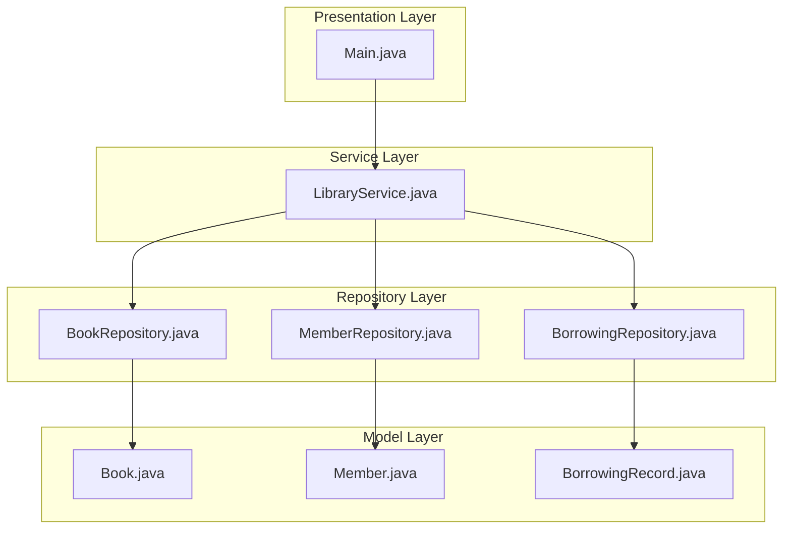
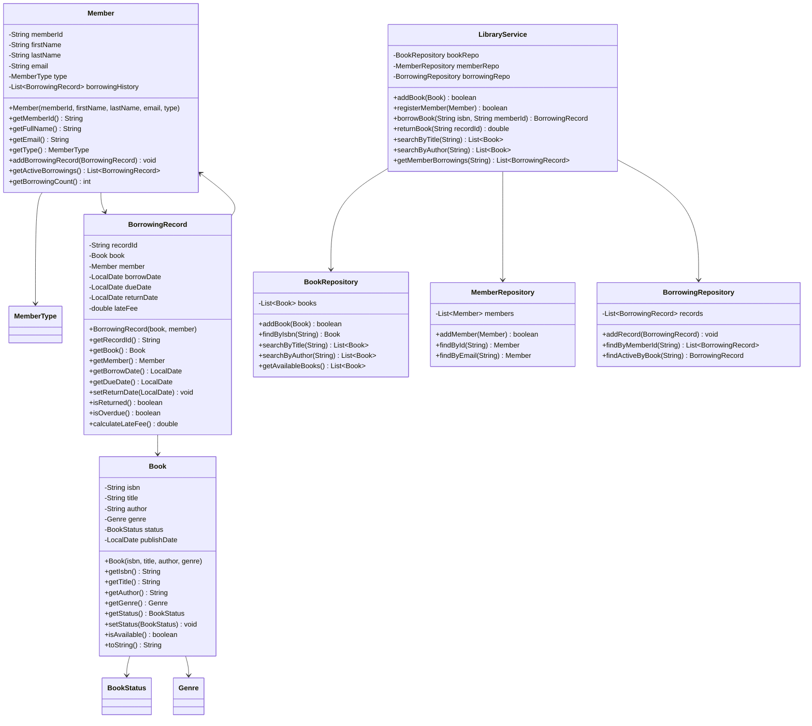

# Library Management System

## Project Overview

A console-based Library Management System that enables library staff to manage books, members, and borrowing/returning operations. This project reinforces OOP fundamentals including encapsulation, associations between objects, and exception handling. Students will implement a system that tracks book availability, manages member accounts, and maintains borrowing history.

## Learning Outcomes

- Design and implement class associations (has-a relationships)
- Use enums for constant values (BookStatus, MemberType)
- Implement bidirectional relationships between objects
- Practice exception handling with custom exceptions
- Use interfaces for polymorphic behavior
- Implement search algorithms with different criteria
- Write comprehensive unit tests

## Requirements

### Functional Requirements

| ID | Requirement | Priority |
|----|-------------|----------|
| FR01 | Add new books with ISBN, title, author, genre | Must |
| FR02 | Register library members with ID, name, email | Must |
| FR03 | Borrow book (check availability) | Must |
| FR04 | Return book (update availability) | Must |
| FR05 | Search books by title, author, ISBN | Must |
| FR06 | View borrowing history for member | Must |
| FR07 | View all currently borrowed books | Must |
| FR08 | Reserve a book when unavailable | Should |
| FR09 | Calculate late fees for overdue books | Should |
| FR10 | Generate borrowing statistics report | Could |

### Non-Functional Requirements

| ID | Requirement |
|----|-------------|
| NFR01 | Prevent concurrent borrowing of same book |
| NFR02 | Validate email format for members |
| NFR03 | ISBN must be 10 or 13 digits |
| NFR04 | Maximum 5 books per member at a time |

## Architecture



## Package Structure

```
library-management/
├── README.md
├── src/
│   └── main/
│       └── java/
│           └── com/
│               └── academy/
│                   └── library/
│                       ├── Main.java
│                       ├── model/
│                       │   ├── Book.java
│                       │   ├── Member.java
│                       │   ├── BorrowingRecord.java
│                       │   └── enums/
│                       │       ├── BookStatus.java
│                       │       ├── MemberType.java
│                       │       └── Genre.java
│                       ├── service/
│                       │   ├── LibraryService.java
│                       │   └── FeeCalculator.java
│                       ├── repository/
│                       │   ├── BookRepository.java
│                       │   ├── MemberRepository.java
│                       │   └── BorrowingRepository.java
│                       ├── exception/
│                       │   ├── BookNotAvailableException.java
│                       │   ├── MaxBooksExceededException.java
│                       │   └── MemberNotFoundException.java
│                       └── util/
│                           └── EmailValidator.java
└── src/
    └── test/
        └── java/
            └── com/
                └── academy/
                    └── library/
                        ├── LibraryServiceTest.java
                        ├── BookTest.java
                        └── MemberTest.java
```

## Class Diagram



## Implementation Guide

### Step 1: Create Enums

```java
package com.academy.library.model.enums;

public enum BookStatus {
    AVAILABLE("Available"),
    BORROWED("Borrowed"),
    RESERVED("Reserved"),
    LOST("Lost");

    private final String displayName;

    BookStatus(String displayName) {
        this.displayName = displayName;
    }

    public String getDisplayName() {
        return displayName;
    }
}

public enum MemberType {
    REGULAR(5),
    PREMIUM(10),
    STUDENT(3);

    private final int maxBooks;

    MemberType(int maxBooks) {
        this.maxBooks = maxBooks;
    }

    public int getMaxBooks() {
        return maxBooks;
    }
}
```

### Step 2: Create Book Model

```java
package com.academy.library.model;

import com.academy.library.model.enums.BookStatus;
import com.academy.library.model.enums.Genre;

public class Book {
    private String isbn;
    private String title;
    private String author;
    private Genre genre;
    private BookStatus status;

    public Book(String isbn, String title, String author, Genre genre) {
        this.isbn = isbn;
        this.title = title;
        this.author = author;
        this.genre = genre;
        this.status = BookStatus.AVAILABLE;
    }

    public boolean isAvailable() {
        return this.status == BookStatus.AVAILABLE;
    }

    // Getters and setters...
}
```

### Step 3: Create BorrowingRecord

```java
package com.academy.library.model;

import java.time.LocalDate;
import java.time.temporal.ChronoUnit;

public class BorrowingRecord {
    private static final int LOAN_PERIOD_DAYS = 14;
    private static final double LATE_FEE_PER_DAY = 0.50;

    private String recordId;
    private Book book;
    private Member member;
    private LocalDate borrowDate;
    private LocalDate dueDate;
    private LocalDate returnDate;

    public BorrowingRecord(Book book, Member member) {
        this.recordId = generateId();
        this.book = book;
        this.member = member;
        this.borrowDate = LocalDate.now();
        this.dueDate = borrowDate.plusDays(LOAN_PERIOD_DAYS);
    }

    public boolean isOverdue() {
        if (returnDate != null) {
            return returnDate.isAfter(dueDate);
        }
        return LocalDate.now().isAfter(dueDate);
    }

    public double calculateLateFee() {
        if (!isOverdue()) return 0.0;
        
        LocalDate endDate = returnDate != null ? returnDate : LocalDate.now();
        long daysOverdue = ChronoUnit.DAYS.between(dueDate, endDate);
        return daysOverdue * LATE_FEE_PER_DAY;
    }

    private String generateId() {
        return "BR-" + System.currentTimeMillis();
    }
}
```

### Step 4: Implement LibraryService

```java
package com.academy.library.service;

import com.academy.library.model.*;
import com.academy.library.model.enums.BookStatus;
import com.academy.library.repository.*;
import com.academy.library.exception.*;
import java.util.List;

public class LibraryService {
    private final BookRepository bookRepo;
    private final MemberRepository memberRepo;
    private final BorrowingRepository borrowingRepo;

    public LibraryService() {
        this.bookRepo = new BookRepository();
        this.memberRepo = new MemberRepository();
        this.borrowingRepo = new BorrowingRepository();
    }

    public BorrowingRecord borrowBook(String isbn, String memberId) 
            throws BookNotAvailableException, MaxBooksExceededException {
        
        Book book = bookRepo.findByIsbn(isbn);
        Member member = memberRepo.findById(memberId);

        if (!book.isAvailable()) {
            throw new BookNotAvailableException("Book is not available: " + isbn);
        }

        if (member.getActiveBorrowings().size() >= member.getType().getMaxBooks()) {
            throw new MaxBooksExceededException("Member has reached maximum borrowings");
        }

        book.setStatus(BookStatus.BORROWED);
        BorrowingRecord record = new BorrowingRecord(book, member);
        member.addBorrowingRecord(record);
        borrowingRepo.addRecord(record);

        return record;
    }

    public double returnBook(String recordId) {
        BorrowingRecord record = borrowingRepo.findById(recordId);
        record.setReturnDate(LocalDate.now());
        record.getBook().setStatus(BookStatus.AVAILABLE);
        return record.calculateLateFee();
    }
}
```

## Unit Tests

```java
package com.academy.library;

import com.academy.library.model.*;
import com.academy.library.model.enums.*;
import com.academy.library.service.LibraryService;
import com.academy.library.exception.*;
import org.junit.jupiter.api.BeforeEach;
import org.junit.jupiter.api.Test;
import static org.junit.jupiter.api.Assertions.*;

public class LibraryServiceTest {
    private LibraryService service;

    @BeforeEach
    void setUp() {
        service = new LibraryService();
    }

    @Test
    void testAddBook() {
        Book book = new Book("978-0134685991", "Effective Java", "Joshua Bloch", Genre.TECHNOLOGY);
        assertTrue(service.addBook(book));
    }

    @Test
    void testBorrowBook() throws Exception {
        Book book = new Book("978-0134685991", "Effective Java", "Joshua Bloch", Genre.TECHNOLOGY);
        Member member = new Member("M001", "John", "Doe", "john@example.com", MemberType.REGULAR);
        service.addBook(book);
        service.registerMember(member);

        BorrowingRecord record = service.borrowBook("978-0134685991", "M001");
        assertNotNull(record);
        assertFalse(book.isAvailable());
    }

    @Test
    void testReturnBookWithLateFee() throws Exception {
        // Setup and borrow book
        Book book = new Book("978-0134685991", "Effective Java", "Joshua Bloch", Genre.TECHNOLOGY);
        Member member = new Member("M001", "John", "Doe", "john@example.com", MemberType.REGULAR);
        service.addBook(book);
        service.registerMember(member);
        BorrowingRecord record = service.borrowBook("978-0134685991", "M001");

        // Simulate overdue by setting past due date
        // ... test late fee calculation
    }

    @Test
    void testBookNotAvailableException() {
        // Test exception when book already borrowed
    }

    @Test
    void testMaxBooksExceededException() {
        // Test exception when member exceeds max books
    }
}
```

## Extension Challenges

1. **Reservation System**: Allow members to reserve books that are currently borrowed
2. **Late Fee Calculator**: Implement automatic late fee calculation with configurable rates
3. **Book Recommendations**: Suggest books based on borrowing history
4. **Barcode Scanner**: Simulate barcode input for quick book lookup
5. **Multi-Branch Support**: Extend system to support multiple library branches

## Interview Questions

1. **How would you handle concurrent borrowing of the same book?**
   - Discuss synchronization, optimistic locking, database transactions

2. **Why did you use the Repository pattern?**
   - Discuss separation of concerns, testability, data source abstraction

3. **How would you extend this to support different media types (DVDs, audiobooks)?**
   - Discuss polymorphism, abstract classes, Strategy pattern

4. **What design pattern would you use for the fee calculation strategy?**
   - Discuss Strategy pattern for different fee rules

5. **How would you optimize search for a large book catalog?**
   - Discuss indexing, caching, search algorithms

## References

- [Java Enums Tutorial](https://docs.oracle.com/javase/tutorial/java/javaOO/enum.html)
- [Java Collections Framework](https://docs.oracle.com/javase/8/docs/api/java/util/Collections.html)
- [Design Patterns: Elements of Reusable Object-Oriented Software](https://www.amazon.com/Design-Patterns-Elements-Reusable-Object-Oriented/dp/0201633612)
