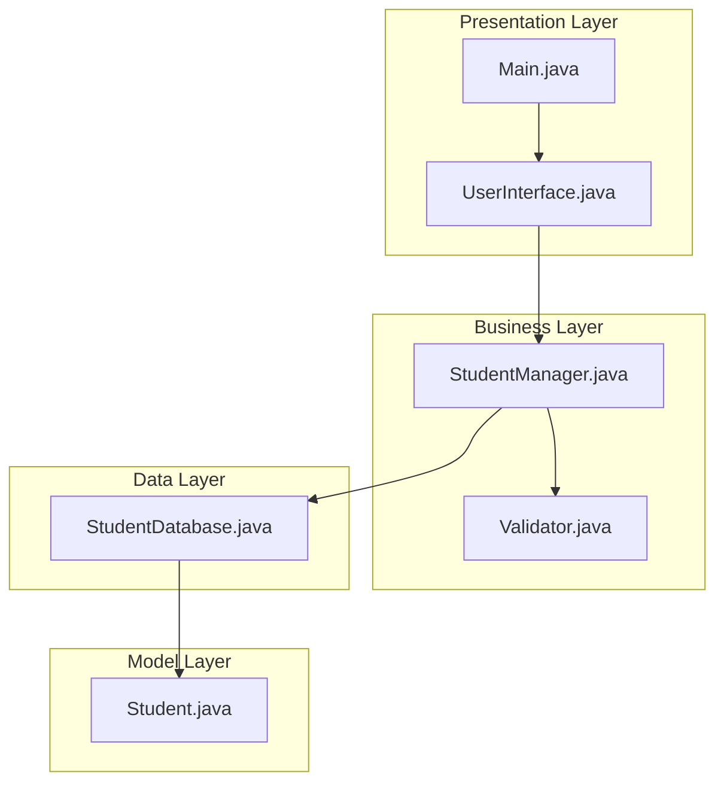
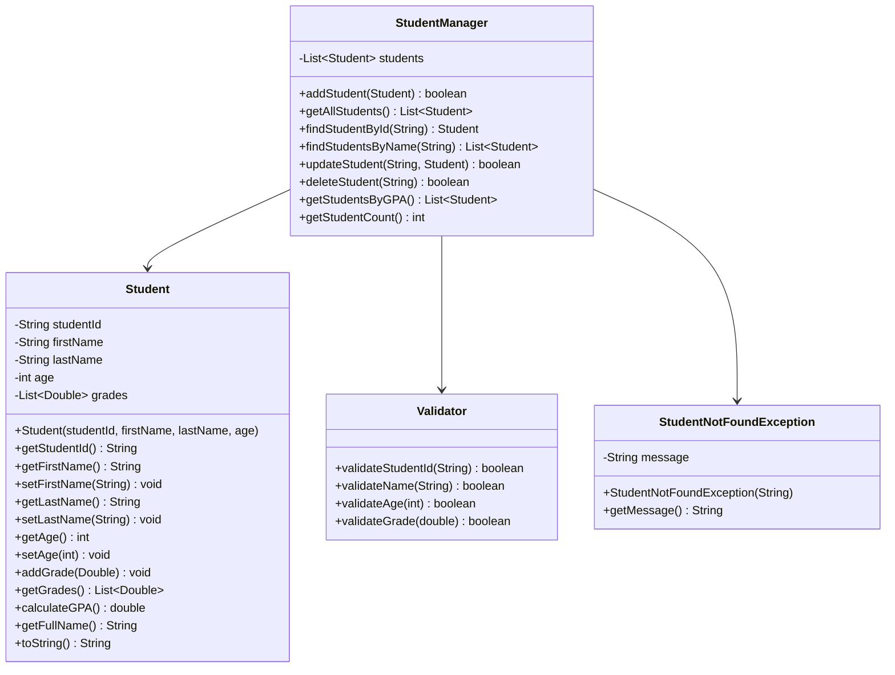

# Student Management System

## Project Overview

A console-based Student Management System that allows users to manage student records with full CRUD operations. This project introduces fundamental OOP concepts including classes, objects, encapsulation, and basic data structures. Students will build a practical application that demonstrates how to organize code into logical packages and implement real-world business logic.

## Learning Outcomes

- Understand class design and object creation
- Implement encapsulation with private fields and public methods
- Use collections (ArrayList) for data storage
- Practice method overloading
- Implement input validation
- Write unit tests for business logic
- Understand package organization

## Requirements

### Functional Requirements

| ID | Requirement | Priority |
|----|-------------|----------|
| FR01 | Add new student with ID, name, age, grade | Must |
| FR02 | Display all students | Must |
| FR03 | Search student by ID | Must |
| FR04 | Search student by name | Must |
| FR05 | Update student information | Must |
| FR06 | Delete student by ID | Must |
| FR07 | Calculate GPA from grades | Must |
| FR08 | Display students sorted by GPA | Should |
| FR09 | Export student data to file | Could |
| FR10 | Import student data from file | Could |

### Non-Functional Requirements

| ID | Requirement |
|----|-------------|
| NFR01 | Response time < 100ms for all operations |
| NFR02 | Handle up to 10,000 students |
| NFR03 | Input validation for all user inputs |
| NFR04 | Graceful error handling |

## Architecture



## Package Structure

```
student-management/
├── README.md
├── src/
│   └── main/
│       └── java/
│           └── com/
│               └── academy/
│                   └── student/
│                       ├── Main.java
│                       ├── model/
│                       │   └── Student.java
│                       ├── manager/
│                       │   └── StudentManager.java
│                       ├── service/
│                       │   └── StudentService.java
│                       ├── util/
│                       │   └── Validator.java
│                       └── exception/
│                           └── StudentNotFoundException.java
└── src/
    └── test/
        └── java/
            └── com/
                └── academy/
                    └── student/
                        └── StudentManagerTest.java
```

## Class Diagram



## Implementation Guide

### Step 1: Create the Student Model

```java
package com.academy.student.model;

import java.util.ArrayList;
import java.util.List;

public class Student {
    private String studentId;
    private String firstName;
    private String lastName;
    private int age;
    private List<Double> grades;

    public Student(String studentId, String firstName, String lastName, int age) {
        this.studentId = studentId;
        this.firstName = firstName;
        this.lastName = lastName;
        this.age = age;
        this.grades = new ArrayList<>();
    }

    public void addGrade(Double grade) {
        if (grade >= 0.0 && grade <= 4.0) {
            this.grades.add(grade);
        }
    }

    public double calculateGPA() {
        if (grades.isEmpty()) return 0.0;
        return grades.stream()
            .mapToDouble(Double::doubleValue)
            .average()
            .orElse(0.0);
    }

    // Getters and setters...
}
```

### Step 2: Create the StudentManager

```java
package com.academy.student.manager;

import com.academy.student.model.Student;
import com.academy.student.exception.StudentNotFoundException;
import java.util.ArrayList;
import java.util.List;
import java.util.Optional;
import java.util.stream.Collectors;

public class StudentManager {
    private List<Student> students;

    public StudentManager() {
        this.students = new ArrayList<>();
    }

    public boolean addStudent(Student student) {
        return students.add(student);
    }

    public Student findStudentById(String id) throws StudentNotFoundException {
        return students.stream()
            .filter(s -> s.getStudentId().equals(id))
            .findFirst()
            .orElseThrow(() -> new StudentNotFoundException("Student not found: " + id));
    }

    public List<Student> findStudentsByName(String name) {
        String lowerName = name.toLowerCase();
        return students.stream()
            .filter(s -> s.getFullName().toLowerCase().contains(lowerName))
            .collect(Collectors.toList());
    }

    public boolean updateStudent(String id, Student updated) throws StudentNotFoundException {
        Student existing = findStudentById(id);
        existing.setFirstName(updated.getFirstName());
        existing.setLastName(updated.getLastName());
        existing.setAge(updated.getAge());
        return true;
    }

    public boolean deleteStudent(String id) throws StudentNotFoundException {
        Student student = findStudentById(id);
        return students.remove(student);
    }

    public List<Student> getStudentsByGPA() {
        return students.stream()
            .sorted((s1, s2) -> Double.compare(s2.calculateGPA(), s1.calculateGPA()))
            .collect(Collectors.toList());
    }
}
```

### Step 3: Create the Main Class

```java
package com.academy.student;

import com.academy.student.manager.StudentManager;
import com.academy.student.model.Student;
import java.util.Scanner;

public class Main {
    private static StudentManager manager = new StudentManager();
    private static Scanner scanner = new Scanner(System.in);

    public static void main(String[] args) {
        boolean running = true;
        while (running) {
            displayMenu();
            int choice = scanner.nextInt();
            scanner.nextLine();
            
            switch (choice) {
                case 1: addStudent(); break;
                case 2: displayAllStudents(); break;
                case 3: searchStudent(); break;
                case 4: updateStudent(); break;
                case 5: deleteStudent(); break;
                case 6: running = false; break;
                default: System.out.println("Invalid choice");
            }
        }
    }

    private static void displayMenu() {
        System.out.println("\n=== Student Management System ===");
        System.out.println("1. Add Student");
        System.out.println("2. Display All Students");
        System.out.println("3. Search Student");
        System.out.println("4. Update Student");
        System.out.println("5. Delete Student");
        System.out.println("6. Exit");
        System.out.print("Enter choice: ");
    }
}
```

### Step 4: Implement Exception Handling

```java
package com.academy.student.exception;

public class StudentNotFoundException extends Exception {
    public StudentNotFoundException(String message) {
        super(message);
    }
}
```

## Unit Tests

```java
package com.academy.student;

import com.academy.student.manager.StudentManager;
import com.academy.student.model.Student;
import org.junit.jupiter.api.BeforeEach;
import org.junit.jupiter.api.Test;
import static org.junit.jupiter.api.Assertions.*;

public class StudentManagerTest {
    private StudentManager manager;

    @BeforeEach
    void setUp() {
        manager = new StudentManager();
    }

    @Test
    void testAddStudent() {
        Student student = new Student("S001", "John", "Doe", 20);
        assertTrue(manager.addStudent(student));
        assertEquals(1, manager.getStudentCount());
    }

    @Test
    void testFindStudentById() {
        Student student = new Student("S001", "John", "Doe", 20);
        manager.addStudent(student);
        assertEquals(student, manager.findStudentById("S001"));
    }

    @Test
    void testCalculateGPA() {
        Student student = new Student("S001", "John", "Doe", 20);
        student.addGrade(4.0);
        student.addGrade(3.5);
        student.addGrade(3.8);
        assertEquals(3.77, student.calculateGPA(), 0.01);
    }

    @Test
    void testDeleteStudent() {
        Student student = new Student("S001", "John", "Doe", 20);
        manager.addStudent(student);
        assertTrue(manager.deleteStudent("S001"));
        assertEquals(0, manager.getStudentCount());
    }

    @Test
    void testUpdateStudent() {
        Student student = new Student("S001", "John", "Doe", 20);
        manager.addStudent(student);
        
        Student updated = new Student("S001", "Jane", "Doe", 21);
        assertTrue(manager.updateStudent("S001", updated));
        assertEquals("Jane", manager.findStudentById("S001").getFirstName());
    }
}
```

## Extension Challenges

1. **File Persistence**: Implement saving/loading students from a CSV or JSON file
2. **Grade Statistics**: Add methods to calculate class average, highest/lowest GPA
3. **Search Filters**: Add filtering by age range, GPA range, or grade level
4. **Data Export**: Export student list to formatted text report
5. **Menu Improvements**: Add pagination for large student lists

## Interview Questions

1. **Why did you choose ArrayList over LinkedList for storing students?**
   - Discuss time complexity of operations and memory considerations

2. **How would you modify this system to support different student types (Undergraduate, Graduate)?**
   - Discuss inheritance and polymorphism

3. **What design patterns could improve this architecture?**
   - Discuss Repository pattern, Strategy pattern for sorting

4. **How would you handle concurrent access to the student list?**
   - Discuss synchronization, thread-safe collections

5. **How would you refactor this to support database storage?**
   - Discuss DAO pattern, separation of concerns

## References

- [Java Collections Framework](https://docs.oracle.com/javase/8/docs/api/java/util/Collections.html)
- [Object-Oriented Programming in Java](https://docs.oracle.com/javase/tutorial/java/concepts/)
- [JUnit 5 Testing](https://junit.org/junit5/docs/current/user-guide/)
