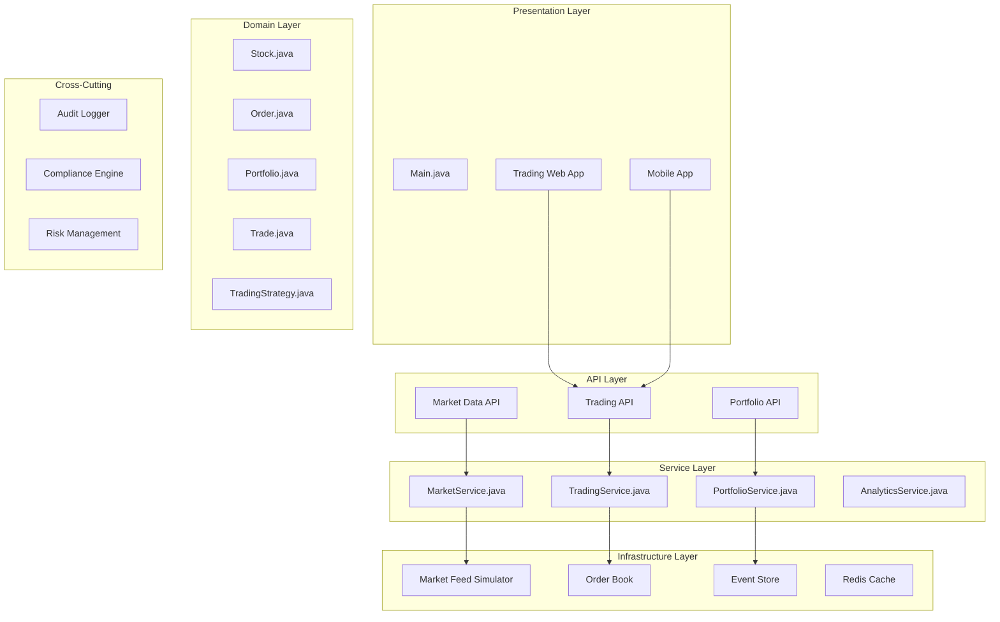
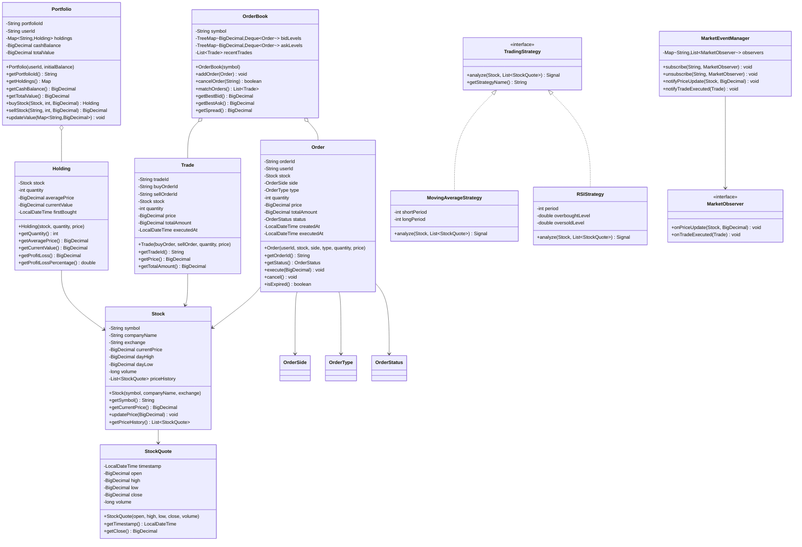

# Trading Platform

## Project Overview

A Trading Platform that handles stock trading, portfolio management, market data, and trading strategies. This enterprise project introduces the Observer pattern for real-time market updates, the Strategy pattern for trading algorithms, and the Command pattern for trade execution. Students will design a system that handles high-frequency operations with precision.

## Learning Outcomes

- Implement the Observer pattern for real-time market data
- Use the Strategy pattern for trading algorithms
- Apply the Command pattern for trade execution and undo
- Design for financial precision with BigDecimal
- Handle concurrent operations safely
- Implement audit logging for compliance
- Design event sourcing for trade history

## Requirements

### Functional Requirements

| ID | Requirement | Priority |
|----|-------------|----------|
| FR01 | User registration with KYC verification | Must |
| FR02 | Real-time stock quotes and market data | Must |
| FR03 | Place buy/sell orders (market, limit, stop) | Must |
| FR04 | Portfolio management with holdings tracking | Must |
| FR05 | Trade execution and settlement | Must |
| FR06 | Transaction history and reporting | Must |
| FR07 | Watchlist for stock monitoring | Should |
| FR08 | Technical indicators and charts | Could |
| FR09 | Algorithmic trading support | Could |
| FR10 | Paper trading (simulated) | Could |

### Non-Functional Requirements

| ID | Requirement |
|----|-------------|
| NFR01 | Financial precision (no rounding errors) |
| NFR02 | Trade execution < 100ms |
| NFR03 | Real-time updates < 1 second delay |
| NFR04 | Complete audit trail for compliance |
| NFR05 | Thread-safe portfolio operations |

## Architecture



## Package Structure

```
trading-platform/
├── README.md
├── src/
│   └── main/
│       └── java/
│           └── com/
│               └── academy/
│                   └── trading/
│                       ├── Main.java
│                       ├── model/
│                       │   ├── Stock.java
│                       │   ├── StockQuote.java
│                       │   ├── Order.java
│                       │   ├── Trade.java
│                       │   ├── Portfolio.java
│                       │   ├── Holding.java
│                       │   ├── User.java
│                       │   ├── Wallet.java
│                       │   └── enums/
│                       │       ├── OrderType.java
│                       │       ├── OrderSide.java
│                       │       ├── OrderStatus.java
│                       │       └── TradeStatus.java
│                       ├── observer/
│                       │   ├── MarketObserver.java
│                       │   ├── MarketEventManager.java
│                       │   ├── PriceAlertHandler.java
│                       │   └── PortfolioUpdateHandler.java
│                       ├── strategy/
│                       │   ├── TradingStrategy.java
│                       │   ├── MovingAverageStrategy.java
│                       │   ├── RSIStrategy.java
│                       │   └── MACDStrategy.java
│                       ├── command/
│                       │   ├── TradeCommand.java
│                       │   ├── BuyStockCommand.java
│                       │   ├── SellStockCommand.java
│                       │   ├── CancelOrderCommand.java
│                       │   └── CommandHistory.java
│                       ├── service/
│                       │   ├── MarketService.java
│                       │   ├── TradingService.java
│                       │   ├── PortfolioService.java
│                       │   ├── OrderBookService.java
│                       │   └── AnalyticsService.java
│                       ├── orderbook/
│                       │   ├── OrderBook.java
│                       │   ├── PriceLevel.java
│                       │   └── OrderMatchingEngine.java
│                       ├── market/
│                       │   ├── MarketDataFeed.java
│                       │   ├── StockPriceSimulator.java
│                       │   └── TechnicalIndicator.java
│                       └── exception/
│                           ├── InsufficientFundsException.java
│                           ├── OrderNotFoundException.java
│                           ├── MarketClosedException.java
│                           └── ComplianceViolationException.java
└── src/
    └── test/
        └── java/
            └── com/
                └── academy/
                    └── trading/
                        ├── TradingServiceTest.java
                        ├── OrderBookTest.java
                        ├── PortfolioTest.java
                        └── StrategyTest.java
```

## Class Diagram



## Implementation Guide

### Step 1: Implement Order Book

```java
package com.academy.trading.orderbook;

import java.util.*;
import java.util.concurrent.ConcurrentSkipListMap;

public class OrderBook {
    private final String symbol;
    private final ConcurrentSkipListMap<BigDecimal, Deque<Order>> bidLevels;
    private final ConcurrentSkipListMap<BigDecimal, Deque<Order>> askLevels;
    private final List<Trade> recentTrades;
    private final ReentrantLock lock;

    public OrderBook(String symbol) {
        this.symbol = symbol;
        this.bidLevels = new ConcurrentSkipListMap<>(Comparator.reverseOrder());
        this.askLevels = new ConcurrentSkipListMap<>();
        this.recentTrades = new ArrayList<>();
        this.lock = new ReentrantLock();
    }

    public void addOrder(Order order) {
        lock.lock();
        try {
            if (order.getSide() == OrderSide.BUY) {
                bidLevels.computeIfAbsent(order.getPrice(), k -> new ArrayDeque<>())
                    .add(order);
            } else {
                askLevels.computeIfAbsent(order.getPrice(), k -> new ArrayDeque<>())
                    .add(order);
            }
        } finally {
            lock.unlock();
        }
    }

    public List<Trade> matchOrders() {
        lock.lock();
        try {
            List<Trade> trades = new ArrayList<>();
            
            while (!bidLevels.isEmpty() && !askLevels.isEmpty()) {
                BigDecimal bestBid = bidLevels.firstKey();
                BigDecimal bestAsk = askLevels.firstKey();
                
                if (bestBid.compareTo(bestAsk) < 0) {
                    break;
                }
                
                Deque<Order> bids = bidLevels.get(bestBid);
                Deque<Order> asks = askLevels.get(bestAsk);
                
                while (!bids.isEmpty() && !asks.isEmpty()) {
                    Order buyOrder = bids.peek();
                    Order sellOrder = asks.peek();
                    
                    int quantity = Math.min(buyOrder.getRemainingQuantity(), 
                                          sellOrder.getRemainingQuantity());
                    BigDecimal tradePrice = bestAsk;
                    
                    Trade trade = new Trade(buyOrder.getOrderId(), sellOrder.getOrderId(),
                                          quantity, tradePrice);
                    trades.add(trade);
                    
                    buyOrder.execute(quantity, tradePrice);
                    sellOrder.execute(quantity, tradePrice);
                    
                    if (buyOrder.getRemainingQuantity() == 0) {
                        bids.poll();
                    }
                    if (sellOrder.getRemainingQuantity() == 0) {
                        asks.poll();
                    }
                }
                
                if (bids.isEmpty()) bidLevels.remove(bestBid);
                if (asks.isEmpty()) askLevels.remove(bestAsk);
            }
            
            recentTrades.addAll(trades);
            return trades;
        } finally {
            lock.unlock();
        }
    }

    public BigDecimal getBestBid() {
        return bidLevels.isEmpty() ? null : bidLevels.firstKey();
    }

    public BigDecimal getBestAsk() {
        return askLevels.isEmpty() ? null : askLevels.firstKey();
    }
}
```

### Step 2: Implement Trading Strategies

```java
package com.academy.trading.strategy;

public interface TradingStrategy {
    Signal analyze(Stock stock, List<StockQuote> priceHistory);
    String getStrategyName();
}

public enum Signal {
    BUY, SELL, HOLD
}

package com.academy.trading.strategy;

public class MovingAverageStrategy implements TradingStrategy {
    private final int shortPeriod;
    private final int longPeriod;

    public MovingAverageStrategy(int shortPeriod, int longPeriod) {
        this.shortPeriod = shortPeriod;
        this.longPeriod = longPeriod;
    }

    @Override
    public Signal analyze(Stock stock, List<StockQuote> priceHistory) {
        if (priceHistory.size() < longPeriod) {
            return Signal.HOLD;
        }

        double shortMA = calculateMA(priceHistory, shortPeriod);
        double longMA = calculateMA(priceHistory, longPeriod);
        double previousShortMA = calculateMA(priceHistory.subList(0, priceHistory.size() - 1), shortPeriod);
        double previousLongMA = calculateMA(priceHistory.subList(0, priceHistory.size() - 1), longPeriod);

        if (previousShortMA <= previousLongMA && shortMA > longMA) {
            return Signal.BUY;
        } else if (previousShortMA >= previousLongMA && shortMA < longMA) {
            return Signal.SELL;
        }
        return Signal.HOLD;
    }

    private double calculateMA(List<StockQuote> quotes, int period) {
        return quotes.subList(quotes.size() - period, quotes.size()).stream()
            .mapToDouble(q -> q.getClose().doubleValue())
            .average()
            .orElse(0.0);
    }
}

public class RSIStrategy implements TradingStrategy {
    private final int period;
    private final double overboughtLevel;
    private final double oversoldLevel;

    public RSIStrategy(int period, double overbought, double oversold) {
        this.period = period;
        this.overboughtLevel = overbought;
        this.oversoldLevel = oversold;
    }

    @Override
    public Signal analyze(Stock stock, List<StockQuote> priceHistory) {
        if (priceHistory.size() < period + 1) {
            return Signal.HOLD;
        }

        double rsi = calculateRSI(priceHistory);
        
        if (rsi < oversoldLevel) {
            return Signal.BUY;
        } else if (rsi > overboughtLevel) {
            return Signal.SELL;
        }
        return Signal.HOLD;
    }

    private double calculateRSI(List<StockQuote> quotes) {
        List<Double> changes = new ArrayList<>();
        for (int i = 1; i < quotes.size(); i++) {
            double change = quotes.get(i).getClose().doubleValue() - 
                          quotes.get(i - 1).getClose().doubleValue();
            changes.add(change);
        }

        List<Double> gains = changes.stream().filter(c -> c > 0).collect(Collectors.toList());
        List<Double> losses = changes.stream().filter(c -> c < 0).map(Math::abs).collect(Collectors.toList());

        double avgGain = gains.stream().mapToDouble(Double::doubleValue).average().orElse(0);
        double avgLoss = losses.stream().mapToDouble(Double::doubleValue).average().orElse(0.001);

        double rs = avgGain / avgLoss;
        return 100 - (100 / (1 + rs));
    }
}
```

### Step 3: Implement Trading Service

```java
package com.academy.trading.service;

import com.academy.trading.model.*;
import com.academy.trading.command.*;
import java.math.BigDecimal;
import java.math.RoundingMode;

public class TradingService {
    private final OrderBookService orderBookService;
    private final PortfolioService portfolioService;
    private final MarketService marketService;
    private final CommandHistory commandHistory;
    private final MarketEventManager eventManager;

    public TradeResult executeTrade(String userId, OrderRequest request) {
        User user = userService.getUser(userId);
        Stock stock = marketService.getStock(request.getSymbol());

        // Validate order
        validateOrder(user, request, stock);

        // Create order
        Order order = Order.create(userId, stock, request);
        
        // Execute command
        TradeCommand command = createCommand(order);
        commandHistory.execute(command);

        // Match orders
        List<Trade> trades = orderBookService.matchOrders(stock.getSymbol());

        // Update portfolio
        for (Trade trade : trades) {
            portfolioService.executeTrade(trade);
        }

        // Notify observers
        eventManager.notifyTradeExecuted(trades);

        return new TradeResult(order.getOrderId(), trades);
    }

    private void validateOrder(User user, OrderRequest request, Stock stock) {
        if (!marketService.isMarketOpen()) {
            throw new MarketClosedException("Market is currently closed");
        }

        BigDecimal orderValue = request.getPrice().multiply(BigDecimal.valueOf(request.getQuantity()));
        
        if (request.getSide() == OrderSide.BUY) {
            if (user.getWallet().getBalance().compareTo(orderValue) < 0) {
                throw new InsufficientFundsException("Insufficient funds");
            }
        } else {
            Portfolio portfolio = portfolioService.getPortfolio(user.getUserId());
            Holding holding = portfolio.getHolding(request.getSymbol());
            if (holding == null || holding.getQuantity() < request.getQuantity()) {
                throw new InsufficientSharesException("Insufficient shares");
            }
        }
    }
}
```

### Step 4: Implement Portfolio with Thread Safety

```java
package com.academy.trading.model;

import java.util.concurrent.ConcurrentHashMap;
import java.util.concurrent.atomic.AtomicReference;

public class Portfolio {
    private final String portfolioId;
    private final String userId;
    private final ConcurrentHashMap<String, Holding> holdings;
    private final AtomicReference<BigDecimal> cashBalance;
    private final ReadWriteLock lock;

    public Portfolio(String userId, BigDecimal initialBalance) {
        this.portfolioId = UUID.randomUUID().toString();
        this.userId = userId;
        this.holdings = new ConcurrentHashMap<>();
        this.cashBalance = new AtomicReference<>(initialBalance);
        this.lock = new ReentrantReadWriteLock();
    }

    public Holding buyStock(Stock stock, int quantity, BigDecimal price) {
        lock.writeLock().lock();
        try {
            BigDecimal totalCost = price.multiply(BigDecimal.valueOf(quantity));
            
            if (cashBalance.get().compareTo(totalCost) < 0) {
                throw new InsufficientFundsException("Insufficient balance");
            }

            cashBalance.updateAndGet(balance -> balance.subtract(totalCost));
            
            return holdings.compute(stock.getSymbol(), (symbol, existing) -> {
                if (existing == null) {
                    return new Holding(stock, quantity, price);
                } else {
                    existing.addShares(quantity, price);
                    return existing;
                }
            });
        } finally {
            lock.writeLock().unlock();
        }
    }

    public BigDecimal sellStock(String symbol, int quantity, BigDecimal price) {
        lock.writeLock().lock();
        try {
            Holding holding = holdings.get(symbol);
            if (holding == null || holding.getQuantity() < quantity) {
                throw new InsufficientSharesException("Insufficient shares");
            }

            BigDecimal proceeds = price.multiply(BigDecimal.valueOf(quantity));
            cashBalance.updateAndGet(balance -> balance.add(proceeds));
            
            holding.removeShares(quantity);
            if (holding.getQuantity() == 0) {
                holdings.remove(symbol);
            }
            
            return proceeds;
        } finally {
            lock.writeLock().unlock();
        }
    }

    public BigDecimal getTotalValue(Map<String, BigDecimal> currentPrices) {
        lock.readLock().lock();
        try {
            BigDecimal holdingsValue = holdings.values().stream()
                .map(h -> {
                    BigDecimal currentPrice = currentPrices.get(h.getSymbol());
                    return currentPrice != null ? 
                        currentPrice.multiply(BigDecimal.valueOf(h.getQuantity())) :
                        h.getCurrentValue();
                })
                .reduce(BigDecimal.ZERO, BigDecimal::add);
            
            return cashBalance.get().add(holdingsValue);
        } finally {
            lock.readLock().unlock();
        }
    }
}
```

## Unit Tests

```java
package com.academy.trading;

import com.academy.trading.model.*;
import com.academy.trading.service.TradingService;
import com.academy.trading.orderbook.OrderBook;
import com.academy.trading.strategy.*;
import org.junit.jupiter.api.BeforeEach;
import org.junit.jupiter.api.Test;
import java.math.BigDecimal;
import java.util.Arrays;
import java.util.List;
import static org.junit.jupiter.api.Assertions.*;

public class TradingServiceTest {
    private TradingService tradingService;
    private OrderBook orderBook;

    @BeforeEach
    void setUp() {
        tradingService = new TradingService();
        orderBook = new OrderBook("AAPL");
    }

    @Test
    void testOrderMatching() {
        Order buyOrder = new Order("user1", createStock("AAPL"), OrderSide.BUY, 
                                  OrderType.LIMIT, 100, new BigDecimal("150.00"));
        Order sellOrder = new Order("user2", createStock("AAPL"), OrderSide.SELL, 
                                   OrderType.LIMIT, 100, new BigDecimal("149.50"));

        orderBook.addOrder(buyOrder);
        orderBook.addOrder(sellOrder);

        List<Trade> trades = orderBook.matchOrders();
        
        assertEquals(1, trades.size());
        assertEquals(new BigDecimal("149.50"), trades.get(0).getPrice());
    }

    @Test
    void testPortfolioBuy() {
        Portfolio portfolio = new Portfolio("user1", new BigDecimal("100000"));
        Stock stock = createStock("AAPL");
        
        Holding holding = portfolio.buyStock(stock, 10, new BigDecimal("150.00"));
        
        assertEquals(10, holding.getQuantity());
        assertEquals(new BigDecimal("149.99"), portfolio.getCashBalance());
    }

    @Test
    void testPortfolioSell() {
        Portfolio portfolio = new Portfolio("user1", new BigDecimal("100000"));
        Stock stock = createStock("AAPL");
        
        portfolio.buyStock(stock, 10, new BigDecimal("150.00"));
        BigDecimal proceeds = portfolio.sellStock("AAPL", 5, new BigDecimal("155.00"));
        
        assertEquals(new BigDecimal("775.00"), proceeds);
        assertEquals(5, portfolio.getHolding("AAPL").getQuantity());
    }

    @Test
    void testMovingAverageStrategy() {
        TradingStrategy strategy = new MovingAverageStrategy(5, 20);
        Stock stock = createStock("AAPL");
        List<StockQuote> history = createPriceHistory(30);
        
        Signal signal = strategy.analyze(stock, history);
        
        assertNotNull(signal);
    }

    @Test
    void testInsufficientFunds() {
        Portfolio portfolio = new Portfolio("user1", new BigDecimal("1000"));
        Stock stock = createStock("AAPL");
        
        assertThrows(InsufficientFundsException.class, () -> 
            portfolio.buyStock(stock, 100, new BigDecimal("150.00")));
    }

    @Test
    void testOrderCancellation() {
        Order order = new Order("user1", createStock("AAPL"), OrderSide.BUY, 
                               OrderType.LIMIT, 100, new BigDecimal("150.00"));
        orderBook.addOrder(order);
        
        assertTrue(orderBook.cancelOrder(order.getOrderId()));
        assertNull(orderBook.getBidOrders().stream()
            .filter(o -> o.getOrderId().equals(order.getOrderId()))
            .findFirst().orElse(null));
    }
}
```

## Extension Challenges

1. **Options Trading**: Support options contracts and Greeks calculation
2. **Backtesting Engine**: Test trading strategies against historical data
3. **Risk Management**: Implement position limits and stop-loss orders
4. **Market Simulator**: Simulate market conditions for testing
5. **Tax Reporting**: Generate tax reports for capital gains

## Interview Questions

1. **How would you handle concurrent trades on the same stock?**
   - Discuss locking strategies, optimistic locking, order book design

2. **Why use BigDecimal for financial calculations?**
   - Discuss floating-point precision, rounding errors, financial regulations

3. **How would you design for high-frequency trading?**
   - Discuss low-latency design, in-memory processing, network optimization

4. **What are the challenges of implementing a real-time order book?**
   - Discuss data structures, concurrency, price-time priority

5. **How would you ensure compliance with financial regulations?**
   - Discuss audit trails, KYC, suspicious activity monitoring

## References

- [Observer Pattern](https://www.baeldung.com/java-observer-pattern)
- [Concurrent Data Structures](https://docs.oracle.com/javase/8/docs/api/java/util/concurrent/package-summary.html)
- [BigDecimal for Finance](https://www.baeldung.com/java-bigdecimal)
