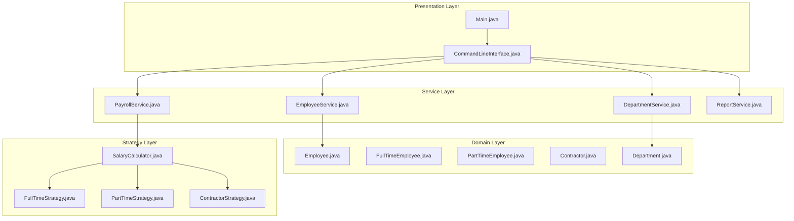
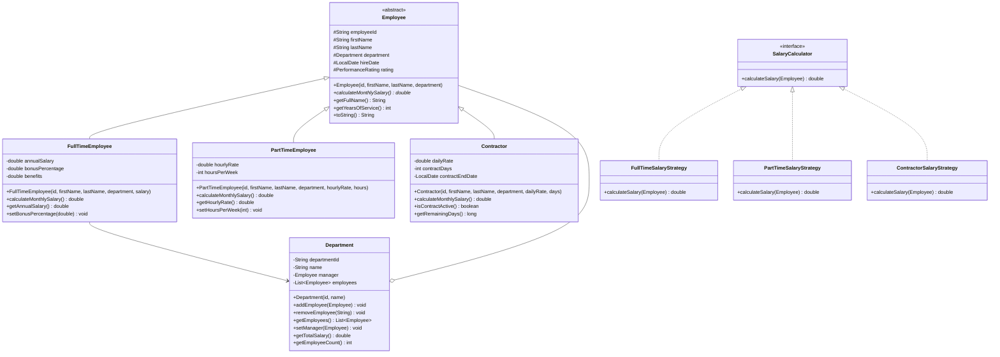

# Employee Management System

## Project Overview

A comprehensive Employee Management System that handles employee records, department organization, payroll calculations, and generating various reports. This intermediate project introduces more complex OOP concepts including inheritance, polymorphism, abstract classes, and interfaces. Students will design a system that supports different employee types with varying salary structures and benefits.

## Learning Outcomes

- Design inheritance hierarchies for different employee types
- Implement abstract classes and interfaces
- Use polymorphism for flexible salary calculations
- Apply the Template Method pattern
- Implement the Strategy pattern for different payroll calculations
- Practice dependency injection concepts
- Generate formatted reports with different output strategies

## Requirements

### Functional Requirements

| ID | Requirement | Priority |
|----|-------------|----------|
| FR01 | Add employees with different types (FullTime, PartTime, Contractor) | Must |
| FR02 | Create and manage departments | Must |
| FR03 | Assign employees to departments | Must |
| FR04 | Calculate monthly payroll with different rules per type | Must |
| FR05 | Generate department-wise salary reports | Must |
| FR06 | Generate employee hierarchy reports | Must |
| FR07 | Search employees by name, department, or type | Must |
| FR08 | Calculate annual salary with bonuses | Should |
| FR09 | Export reports to CSV format | Should |
| FR10 | Track employee performance ratings | Could |

### Non-Functional Requirements

| ID | Requirement |
|----|-------------|
| NFR01 | Support 1000+ employees efficiently |
| NFR02 | Separate business logic from presentation |
| NFR03 | Use interfaces for extensibility |
| NFR04 | Follow SOLID principles |

## Architecture



## Package Structure

```
employee-management/
├── README.md
├── src/
│   └── main/
│       └── java/
│           └── com/
│               └── academy/
│                   └── employee/
│                       ├── Main.java
│                       ├── model/
│                       │   ├── Employee.java
│                       │   ├── FullTimeEmployee.java
│                       │   ├── PartTimeEmployee.java
│                       │   ├── Contractor.java
│                       │   ├── Department.java
│                       │   └── enums/
│                       │       ├── EmployeeType.java
│                       │       └── PerformanceRating.java
│                       ├── service/
│                       │   ├── EmployeeService.java
│                       │   ├── DepartmentService.java
│                       │   └── PayrollService.java
│                       ├── strategy/
│                       │   ├── SalaryCalculator.java
│                       │   ├── FullTimeSalaryStrategy.java
│                       │   ├── PartTimeSalaryStrategy.java
│                       │   └── ContractorSalaryStrategy.java
│                       ├── report/
│                       │   ├── ReportGenerator.java
│                       │   ├── SalaryReport.java
│                       │   └── DepartmentReport.java
│                       └── exception/
│                           ├── EmployeeNotFoundException.java
│                           └── DepartmentNotFoundException.java
└── src/
    └── test/
        └── java/
            └── com/
                └── academy/
                    └── employee/
                        ├── EmployeeServiceTest.java
                        ├── PayrollServiceTest.java
                        └── SalaryCalculatorTest.java
```

## Class Diagram



## Implementation Guide

### Step 1: Create Abstract Employee Class

```java
package com.academy.employee.model;

import java.time.LocalDate;
import java.time.temporal.ChronoUnit;

public abstract class Employee {
    protected String employeeId;
    protected String firstName;
    protected String lastName;
    protected Department department;
    protected LocalDate hireDate;
    protected PerformanceRating rating;

    public Employee(String employeeId, String firstName, String lastName, Department department) {
        this.employeeId = employeeId;
        this.firstName = firstName;
        this.lastName = lastName;
        this.department = department;
        this.hireDate = LocalDate.now();
        this.rating = PerformanceRating.STANDARD;
    }

    public abstract double calculateMonthlySalary();

    public String getFullName() {
        return firstName + " " + lastName;
    }

    public int getYearsOfService() {
        return (int) ChronoUnit.YEARS.between(hireDate, LocalDate.now());
    }
}
```

### Step 2: Create Employee Subclasses

```java
package com.academy.employee.model;

public class FullTimeEmployee extends Employee {
    private double annualSalary;
    private double bonusPercentage;

    public FullTimeEmployee(String id, String firstName, String lastName, 
                           Department department, double annualSalary) {
        super(id, firstName, lastName, department);
        this.annualSalary = annualSalary;
        this.bonusPercentage = 10.0;
    }

    @Override
    public double calculateMonthlySalary() {
        double monthly = annualSalary / 12;
        double bonus = monthly * (bonusPercentage / 100);
        return monthly + bonus;
    }
}

public class PartTimeEmployee extends Employee {
    private double hourlyRate;
    private int hoursPerWeek;

    public PartTimeEmployee(String id, String firstName, String lastName,
                           Department department, double hourlyRate, int hoursPerWeek) {
        super(id, firstName, lastName, department);
        this.hourlyRate = hourlyRate;
        this.hoursPerWeek = hoursPerWeek;
    }

    @Override
    public double calculateMonthlySalary() {
        return hourlyRate * hoursPerWeek * 4;
    }
}

public class Contractor extends Employee {
    private double dailyRate;
    private int contractDays;
    private LocalDate contractEndDate;

    @Override
    public double calculateMonthlySalary() {
        return dailyRate * 22;
    }
}
```

### Step 3: Implement Strategy Pattern

```java
package com.academy.employee.strategy;

public interface SalaryCalculator {
    double calculateSalary(Employee employee);
}

package com.academy.employee.strategy;

public class FullTimeSalaryStrategy implements SalaryCalculator {
    @Override
    public double calculateSalary(Employee employee) {
        FullTimeEmployee fte = (FullTimeEmployee) employee;
        return fte.getAnnualSalary() / 12;
    }
}

package com.academy.employee.service;

import com.academy.employee.strategy.*;

public class PayrollService {
    private Map<EmployeeType, SalaryCalculator> strategies;

    public PayrollService() {
        strategies = new EnumMap<>(EmployeeType.class);
        strategies.put(EmployeeType.FULL_TIME, new FullTimeSalaryStrategy());
        strategies.put(EmployeeType.PART_TIME, new PartTimeSalaryStrategy());
        strategies.put(EmployeeType.CONTRACTOR, new ContractorSalaryStrategy());
    }

    public double calculatePayroll(Employee employee) {
        SalaryCalculator calculator = strategies.get(employee.getType());
        return calculator.calculateSalary(employee);
    }

    public List<PayrollRecord> processMonthlyPayroll(List<Employee> employees) {
        return employees.stream()
            .map(e -> new PayrollRecord(e, calculatePayroll(e)))
            .collect(Collectors.toList());
    }
}
```

### Step 4: Implement Report Generation

```java
package com.academy.employee.report;

public class ReportGenerator {
    
    public String generateDepartmentReport(Department department) {
        StringBuilder report = new StringBuilder();
        report.append("=== Department Report ===\n");
        report.append("Department: ").append(department.getName()).append("\n");
        report.append("Employee Count: ").append(department.getEmployeeCount()).append("\n");
        report.append("Total Salary: $").append(String.format("%.2f", department.getTotalSalary())).append("\n\n");
        
        for (Employee e : department.getEmployees()) {
            report.append(String.format("%-20s $%,.2f\n", e.getFullName(), e.calculateMonthlySalary()));
        }
        
        return report.toString();
    }
}
```

## Unit Tests

```java
package com.academy.employee;

import com.academy.employee.model.*;
import com.academy.employee.service.*;
import org.junit.jupiter.api.BeforeEach;
import org.junit.jupiter.api.Test;
import static org.junit.jupiter.api.Assertions.*;

public class EmployeeServiceTest {
    private EmployeeService service;
    private Department department;

    @BeforeEach
    void setUp() {
        service = new EmployeeService();
        department = new Department("D001", "Engineering");
    }

    @Test
    void testAddFullTimeEmployee() {
        FullTimeEmployee emp = new FullTimeEmployee("E001", "John", "Doe", department, 75000);
        assertTrue(service.addEmployee(emp));
        assertEquals(75000, emp.getAnnualSalary());
    }

    @Test
    void testCalculateFullTimeSalary() {
        FullTimeEmployee emp = new FullTimeEmployee("E001", "John", "Doe", department, 72000);
        assertEquals(6000, emp.calculateMonthlySalary(), 0.01);
    }

    @Test
    void testCalculatePartTimeSalary() {
        PartTimeEmployee emp = new PartTimeEmployee("E002", "Jane", "Doe", department, 25, 20);
        assertEquals(2000, emp.calculateMonthlySalary(), 0.01);
    }

    @Test
    void testDepartmentTotalSalary() {
        department.addEmployee(new FullTimeEmployee("E001", "John", "Doe", department, 72000));
        department.addEmployee(new PartTimeEmployee("E002", "Jane", "Doe", department, 25, 20));
        assertEquals(8000, department.getTotalSalary(), 0.01);
    }

    @Test
    void testSearchByDepartment() {
        service.addEmployee(new FullTimeEmployee("E001", "John", "Doe", department, 72000));
        List<Employee> results = service.searchByDepartment("Engineering");
        assertEquals(1, results.size());
    }
}
```

## Extension Challenges

1. **Performance Bonuses**: Calculate bonuses based on performance ratings
2. **Salary History**: Track salary changes over time for each employee
3. **CSV Import/Export**: Import employees from CSV and export reports
4. **Organizational Chart**: Generate visual org chart representation
5. **Leave Management**: Add vacation days and sick leave tracking

## Interview Questions

1. **Why did you use the Strategy pattern for salary calculation?**
   - Discuss open/closed principle, easy addition of new employee types

2. **How would you redesign this to support multiple companies?**
   - Discuss composition over inheritance, multi-tenancy

3. **What are the benefits of using an abstract Employee class?**
   - Discuss polymorphism, code reuse, enforcing contract

4. **How would you implement salary history tracking?**
   - Discuss audit trail, Observer pattern, event sourcing

5. **How would you optimize for a company with 100,000+ employees?**
   - Discuss pagination, lazy loading, database optimization

## References

- [Java Inheritance Tutorial](https://docs.oracle.com/javase/tutorial/java/IandI/subclasses.html)
- [Design Patterns - Strategy](https://www.baeldung.com/java-strategy-pattern)
- [SOLID Principles](https://www.digitalocean.com/community/conceptual-articles/s-o-l-i-d-the-first-five-principles-of-object-oriented-design)
