# Object-Oriented Programming

## Overview

Master Java's object-oriented programming paradigm through 33 progressive topics covering everything from basic classes to enterprise design principles.

## Learning Objectives

By the end of this module, you will be able to:

- Design and implement classes with proper encapsulation
- Use inheritance and polymorphism effectively
- Apply abstraction through interfaces and abstract classes
- Implement SOLID principles in Java code
- Create immutable objects and use records
- Apply design principles to real-world problems
- Build mini-projects demonstrating all OOP concepts

## Prerequisites

- [Module 01: Java Fundamentals](../01-java-fundamentals/)

## Topics

### Foundations (01-08)

| # | Topic | Focus | Est. Time |
|---|-------|-------|-----------|
| 01 | [Introduction](01-introduction/) | What is OOP, Why OOP, Paradigms | 1 hour |
| 02 | [Classes](02-classes/) | Class definition, fields, methods | 2 hours |
| 03 | [Objects](03-objects/) | Object creation, references, memory | 2 hours |
| 04 | [Constructors](04-constructors/) | Default, parameterized, copy constructors | 2 hours |
| 05 | [Methods](05-methods/) | Signatures, return types, parameters | 2 hours |
| 06 | [this keyword](06-this-keyword/) | Reference to current object | 1 hour |
| 07 | [Static members](07-static-members/) | Static fields, methods, blocks | 2 hours |
| 08 | [Encapsulation](08-encapsulation/) | Access modifiers, getters/setters | 3 hours |

### Inheritance & Polymorphism (09-18)

| # | Topic | Focus | Est. Time |
|---|-------|-------|-----------|
| 09 | [Inheritance](09-inheritance/) | extends, super, IS-A relationship | 3 hours |
| 10 | [Polymorphism](10-polymorphism/) | Compile-time vs runtime | 3 hours |
| 11 | [Abstraction](11-abstraction/) | Hiding complexity | 2 hours |
| 12 | [Interfaces](12-interfaces/) | Contracts, default methods, multiple inheritance | 3 hours |
| 13 | [Abstract classes](13-abstract-classes/) | Template method, partial implementation | 2 hours |
| 14 | [Object class](14-object-class/) | toString, equals, hashCode, clone | 3 hours |
| 15 | [Method overloading](15-method-overloading/) | Static polymorphism | 2 hours |
| 16 | [Method overriding](16-method-overriding/) | Runtime polymorphism | 2 hours |
| 17 | [Dynamic binding](17-dynamic-binding/) | Runtime method resolution | 2 hours |
| 18 | [Static binding](18-static-binding/) | Compile-time method resolution | 1 hour |

### Relationships (19-22)

| # | Topic | Focus | Est. Time |
|---|-------|-------|-----------|
| 19 | [Composition](19-composition/) | Strong HAS-A, lifecycle management | 3 hours |
| 20 | [Association](20-association/) | General relationships | 2 hours |
| 21 | [Aggregation](21-aggregation/) | Weak HAS-A, independent lifecycle | 2 hours |
| 22 | [Dependency](22-dependency/) | USES-A, loose coupling | 2 hours |

### Advanced Concepts (23-32)

| # | Topic | Focus | Est. Time |
|---|-------|-------|-----------|
| 23 | [Immutable objects](23-immutable-objects/) | Thread safety, defensive copying | 3 hours |
| 24 | [Records](24-records/) | Java 16+ data classes | 2 hours |
| 25 | [Sealed classes](25-sealed-classes/) | Java 17+ restricted inheritance | 2 hours |
| 26 | [Enums](26-enums/) | Type-safe constants with behavior | 3 hours |
| 27 | [Inner classes](27-inner-classes/) | Member inner classes | 2 hours |
| 28 | [Nested classes](28-nested-classes/) | Static nested classes | 2 hours |
| 29 | [Anonymous classes](29-anonymous-classes/) | Inline implementations | 2 hours |
| 30 | [Functional interfaces](30-functional-interfaces/) | Lambda expressions, method references | 3 hours |
| 31 | [SOLID principles](31-solid-principles/) | Single, Open, Liskov, Interface, Dependency | 4 hours |
| 32 | [Design principles](32-design-principles/) | DRY, KISS, YAGNI, SoC, LoD | 3 hours |

### Projects (33)

| # | Topic | Focus | Est. Time |
|---|-------|-------|-----------|
| 33 | [Mini projects](33-mini-projects/) | Progressive project-based learning | 20+ hours |

## Module Project

Build a **Bank Management System** demonstrating all OOP concepts:
- Account hierarchy (Savings, Checking, Business)
- Customer management
- Transaction processing
- Interest calculation
- Overdraft protection

See [Bank Management System](../01-java-fundamentals/project/) for the starter project.

## Estimated Total Time

- **Foundations**: 15 hours
- **Inheritance & Polymorphism**: 23 hours
- **Relationships**: 9 hours
- **Advanced Concepts**: 24 hours
- **Projects**: 20+ hours
- **Total**: 90+ hours

## Learning Path

```mermaid
flowchart TD
    A[01-Introduction] --> B[02-Classes]
    B --> C[03-Objects]
    C --> D[04-Constructors]
    D --> E[05-Methods]
    E --> F[06-this keyword]
    F --> G[07-Static members]
    G --> H[08-Encapsulation]
    H --> I[09-Inheritance]
    I --> J[10-Polymorphism]
    J --> K[11-Abstraction]
    K --> L[12-Interfaces]
    L --> M[13-Abstract classes]
    M --> N[14-Object class]
    N --> O[15-Overloading]
    O --> P[16-Overriding]
    P --> Q[17-Dynamic binding]
    Q --> R[18-Static binding]
    R --> S[19-Composition]
    S --> T[20-Association]
    T --> U[21-Aggregation]
    U --> V[22-Dependency]
    V --> W[23-Immutable objects]
    W --> X[24-Records]
    X --> Y[25-Sealed classes]
    Y --> Z[26-Enums]
    Z --> AA[27-Inner classes]
    AA --> AB[28-Nested classes]
    AB --> AC[29-Anonymous classes]
    AC --> AD[30-Functional interfaces]
    AD --> AE[31-SOLID principles]
    AE --> AF[32-Design principles]
    AF --> AG[33-Mini projects]
```

## Resources

- [Java Documentation](https://docs.oracle.com/en/java/)
- [Effective Java](https://www.oreilly.com/library/view/effective-java/9780134686097/)
- [Clean Code](https://www.oreilly.com/library/view/clean-code/9780136083238/)
