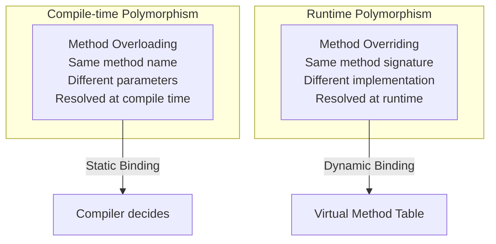
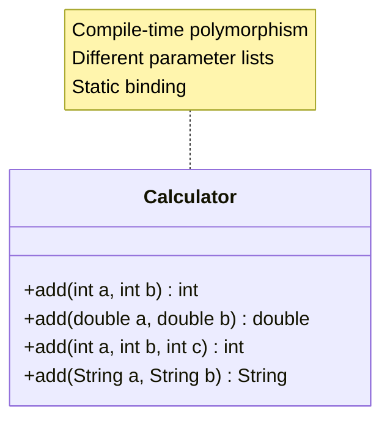
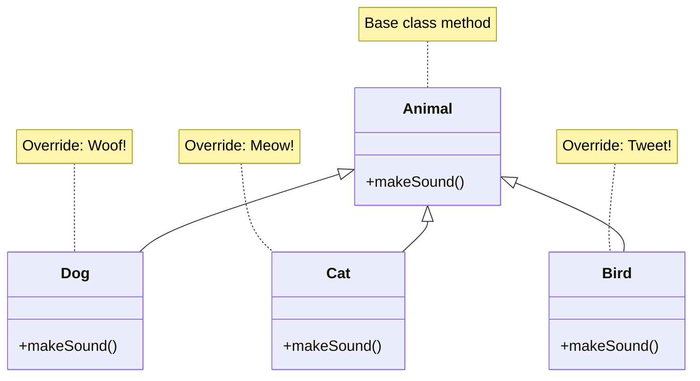
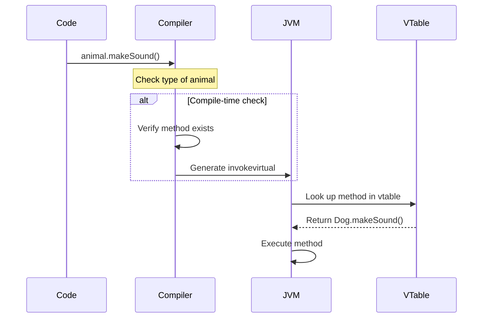
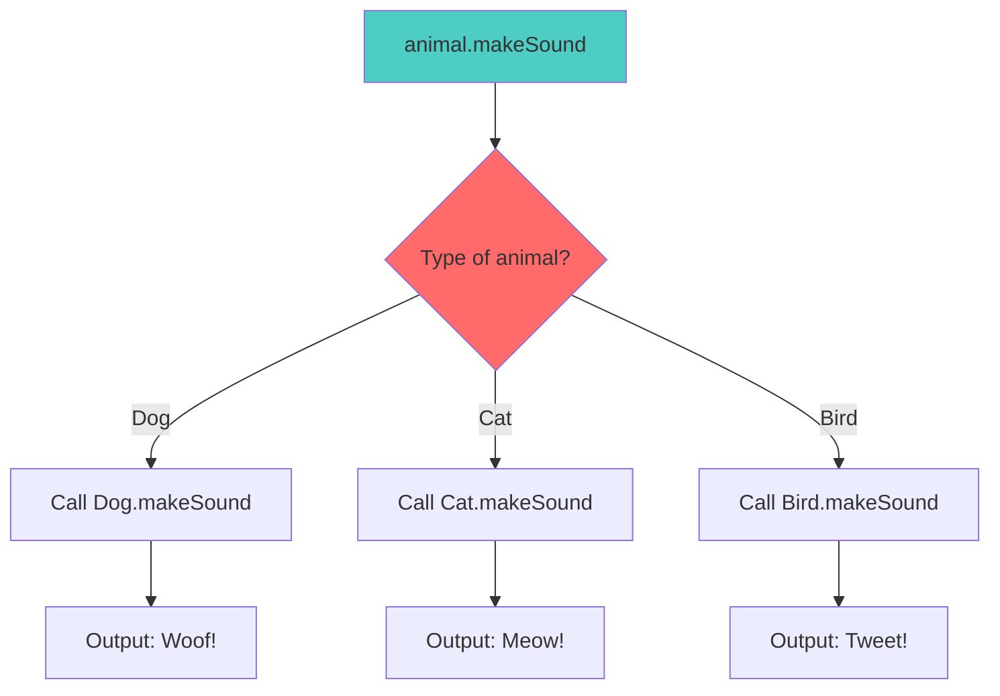
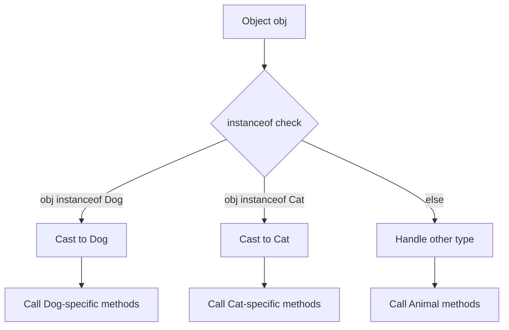

# Polymorphism and Method Dispatch

Polymorphism allows objects to take many forms, with method dispatch determining which implementation is called at runtime.

## Compile-time vs Runtime Polymorphism



## Method Overloading (Static Binding)



## Method Overriding (Dynamic Binding)



## Virtual Method Table (vtable)

```mermaid
graph TB
    subgraph "Animal vtable"
        av1[makeSound → Animal.makeSound]
    end
    
    subgraph "Dog vtable"
        dv1[makeSound → Dog.makeSound]
    end
    
    subgraph "Cat vtable"
        cv1[makeSound → Cat.makeSound]
    end
    
    subgraph "Runtime Dispatch"
        animal[Animal ref = new Dog()]
        animal -->|lookup| dv1
    end
    
    av1 -.->|inherited| dv1
    av1 -.->|inherited| cv1
```

## Method Dispatch Flow



## Dynamic Dispatch Example



## instanceof and Type Casting



## Key Takeaways

- **Static Binding**: Resolved at compile time (overloading)
- **Dynamic Binding**: Resolved at runtime (overriding)
- **vtable**: Table of method pointers for each class
- **`instanceof`**: Check object type before casting
- **Performance**: Static binding is slightly faster than dynamic