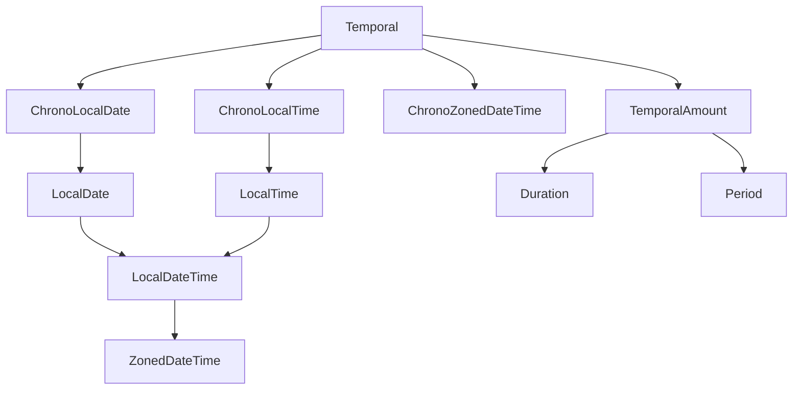
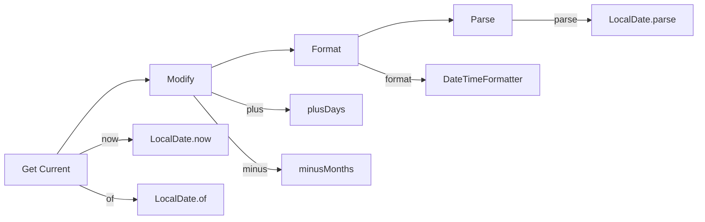
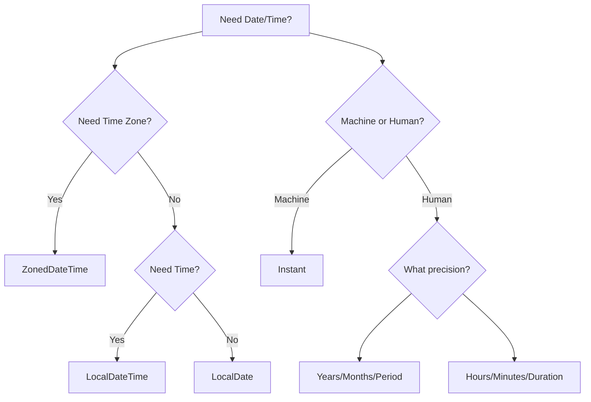

# Module 07: Date/Time API

## Overview
The Java Date/Time API (java.time package) introduced in Java 8 provides a comprehensive set of classes for handling dates, times, durations, and time zones. It replaces the legacy Date and Calendar classes with a modern, immutable, thread-safe API.

## Learning Objectives
- Master LocalDate, LocalTime, LocalDateTime
- Understand ZonedDateTime and time zones
- Use Duration and Period for time measurements
- Format dates with DateTimeFormatter
- Handle temporal adjusters and queries

## Prerequisites
- Basic Java knowledge
- Understanding of immutability
- Familiarity with OOP concepts

## Why This Concept Exists
The legacy Date/Calendar classes were:
- Mutable (thread-unsafe)
- Poorly designed (months start at 0)
- Lacked timezone support
- Difficult to use for arithmetic

The java.time API solves all these issues.

## Problem Statement
How do you handle date/time operations in a thread-safe, immutable, and intuitive way?

## Theory

### Core Classes

| Class | Description | Use Case |
|-------|-------------|----------|
| LocalDate | Date without time | Birthdays, holidays |
| LocalTime | Time without date | Meeting times |
| LocalDateTime | Date + time | Timestamps |
| ZonedDateTime | Date + time + timezone | Global events |
| Instant | Machine timestamp | Epoch time |
| Duration | Time-based amount | Hours, minutes |
| Period | Date-based amount | Years, months, days |

### Immutability
All java.time classes are immutable:
```java
LocalDate date = LocalDate.now();
LocalDate tomorrow = date.plusDays(1); // Original unchanged
```

## Internal Working

### LocalDate Internals
- Stores year, month, day as integers
- Uses optimized representation internally
- Thread-safe by design (immutable)

### ZonedDateTime Internals
- Combines LocalDateTime with ZoneId
- Handles DST transitions automatically
- Uses ISO-8601 format

## JVM Perspective
- java.time objects are allocated on heap
- Immutable objects can be shared safely
- No synchronization needed

## Memory Representation
```
LocalDate:
┌─────────────────────────────────────┐
│ Year (int)    │ Month (int) │ Day (int) │
└─────────────────────────────────────┘

ZonedDateTime:
┌─────────────────────────────────────────────────────┐
│ LocalDate │ LocalTime │ ZoneId │ ZoneOffset │
└─────────────────────────────────────────────────────┘
```

## Architecture Diagram



## Flow Diagram



## Syntax

### Creating Instances
```java
// Current date/time
LocalDate today = LocalDate.now();
LocalTime now = LocalTime.now();
LocalDateTime dateTime = LocalDateTime.now();

// Specific date/time
LocalDate date = LocalDate.of(2024, 1, 15);
LocalTime time = LocalTime.of(10, 30, 0);
LocalDateTime dt = LocalDateTime.of(2024, 1, 15, 10, 30);

// From string
LocalDate parsed = LocalDate.parse("2024-01-15");
```

### Manipulation
```java
LocalDate date = LocalDate.now();

// Addition
LocalDate tomorrow = date.plusDays(1);
LocalDate nextMonth = date.plusMonths(1);
LocalDate nextYear = date.plusYears(1);

// Subtraction
LocalDate yesterday = date.minusDays(1);

// With
LocalDate specific = date.withDayOfMonth(1);
LocalDate january = date.withMonth(1);
```

### Formatting
```java
LocalDate date = LocalDate.of(2024, 1, 15);

String iso = date.format(DateTimeFormatter.ISO_DATE);
String custom = date.format(DateTimeFormatter.ofPattern("dd/MM/yyyy"));
String full = date.format(DateTimeFormatter.ofPattern("EEEE, MMMM dd, yyyy"));
```

### Parsing
```java
LocalDate date = LocalDate.parse("2024-01-15");
LocalDate custom = LocalDate.parse("15/01/2024", 
    DateTimeFormatter.ofPattern("dd/MM/yyyy"));
```

## Easy Example
```java
public class EasyExample {
    public static void main(String[] args) {
        LocalDate today = LocalDate.now();
        System.out.println("Today: " + today);
        System.out.println("Day of week: " + today.getDayOfWeek());
        System.out.println("Day of year: " + today.getDayOfYear());
    }
}
```

## Medium Example
```java
public class MediumExample {
    public static void main(String[] args) {
        LocalDate startDate = LocalDate.of(2024, 1, 1);
        LocalDate endDate = LocalDate.now();
        
        long daysBetween = ChronoUnit.DAYS.between(startDate, endDate);
        System.out.println("Days since 2024: " + daysBetween);
        
        Period period = Period.between(startDate, endDate);
        System.out.println("Period: " + period.getYears() + " years, " 
            + period.getMonths() + " months, " + period.getDays() + " days");
    }
}
```

## Hard Example
```java
public class HardExample {
    public static void main(String[] args) {
        // Time zone handling
        ZonedDateTime tokyo = ZonedDateTime.now(ZoneId.of("Asia/Tokyo"));
        ZonedDateTime ny = tokyo.withZoneSameInstant(ZoneId.of("America/New_York"));
        
        System.out.println("Tokyo: " + tokyo.format(
            DateTimeFormatter.ofPattern("HH:mm z")));
        System.out.println("New York: " + ny.format(
            DateTimeFormatter.ofPattern("HH:mm z")));
        
        // Duration calculation
        Duration flightDuration = Duration.ofHours(14).plusMinutes(30);
        LocalTime departure = LocalTime.of(10, 0);
        LocalTime arrival = departure.plus(flightDuration);
        System.out.println("Arrival: " + arrival);
    }
}
```

## Enterprise Example
```java
public class EnterpriseExample {
    public static void main(String[] args) {
        // Business day calculation
        LocalDate date = LocalDate.now();
        LocalDate nextBusinessDay = date;
        do {
            nextBusinessDay = nextBusinessDay.plusDays(1);
        } while (nextBusinessDay.getDayOfWeek() == DayOfWeek.SATURDAY 
            || nextBusinessDay.getDayOfWeek() == DayOfWeek.SUNDAY);
        
        System.out.println("Next business day: " + nextBusinessDay);
        
        // Age calculation
        LocalDate birthday = LocalDate.of(1990, 5, 15);
        int age = Period.between(birthday, LocalDate.now()).getYears();
        System.out.println("Age: " + age);
    }
}
```

## Performance Considerations
- Immutable objects are thread-safe
- No synchronization overhead
- Cached instances for common values
- Minimal memory footprint

## Time & Space Complexity
| Operation | Time | Space |
|-----------|------|-------|
| Creation | O(1) | O(1) |
| Plus/Minus | O(1) | O(1) |
| Format | O(n) | O(n) |
| Parse | O(n) | O(1) |

## Thread Safety
All java.time classes are:
- Immutable
- Thread-safe
- Can be shared across threads
- No synchronization needed

## Best Practices
1. Use java.time instead of legacy Date/Calendar
2. Store dates as LocalDate when time is not needed
3. Use ZonedDateTime for global applications
4. Prefer DateTimeFormatter over SimpleDateFormat
5. Use Instant for machine timestamps

## Common Mistakes
1. Using old Date/Calendar classes
2. Not handling time zones
3. Parsing without specifying format
4. Mutable date manipulation

## Pitfalls & Warnings
1. Month enum starts at 1 (not 0)
2. DayOfWeek enum starts at Monday (1)
3. Leap year handling
4. DST transition handling

## Debugging Tips
1. Use toString() for debugging
2. Check time zone IDs
3. Verify date formats
4. Use ChronoUnit for comparisons

## Comparison Table

| Feature | java.time | Legacy Date | Calendar |
|---------|-----------|-------------|----------|
| Immutable | ✅ | ❌ | ❌ |
| Thread-safe | ✅ | ❌ | ❌ |
| Timezone | ✅ | Partial | ✅ |
| Modern API | ✅ | ❌ | ❌ |

## Decision Tree



## Interview Questions

### Q1: What are the main classes in java.time?
**Answer:** LocalDate, LocalTime, LocalDateTime, ZonedDateTime, Instant, Duration, Period.

### Q2: Why is java.time better than legacy Date?
**Answer:** Immutable, thread-safe, better API, proper timezone support.

### Q3: How do you format a date?
**Answer:** Use DateTimeFormatter.ofPattern() or predefined formatters.

### Q4: What is the difference between Duration and Period?
**Answer:** Duration is time-based (hours, minutes), Period is date-based (years, months, days).

### Q5: How do you handle time zones?
**Answer:** Use ZonedDateTime with ZoneId.of() for timezone conversion.

### Q6: How do you calculate difference between dates?
**Answer:** Use ChronoUnit.DAYS.between() or Period.between().

### Q7: What is an Instant?
**Answer:** A point on the timeline, useful for machine timestamps.

### Q8: How do you get the first day of month?
**Answer:** Use date.withDayOfMonth(1).

### Q9: What is a TemporalAdjuster?
**Answer:** A strategy for adjusting temporal objects.

### Q10: How do you parse a string to LocalDate?
**Answer:** Use LocalDate.parse("2024-01-15") or with custom formatter.

### Q11: What is the difference between LocalDateTime and ZonedDateTime?
**Answer:** LocalDateTime has no timezone, ZonedDateTime includes timezone.

### Q12: How do you check for leap year?
**Answer:** Use date.isLeapYear().

### Q13: What is the epoch time?
**Answer:** Seconds since 1970-01-01T00:00:00Z.

### Q14: How do you get current time in another timezone?
**Answer:** Use LocalTime.now(ZoneId.of("Asia/Tokyo")).

### Q15: What are temporal units?
**Answer:** ChronoUnit enum: DAYS, HOURS, MINUTES, etc.

## Exercises

### Easy
1. Print today's date in format "January 15, 2024"
2. Calculate days until your next birthday
3. Print current time in 24-hour format

### Medium
1. Create a date calculator (add/subtract days)
2. Find all Fridays in current month
3. Calculate business days between two dates

### Hard
1. Build a timezone converter
2. Create a recurring event scheduler
3. Implement a countdown timer

## Summary
The java.time API is the modern way to handle dates and times in Java. It's immutable, thread-safe, and provides comprehensive functionality for all date/time operations.

## References
- Oracle Java Documentation: java.time
- Java 8 Date and Time Tutorial
- Baeldung Java Time Guide
