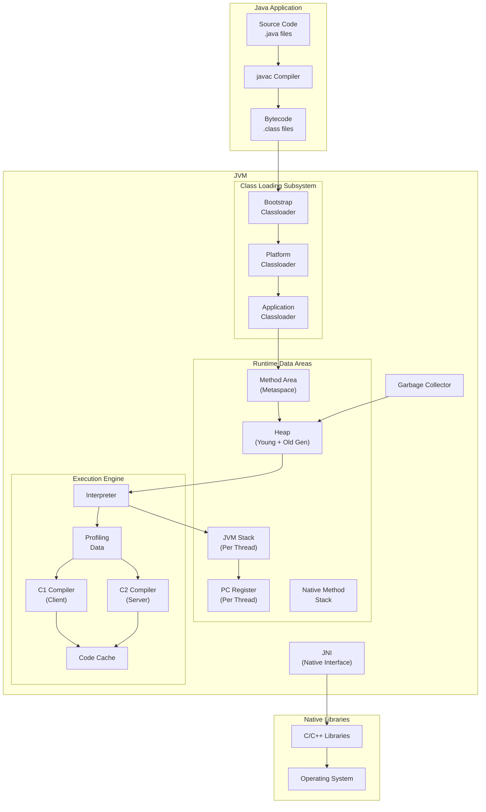
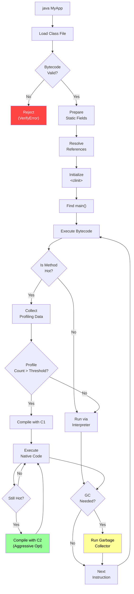

# 01 - JVM Architecture

## Introduction

The Java Virtual Machine (JVM) is the runtime engine that executes Java bytecode. It provides platform independence by abstracting the underlying hardware and operating system. Understanding JVM architecture is essential for writing high-performance code, diagnosing production issues, and mastering Java's behavior at the lowest level. This topic covers the complete JVM architecture including classloaders, runtime data areas, the execution engine, and native method interfaces.

## Learning Objectives

By the end of this topic, you will be able to:

- Explain the complete JVM architecture and its components
- Describe how class files are loaded, verified, and prepared
- Identify the purpose and behavior of each runtime data area
- Understand the relationship between the JIT compiler and interpreter
- Diagnose common JVM issues using architectural knowledge
- Design applications with JVM internals awareness

## Prerequisites

- Basic Java programming proficiency
- Understanding of compilation vs. interpretation
- Familiarity with binary/hexadecimal number systems
- Basic knowledge of operating system concepts (memory, threads)

## Why This Concept Exists

Java achieves "Write Once, Run Anywhere" (WORA) through the JVM. The JVM exists to:

1. **Platform Independence**: Abstract hardware differences so compiled bytecode runs on any OS
2. **Memory Safety**: Prevent memory corruption through bounds checking, type checking, and garbage collection
3. **Security**: Verify bytecode before execution to prevent malicious code
4. **Performance**: Use JIT compilation to optimize hot code paths at runtime
5. **Dynamic Loading**: Load classes on demand, enabling plugins and dynamic architectures

Without the JVM, Java would be another compiled language tied to specific platforms.

## Problem Statement

Consider a Java application running in production:

```java
public class ProductionApp {
    public static void main(String[] args) {
        // Application starts - but what happens under the hood?
        var service = new OrderService();
        service.processOrders();
    }
}
```

When this `main` method runs, the JVM must:

1. Locate and load the `OrderService` class file
2. Verify the bytecode is safe
3. Allocate memory for the object on the heap
4. Execute the bytecode (interpret or JIT-compile)
5. Manage garbage collection of unused objects
6. Handle any native method calls

Understanding this pipeline is critical for diagnosing:
- `ClassNotFoundException` (classloading issues)
- `OutOfMemoryError` (memory management)
- `StackOverflowError` (thread stack issues)
- Poor performance (JIT compilation gaps)

## Theory

### JVM Ecosystem Architecture

The JVM ecosystem consists of several interconnected subsystems:

**1. Class Loading Subsystem**
- Loads `.class` files from disk, network, or generated at runtime
- Three classloaders: Bootstrap, Platform (Extension), Application
- Delegation model ensures classes are loaded once

**2. Runtime Data Areas**
- **Method Area (Metaspace)**: Stores class metadata, constant pool, method code
- **Heap**: Object instances and arrays (GC managed)
- **JVM Stack**: Per-thread stack for method calls and local variables
- **PC Register**: Per-thread program counter
- **Native Method Stack**: For JNI native method calls

**3. Execution Engine**
- **Interpreter**: Executes bytecode line by line
- **JIT Compiler**: Compiles hot bytecode to native machine code
- **Garbage Collector**: Automatically reclaims unused memory

**4. Native Method Interface (JNI)**
- Bridge between Java and native (C/C++) code
- Access to OS-level functionality

### JVM Lifecycle

```
1. Bootstrap: Load rt.jar / modules (core classes)
2. Link: Verify → Prepare → Resolve
3. Initialize: Execute static initializers
4. Execute: Find main() → create threads → run
5. Shutdown: Normal exit, System.exit(), error, or daemon threads finish
```

### Class File Format

Every `.class` file has this structure:

```
ClassFile {
    u4             magic;           // 0xCAFEBABE
    u2             minor_version;
    u2             major_version;
    u2             constant_pool_count;
    cp_info        constant_pool[constant_pool_count-1];
    u2             access_flags;
    u2             this_class;
    u2             super_class;
    u2             interfaces_count;
    u2             interfaces[interfaces_count];
    u2             fields_count;
    field_info     fields[fields_count];
    u2             methods_count;
    method_info    methods[methods_count];
    u2             attributes_count;
    attribute_info attributes[attributes_count];
}
```

## Internal Working

### Class Loading Process

**Phase 1: Loading**
1. The ClassLoader reads the `.class` file byte stream
2. Converts it to a `java.lang.Class` object in the method area
3. Creates a mirror object on the heap

**Phase 2: Linking**
- **Verification**: Ensures bytecode is valid (magic number, version, structural integrity)
- **Preparation**: Allocates memory for static fields, assigns defaults
- **Resolution**: Replaces symbolic references with direct references

**Phase 3: Initialization**
- Executes `<clinit>()` static initializer blocks
- Static field assignments from source code

### Runtime Data Area Details

**Heap Structure (G1 GC example):**
```
Heap
├── Young Generation (1/3 of heap)
│   ├── Eden Space (80%)
│   ├── Survivor 0 (10%)
│   └── Survivor 1 (10%)
└── Old Generation (2/3 of heap)
    └── Object Tenuring
```

**Stack Frame Layout:**
```
Stack Frame
├── Local Variable Array
│   ├── [0] this (instance methods)
│   ├── [1] param1
│   └── [2] param2
├── Operand Stack
│   ├── Intermediate computation results
│   └── Method call arguments
├── Dynamic Linking
│   └── Symbolic reference resolution
└── Return Address
    └── PC register value after call
```

### Execution Engine Pipeline

```
Bytecode → Interpreter (fast startup)
              ↓
         Profiling Data
              ↓
         JIT Compiler (C1/C2)
              ↓
         Optimized Native Code
              ↓
         Code Cache
```

## JVM Perspective

From the JVM's viewpoint, every Java program is a sequence of bytecodes to be executed safely and efficiently.

### Bytecode Execution Flow

```
main() → invokevirtual #1  (method ref)
       → invokevirtual #2  (method ref)
       → invokevirtual #3  (method ref)
       → return
```

The JVM maintains:
- A **constant pool** per class (string literals, method references, field references)
- A **pc register** per thread (points to current bytecode instruction)
- An **operand stack** per stack frame (for intermediate computations)

### Memory Management Perspective

The JVM views memory in two categories:
- **Managed Memory**: Heap (GC-tracked object allocations)
- **Unmanaged Memory**: Native memory (off-heap buffers, JNI allocations)

The JVM's memory limit (`-Xmx`) controls only the managed heap, not native memory, which is a common source of `OutOfMemoryError: Direct buffer memory`.

## Memory Representation

### Object Layout on 64-bit JVM (compressed oops)

```
Object Header (12 bytes)
├── Mark Word (8 bytes)
│   ├── Hash code (31 bits)
│   ├── GC age (4 bits)
│   ├── Lock state (2 bits)
│   └── Thread ID (54 bits)
└── Klass Pointer (4 bytes)

Instance Fields
├── int value      → 4 bytes
├── long id        → 8 bytes
├── Object ref     → 4 bytes (compressed)
└── padding        → to 8-byte boundary
```

### Array Layout

```
Array Header (16 bytes)
├── Mark Word (8 bytes)
├── Klass Pointer (4 bytes)
└── Array Length (4 bytes)

Elements
├── [0] → element type size
├── [1] → element type size
└── ...
```

### Memory Overhead Example

```java
// Estimated memory per instance:
new Object()                    // 16 bytes (12 header + 4 padding)
new Integer(42)                 // 16 bytes header + 4 bytes int = 24 bytes
new String("Hello")            // 16 bytes header + 48 bytes fields ≈ 64 bytes
new ArrayList<>()              // 16 bytes header + ~40 bytes fields
new HashMap<>()                // 16 bytes header + ~96 bytes fields
```

## Architecture Diagram (Mermaid)



## Flow Diagram (Mermaid)



## Syntax

### JVM Command-Line Options

```bash
# Basic JVM invocation
java [options] <mainclass> [args]

# Memory configuration
java -Xms512m -Xmx2g -Xss1m MyApp

# GC selection
java -XX:+UseG1GC MyApp
java -XX:+UseZGC MyApp

# Diagnostics
java -XX:+PrintGCDetails -Xlog:gc* MyApp

# JVM version and info
java -version
java -XshowSettings:all
```

### System Class for Runtime Info

```java
// Access JVM runtime information
long heapMax = Runtime.getRuntime().maxMemory();
long heapTotal = Runtime.getRuntime().totalMemory();
long heapFree = Runtime.getRuntime().freeMemory();
int processors = Runtime.getRuntime().availableProcessors();
```

## Easy Example

```java
package academy.javaengineering.jvm;

/**
 * Basic JVM architecture demonstration.
 * Shows class loading, object creation, and memory information.
 */
public class JvmArchitectureExample {

    // Static field - loaded during class initialization (Method Area)
    private static final String APP_NAME = "JvmArchDemo";

    // Instance field - loaded when object is created (Heap)
    private int instanceCounter;

    public static void main(String[] args) {
        System.out.println("=== JVM Architecture Demo ===\n");

        // 1. Runtime information
        printRuntimeInfo();

        // 2. Class loading demonstration
        demonstrateClassLoading();

        // 3. Object creation and memory
        demonstrateObjectCreation();

        // 4. Stack vs Heap
        demonstrateStackVsHeap();

        // 5. String pool
        demonstrateStringPool();

        // 6. GC information
        demonstrateGCInfo();
    }

    static void printRuntimeInfo() {
        Runtime runtime = Runtime.getRuntime();
        System.out.println("--- Runtime Information ---");
        System.out.println("Available Processors: " + runtime.availableProcessors());
        System.out.println("Max Memory: " + formatBytes(runtime.maxMemory()));
        System.out.println("Total Memory: " + formatBytes(runtime.totalMemory()));
        System.out.println("Free Memory: " + formatBytes(runtime.freeMemory()));
        System.out.println("Used Memory: " + formatBytes(runtime.totalMemory() - runtime.freeMemory()));
        System.out.println();
    }

    static void demonstrateClassLoading() {
        System.out.println("--- Class Loading ---");

        // Each class is loaded by a classloader
        ClassLoader appLoader = JvmArchitectureExample.class.getClassLoader();
        ClassLoader platformLoader = appLoader.getParent();
        ClassLoader bootstrapLoader = platformLoader.getParent();

        System.out.println("App ClassLoader: " + appLoader);
        System.out.println("Platform ClassLoader: " + platformLoader);
        System.out.println("Bootstrap ClassLoader: " + bootstrapLoader);
        System.out.println("String ClassLoader: " + String.class.getClassLoader());
        System.out.println();
    }

    static void demonstrateObjectCreation() {
        System.out.println("--- Object Creation (Heap Allocation) ---");

        JvmArchitectureExample obj1 = new JvmArchitectureExample();
        JvmArchitectureExample obj2 = new JvmArchitectureExample();

        System.out.println("Object 1 hashCode: " + System.identityHashCode(obj1));
        System.out.println("Object 2 hashCode: " + System.identityHashCode(obj2));
        System.out.println("Same object? " + (obj1 == obj2));
        System.out.println("Instance size estimate: ~16 bytes (header) + 4 bytes (int field) = ~20 bytes");
        System.out.println();
    }

    static void demonstrateStackVsHeap() {
        System.out.println("--- Stack vs Heap ---");

        int stackVar = 42;  // Local variable → Stack
        int[] heapArray = new int[5];  // Array → Heap, reference → Stack

        System.out.println("Stack variable (stackVar): lives in stack frame");
        System.out.println("Array reference (heapArray): reference in stack, object in heap");
        System.out.println("Stack variable value: " + stackVar);
        System.out.println("Heap array length: " + heapArray.length);
        System.out.println();
    }

    static void demonstrateStringPool() {
        System.out.println("--- String Pool (Intern Pool) ---");

        String s1 = "Hello";           // String pool
        String s2 = "Hello";           // Same pool reference
        String s3 = new String("Hello"); // Heap allocated
        String s4 = s3.intern();       // Returns pool reference

        System.out.println("s1 == s2 (pool): " + (s1 == s2));
        System.out.println("s1 == s3 (pool vs heap): " + (s1 == s3));
        System.out.println("s1 == s4 (interned): " + (s1 == s4));
        System.out.println();
    }

    static void demonstrateGCInfo() {
        System.out.println("--- Garbage Collection Info ---");

        java.lang.management.ManagementFactory.getGarbageCollectorMXBeans()
            .forEach(gc -> {
                System.out.println("GC Name: " + gc.getName());
                System.out.println("  Collections: " + gc.getCollectionCount());
                System.out.println("  Time: " + gc.getCollectionTime() + "ms");
            });
        System.out.println();
    }

    private static String formatBytes(long bytes) {
        if (bytes < 1024) return bytes + " B";
        if (bytes < 1024 * 1024) return String.format("%.1f KB", bytes / 1024.0);
        if (bytes < 1024 * 1024 * 1024) return String.format("%.1f MB", bytes / (1024.0 * 1024));
        return String.format("%.2f GB", bytes / (1024.0 * 1024 * 1024));
    }
}
```

## Medium Example

```java
package academy.javaengineering.jvm;

import java.util.*;
import java.lang.management.*;

/**
 * Demonstrates JVM internals: class loading hierarchy, memory areas,
 * and runtime data structures.
 */
public class JvmArchitectureMediumExample {

    public static void main(String[] args) {
        System.out.println("=== JVM Internals Deep Dive ===\n");

        // 1. Class Hierarchy
        demonstrateClassHierarchy();

        // 2. Memory MXBeans
        demonstrateMemoryAreas();

        // 3. Thread information
        demonstrateThreadInfo();

        // 4. Constant Pool
        demonstrateConstantPool();

        // 5. Object header analysis
        demonstrateObjectHeaders();

        // 6. JIT compilation info
        demonstrateJITInfo();
    }

    static void demonstrateClassHierarchy() {
        System.out.println("--- Class Hierarchy ---");

        Class<?> clazz = LinkedHashMap.class;
        while (clazz != null) {
            System.out.println("  " + clazz.getName());
            clazz = clazz.getSuperclass();
        }
        System.out.println("  " + Object.class.getName() + " (root)");
        System.out.println();
    }

    static void demonstrateMemoryAreas() {
        System.out.println("--- Memory Areas ---");

        // Heap
        MemoryMXBean memoryBean = ManagementFactory.getMemoryMXBean();
        MemoryUsage heap = memoryBean.getHeapMemoryUsage();
        System.out.println("Heap:");
        System.out.println("  Init:    " + formatBytes(heap.getInit()));
        System.out.println("  Used:    " + formatBytes(heap.getUsed()));
        System.out.println("  Committed: " + formatBytes(heap.getCommitted()));
        System.out.println("  Max:     " + formatBytes(heap.getMax()));

        // Non-Heap (Metaspace)
        MemoryUsage nonHeap = memoryBean.getNonHeapMemoryUsage();
        System.out.println("Non-Heap (Metaspace):");
        System.out.println("  Init:    " + formatBytes(nonHeap.getInit()));
        System.out.println("  Used:    " + formatBytes(nonHeap.getUsed()));
        System.out.println("  Committed: " + formatBytes(nonHeap.getCommitted()));
        System.out.println();

        // Memory pools
        System.out.println("Memory Pools:");
        for (MemoryPoolMXBean pool : ManagementFactory.getMemoryPoolMXBeans()) {
            System.out.println("  " + pool.getName() + " [" + pool.getType() + "]: "
                + formatBytes(pool.getUsage().getUsed()) + " / "
                + formatBytes(pool.getUsage().getCommitted()));
        }
        System.out.println();
    }

    static void demonstrateThreadInfo() {
        System.out.println("--- Thread Information ---");

        ThreadMXBean threadBean = ManagementFactory.getThreadMXBean();
        System.out.println("Thread Count: " + threadBean.getThreadCount());
        System.out.println("Peak Thread Count: " + threadBean.getPeakThreadCount());
        System.out.println("Daemon Thread Count: " + threadBean.getDaemonThreadCount());
        System.out.println("Current Thread: " + Thread.currentThread().getName());
        System.out.println("Thread ID: " + Thread.currentThread().threadId());
        System.out.println();
    }

    static void demonstrateConstantPool() {
        System.out.println("--- Constant Pool (Symbolic References) ---");

        // String constants are interned
        String a = "constant";
        String b = "constant";
        System.out.println("String intern: a == b -> " + (a == b));

        // Integer cache (-128 to 127)
        Integer x = 127;
        Integer y = 127;
        Integer xx = 128;
        Integer yy = 128;
        System.out.println("Integer cache (127): x == y -> " + (x == y));
        System.out.println("Integer cache (128): xx == yy -> " + (xx == yy));
        System.out.println();
    }

    static void demonstrateObjectHeaders() {
        System.out.println("--- Object Header Analysis ---");

        // On 64-bit JVM with compressed oops, object header is 12 bytes
        System.out.println("Estimated object sizes (compressed oops):");
        System.out.println("  new Object():           ~16 bytes");
        System.out.println("  new Integer(1):         ~16 bytes header + 4 bytes = 20 bytes");
        System.out.println("  new long[1]:            ~24 bytes header + 8 bytes = 32 bytes");
        System.out.println("  new String(\"abc\"):     ~40 bytes (varies by impl)");
        System.out.println("  new ArrayList():        ~40 bytes + elementData array");
        System.out.println();
    }

    static void demonstrateJITInfo() {
        System.out.println("--- JIT Compilation Info ---");

        CompilationMXBean compBean = ManagementFactory.getCompilationMXBean();
        if (compBean != null) {
            System.out.println("JIT Compiler: " + compBean.getName());
            System.out.println("Total Compilation Time: " + compBean.getTotalCompilationTime() + "ms");
        }
        System.out.println();
    }

    private static String formatBytes(long bytes) {
        if (bytes < 1024) return bytes + " B";
        if (bytes < 1024 * 1024) return String.format("%.1f KB", bytes / 1024.0);
        if (bytes < 1024 * 1024 * 1024) return String.format("%.1f MB", bytes / (1024.0 * 1024));
        return String.format("%.2f GB", bytes / (1024.0 * 1024 * 1024));
    }
}
```

## Hard Example

```java
package academy.javaengineering.jvm;

import java.lang.management.*;
import java.util.*;
import java.util.concurrent.*;

/**
 * Advanced JVM internals: memory layout simulation, classloader chain
 * analysis, and runtime data area inspection.
 */
public class JvmArchitectureHardExample {

    // Simulate object header using Unsafe (conceptual)
    private static volatile long objectAddressCounter = 1000L;

    public static void main(String[] args) throws Exception {
        System.out.println("=== Advanced JVM Internals ===\n");

        // 1. Memory Layout Deep Dive
        analyzeMemoryLayout();

        // 2. Class Loading Chain Trace
        traceClassLoading();

        // 3. Runtime Data Area Inspection
        inspectRuntimeDataAreas();

        // 4. JIT Compilation Analysis
        analyzeJITCompilation();

        // 5. GC Roots Analysis
        analyzeGCRoots();

        // 6. JVM Flags and Configuration
        dumpJVMConfiguration();
    }

    static void analyzeMemoryLayout() {
        System.out.println("--- Memory Layout Analysis ---");

        // Measure object sizes by allocation diff
        Runtime rt = Runtime.getRuntime();
        rt.gc();
        rt.gc();
        long before = rt.totalMemory() - rt.freeMemory();

        int count = 1_000_000;
        Object[] objects = new Object[count];
        for (int i = 0; i < count; i++) {
            objects[i] = new Object();
        }

        long after = rt.totalMemory() - rt.freeMemory();
        long perObject = (after - before) / count;
        System.out.println("Empty Object size: ~" + perObject + " bytes per instance");
        System.out.println("(Includes header: mark word + klass pointer + padding)");

        // Array sizing
        rt.gc();
        rt.gc();
        before = rt.totalMemory() - rt.freeMemory();

        int[][] arrays = new int[100000][];
        for (int i = 0; i < 100000; i++) {
            arrays[i] = new int[10];
        }

        after = rt.totalMemory() - rt.freeMemory();
        long perArray = (after - before) / 100000;
        System.out.println("int[10] array size: ~" + perArray + " bytes per instance");
        System.out.println("  Header (16 bytes) + 10 * 4 bytes = 56 bytes (with alignment)");
        System.out.println();
    }

    static void traceClassLoading() {
        System.out.println("--- Class Loading Chain Trace ---");

        String[] testClasses = {
            "java.lang.String",
            "java.util.HashMap",
            "academy.javaengineering.jvm.JvmArchitectureHardExample",
            "javax.xml.parsers.DocumentBuilderFactory"
        };

        for (String className : testClasses) {
            try {
                Class<?> clazz = Class.forName(className);
                ClassLoader loader = clazz.getClassLoader();
                System.out.printf("%-50s -> %s%n", className, loaderName(loader));
            } catch (ClassNotFoundException e) {
                System.out.printf("%-50s -> NOT FOUND%n", className);
            }
        }
        System.out.println();
    }

    static void inspectRuntimeDataAreas() {
        System.out.println("--- Runtime Data Areas ---");

        // Current thread's stack
        Thread current = Thread.currentThread();
        System.out.println("Current Thread: " + current.getName());
        System.out.println("Thread State: " + current.getState());
        System.out.println("Thread ID: " + current.threadId());
        System.out.println("Is Daemon: " + current.isDaemon());
        System.out.println("Priority: " + current.getPriority());

        // Stack trace for current thread
        StackTraceElement[] stack = current.getStackTrace();
        System.out.println("Current Stack Depth: " + stack.length);
        System.out.println("Stack Frames:");
        for (int i = 0; i < Math.min(stack.length, 5); i++) {
            System.out.println("  [" + i + "] " + stack[i]);
        }
        System.out.println();
    }

    static void analyzeJITCompilation() {
        System.out.println("--- JIT Compilation Analysis ---");

        CompilationMXBean compBean = ManagementFactory.getCompilationMXBean();
        if (compBean != null) {
            System.out.println("Compiler: " + compBean.getName());
            System.out.println("Compilation Time: " + compBean.getTotalCompilationTime() + "ms");
        }

        // Trigger JIT compilation with hot loop
        long sum = 0;
        for (int i = 0; i < 10_000_000; i++) {
            sum += i;
        }
        System.out.println("Hot loop result: " + sum);

        // Recheck compilation time
        if (compBean != null) {
            System.out.println("Post-loop Compilation Time: " + compBean.getTotalCompilationTime() + "ms");
        }
        System.out.println();
    }

    static void analyzeGCRoots() {
        System.out.println("--- GC Root Types ---");

        System.out.println("GC Root categories in JVM:");
        System.out.println("  1. Thread stack variables (local variables)");
        System.out.println("  2. Static fields of loaded classes");
        System.out.println("  3. JNI global references");
        System.out.println("  4. Monitors (synchronized blocks)");
        System.out.println("  5. Objects used for system class loading");
        System.out.println("  6. Finalizer references");
        System.out.println("  7. Debugger references (JDWP)");
        System.out.println();

        // Demonstrate local variable as GC root
        Object localVar = new Object();
        System.out.println("Local variable 'localVar' is a GC root (stack reference)");
        System.out.println("Object hash: " + System.identityHashCode(localVar));
        localVar = null;  // No longer a GC root
        System.out.println("After nulling: localVar is no longer a GC root");
        System.out.println();
    }

    static void dumpJVMConfiguration() {
        System.out.println("--- JVM Configuration ---");

        Map<String, String> vmArgs = ManagementFactory.getRuntimeMXBean().getInputArguments();
        System.out.println("JVM Arguments (" + vmArgs.size() + "):");
        vmArgs.forEach((k, v) -> System.out.println("  " + k + " = " + v));

        System.out.println("\nSystem Properties:");
        String[] props = {"java.version", "java.vendor", "os.name", "os.arch",
            "java.vm.name", "java.vm.version", "sun.arch.data.model"};
        for (String prop : props) {
            System.out.println("  " + prop + " = " + System.getProperty(prop));
        }
    }

    private static String loaderName(ClassLoader loader) {
        if (loader == null) return "Bootstrap (null)";
        String name = loader.getClass().getName();
        if (name.contains("PlatformClassLoader")) return "Platform ClassLoader";
        if (name.contains("AppClassLoader")) return "Application ClassLoader";
        return name;
    }
}
```

## Enterprise Example

```java
package academy.javaengineering.jvm;

import java.lang.management.*;
import java.util.*;
import java.util.concurrent.*;
import java.util.concurrent.atomic.*;

/**
 * Enterprise JVM monitoring and diagnostics dashboard.
 * Demonstrates real-time JVM health monitoring used in production.
 */
public class JvmArchitectureEnterpriseExample {

    private static final AtomicLong requestCount = new AtomicLong(0);
    private static final AtomicLong errorCount = new AtomicLong(0);

    public static void main(String[] args) throws Exception {
        System.out.println("=== Enterprise JVM Monitoring Dashboard ===\n");

        // Start monitoring
        ScheduledExecutorService monitor = Executors.newSingleThreadScheduledExecutor(r -> {
            Thread t = new Thread(r, "jvm-monitor");
            t.setDaemon(true);
            return t;
        });

        monitor.scheduleAtFixedRate(() -> {
            printDashboard();
        }, 0, 2, TimeUnit.SECONDS);

        // Simulate work
        simulateWorkload();

        Thread.sleep(5000);
        monitor.shutdown();
    }

    static void printDashboard() {
        StringBuilder sb = new StringBuilder();
        sb.append("\n╔══════════════════════════════════════════════════════════╗\n");
        sb.append("║              JVM HEALTH DASHBOARD                       ║\n");
        sb.append("╠══════════════════════════════════════════════════════════╣\n");

        // Memory
        MemoryMXBean memBean = ManagementFactory.getMemoryMXBean();
        MemoryUsage heap = memBean.getHeapMemoryUsage();
        double heapUsedPct = (double) heap.getUsed() / heap.getMax() * 100;
        sb.append(String.format("║ Heap: %s / %s (%.1f%%)%n",
            formatBytes(heap.getUsed()), formatBytes(heap.getMax()), heapUsedPct));
        sb.append(String.format("║ Non-Heap: %s / %s%n",
            formatBytes(memBean.getNonHeapMemoryUsage().getUsed()),
            formatBytes(memBean.getNonHeapMemoryUsage().getCommitted())));

        // Threads
        ThreadMXBean threadBean = ManagementFactory.getThreadMXBean();
        sb.append(String.format("║ Threads: %d (peak: %d, daemon: %d)%n",
            threadBean.getThreadCount(), threadBean.getPeakThreadCount(),
            threadBean.getDaemonThreadCount()));

        // GC
        List<GarbageCollectorMXBean> gcBeans = ManagementFactory.getGarbageCollectorMXBeans();
        long totalCollections = 0;
        long totalTime = 0;
        for (GarbageCollectorMXBean gc : gcBeans) {
            totalCollections += gc.getCollectionCount();
            totalTime += gc.getCollectionTime();
        }
        sb.append(String.format("║ GC: %d collections, %dms total%n", totalCollections, totalTime));

        // Uptime
        long uptime = ManagementFactory.getRuntimeMXBean().getUptime();
        sb.append(String.format("║ Uptime: %d min %d sec%n",
            TimeUnit.MILLISECONDS.toMinutes(uptime),
            TimeUnit.MILLISECONDS.toSeconds(uptime) % 60));

        // Requests
        sb.append(String.format("║ Requests: %d (Errors: %d)%n",
            requestCount.get(), errorCount.get()));

        sb.append("╚══════════════════════════════════════════════════════════╝");

        System.out.println(sb);
    }

    static void simulateWorkload() {
        ExecutorService exec = Executors.newFixedThreadPool(4);
        Random random = new Random();

        for (int i = 0; i < 20; i++) {
            exec.submit(() -> {
                requestCount.incrementAndGet();
                if (random.nextDouble() < 0.1) {
                    errorCount.incrementAndGet();
                }
                // Simulate processing
                byte[] data = new byte[random.nextInt(10000)];
                Arrays.fill(data, (byte) 1);
                try {
                    Thread.sleep(random.nextInt(100));
                } catch (InterruptedException e) {
                    Thread.currentThread().interrupt();
                }
            });
        }
        exec.shutdown();
    }

    private static String formatBytes(long bytes) {
        if (bytes < 1024) return bytes + " B";
        if (bytes < 1024 * 1024) return String.format("%.1f KB", bytes / 1024.0);
        if (bytes < 1024 * 1024 * 1024) return String.format("%.1f MB", bytes / (1024.0 * 1024));
        return String.format("%.2f GB", bytes / (1024.0 * 1024 * 1024));
    }
}
```

## Performance Considerations

1. **Object Header Overhead**: Every object has 12-16 bytes of header. For small objects, this is significant overhead. Use `jol` (Java Object Layout) to measure actual sizes.

2. **Compressed Oops**: By default, JVM uses compressed ordinary object pointers (oops) on heaps < 32GB, reducing reference size from 8 to 4 bytes. Heap larger than 32GB disables this.

3. **String Deduplication**: G1 and ZGC support `-XX:+UseStringDeduplication` to reduce String memory by deduplicating equal strings.

4. **TLAB (Thread Local Allocation Buffers)**: Each thread gets a private allocation area in Eden to avoid lock contention. Default size: ~2% of Eden.

5. **Class Loading Overhead**: Dynamic class loading (reflection, proxies) is expensive. Cache `Class.forName()` results.

6. **JIT Compilation Thresholds**: Default CompileThreshold is 10,000 invocations (C1) / 10,000 (C2). Lower for faster startup; higher for throughput.

7. **Stack Size**: Default `-Xss` is 512KB-1MB. Deep recursion or large local variable arrays need more. Too large wastes memory per thread.

## Time & Space Complexity

| Operation | Time | Space |
|-----------|------|-------|
| Class Loading | O(f) where f = file size | O(c) per class in Metaspace |
| Object Allocation | O(1) amortized (TLAB) | O(n) object size on Heap |
| Method Invocation | O(1) stack frame push | O(s) where s = stack frame size |
| GC (Minor) | O(live objects) | O(resident set) |
| GC (Major) | O(heap size) worst case | O(peak heap usage) |
| JIT Compilation | O(bytecode length) | O(native code size) in Code Cache |

## Thread Safety

- **Class Loading**: Bootstrap and Platform classloaders are thread-safe. Application classloaders may not be; use `Class.forName()` with synchronization.
- **Method Area**: Shared across threads. Class metadata is immutable once loaded. Static fields are shared (potential race condition).
- **Heap**: Shared. All threads allocate from Eden (TLAB reduces contention). GC pauses stop all threads (STW).
- **Stack**: Per-thread. No sharing. Safe by design.
- **PC Register**: Per-thread. No sharing. Safe by design.
- **Code Cache**: Shared. Read-only after JIT compilation. Safe.

## Best Practices

1. **Monitor Heap Usage**: Always set `-Xmx` and `-Xms` explicitly in production
2. **Use Metaspace**: Prefer `-XX:MaxMetaspaceSize` over deprecated PermGen
3. **Tune Thread Count**: Don't create too many threads (stack memory overhead)
4. **Profile Before Tuning**: Use JFR/JMC before adjusting JVM flags
5. **Prefer G1/ZGC**: Use modern GC algorithms over legacy CMS/Serial
6. **Enable GC Logging**: `-Xlog:gc*:file=gc.log:time,uptime` in production
7. **Avoid Large Objects**: Objects > 50% of region size bypass G1's young gen
8. **Set Heap Correctly**: Heaps too small cause GC thrashing; too large cause long pauses

## Common Mistakes

1. **Not Setting Heap Bounds**: Using default `-Xmx` (physical RAM / 4) leads to unpredictable behavior
2. **Ignoring Metaspace**: Dynamic class loading can exhaust Metaspace without `-XX:MaxMetaspaceSize`
3. **Over-Threaded Apps**: Creating thousands of threads exhausts native memory
4. **Using Deprecated Flags**: `-XX:+UseConcMarkSweepGC` is removed in Java 14+
5. **Assuming GC Is Free**: Every GC cycle has CPU and latency cost
6. **Not Monitoring Native Memory**: Off-heap allocations can cause OOM

## Pitfalls

- **32GB Heap Limit**: Going above 32GB disables compressed oops, requiring more heap for same objects
- **String Intern Pool**: Excessive `String.intern()` causes Metaspace/permanent generation growth
- **Finalizers**: `finalize()` is deprecated and unreliable; use `Cleaner` instead
- **ThreadLocal Leaks**: Forgetting to remove ThreadLocal values causes memory leaks in thread pools
- **Metaspace OOM**: Dynamic class generation (cglib, proxies) can exhaust Metaspace

## Debugging Tips

```bash
# View JVM flags
java -XX:+PrintFlagsFinal -version | grep -i heap

# Memory map
jcmd <pid> VM.native_memory summary

# Class loading details
java -verbose:class MyApp

# GC logging (Java 11+)
java -Xlog:gc*:file=gc.log:time,uptime:filecount=5:filesize=10m MyApp

# Thread dump
jstack <pid>

# Heap dump
jmap -dump:live,format=b,file=heap.hprof <pid>

# JVM info
jinfo -flags <pid>
jcmd <pid> VM.flags
```

## Comparison Table

| Feature | JVM (Java) | CLR (.NET) | V8 (Node.js) |
|---------|-----------|------------|---------------|
| Bytecode Format | `.class` (JVM spec) | CIL/MSIL | V8 Bytecode |
| JIT Compiler | C1/C2 | RyuJIT | TurboFan |
| GC Algorithm | G1/ZGC/Shenandoah | Server GC | Orinoco (concurrent) |
| Class Loading | Hierarchical delegation | Assembly loading | V8 internal |
| Memory Model | JMM (JSR-133) | ECMA Memory Model | WeakRef/FinalizationRef |
| Tiered Compilation | Yes (0-4) | Yes (3 levels) | Yes (Sparkplug) |
| Ahead-of-Time | GraalVM Native Image | ReadyToRun | N/A |
| Max Heap | Effectively unlimited | 2GB (32-bit) | ~4GB |
| Metaspace/PermGen | Metaspace (native) | N/A | N/A |

## Decision Tree

```
Should you deep-dive into JVM internals?
│
├─ Are you seeing production performance issues?
│  ├─ Yes → Study GC algorithms and tuning (Topic 03, 08)
│  └─ No
│
├─ Are you working with large heap applications (>16GB)?
│  ├─ Yes → Study compressed oops and G1/ZGC (Topic 01, 03)
│  └─ No
│
├─ Are you debugging class loading issues?
│  ├─ Yes → Study classloader hierarchy (Topic 02)
│  └─ No
│
├─ Are you profiling application performance?
│  ├─ Yes → Study JIT compilation and profiling (Topic 06, 07)
│  └─ No
│
└─ Are you building frameworks/libraries?
   ├─ Yes → Study bytecode and class loading (Topic 05, 02)
   └─ No → General JVM awareness is sufficient
```

## Interview Questions (15+)

**Q1: What is the difference between JVM, JRE, and JDK?**
A: JVM is the virtual machine that executes bytecode. JRE includes JVM + core libraries. JDK includes JRE + development tools (javac, jdb, etc.).

**Q2: Explain the JVM class loading mechanism.**
A: The JVM loads classes through Bootstrap, Platform, and Application classloaders using a delegation model. Each classloader delegates to its parent first. Loading involves: Loading → Verification → Preparation → Resolution → Initialization.

**Q3: What is the Method Area and how is it implemented?**
A: The Method Area stores class metadata, constant pool, method bytecode, and static variables. In Java 8+, it's implemented as Metaspace (native memory), replacing PermGen (heap-based).

**Q4: What is the difference between Heap and Stack?**
A: Heap stores objects and arrays (shared, GC-managed). Stack stores method frames with local variables, operand stack, and return addresses (per-thread, LIFO, automatic cleanup).

**Q5: What are TLABs and why do they exist?**
A: Thread Local Allocation Buffers are private allocation areas in Eden for each thread. They eliminate lock contention during object allocation by allowing each thread to allocate independently.

**Q6: How does compressed oops work?**
A: On 64-bit JVMs with heaps < 32GB, object references are compressed from 8 bytes to 4 bytes using base + offset addressing. This reduces memory usage and improves cache efficiency.

**Q7: What is JIT compilation and why does the JVM use it?**
A: JIT (Just-In-Time) compilation converts frequently executed bytecode to native machine code at runtime. The JVM profiles hot methods and compiles them with increasingly aggressive optimizations (tiered compilation: C1 → C2).

**Q8: Explain the JVM memory model (JMM).**
A: The JMM defines how threads interact through memory. It establishes happens-before relationships, volatile semantics, and synchronized block memory visibility. It prevents visibility and ordering problems in concurrent code.

**Q9: What happens when you run `java MyApp`?**
A: The JVM: (1) loads the bootstrap classloader, (2) loads MyApp class, (3) links (verify/prepare/resolve), (4) initializes static fields, (5) finds and invokes `main()`, (6) executes bytecode via interpreter, (7) JIT-compiles hot methods, (8) runs GC as needed.

**Q10: What is the purpose of the constant pool?**
A: The constant pool stores compile-time constants (strings, numeric literals) and symbolic references (method/field references). It reduces redundancy and enables lazy resolution of symbolic references at runtime.

**Q11: What is the difference between `==` and `.equals()` from a JVM perspective?**
A: `==` compares reference addresses (8 bytes with compressed oops). `.equals()` compares content. For String literals from the same pool entry, `==` returns true. For heap-allocated objects, `==` compares identity, not value.

**Q12: How does the JVM handle integer caching?**
A: `Integer.valueOf()` caches values -128 to 127 by default. `Integer x = 127; Integer y = 127;` results in same object (x == y is true). For 128, new objects are created. This is specified in JLS §5.1.7.

**Q13: What is a stack overflow and how does it occur?**
A: `StackOverflowError` occurs when the thread stack exceeds its limit (default ~512KB-1MB). Typically caused by unbounded recursion or very deep method call chains.

**Q14: What are native methods and how does the JVM handle them?**
A: Native methods are implemented in C/C++ and called via JNI (Java Native Interface). The JVM maintains a native method stack and uses JNI bindings to call the native implementation.

**Q15: What is the difference between Metaspace and PermGen?**
A: PermGen (Java 7 and earlier) was a fixed-size heap area for class metadata. Metaspace (Java 8+) uses native memory, is unlimited by default (bounded by OS), and supports class unloading during full GC.

**Q16: How does the JVM determine if a method is "hot"?**
A: The JVM counts method invocation次数 and back-edge branches. Default thresholds: C1 compilation at 10,000 invocations, C2 at 10,000 (with C1 profile data). Methods exceeding these thresholds are queued for JIT compilation.

**Q17: What is escape analysis in the JVM?**
A: Escape analysis determines if an object's scope is limited to a method. If it doesn't escape, the JVM can allocate it on the stack (scalar replacement) instead of the heap, avoiding GC overhead.

## Exercises

### Level 1 (Beginner)

1. Write a program that prints the ClassLoader hierarchy for 10 different classes (String, ArrayList, Thread, etc.)
2. Create a program that measures the memory difference between creating objects on the heap vs. reusing them
3. Use `Runtime.getRuntime()` to monitor memory usage during object allocation

### Level 2 (Intermediate)

4. Write a program that demonstrates the integer cache behavior with values from 100 to 150
5. Create a custom ClassLoader that loads a class from a byte array
6. Use JMX to create a simple JVM monitoring utility that reports heap, threads, and GC stats

### Level 3 (Advanced)

7. Write a program that uses JOL (Java Object Layout) to analyze the memory layout of different objects
8. Create a classloader leak scenario and write a diagnostic tool to detect it
9. Implement a JVM metrics collector using the `java.lang.management` API that exports to Prometheus format

## Summary

The JVM is a sophisticated runtime system that provides platform independence, memory safety, security, and performance through:

- **Class Loading**: Hierarchical delegation model with Bootstrap, Platform, and Application classloaders
- **Runtime Data Areas**: Method Area (Metaspace), Heap, Stack, PC Register, Native Method Stack
- **Execution Engine**: Interpreter + JIT compilation (C1/C2) with tiered compilation
- **Memory Management**: Automatic garbage collection with multiple algorithm choices
- **Native Interface**: JNI bridge to C/C++ code

Understanding JVM internals enables better performance tuning, effective debugging, and writing optimized Java code.

## References

- [JVM Specification (Oracle)](https://docs.oracle.com/javase/specs/jvms/se21/html/)
- [OpenJDK Source](https://github.com/openjdk/jdk)
- [Java Performance by Scott Oaks](https://www.oreilly.com/library/view/java-performance/9781492056027/)
- [Inside the JVM, Bill Venners](https://www.artima.com/insidejvm2e/)
- [Java Object Layout (JOL)](https://github.com/openjdk/jol)
- [JVM Internals](http://blog.jamesdbloom.com/java_vm_internals.html)
- [Oracle JVM Troubleshooting Guide](https://docs.oracle.com/en/java/javase/21/gctuning/)
